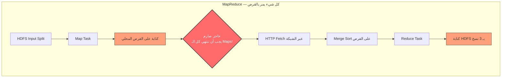
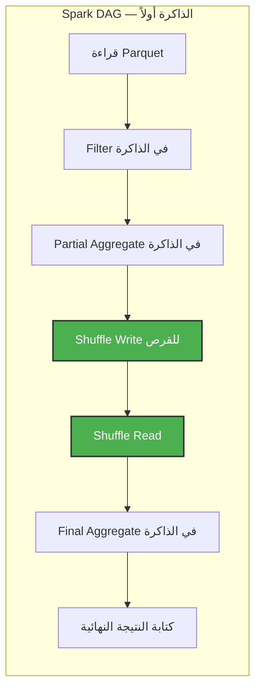

# 📘 الحوسبة الموزعة و MapReduce: الأساس الذي بُني عليه Spark

> [!IMPORTANT]
> **هدف هذا الدليل:**
> 
> بنهاية هذا الملف، ستفهم لماذا كان MapReduce ثورياً ولماذا أصبح عائقاً، وكيف حل Spark مشاكله الجوهرية، وكيف تقرأ خطة التنفيذ (Physical Plan) وتُحسّنها.

---

## 1. 🎯 لماذا نحتاج الحوسبة الموزعة أصلاً؟

### المشكلة الأساسية

تخيل أن لديك جدول مبيعات بحجم **10 تيرابايت**. جهازك الشخصي يملك 32 GB RAM. كيف تُعالج هذه البيانات؟

```
الحل البدائي: خادم واحد ضخم (Scale-Up)
  ← شراء خادم بـ 10 TB RAM: تكلفة خرافية
  ← حد مادي: لا يمكن توسعة خادم واحد إلى ما لا نهاية
  ← نقطة فشل واحدة: إذا انهار الخادم، ضاع كل شيء

الحل الذكي: مئات الأجهزة الرخيصة (Scale-Out)
  ← 100 جهاز × 128 GB = 12.8 TB RAM مشتركة
  ← إذا انهار جهاز واحد، الـ 99 الأخرى تكمل العمل
  ← تكلفة أقل بكثير (Commodity Hardware)
```

**هذا هو جوهر الحوسبة الموزعة:** توزيع البيانات والحساب على أجهزة رخيصة كثيرة بدلاً من جهاز واحد غالٍ.

---

## 2. 🏗️ MapReduce: الثورة الأولى

### ما هو MapReduce؟

ابتكرته Google عام 2004 لمعالجة بيانات بحجم الويب. نشرته Hadoop لاحقاً كـ Open Source. الفكرة بسيطة:

**قسّم المشكلة لجزأين:** Map (تحويل) و Reduce (تجميع).

```
مثال: احسب عدد مرات ظهور كل كلمة في مليار صفحة ويب

Map Phase:
  "Hello World" → [("Hello", 1), ("World", 1)]
  "Hello Spark" → [("Hello", 1), ("Spark", 1)]

Shuffle & Sort: (يُجمع كل المفتاح نفسه معاً)
  ("Hello", [1, 1]) → للـ Reducer
  ("World", [1])    → للـ Reducer
  ("Spark", [1])    → للـ Reducer

Reduce Phase:
  ("Hello", [1, 1]) → ("Hello", 2)
  ("World", [1])    → ("World", 1)
```

### التشريح الداخلي لـ MapReduce



---

## 3. 🔴 عيوب MapReduce: لماذا أصبح عائقاً؟

### العيب الأول: الحاجز الصارم (Synchronization Barrier)

> [!WARNING]
> **هذا هو الخلل الجوهري في MapReduce:**
>
> لا يمكن لأي Reducer أن يبدأ عمله حتى **تنتهي جميع الـ Mappers بدون استثناء**.
>
> ```
> 100 Mapper انتهوا في دقيقتين
> 1 Mapper (Straggler) يستغرق 45 دقيقة
> → الـ Pipeline كلها تنتظر 45 دقيقة!
> ```

### العيب الثاني: الاعتماد الكامل على القرص

كل مرحلة تكتب على القرص وتقرأ منه:

```
رياضيات MapReduce:
  100 GB بيانات × 4 مراحل متسلسلة = 800 GB قراءة/كتابة!

الحساب:
  Map Write:     100 GB → قرص محلي
  Shuffle Read:  100 GB → من كل الأجهزة عبر الشبكة
  Reduce Write:  100 GB × 3 نسخ HDFS = 300 GB
  (وهذا لمرحلة واحدة فقط!)
```

### العيب الثالث: جمود الهيكل

كل مشكلة يجب أن تتحول لـ Map + Reduce فقط. لا يمكن كتابة Pipeline متعدد الخطوات بدون ربط عدة Jobs يدوياً.

```
مثال: حساب متوسط المبيعات لكل منتج
  Job 1: Map (استخراج) + Reduce (جمع)
  Job 2: Map (تحميل) + Reduce (قسمة)
  
  بين الـ Jobs: كتابة على HDFS + قراءة من HDFS = تأخير هائل!
```

> [!CAUTION]
> **Common Mistake:** كثيرون يقولون "MapReduce بطيء". الأدق أن نقول: "MapReduce غير فعّال للعمليات التكرارية والتفاعلية لأن كل خطوة تعيد قراءة البيانات من القرص من البداية".

---

## 4. ⚡ Spark: الحل الجذري

### الفكرة العبقرية: ابنِ الرسم البياني أولاً

بدلاً من تنفيذ كل خطوة فوراً وكتابة نتيجتها على القرص، Spark:
1. **يجمع كل العمليات** في رسم بياني (DAG)
2. **يُحللها** بحثاً عن تحسينات
3. **يُنفذها** بأقل عدد ممكن من تمريرات البيانات (Data Passes)



**ما الذي يحدث فيزيائياً؟**
- القراءة من القرص: **مرة واحدة فقط** (في البداية)
- Filter + Partial Aggregate: **في الذاكرة** بدون لمس القرص
- Shuffle Write/Read: **مرة واحدة** (فقط عند الضرورة الحتمية)
- الكتابة النهائية: **مرة واحدة** (في النهاية)

### مقارنة الحسابات

```
سيناريو: معالجة 100 GB، 4 عمليات متسلسلة

MapReduce:
  قراءة + كتابة في كل مرحلة = 100 GB × 4 × 2 = 800 GB I/O
  
Spark:
  قراءة مرة = 100 GB
  Shuffle Write = ~20 GB (بعد Pre-aggregation)
  Shuffle Read  = ~20 GB
  كتابة نهائية = ~5 GB
  إجمالي Spark = ~145 GB I/O   →   أقل بـ 5.5x!
```

---

## 5. 🔬 التبعيات: قلب الفرق بين MapReduce و Spark

### التبعيات الضيقة (Narrow) — لا Shuffle

```python
# كل هذه العمليات تُنفَّذ في نفس الـ Task، في الذاكرة
result = sc.textFile("s3://logs/") \
           .filter(lambda line: "ERROR" in line) \   # Narrow ─┐
           .map(lambda line: line.split("\t")[0]) \  # Narrow  ├── Task واحدة!
           .map(lambda date: (date, 1))              # Narrow ─┘
```

**ما يحدث:** سجل يدخل → يمر عبر الـ 3 عمليات في الذاكرة → يخرج. لا قرص، لا شبكة.

### التبعيات الواسعة (Wide) — Shuffle حتمي

```python
# هنا Spark مُجبر على نقل البيانات عبر الشبكة
grouped = result.reduceByKey(lambda a, b: a + b)
# كل البيانات ذات نفس الـ date يجب أن تجتمع في Executor واحد
# → يتطلب نقل البيانات عبر الشبكة (Shuffle)!
```

| نوع التبعية | أمثلة | يتطلب Shuffle؟ | تأثير على الأداء |
| :--- | :--- | :--- | :--- |
| **Narrow** | `map`, `filter`, `flatMap`, `union` | ❌ لا | سريع جداً |
| **Wide** | `groupByKey`, `join`, `distinct`, `repartition` | ✅ نعم | بطيء نسبياً |

---

## 6. 📊 قراءة خطة التنفيذ (Physical Plan)

هذه مهارة أساسية لكل مهندس Spark. دعنا نحلل استعلاماً حقيقياً:

```python
df = spark.read.parquet("s3a://logs/raw_traffic") \
    .filter("status == 'ERROR'") \
    .groupBy("service") \
    .count()

df.explain(mode="formatted")
```

**المخرجات:**
```
== Physical Plan ==
*(2) HashAggregate(keys=[service], functions=[count(1)])
+- Exchange hashpartitioning(service, 200)     ← هنا الـ Shuffle!
   +- *(1) HashAggregate(keys=[service], functions=[partial_count(1)])
      +- *(1) Filter (isnotnull(status) AND (status = ERROR))
         +- *(1) Scan parquet s3a://logs/...
                 PushedFilters: [IsNotNull(status), EqualTo(status,ERROR)]
```

**كيف تقرأ هذه الخطة (من الأسفل للأعلى):**

| السطر | ما يعنيه | ملاحظة |
| :--- | :--- | :--- |
| `Scan parquet` | قراءة ملفات Parquet | `*` = Codegen مُفعّل ✅ |
| `PushedFilters` | الفلتر يصل لقارئ Parquet | Predicate Pushdown يعمل ✅ |
| `Filter` | فلترة في الذاكرة | لا قرص |
| `HashAggregate (partial)` | تجميع مسبق لتقليل الـ Shuffle | Pre-aggregation مفيد |
| `Exchange` | **هنا الـ Shuffle!** | نقل عبر الشبكة |
| `HashAggregate (final)` | التجميع النهائي | بعد الـ Shuffle |

> [!TIP]
> **Pro Tip:** ابحث عن `PushedFilters` في خطتك. وجودها يعني أن Catalyst يقرأ فقط الصفوف المطلوبة من Parquet — توفير هائل في I/O!
>
> إذا لم تجدها، تأكد أنك لا تستخدم Python UDF قبل الفلتر (UDFs تُعطّل Pushdown).

---

## 7. ⚙️ Catalyst Optimizer: المُحسّن الذكي

Catalyst هو "المحرك التفكيري" لـ Spark. يأخذ استعلامك ويُحسّنه قبل التنفيذ:

```
كودك:
df.select("*").filter("amount > 1000").join(lookup, "id").filter("region = 'MENA'")

ما يراه Catalyst:
1. select("*") ← غير فعّال، سيقرأ كل الأعمدة
2. filter بعد join ← يجب تنزيله قبل join

بعد التحسين:
1. اقرأ فقط الأعمدة المطلوبة (Column Pruning)
2. طبق كلا الفلترين قبل الـ Join (Predicate Pushdown)
3. إذا كان lookup صغيراً، حوّل الـ Join لـ Broadcast (لا Shuffle!)
```

> [!TIP]
> **Pro Tip — Whole-Stage Codegen:**
> الـ `*` في الخطة (مثل `*(1) Filter`) يعني أن Spark **دمج العمليات في Java Class واحدة مُجمّعة**. البيانات تبقى في CPU Registers بدلاً من الذهاب للـ Heap — أسرع بـ 5-10x!

---

## 8. 🚨 سيناريوهات الفشل وكيفية التشخيص

### حادثة 1: OOM بسبب عدد Partitions قليل

```text
ERROR CoarseGrainedExecutorBackend: Executor self-exiting due to OOM
java.lang.OutOfMemoryError: Java heap space
  at org.apache.spark.util.collection.unsafe.sort.UnsafeExternalSorter...
```

**تحليل المهندس الخبير:**
```
البيانات: 2 TB
spark.sql.shuffle.partitions: 200 (الافتراضي)

حجم كل Task = 2 TB ÷ 200 = 10 GB لكل مهمة!
ذاكرة الـ Executor = 8 GB

10 GB > 8 GB → OOM حتمي!
```

**الحل:**
```python
# اضبط عدد الـ Partitions = حجم البيانات (بالـ MB) ÷ 128 MB
# 2 TB = 2,048,000 MB ÷ 128 = ~16,000 Partition
spark.conf.set("spark.sql.shuffle.partitions", "2000")

# أو الأسهل: فعّل AQE ليختار تلقائياً
spark.conf.set("spark.sql.adaptive.enabled", "true")
```

### حادثة 2: Straggler بسبب Data Skew

```
Stage 3 Tasks:
  Task 0: 45 min  ← Straggler! (يحتوي 80% من البيانات)
  Task 1: 2 min
  Task 2: 1 min
  Task 3: 30 sec
```

**التشخيص:**
```python
# أولاً: اكتشف التوزيع
df.groupBy("key_column").count().orderBy("count", ascending=False).show(5)
# إذا كانت قيمة واحدة تحتوي على 80%+ من البيانات → Data Skew

# الحل 1: AQE (Spark 3+)
spark.conf.set("spark.sql.adaptive.skewJoin.enabled", "true")

# الحل 2: Salting يدوياً
from pyspark.sql.functions import concat, col, lit, floor, rand
df = df.withColumn("key_salted", 
    concat(col("key"), lit("_"), (floor(rand() * 10)).cast("string")))
```

---

## 9. 🧪 التمارين العملية

### التمرين 1: رؤية الـ Lineage وحدود الـ Stages

```python
from pyspark.sql import SparkSession

spark = SparkSession.builder \
    .master("local[4]") \
    .appName("MapReduceVsSpark") \
    .getOrCreate()

sc = spark.sparkContext

# أنشئ RDD وطبّق تحويلات
base = sc.parallelize(range(1, 100000), 4)

# سلسلة Narrow (مهمة واحدة)
narrow_chain = base.map(lambda x: x * 2) \
                   .filter(lambda x: x > 1000) \
                   .map(lambda x: (x % 100, x))

print("=== Narrow Chain Lineage (مهمة واحدة) ===")
print(narrow_chain.toDebugString().decode("utf-8"))
# ستجد: PairwiseRDD → MapPartitionsRDD → MapPartitionsRDD
# لا ShuffledRDD → يعني لا Shuffle!

# إضافة Wide Dependency
with_shuffle = narrow_chain.reduceByKey(lambda a, b: a + b)

print("\n=== مع Wide Dependency (Shuffle حتمي) ===")
print(with_shuffle.toDebugString().decode("utf-8"))
# ستجد: ShuffledRDD ← هذه الكلمة تعني حد المرحلة!
```

**ما ستلاحظه:**
- الـ Narrow chain كلها في نفس الـ Stage بدون `ShuffledRDD`
- بمجرد إضافة `reduceByKey`، تظهر `ShuffledRDD` = Stage جديد

### التمرين 2: مقارنة Spark مع "محاكاة MapReduce"

```python
import time

# بيانات 5 مليون عنصر
data = [(f"word_{i % 1000}", 1) for i in range(5_000_000)]
rdd = sc.parallelize(data, 20)

# ❌ طريقة MapReduce: groupByKey (يجمع كل شيء أولاً)
start = time.time()
mr_style = rdd.groupByKey().mapValues(sum).count()
mr_time = time.time() - start
print(f"طريقة MapReduce (groupByKey):   {mr_time:.2f}s")

# ✅ طريقة Spark: reduceByKey (يُقلص قبل الـ Shuffle)
start = time.time()
spark_style = rdd.reduceByKey(lambda a, b: a + b).count()
spark_time = time.time() - start
print(f"طريقة Spark (reduceByKey):      {spark_time:.2f}s")
print(f"الفرق: {mr_time/spark_time:.1f}x")
```

### التمرين 3: تحليل Disk Spill و كيفية الإصلاح

```python
# إجبار Spark على الـ Spill بعدد Partitions قليل جداً
spark.conf.set("spark.sql.shuffle.partitions", "3")

large_df = spark.range(1, 5_000_000) \
    .selectExpr("id", "cast(id % 1000 as string) as key", "rand() as value")

print("افتح http://localhost:4040 → Stages → ابحث عن Spill (Disk)")
large_df.groupBy("key").sum("value").count()

# الإصلاح: زيادة عدد الـ Partitions
spark.conf.set("spark.sql.shuffle.partitions", "200")
large_df.groupBy("key").sum("value").count()
print("قارن Spill قبل وبعد التعديل في الـ UI")
```

---

## 10. 🎓 أسئلة المقابلات التقنية

### سؤال 1: ما الفرق الجوهري بين MapReduce وSpark؟

**الإجابة النموذجية:**
- **MapReduce:** هيكل ثنائي صارم (Map + Reduce)، يعتمد بالكامل على القرص بين المراحل، حاجز تزامن كامل (جميع الـ Maps يجب أن تنتهي قبل أي Reduce).
- **Spark:** يبني DAG كامل للعمليات، يُنفّذ Narrow transformations في الذاكرة بدون قرص، يكتب على القرص فقط عند الـ Shuffle، لا حاجز تزامن إلا عند حدود الـ Stage.

**النتيجة العملية:** Spark أسرع بـ 10-100x للعمليات التكرارية (ML) والتفاعلية (SQL)، لكن MapReduce أكثر مرونة في التعافي من الأعطال الكارثية لعمليات الدفعات الطويلة.

### سؤال 2: ما الفرق بين `repartition()` و `coalesce()`؟

**الإجابة النموذجية:**
- **`repartition(n)`:** Wide Dependency كاملة — تُجري Hash Shuffle شامل لإعادة توزيع البيانات بالتساوي. تُستخدم لزيادة أو إعادة توازن عدد الـ Partitions. مُكلفة لكنها تضمن التوزيع المتوازن.
- **`coalesce(n)`:** Narrow Dependency — تدمج Partitions المتجاورة محلياً على نفس الـ Executor دون Shuffle. أسرع بكثير لكن تستخدم **فقط لتقليل** عدد الـ Partitions. إذا حاولت الزيادة بها، لا شيء يحدث.

```python
# بعد filter كثيف: 1000 → 50 partition (معظمها فارغ)
df.filter("rare_condition = true").coalesce(20)  # ✅ Narrow، لا Shuffle

# لإعادة التوازن الكامل:
df.repartition(200)  # ✅ Wide، Shuffle كامل، توزيع مثالي
df.repartition(200, "key_column")  # ✅ Shuffle بناءً على Hash للمفتاح
```

### سؤال 3 (متقدم): ماذا يحدث إذا كانت البيانات 5x أكبر من ذاكرة الـ Executor؟

**الإجابة النموذجية:**
يعتمد على العملية:
- **Narrow transformations:** Spark يُعالج الـ Partitions واحداً تلو الآخر في الذاكرة. لا مشكلة.
- **Wide transformations (Shuffle):** Spark يحتاج لتخزين بيانات الـ Shuffle. إذا نفدت الذاكرة، يبدأ **Disk Spill**: يكتب الفائض على القرص المحلي مؤقتاً. يُبطئ الأداء لكن لا ينهار.
- **Cache:** إذا نفدت الذاكرة، يتم إخلاء (Evict) أقل الـ Partitions استخداماً (LRU). يُعاد حسابها من الـ Lineage عند الحاجة.

---

## 11. 📋 ورقة الغش السريعة

### مقارنة MapReduce مقابل Spark

| المعيار | MapReduce | Spark |
| :--- | :--- | :--- |
| **نموذج التنفيذ** | Map → Disk → Reduce | DAG في الذاكرة |
| **الاعتماد على القرص** | كل مرحلة تكتب HDFS | فقط عند الـ Shuffle |
| **حاجز التزامن** | صارم: كل Maps تنتهي | فقط عند حدود Stage |
| **العمليات التكرارية (ML)** | بطيء جداً (قرص في كل iteration) | سريع (RAM) |
| **الاستعلامات التفاعلية (SQL)** | غير مناسب | مثالي |
| **التعافي من الأعطال** | كامل (HDFS 3x replication) | جزئي (Lineage Recomputation) |

### الإعدادات الأهم للأداء

```python
# 1. عدد الـ Partitions (ابدأ من هنا دائماً)
spark.conf.set("spark.sql.shuffle.partitions", "200")  # افتراضي
# الصيغة: حجم البيانات (MB) ÷ 128 MB = عدد الـ Partitions

# 2. AQE (Spark 3+) — افعله دائماً
spark.conf.set("spark.sql.adaptive.enabled", "true")
spark.conf.set("spark.sql.adaptive.skewJoin.enabled", "true")

# 3. Kryo Serializer (أسرع من Java Serializer)
spark.conf.set("spark.serializer", "org.apache.spark.serializer.KryoSerializer")

# 4. Broadcast Join (للجداول الصغيرة)
spark.conf.set("spark.sql.autoBroadcastJoinThreshold", "10MB")
```

### قاموس المصطلحات السريع

| المصطلح | التعريف |
| :--- | :--- |
| **DAG** | Directed Acyclic Graph — رسم بياني من العمليات |
| **Stage** | مجموعة Tasks يمكن تنفيذها بدون Shuffle |
| **Task** | وحدة العمل الأصغر — تعالج Partition واحداً |
| **Shuffle** | نقل البيانات عبر الشبكة لإعادة توزيعها |
| **Spill** | كتابة البيانات على القرص عند نفاد الذاكرة |
| **Straggler** | Task تأخذ وقتاً أطول بكثير من المتوسط |
| **Predicate Pushdown** | إرسال الفلتر لقارئ الملفات لتقليل الـ I/O |

> [!TIP]
> **الخطوة القادمة:** انتقل للملف `02_spark_cluster_topology.md` لفهم الأدوار الفيزيائية للـ Driver والـ Executors وكيف تتواصل مع بعضها.

<!-- START_NAVIGATION_LINKS -->
---
### 🔗 روابط التنقل السريع

| السابق (Previous) | التالي (Next) |
| :--- | :--- |
| 🏁 بداية المسار | [▶️ 📘 طوبولوجيا عناقيد Spark: التشريح الكامل للـ Driver والـ Workers والـ Executors](02_spark_cluster_topology.md) |
<!-- END_NAVIGATION_LINKS -->
