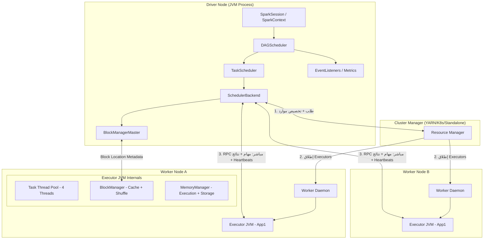

# 📘 طوبولوجيا عناقيد Spark: التشريح الكامل للـ Driver والـ Workers والـ Executors

> [!IMPORTANT]
> **هدف هذا الدليل:**
> بنهاية هذا الملف، ستفهم بالضبط كيف تتحدث مكونات Spark مع بعضها على مستوى الشبكة، ولماذا تُسبب بعض الخيارات البرمجية انهيار العنقود بالكامل، وكيف تحسب موارد الإنتاج بدقة رياضية.

---

## 📑 جدول المحتويات
1. [مقدمة تأسيسية](#1-مقدمة-تأسيسية)
2. [التشريح الداخلي للمكونات](#2-التشريح-الداخلي-للمكونات)
3. [دورة حياة المهمة على الشبكة](#3-دورة-حياة-المهمة-على-الشبكة)
4. [حساب الموارد بدقة](#4-حساب-الموارد-بدقة)
5. [أخطاء شائعة ومحطات خطر](#5-أخطاء-شائعة-ومحطات-خطر)
6. [أسئلة المقابلات التقنية](#6-أسئلة-المقابلات-التقنية)
7. [تتبع الأعطال عبر Spark UI](#7-تتبع-الأعطال-عبر-spark-ui)
8. [التمارين العملية](#8-التمارين-العملية)
9. [ورقة الغش السريعة](#9-ورقة-الغش-السريعة)

---

## 1. مقدمة تأسيسية

### 🧠 لماذا يجب أن تفهم الطوبولوجيا؟

تخيل أنك تكتب هذا الكود:

```python
result = df.groupBy("country").count().collect()
```

هذا سطر واحد بسيط. لكن خلف الكواليس، يحدث ما يلي:
1. يُترجم الكود إلى مراحل (Stages) بواسطة الـ DAG Scheduler.
2. تُرسل عشرات المهام (Tasks) عبر الشبكة إلى أجهزة مختلفة.
3. تُعيد الأجهزة البيانات المعالجة إلى الـ Driver.
4. الـ Driver يجمع كل شيء في الذاكرة.

إذا كنت لا تفهم من هو الـ Driver وما هو دوره، لن تعرف لماذا يُسبب `.collect()` انهياراً كاملاً حين يكون حجم البيانات كبيراً، ولن تستطيع إصلاح المشكلة.

### ❌ المفاهيم الخاطئة الأكثر شيوعاً

> [!WARNING]
> **خطأ شائع #1:** "العمال (Workers) والمنفذون (Executors) هما نفس الشيء."
>
> **الحقيقة:**
> - **Worker** = الخادم المادي أو خدمة الخلفية (Daemon) على الجهاز. لا ينفذ الكود الخاص بك.
> - **Executor** = عملية JVM مستقلة يُطلقها الـ Worker خصيصاً لتطبيقك. هو من ينفذ الكود.
> - يمكن لخادم واحد (Worker) تشغيل عدة Executors لعدة تطبيقات مختلفة في نفس الوقت.

> [!WARNING]
> **خطأ شائع #2:** "مدير العنقود (Cluster Manager) يُشرف على تنفيذ المهام."
>
> **الحقيقة:** دوره ينتهي بعد تخصيص الموارد. بعدها يتحدث الـ Driver مباشرة مع الـ Executors عبر Peer-to-Peer بدون وسيط.

---

## 2. التشريح الداخلي للمكونات



### 🔬 ما بداخل الـ Driver JVM؟

الـ Driver هو **العقل المدبر الكامل**. إذا مات الـ Driver، مات التطبيق بأكمله. لذا فهم مكوناته أساسي جداً:

| المكون | مسؤوليته | ما الذي يحدث إذا تعطل؟ |
| :--- | :--- | :--- |
| **DAGScheduler** | يحول الكود إلى مراحل (Stages) ويقرر أين تُنفذ البيانات | لا يمكن بدء أي مهمة جديدة |
| **TaskScheduler** | يرسل المهام للـ Executors ويعيد المحاولة عند الفشل | تتوقف المهام عن الإرسال |
| **SchedulerBackend** | يتحدث مع مدير العنقود لطلب الموارد | لا يمكن طلب Executors جديدة |
| **BlockManagerMaster** | يتتبع أين تُخزن البيانات المؤقتة (Cache) في العنقود | تفشل عمليات الـ Cache |

> [!TIP]
> **Pro Tip:** الـ Driver هو نقطة فشل واحدة (Single Point of Failure) بطبيعته. في بيئات الإنتاج، يجب تشغيله في وضع **Cluster Mode** (داخل العنقود) وليس **Client Mode** (على جهازك) حتى يستفيد من إعادة الجدولة التلقائية عند انهيار الجهاز.

---

### 🔬 ما بداخل الـ Executor JVM؟

الـ Executor هو **العامل الميداني**. انهياره لا يقتل التطبيق، فقط تُعاد جدولة مهامه.

```
+--------------------------------------------------+
|              Executor JVM Process                |
|  ┌─────────────────────────────────────────────┐ |
|  │           Task Thread Pool                  │ |
|  │  [Thread 1: معالجة Partition 0]             │ |
|  │  [Thread 2: معالجة Partition 1]             │ |
|  │  [Thread 3: معالجة Partition 2]             │ |
|  │  [Thread 4: خامل - ينتظر مهمة]             │ |
|  └─────────────────────────────────────────────┘ |
|                                                  |
|  ┌────────────────┐  ┌─────────────────────────┐ |
|  │  BlockManager  │  │     MemoryManager        │ |
|  │ Cache Partitions│  │ Execution: 60% = 3.6 GB │ |
|  │ Shuffle Files  │  │ Storage:   40% = 2.4 GB │ |
|  └────────────────┘  └─────────────────────────┘ |
+--------------------------------------------------+
```

**شرح الأقسام:**
- **Task Thread Pool:** كل خيط (Thread) يعالج **Partition واحداً** في الوقت نفسه. عدد الخيوط = `spark.executor.cores`. إذا حددت 4 Cores، يعمل 4 خيوط بالتوازي.
- **BlockManager:** يُخزن الـ Partitions المُخبأة (Cached) وملفات الـ Shuffle المحلية.
- **MemoryManager:** يُقسم الذاكرة بين الأنشطة الحسابية (Execution: Joins, Aggregations) والتخزين المؤقت (Storage: Cache).

---

## 3. دورة حياة المهمة على الشبكة

لنأخذ هذا الكود ونتبع مساره بالكامل:

```python
# الكود على الـ Driver
df = spark.read.parquet("s3a://data/sales")  # تعريف فقط، لا قراءة بعد
filtered = df.filter("amount > 1000")         # إضافة Node للخطة
result = filtered.count()                     # ACTION: يبدأ التنفيذ هنا!
```

### الخطوة 1: بناء الخطة (في الـ Driver)
```
User Code → Unresolved Logical Plan → Analyzed Logical Plan 
         → Optimized Plan → Physical Plan → Task Creation
```
كل هذا يحدث **داخل الـ Driver** قبل إرسال أي شيء للشبكة.

### الخطوة 2: تسلسل اتصالات الشبكة

```
[Driver]          [Cluster Manager]     [Executor 1]      [Executor 2]
   |                     |                   |                  |
   |--طلب Executors----->|                   |                  |
   |                     |--إطلاق Exec 1---->|                  |
   |                     |--إطلاق Exec 2---->|                  |
   |<----تسجيل مباشر-----|-------------------|<-Heartbeat بدأ---|
   |                                          |                  |
   |--إرسال Task (Partition 0,1) serialized-->|                  |
   |--إرسال Task (Partition 2,3) serialized-->|                  |
   |                                          |                  |
   |         [Exec 1 ينفذ Partition 0]        |                  |
   |         [Exec 2 ينفذ Partition 2]        |                  |
   |                                          |                  |
   |<--نتيجة count = 47821 (4 bytes فقط!)----|                  |
   |<--نتيجة count = 39204 (4 bytes فقط!)----|                  |
   |                                          |                  |
   | [Driver يجمع: 47821 + 39204 = 87025]    |                  |
```

> [!TIP]
> **Pro Tip:** لاحظ أن `.count()` يُعيد رقماً صغيراً (4 bytes). لكن `.collect()` يُعيد **البيانات الكاملة** من جميع الـ Executors دفعةً واحدة إلى ذاكرة الـ Driver. هذا هو الفرق بين أمان وكارثة!

---

## 4. حساب الموارد بدقة

### 📐 معادلة الإعداد الأمثل للـ Executor

لنفترض أن لديك خادماً بـ 16 Core و 64 GB RAM:

```
الخطوة 1: تحديد عدد الـ Cores لكل Executor
  القاعدة الذهبية: 4-5 Cores لكل Executor (لتجنب GC الثقيل)
  الاختيار: 4 Cores/Executor

الخطوة 2: تحديد عدد الـ Executors لكل خادم
  16 Cores ÷ 4 Cores/Executor = 4 Executors/Server
  (احجز 1 Core للنظام + Worker Daemon)
  → فعلياً: 3 Executors فقط (12 Cores للـ Spark)

الخطوة 3: تحديد الذاكرة لكل Executor
  64 GB - 2 GB (للنظام) = 62 GB
  62 GB ÷ 3 Executors ≈ 20 GB/Executor
  (احجز 10% لعبء الـ JVM Overhead)
  → spark.executor.memory = 18 GB
```

**إعداد `spark-submit` النهائي:**
```bash
spark-submit \
  --executor-cores 4 \
  --executor-memory 18g \
  --num-executors 30 \  # لعنقود من 10 خوادم × 3 Executors
  my_app.py
```

> [!CAUTION]
> **Common Mistake:** تخصيص 16 Cores لـ Executor واحد على خادم بـ 16 Core.
>
> **المشكلة:** الـ GC سيوقف جميع الخيوط الـ 16 في آنٍ واحد (Stop-the-World). مدة التوقف تتناسب مع حجم الذاكرة. Executor بـ 64 GB قد يتوقف لـ 30+ ثانية، مما يقطع الـ Heartbeat ويجعل الـ Driver يعتقد أن الـ Executor مات!

---

## 5. أخطاء شائعة ومحطات خطر

### 🚨 الكارثة الأولى: `.collect()` على بيانات ضخمة

```python
# ❌ كود خطير جداً في الإنتاج
all_data = spark.read.parquet("s3://data/10TB_dataset").collect()
# ☠️ ما سيحدث: كل الـ Executors سترسل بياناتها (10 TB) للـ Driver Heap
# النتيجة: java.lang.OutOfMemoryError: GC overhead limit exceeded
```

```python
# ✅ البديل الصحيح
# إذا أردت عرض عينة فقط:
sample = spark.read.parquet("s3://data/10TB_dataset").limit(100).collect()

# إذا أردت حفظ النتائج:
spark.read.parquet("s3://data/10TB_dataset") \
    .write.parquet("s3://output/result/")  # يكتب مباشرة بدون مرور بالـ Driver
```

### 🚨 الكارثة الثانية: نسيان تحرير الـ Cache

```python
# ❌ خطأ شائع في حلقات ML
for i in range(100):
    df_iteration = base_df.filter(f"batch_id = {i}").cache()
    model.fit(df_iteration)
    # ⚠️ نسي كتابة df_iteration.unpersist()!
# النتيجة: تراكم 100 Cached DataFrame حتى نفاد ذاكرة الـ Executor
```

```python
# ✅ الكود الصحيح
for i in range(100):
    df_iteration = base_df.filter(f"batch_id = {i}").cache()
    df_iteration.count()  # تجسيد الـ Cache
    model.fit(df_iteration)
    df_iteration.unpersist()  # ✅ تحرير الذاكرة فوراً
```

---

## 6. أسئلة المقابلات التقنية

### سؤال 1 (متوسط): ماذا يحدث إذا مات مدير العنقود أثناء تشغيل Job؟

**الإجابة النموذجية:**
- الـ Job الحالي **يستمر في العمل** بشكل طبيعي.
- بعد أن يُسجل الـ Driver الـ Executors، يصبح الاتصال **Peer-to-Peer مباشراً** بين الـ Driver والـ Executors.
- الـ Cluster Manager لا يتدخل في تنفيذ المهام.
- لكن **لن تستطيع** طلب Executors جديدة أو تقديم تطبيقات جديدة حتى يعود الـ Manager.

### سؤال 2 (متقدم): كيف يكتشف الـ Driver موت الـ Executor؟

**الإجابة النموذجية:**
- عبر **Heartbeat** يرسله كل Executor للـ Driver كل 10 ثوانٍ (افتراضياً).
- إذا لم يصل الـ Heartbeat خلال `spark.network.timeout` (افتراضي: 120 ثانية)، يُعلن الـ Driver أن الـ Executor مات.
- يطلب الـ Driver من الـ Cluster Manager حاوية بديلة.
- يُعيد جدولة المهام التي كانت تعمل على الـ Executor المفقود.

> [!TIP]
> **Pro Tip للمقابلات:** اذكر أيضاً أن GC Pause طويل جداً (Stop-the-World) يمكن أن يمنع الـ Executor من إرسال الـ Heartbeat، مما يجعله يبدو ميتاً رغم أنه ما زال يعمل. الحل: تقليل `spark.executor.cores` أو زيادة `spark.network.timeout`.

### سؤال 3 (متقدم): ما الفرق بين `spark.executor.memory` و `spark.executor.memoryOverhead`؟

**الإجابة النموذجية:**
- `spark.executor.memory` = ذاكرة الـ JVM Heap (حيث تعيش الكائنات وبيانات الـ Cache).
- `spark.executor.memoryOverhead` = ذاكرة خارج الـ JVM Heap (للـ Python processes, NIO buffers, PySpark workers).
- **إجمالي الذاكرة المطلوبة من نظام التشغيل** = executor.memory + memoryOverhead.
- إذا زاد استهلاك PySpark UDFs، يجب زيادة `memoryOverhead` وليس `executor.memory`.

---

## 7. تتبع الأعطال عبر Spark UI

افتح **Executors Tab** في `http://[driver-ip]:4040/executors`

| المقياس | القيمة الطبيعية | مؤشر الخطر | التشخيص |
| :--- | :--- | :--- | :--- |
| **GC Time** | < 5% من Task Time | > 15% | زيادة `executor.memory` أو تقليل `executor.cores` |
| **Failed Tasks** | 0 | > 3 على نفس الـ Executor | مشكلة في الخادم المادي (قرص/شبكة) |
| **Executor Status** | Active | Dead | OOM من نظام التشغيل؛ راجع `spark.executor.memoryOverhead` |
| **Shuffle Spill (Disk)** | 0 | > حجم البيانات × 20% | زيادة `spark.sql.shuffle.partitions` |

---

## 8. التمارين العملية

### 🧪 التمرين 1: فحص الـ Topology برمجياً

```python
from pyspark.sql import SparkSession

spark = SparkSession.builder \
    .appName("TopologyInspector") \
    .master("local[4]") \
    .config("spark.executor.memory", "2g") \
    .getOrCreate()

sc = spark.sparkContext

# فحص 1: عرض معلومات الـ Driver
print("=" * 50)
print(f"Driver Host:    {sc.master}")
print(f"App Name:       {sc.appName}")
print(f"Default Parallelism: {sc.defaultParallelism}")
# sc.defaultParallelism = عدد Cores المتاحة = عدد Tasks الافتراضي

# فحص 2: إحصائيات الـ Executors النشطة
status = sc.statusTracker()
exec_infos = status.getExecutorInfos()
print(f"\nNumber of Active Executors: {len(exec_infos)}")
for info in exec_infos:
    print(f"  - Executor ID: {info.executorId()}, Host: {info.host()}")
```

**ما ستلاحظه:**
- في وضع `local[4]`، سيكون هناك Executor واحد فقط هو الـ Driver نفسه.
- عدد الـ Default Parallelism سيكون 4 (عدد الـ Threads).

### 🧪 التمرين 2: مشاهدة الـ Heartbeat Timeout (محاكاة)

```python
import os
from pyspark.sql.functions import udf
from pyspark.sql.types import IntegerType

# محاكاة Executor يتوقف فجأة
def dangerous_function(x):
    if x == 500:
        # إيقاف العملية قسراً - محاكاة OOM Killer
        os._exit(1)
    return x * 2

safe_udf = udf(dangerous_function, IntegerType())

try:
    spark.range(1000) \
        .withColumn("result", safe_udf("id")) \
        .count()
except Exception as e:
    print(f"Job failed with: {type(e).__name__}")
    print("افتح Spark UI على localhost:4040 ورى الـ Executors Tab")
    print("ستجد Task مُعلمة كـ 'FAILED' وأخرى 'KILLED'")
```

---

## 9. ورقة الغش السريعة

### إعدادات جوهرية يجب حفظها

| الإعداد | الوصف | القيمة المثلى |
| :--- | :--- | :--- |
| `spark.executor.cores` | عدد Threads في كل Executor | **4** (ذهبي) |
| `spark.executor.memory` | ذاكرة الـ JVM Heap | `(RAM_per_node - 2GB) / executors_per_node` |
| `spark.executor.memoryOverhead` | ذاكرة خارج الـ JVM (Python, NIO) | `max(384MB, memory × 0.10)` |
| `spark.driver.memory` | ذاكرة الـ Driver Heap | `4-8 GB` في الإنتاج |
| `spark.network.timeout` | وقت انتهاء انتظار الـ Heartbeat | `120s` (زد لـ `300s` عند GC ثقيل) |
| `spark.dynamicAllocation.enabled` | إضافة/حذف Executors تلقائياً | `true` في البيئات المشتركة |

### قاموس سريع للمكونات

| المصطلح | التعريف المختصر |
| :--- | :--- |
| **Driver** | المنسق الرئيسي؛ موته = موت التطبيق |
| **Executor** | العامل الميداني؛ موته = إعادة جدولة مهامه فقط |
| **Worker Daemon** | خادم خلفية على الجهاز؛ يطلق الـ Executors ولا ينفذ الكود |
| **Task** | وحدة العمل الأصغر؛ تعالج Partition واحداً |
| **Heartbeat** | نبضة قلب دورية من الـ Executor للـ Driver كل 10 ثوانٍ |
| **BlockManagerMaster** | فهرس مركزي في الـ Driver لمواقع البيانات المخزنة |

> [!TIP]
> **الخطوة القادمة:** انتقل للملف `03_cluster_resource_managers.md` لمعرفة الفروق العميقة بين YARN وKubernetes وStandalone وكيف تختار المناسب لبيئتك.

<!-- START_NAVIGATION_LINKS -->
---
### 🔗 روابط التنقل السريع

| السابق (Previous) | التالي (Next) |
| :--- | :--- |
| [◀️ 📘 الحوسبة الموزعة و MapReduce: الأساس الذي بُني عليه Spark](01_distributed_computing_mapreduce.md) | [▶️ 📘 مدراء موارد العنقود: YARN vs Kubernetes vs Standalone — دليل الاختيار والتشغيل](03_cluster_resource_managers.md) |
<!-- END_NAVIGATION_LINKS -->
