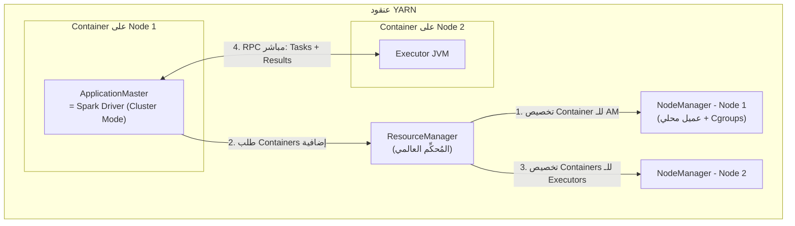
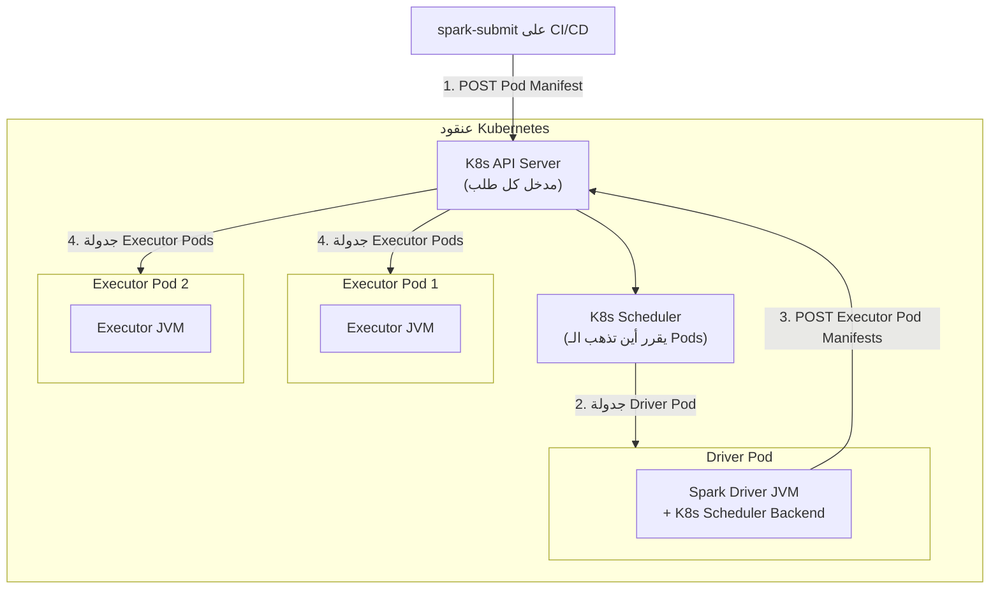
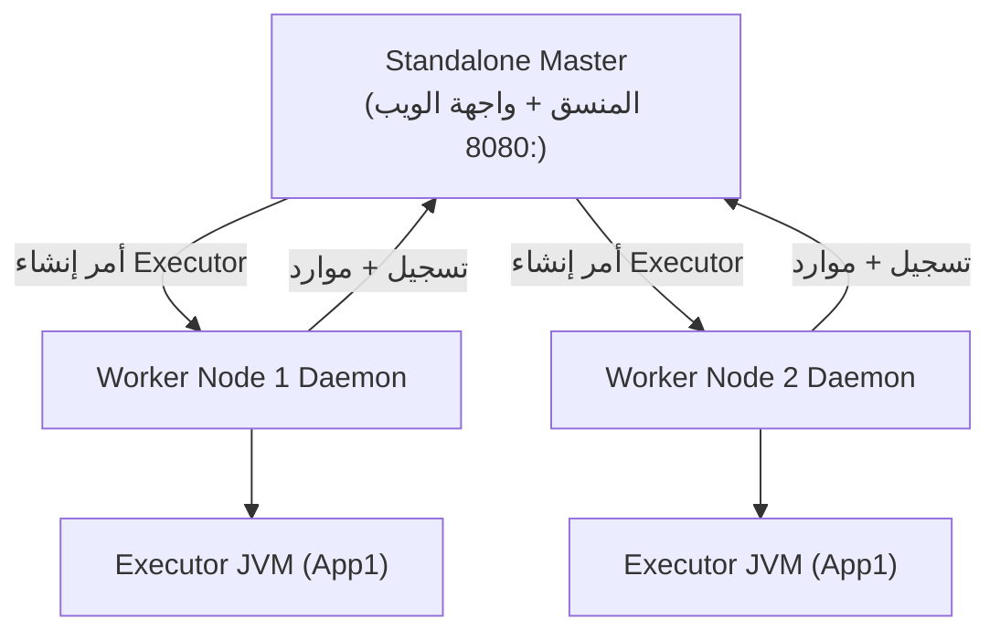

# 📘 مدراء موارد العنقود: YARN vs Kubernetes vs Standalone — دليل الاختيار والتشغيل

> [!IMPORTANT]
> **هدف هذا الدليل:**
> بنهاية هذا الملف، ستفهم كيف يتعامل كل مدير موارد مع Spark داخلياً، ومتى تختار كل منهم، وكيف تُشخص أعطال تخصيص الموارد في بيئات الإنتاج.

---

## 1. 🚀 لماذا يحتاج Spark لمدير موارد خارجي؟

Spark هو محرك تنفيذ بيانات (Data Execution Engine) فقط. لا يعرف شيئاً عن:
- هل الخادم 3 متاح أم مشغول؟
- كم من الـ RAM يمكن استخدامه دون الإضرار بتطبيق آخر؟
- ماذا أفعل إذا انهار خادم وتحتاج لإعادة جدولة مهامه؟

هذه المهمة بالكامل تقع على عاتق **مدير الموارد (Resource Manager)**. ويدعم Spark ثلاثة منهم:

| مدير الموارد | الأنسب لـ | لماذا؟ |
| :--- | :--- | :--- |
| **YARN** | بيئات Hadoop القائمة | متكامل بعمق مع HDFS، Hive، HBase |
| **Kubernetes** | البنى السحابية الحديثة | يتكامل مع Docker، CI/CD، IAM، Secrets |
| **Standalone** | عناقيد Spark مخصصة بالكامل | أبسط إعداداً وأسرع تخصيصاً للموارد |

> [!TIP]
> **Pro Tip:** الاختيار ليس قاعدة مطلقة. إذا كانت منصة Hadoop وHDFS وHive موجودة بالفعل فـ YARN منطقي. إذا كانت المؤسسة تعتمد الحاويات وCI/CD وSecrets وObservability على Kubernetes فـ K8s مناسب. إذا كان العنقود مخصصاً لـ Spark فقط وبسيط التشغيل فـ Standalone يكفي.

---

## 2. 🏗️ المعمارية الداخلية لكل مدير

### 2.1 — YARN (Yet Another Resource Negotiator)



**كيف يعمل YARN مع Spark؟**

1. **ResourceManager (RM):** المُحكّم العالمي للعنقود. يستلم طلبات الموارد ويوزعها بشكل عادل.
2. **NodeManager (NM):** يعمل على كل خادم، يستلم أوامر الـ RM وينشئ الحاويات (Containers) باستخدام Linux Cgroups للعزل.
3. **ApplicationMaster (AM):** حاوية خاصة ينشئها YARN لإدارة تطبيقك. **في وضع Cluster Mode** = هو الـ Spark Driver بالذات. **في وضع Client Mode** = مجرد وكيل يطلب الموارد بالنيابة عن الـ Driver البعيد.

> [!WARNING]
> **Common Mistake:** كثيرون يعتقدون أن YARN يُشرف على مهام Spark. **لا.** بعد أن يُطلق YARN الحاويات، تصبح العلاقة مباشرة بين الـ Spark Driver والـ Executors عبر RPC. YARN لا يعلم بمهام Spark الفردية (Tasks) بل فقط بالـ Containers ككل.

---

### 2.2 — Kubernetes (K8s)



**ما الجديد في Kubernetes؟**
- لا يوجد Daemon مخصص لـ Spark. كل شيء يتم عبر **K8s API Server**.
- الـ Driver Pod نفسه يُنشئ الـ Executor Pods برمجياً (يتصرف كـ K8s Client).
- كل Executor يعمل في Pod معزول تماماً بـ CPU Limits وMemory Limits محددة.

**المتطلب الأمني الحرج:**
لكي ينشئ الـ Driver Pod حاويات جديدة، يحتاج إلى ServiceAccount بصلاحيات محددة:

```yaml
# spark-rbac.yaml
apiVersion: v1
kind: ServiceAccount
metadata:
  name: spark-sa
  namespace: data-platform
---
apiVersion: rbac.authorization.k8s.io/v1
kind: Role
metadata:
  name: spark-role
  namespace: data-platform
rules:
  - apiGroups: [""]
    resources: ["pods", "services", "configmaps"]
    verbs: ["create", "list", "watch", "delete", "patch"]
---
apiVersion: rbac.authorization.k8s.io/v1
kind: RoleBinding
metadata:
  name: spark-rolebinding
  namespace: data-platform
subjects:
  - kind: ServiceAccount
    name: spark-sa
roleRef:
  kind: Role
  name: spark-role
  apiGroup: rbac.authorization.k8s.io
```

---

### 2.3 — Standalone Mode



**مزايا الـ Standalone:**
- **أبسط** في الإعداد (لا K8s, لا YARN).
- **أسرع** في تخصيص الموارد (يتجاوز طبقات التجريد المعقدة).
- **الأمثل** للعناقيد المخصصة لـ Spark فقط (Dedicated Spark clusters).

**قيوده:**
- لا يدعم تعدد المستأجرين (Multi-tenancy) بشكل متقدم.
- لا يملك عزل أمني للـ Containers.

---

## 3. 🔍 مشكلة Shuffle مع Dynamic Allocation

### المشكلة الأساسية

عندما تُفعّل التخصيص الديناميكي (`spark.dynamicAllocation.enabled=true`)، يُحرر Spark الـ Executors الخاملة لتوفير التكلفة. لكن هناك مشكلة:

```
Stage 0 → ينشئ Shuffle Files على Executor 3
Executor 3 يصبح خاملاً → يُحذف لتوفير الموارد
Stage 1 يحتاج Shuffle Files التي كانت على Executor 3
→ FetchFailedException! 💥
```

### الحلول حسب مدير الموارد

| مدير الموارد | الحل | كيف يعمل |
| :--- | :--- | :--- |
| **YARN** | External Shuffle Service | خدمة Node-level مستقلة تحتفظ بإمكانية تقديم ملفات الـ Shuffle بعد حذف الـ Executor |
| **Kubernetes** | Shuffle Tracking | Spark يمنع حذف الـ Executor إذا كان يحتوي على Shuffle Files نشطة |
| **Kubernetes (متقدم)** | Remote/External Shuffle Service | حل إضافي خارج Spark core يكتب أو يخدم Shuffle خارج عمر الـ Executor |

**إعداد Shuffle Tracking على Kubernetes:**
```properties
spark.dynamicAllocation.enabled=true
spark.dynamicAllocation.shuffleTracking.enabled=true
spark.dynamicAllocation.shuffleTracking.timeout=300s
```

---

## 4. ⚡ هندسة الأداء والمقارنة العميقة

### وقت إطلاق الـ Executors

| مدير الموارد | السلوك المعتاد | السبب |
| :--- | :--- | :--- |
| **Standalone** | الأسرع غالباً في عناقيد صغيرة مخصصة | طبقات أقل وإطلاق Executors مباشر |
| **YARN** | متوسط ويعتمد على ازدحام الـ ResourceManager والـ Queues | تفاوض Containers وعزل Cgroups |
| **Kubernetes** | قد يكون أبطأ عند سحب Images أو ضغط Scheduler | Pod Scheduling وImage Pull وCNI وAdmission Controllers |

> [!TIP]
> **Pro Tip:** على Kubernetes، قم بـ Pre-pull الـ Spark Docker Image على جميع الـ Nodes باستخدام DaemonSet لتقليل وقت الإطلاق من ~15 ثانية إلى ~3 ثوانٍ.

```yaml
# pre-pull-daemonset.yaml
apiVersion: apps/v1
kind: DaemonSet
spec:
  template:
    spec:
      initContainers:
        - name: pre-pull
          image: apache/spark:3.5.0
          command: ["echo", "Image pre-pulled!"]
```

### عبء الشبكة (Network Overhead)

**YARN** يستخدم غالباً شبكة المضيف مباشرة = أداء جيد للـ Shuffle.

**Kubernetes** يضيف CNI وطبقات عزل. مقدار الـ overhead يعتمد على الـ CNI، MTU، سياسة الشبكة، ونوع السحابة؛ لا تفترض رقماً ثابتاً بدون قياس.

**الحلول على K8s:** استخدم CNI مناسباً للـ throughput، اضبط MTU، راقب network policies، وفكر في node locality أو remote shuffle service عند الـ shuffle الثقيل. Host networking يتطلب Pod templates/سياسات أمان واضحة ولا ينبغي تقديمه كإعداد افتراضي عام.

---

## 5. 🚨 سيناريوهات الفشل وكيفية التشخيص

### حادثة 1: Executor Pods عالقة في حالة Pending

```bash
# فحص حالة الـ Pods
kubectl get pods -n data-platform -l spark-role=executor

# المخرجات:
# NAME                        READY   STATUS    RESTARTS   AGE
# spark-executor-1            0/1     Pending   0          5m
# spark-executor-2            0/1     Pending   0          5m

# تشخيص السبب
kubectl describe pod spark-executor-1 -n data-platform
# ابحث عن Events في الأسفل:
# Events: 0/3 nodes are available: 3 Insufficient cpu.
```

**السبب:** العنقود لا يملك موارد كافية لتشغيل الـ Pods.

**الحل:**
```bash
# خيار 1: تقليل طلب الموارد
spark-submit --conf spark.kubernetes.executor.request.cores=1 ...

# خيار 2: تفعيل Node AutoScaler لإضافة خوادم جديدة تلقائياً
kubectl patch nodepool default --patch '{"spec":{"autoscaling":{"enabled":true}}}'
```

### حادثة 2: 403 Forbidden عند إنشاء Executor Pods

```text
ERROR KubernetesClusterSchedulerBackend: Failed to create executor pod:
io.kubernetes.client.openapi.ApiException: Forbidden
Message: pods is forbidden: User "system:serviceaccount:default:default"
         cannot create resource "pods" in API group "" in namespace "data-platform"
```

**التشخيص:** الـ Driver Pod يستخدم الـ `default` ServiceAccount الذي لا يملك صلاحيات.

**الحل:**
```bash
# تطبيق ملف RBAC المذكور في القسم 2.2 أعلاه
kubectl apply -f spark-rbac.yaml

# ثم تقديم المهمة بـ ServiceAccount الصحيح
spark-submit \
  --conf spark.kubernetes.authenticate.driver.serviceAccountName=spark-sa \
  ...
```

---

## 6. 🧪 التمارين العملية

### التمرين 1: تشغيل Standalone والتحقق من الـ Master UI

```bash
# 1. تشغيل الـ Master
/opt/spark/sbin/start-master.sh --host localhost --port 7077

# 2. تشغيل Worker
/opt/spark/sbin/start-worker.sh spark://localhost:7077

# 3. افتح المتصفح
# http://localhost:8080 - ستجد واجهة الـ Master

# 4. تقديم مهمة اختبارية
spark-submit \
  --master spark://localhost:7077 \
  --class org.apache.spark.examples.SparkPi \
  /opt/spark/examples/jars/spark-examples.jar 100
```

### التمرين 2: مقارنة Client Mode vs Cluster Mode

```python
# hostname_check.py — سيطبع اسم الجهاز الذي يعمل عليه الـ Driver
import socket
from pyspark.sql import SparkSession

spark = SparkSession.builder.appName("HostnameCheck").getOrCreate()
print(f"Driver running on: {socket.gethostname()}")
print(f"Driver IP: {socket.gethostbyname(socket.gethostname())}")
spark.stop()
```

```bash
# Client Mode: Driver على جهازك
spark-submit --master spark://spark-master:7077 --deploy-mode client hostname_check.py
# المخرج: Driver running on: my-laptop

# Cluster Mode: Driver داخل الـ Cluster
spark-submit --master spark://spark-master:7077 --deploy-mode cluster hostname_check.py
# المخرج: Driver running on: spark-worker-2  (اسم خادم داخل العنقود)
```

### التمرين 3: محاكاة موت Worker وإعادة الجدولة

```bash
# 1. ابدأ job طويل
spark-submit --master spark://spark-master:7077 long_running_job.py &

# 2. أوقف Worker أثناء التنفيذ
docker compose stop spark-worker-1

# 3. راقب Spark UI
# http://localhost:4040/stages
# ستجد المهام تُعاد جدولتها تلقائياً على spark-worker-2
```

---

## 7. 📋 ورقة الغش السريعة

### أوامر التشخيص السريع

```bash
# YARN
yarn application -list                    # قائمة التطبيقات
yarn logs -applicationId application_xxx # سجلات تطبيق محدد
yarn node -list                          # حالة الخوادم

# Kubernetes
kubectl get pods -n data-platform        # حالة جميع الـ Pods
kubectl logs spark-driver -n data-platform # سجلات الـ Driver
kubectl top pods -n data-platform        # استهلاك CPU/RAM

# Standalone
# افتح http://master-ip:8080 في المتصفح
```

### جدول اختيار مدير الموارد

| السؤال | الإجابة | الاختيار |
| :--- | :--- | :--- |
| هل لديك Hadoop cluster قائم؟ | نعم | YARN |
| هل تبني على السحابة (AWS/GCP/Azure)؟ | نعم | Kubernetes |
| هل العنقود مخصص لـ Spark فقط؟ | نعم | Standalone |
| هل تحتاج Multi-tenancy متقدم؟ | نعم | YARN أو Kubernetes |
| هل تريد تكامل مع Prometheus/Grafana؟ | نعم | Kubernetes |

> [!TIP]
> **الخطوة القادمة:** انتقل للملف `04_spark_session_lifecycle.md` لفهم ما يحدث بالضبط داخل `SparkSession.builder.getOrCreate()` وكيف يتم بناء جسر الـ Py4J بين Python و JVM.

<!-- START_NAVIGATION_LINKS -->
---
### 🔗 روابط التنقل السريع

| السابق (Previous) | التالي (Next) |
| :--- | :--- |
| [◀️ 📘 طوبولوجيا عناقيد Spark: التشريح الكامل للـ Driver والـ Workers والـ Executors](02_spark_cluster_topology.md) | [▶️ 📘 دورة حياة SparkSession: من السطر الأول إلى آخر Task](04_spark_session_lifecycle.md) |
<!-- END_NAVIGATION_LINKS -->
