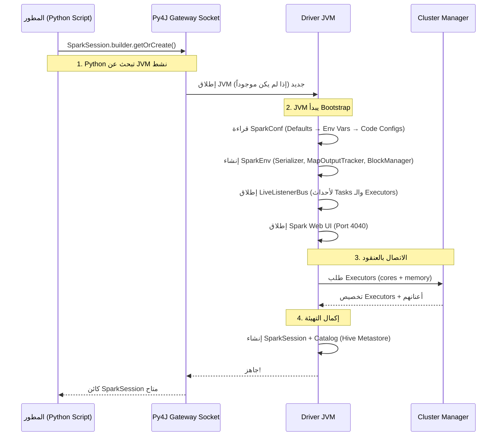

# 📘 دورة حياة SparkSession: من السطر الأول إلى آخر Task

> [!IMPORTANT]
> **هدف هذا الدليل:**
> بنهاية هذا الملف، ستفهم ما يحدث حرفياً عند كتابة `SparkSession.builder.getOrCreate()` — كيف ينطلق جسر Py4J، وكيف تُبنى البيئة الداخلية، ولماذا التكوين الخاطئ هنا يُسبب أعطالاً صعبة التشخيص.

---

## 1. 🎯 المشكلة التي يحلها هذا الدليل

معظم المطورين يكتبون:

```python
spark = SparkSession.builder.appName("MyApp").getOrCreate()
```

ويظنون أن هذا السطر "يبدأ Spark". لكن الحقيقة أن هذا السطر الواحد يُطلق سلسلة طويلة من العمليات المعقدة تشمل:
- إطلاق عملية JVM منفصلة
- فتح Socket محلي بين Python و JVM (Py4J Gateway)
- تهيئة 8+ مكونات داخلية
- الاتصال بمدير العنقود وطلب الموارد

فهم هذه السلسلة يُمكّنك من:
- تشخيص أخطاء بدء التشغيل بسرعة
- تجنب تسرب الموارد (Resource Leaks)
- تكوين الـ Session بشكل صحيح للإنتاج

---

## 2. 🏗️ المعمارية: عمليتان لا واحدة

### السؤال المحوري: كيف يتحدث Python مع الـ JVM؟

PySpark ليس مجرد "واجهة Python لـ Spark". هو في الحقيقة **نظامان منفصلان** يتحدثان عبر شبكة محلية:

```
┌─────────────────────────────────────────────────────────┐
│                      خادم الـ Driver                    │
│                                                         │
│  ┌──────────────────┐    Py4J Socket   ┌─────────────┐  │
│  │  Python Process  │ <──────────────> │  JVM Process │  │
│  │  (تفسير الكود)   │  localhost:XXXX  │  (Spark Core)│  │
│  │                  │                  │              │  │
│  │ df.filter(...)   │  ──يُترجم إلى──> │ Filter.apply │  │
│  │ df.count()       │  <──النتيجة────  │ count = 1000 │  │
│  └──────────────────┘                  └─────────────┘  │
│                                                         │
└─────────────────────────────────────────────────────────┘
```

**Py4J Gateway:** مكتبة تسمح لـ Python باستدعاء كائنات Java مباشرة عبر Socket TCP محلي. كل أمر Spark تكتبه في Python يُترجم إلى استدعاء Java في الـ JVM.

> [!WARNING]
> **Common Mistake:** كثيرون يعتقدون أن Python UDFs تعمل داخل الـ JVM.
>
> **الحقيقة:** كود Python الخاص بك (بما فيه UDFs) يعمل في **عملية Python منفصلة** على الـ Executor. يجب على الـ JVM تحويل (Serialize) البيانات من صيغة Tungsten الثنائية، ونقلها عبر Pipe لعملية Python، وانتظار النتيجة، ثم إعادة تحويلها. لهذا السبب Python UDFs أبطأ بكثير من الدوال الأصلية!

---

## 3. 🔬 تسلسل التهيئة الكامل (Bootstrap Sequence)



### شرح كل مرحلة بعمق

**المرحلة 1 — البحث عن JVM موجود:**
```python
# getOrCreate() تبحث أولاً عن SparkSession نشط في الـ JVM الحالي
spark1 = SparkSession.builder.appName("App1").getOrCreate()
spark2 = SparkSession.builder.appName("App2").getOrCreate()

# ⚠️ تنبيه: spark2 هو نفس spark1! تم تجاهل "App2"
print(spark1 is spark2)  # True
print(spark2.conf.get("spark.app.name"))  # "App1" وليس "App2"!
```

**المرحلة 2 — SparkConf: من أين تأتي الإعدادات؟**

تُقرأ الإعدادات بهذا الترتيب (الأحدث يتغلب على القديم):
```
1. القيم الافتراضية داخل Spark
2. ملفات الإعداد مثل `spark-defaults.conf`
3. معاملات `spark-submit` مثل `--conf key=value`
4. إعدادات `SparkConf` أو `.config(...)` قبل إنشاء `SparkContext`
```

> بعض الإعدادات لا يمكن تغييرها بعد إنشاء `SparkContext`، حتى لو استخدمت `spark.conf.set` لاحقاً.

**المرحلة 3 — SparkEnv: البنية التحتية الداخلية:**

```
SparkEnv يحتوي على:
├── Serializer        → تحويل البيانات للنقل (Java Serializer أو Kryo)
├── MapOutputTracker  → تتبع مواقع ملفات الـ Shuffle
├── BlockManager      → تخزين واسترجاع الـ Partitions والـ Broadcasts
├── BroadcastManager  → توزيع المتغيرات الكبيرة لجميع الـ Executors
└── MetricsSystem     → إرسال مقاييس الأداء لأنظمة المراقبة
```

> [!TIP]
> **Pro Tip:** يمكنك إضافة Listeners مخصصة لالتقاط أحداث Spark برمجياً (مثل إرسال تنبيه عند فشل Stage):
> إضافة SparkListeners مخصصة من PySpark ليست مباشرة مثل تعريف Python class وتمريرها للـ JVM. في الإنتاج استخدم JVM listener مضافاً عبر `spark.extraListeners`، أو اعتمد على event logs وSpark History Server/metrics sinks.

---

## 4. ⚙️ إعداد SparkSession للإنتاج

### 4.1 — شبلون الإعداد الكامل

```python
from pyspark.sql import SparkSession

spark = SparkSession.builder \
    .appName("ProductionETL_v2") \
    
    # --- إعدادات الموارد ---
    .config("spark.executor.memory", "8g") \
    .config("spark.executor.cores", "4") \
    .config("spark.executor.memoryOverhead", "1g") \
    .config("spark.driver.memory", "4g") \
    
    # --- إعدادات الأداء ---
    .config("spark.sql.shuffle.partitions", "200") \
    .config("spark.sql.adaptive.enabled", "true") \
    .config("spark.serializer", "org.apache.spark.serializer.KryoSerializer") \
    
    # --- إعدادات الـ Catalog (Hive) ---
    .config("spark.sql.catalogImplementation", "hive") \
    .config("hive.metastore.uris", "thrift://hive-metastore:9083") \
    
    # --- إعدادات التخزين (S3) ---
    .config("spark.hadoop.fs.s3a.endpoint", "s3.amazonaws.com") \
    .config("spark.hadoop.fs.s3a.impl", "org.apache.hadoop.fs.s3a.S3AFileSystem") \
    
    .getOrCreate()
```

### 4.2 — إدارة الجلسات المتعددة (Multi-Session)

```python
# SparkSession الرئيسية
spark_main = SparkSession.builder.appName("MainApp").getOrCreate()

# جلسة معزولة (تشارك نفس الـ SparkContext لكن لها Catalog منفصل)
spark_isolated = spark_main.newSession()

# كل جلسة لها حالة مؤقتة (Temp Views) منفصلة
spark_main.createOrReplaceTempView("orders", orders_df)
# spark_isolated لا ترى "orders" هنا!

# ✅ هذا مفيد في Spark Thrift Server حيث كل مستخدم له جلسة معزولة
```

---

## 5. 🔴 أخطاء التهيئة الأكثر شيوعاً

### الخطأ 1: نسيان `spark.stop()` في نهاية التطبيق

```python
# ❌ كود يُسبب تسرب الموارد
def process_batch(batch_id):
    spark = SparkSession.builder.appName(f"Batch-{batch_id}").getOrCreate()
    spark.read.parquet(f"s3://data/batch_{batch_id}").write.parquet("s3://output/")
    # ⚠️ نسي spark.stop()!
    # الـ Executors ستبقى تعمل على العنقود بدون عمل

for i in range(10):
    process_batch(i)
# النتيجة: 10 تطبيقات Spark مفتوحة على العنقود، تهدر الموارد!
```

```python
# ✅ الحل: استخدام context manager
from contextlib import contextmanager

@contextmanager
def spark_session(app_name):
    spark = SparkSession.builder.appName(app_name).getOrCreate()
    try:
        yield spark
    finally:
        spark.stop()  # يُنفذ دائماً حتى عند حدوث Exception

# الاستخدام الآمن:
with spark_session("MyBatchJob") as spark:
    spark.read.parquet("...").write.parquet("...")
```

### الخطأ 2: تكوين `getOrCreate()` متناقض في Airflow

```python
# ❌ خطأ شائع في Airflow DAGs
# Task 1
spark = SparkSession.builder.config("spark.executor.memory", "4g").getOrCreate()
# Task 2 (نفس الـ Worker)
spark = SparkSession.builder.config("spark.executor.memory", "8g").getOrCreate()
# ⚠️ Task 2 ستحصل على SparkSession بـ 4g وليس 8g!
```

```python
# ✅ الحل: دائماً أوقف الجلسة السابقة قبل إنشاء جلسة جديدة بإعدادات مختلفة
from pyspark.sql import SparkSession

def get_fresh_session(app_name, **configs):
    """دائماً ينشئ جلسة جديدة بالإعدادات المطلوبة"""
    SparkSession.builder.getOrCreate().stop()  # إيقاف أي جلسة سابقة
    
    builder = SparkSession.builder.appName(app_name)
    for key, value in configs.items():
        builder = builder.config(key, value)
    return builder.getOrCreate()
```

### الخطأ 3: SparkContext تعددية (Multiple Contexts) في Tests

```python
# ❌ خطأ شائع في Unit Tests
class TestSparkJobs(unittest.TestCase):
    def setUp(self):
        # ⚠️ كل test تحاول إنشاء SparkContext جديد
        self.sc = SparkContext.getOrCreate()

# الحل: ✅ SparkContext واحد يتشارك بين جميع الـ Tests
@pytest.fixture(scope="session")
def spark():
    """يُنشئ SparkSession واحدة لكل جلسة اختبار"""
    spark = SparkSession.builder \
        .master("local[2]") \
        .appName("TestSuite") \
        .getOrCreate()
    yield spark
    spark.stop()
```

---

## 6. 🔬 تشخيص أعطال التهيئة

### فحص المشكلة: Port 4040 محجوز

```bash
# رسالة الخطأ:
# WARN SparkUI: Could not initialize Spark UI
# java.net.BindException: Address already in use: Service 'SparkUI' failed after 16 retries

# التشخيص:
lsof -i :4040  # من يستخدم الـ Port؟

# الحل 1: تغيير المنفذ
.config("spark.ui.port", "4041")

# الحل 2: Spark سيجرب المنافذ 4040→4041→4042 تلقائياً
# (يبحث حتى يجد منفذاً متاحاً بحد أقصى 16 محاولة)
```

### فحص المشكلة: Py4J Connection Refused

```bash
# رسالة الخطأ:
# py4j.protocol.Py4JNetworkError: Answer from Java side is empty

# الأسباب الشائعة:
# 1. JAVA_HOME غير مضبوط بشكل صحيح
echo $JAVA_HOME   # يجب أن يشير لمجلد Java

# 2. Py4J version غير متوافق
pip show py4j     # تحقق من الإصدار

# 3. Driver JVM انهار أثناء التهيئة
# ابحث في سجلات Spark عن: ERROR SparkContext: Error initializing SparkContext
```

---

## 7. 🧪 التمارين العملية

### التمرين 1: استكشاف دورة الحياة

```python
from pyspark.sql import SparkSession
import time

print("1. قبل إنشاء SparkSession...")

spark = SparkSession.builder \
    .appName("LifecycleLab") \
    .master("local[2]") \
    .config("spark.ui.enabled", "true") \
    .config("spark.ui.port", "4040") \
    .getOrCreate()

print(f"2. SparkSession جاهزة! App ID: {spark.sparkContext.applicationId}")
print(f"   Spark UI: http://localhost:{spark.conf.get('spark.ui.port', '4040')}")
print(f"   Default Parallelism: {spark.sparkContext.defaultParallelism}")
print(f"   Spark Version: {spark.version}")

# افتح المتصفح على http://localhost:4040 الآن!
time.sleep(30)  # 30 ثانية لاستكشاف الـ UI

# اختبار getOrCreate لا تنشئ جلسة جديدة
spark2 = SparkSession.builder.appName("AnotherApp").getOrCreate()
print(f"\n3. هل spark2 هو نفس spark؟ {spark is spark2}")
print(f"   App Name للـ spark2: {spark2.conf.get('spark.app.name')}")

spark.stop()
print("4. SparkSession أُغلقت. الـ JVM توقف.")
```

### التمرين 2: قياس وقت التهيئة

```python
import time
from pyspark.sql import SparkSession

# قياس وقت إنشاء الـ Session
start = time.time()
spark = SparkSession.builder \
    .appName("TimingTest") \
    .master("local[*]") \
    .getOrCreate()
init_time = time.time() - start

print(f"وقت تهيئة SparkSession: {init_time:.2f} ثانية")
# طبيعي: 3-8 ثوانٍ لـ Local Mode
# على Cluster: 15-60 ثانية (حسب مدير الموارد)

# قياس وقت أول Query (يشمل تجميع الـ Executors)
start = time.time()
count = spark.range(1000000).count()
first_query_time = time.time() - start
print(f"وقت أول استعلام: {first_query_time:.2f} ثانية")

# القياس الثاني (بدون تأخير التهيئة)
start = time.time()
count = spark.range(1000000).count()
second_query_time = time.time() - start
print(f"وقت ثاني استعلام: {second_query_time:.2f} ثانية")
# الفرق كبير! الأول يشمل تهيئة الـ JIT Compiler

spark.stop()
```

---

## 8. 🎓 أسئلة المقابلات التقنية

### سؤال 1: ما الفرق بين `SparkSession`، `SparkContext`، و `SQLContext`؟

**الإجابة النموذجية:**
- **SparkContext** (Spark 1.x): نقطة الدخول للـ RDD API. يتصل بالعنقود ويدير الموارد.
- **SQLContext** (Spark 1.x): طبقة إضافية فوق SparkContext لتشغيل SQL.
- **SparkSession** (Spark 2.x+): **وحّدت الثلاثة** في كائن واحد. تحتوي داخلياً على SparkContext، وتُتيح كلاً من RDD API وDataFrame API وSQL API.

```python
# في Spark 2+، يمكن الوصول لـ SparkContext من SparkSession:
sc = spark.sparkContext  # الـ SparkContext الداخلي
```

### سؤال 2: ماذا يحدث إذا استدعيت `getOrCreate()` مرتين بإعدادات مختلفة؟

**الإجابة النموذجية:**
الاستدعاء الثاني **يتجاهل إعداداته تماماً** ويُعيد الجلسة الأولى. هذا السلوك يُسبب أخطاء صعبة الاكتشاف في الإنتاج. الحل هو إما:
- استخدام `spark.newSession()` لجلسة معزولة (تشارك نفس SparkContext)
- استدعاء `spark.stop()` ثم إنشاء جلسة جديدة بالإعدادات المطلوبة

### سؤال 3 (متقدم): لماذا Python UDFs أبطأ بكثير من Spark SQL expressions؟

**الإجابة النموذجية:**
لأن كود Python UDF لا يعمل داخل الـ JVM. عند تنفيذ UDF:
1. يجب على الـ JVM تحويل (Deserialize) البيانات من صيغة Tungsten الثنائية
2. نقلها عبر IPC Pipe لعملية Python
3. تنفيذ الكود Python
4. إعادة النتيجة عبر IPC Pipe للـ JVM
5. إعادة تحويل (Serialize) النتيجة لصيغة Tungsten

هذه الدورة تحدث لكل Row في البيانات، مما يجعلها أبطأ بـ 10-100x من expressions أصلية في Spark SQL.

**الحل:** استخدم Pandas UDFs (Vectorized UDFs) التي تنقل البيانات على شكل Apache Arrow batches:
```python
from pyspark.sql.functions import pandas_udf
from pyspark.sql.types import DoubleType
import pandas as pd

@pandas_udf(DoubleType())
def fast_udf(series: pd.Series) -> pd.Series:
    # يعمل على batch كامل بدلاً من Row واحدة
    return series * 2.0
```

---

## 9. 📋 ورقة الغش السريعة

```python
# إنشاء Session مثالية للإنتاج
spark = SparkSession.builder \
    .appName("ProductionJob") \
    .config("spark.sql.adaptive.enabled", "true") \
    .config("spark.sql.adaptive.coalescePartitions.enabled", "true") \
    .config("spark.serializer", "org.apache.spark.serializer.KryoSerializer") \
    .getOrCreate()

# فحص الإعدادات الحالية
spark.sparkContext.getConf().getAll()  # كل الإعدادات كـ list of tuples

# تغيير إعداد Runtime (بعض الإعدادات تقبل التغيير بعد التهيئة)
spark.conf.set("spark.sql.shuffle.partitions", "500")

# إيقاف آمن
spark.stop()
```

| الموقف | الأمر الصحيح |
| :--- | :--- |
| الجلسة الأولى في التطبيق | `SparkSession.builder.getOrCreate()` |
| جلسة معزولة (Temp Views منفصلة) | `spark.newSession()` |
| تغيير إعداد بعد التهيئة | `spark.conf.set("key", "value")` |
| إيقاف الجلسة | `spark.stop()` |
| الوصول للـ SparkContext | `spark.sparkContext` |

> [!TIP]
> **الخطوة القادمة:** انتقل للملف `05_resilient_distributed_datasets.md` لفهم بنية RDD الداخلية وكيف يضمن Spark التعافي من الأعطال عبر نظام خط النسب (Lineage).

<!-- START_NAVIGATION_LINKS -->
---
### 🔗 روابط التنقل السريع

| السابق (Previous) | التالي (Next) |
| :--- | :--- |
| [◀️ 📘 مدراء موارد العنقود: YARN vs Kubernetes vs Standalone — دليل الاختيار والتشغيل](03_cluster_resource_managers.md) | [▶️ 📘 الـ RDD: العمود الفقري لـ Spark — الخط الداخلي والتسامح مع الأعطال](05_resilient_distributed_datasets.md) |
<!-- END_NAVIGATION_LINKS -->
