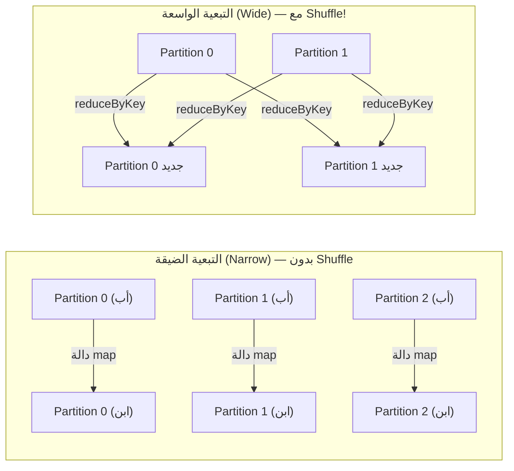

# 📘 الـ RDD: العمود الفقري لـ Spark — الخط الداخلي والتسامح مع الأعطال

> [!IMPORTANT]
> **هدف هذا الدليل:**
> بنهاية هذا الملف، ستفهم لماذا الـ RDD يُعدّ أذكى ابتكار في تاريخ معالجة البيانات الموزعة — كيف يتذكر "كيف وُلد" ليُعيد إنشاء نفسه عند الفشل، وكيف تُسبب التبعيات الواسعة (Wide Dependencies) انهيار الأداء.

---

## 1. 🎯 ما هو الـ RDD وما المشكلة التي حلها؟

قبل Spark، كانت Hadoop MapReduce تُعامل الأخطاء بطريقة واحدة: **اكتب كل شيء على القرص الصلب**. إذا مات خادم، اقرأ من القرص وابدأ من جديد. بسيط لكن بطيء جداً.

**Spark اخترع حلاً عبقرياً:** بدلاً من حفظ البيانات، **احفظ الوصفة!**

```
MapReduce يحفظ:  [1, 2, 3, 4, 5]  ← بيانات على القرص (ثقيل)

RDD يحفظ:
  "اقرأ من S3://data/sales"
  ثم "فلتر amount > 1000"
  ثم "اضرب كل قيمة × 2"    ← وصفة خفيفة في الذاكرة (خفيف جداً!)
```

إذا مات خادم وفُقدت الـ Partition 3، يقول الـ Driver للخادم البديل: "نفّذ الوصفة على الـ Partition 3". هذا يُسمى **Lineage Graph (خط النسب)**.

---

## 2. 🏗️ التشريح الداخلي للـ RDD

الـ RDD (Resilient Distributed Dataset) ليس مجرد "مجموعة بيانات موزعة". هو كائن يحتوي على 5 معلومات أساسية:

```
RDD = {
  1. قائمة الـ Partitions    → [Partition 0, Partition 1, ..., Partition N]
  2. دالة الحساب            → الكود المراد تنفيذه على كل Partition
  3. قائمة التبعيات          → [RDD الأب 1, RDD الأب 2, ...]
  4. (اختياري) Partitioner  → كيف تُوزع البيانات على الـ Partitions (Hash/Range)
  5. (اختياري) أفضل موقع   → على أي خوادم توجد البيانات (Data Locality)
}
```

### أنواع التبعيات: الفرق بين الضيق والواسع

هذا هو **أهم مفهوم** في هذا الدليل. نوع التبعية يحدد ما إذا كان Spark سيضطر لنقل البيانات عبر الشبكة (Shuffle) أم لا.



| نوع التبعية | مثال | يتطلب Shuffle؟ | التعافي عند فشل Partition |
| :--- | :--- | :--- | :--- |
| **Narrow (ضيق)** | `map`, `filter`, `flatMap` | ❌ لا | غالباً إعادة حساب الـ Partition المفقود فقط |
| **Wide (واسع)** | `groupByKey`, `reduceByKey`, `join` | ✅ نعم | قد يعاد تشغيل map-side stage إذا فقدت Shuffle outputs |

> [!WARNING]
> **Common Mistake:** استخدام `groupByKey()` بدلاً من `reduceByKey()`.
>
> ```python
> # ❌ groupByKey — يجمع كل القيم في الذاكرة أولاً ثم يعالجها
> rdd.groupByKey().mapValues(lambda vals: sum(vals))
> # المشكلة: إذا كان هناك 1 مليون قيمة لمفتاح واحد، ستُحمل كلها في ذاكرة مهمة واحدة!
>
> # ✅ reduceByKey — يجمع مسبقاً على كل Executor قبل الـ Shuffle
> rdd.reduceByKey(lambda a, b: a + b)
> # الميزة: يُقلل حجم البيانات المنقولة عبر الشبكة بشكل هائل
> ```

---

## 3. 🔬 خط النسب (Lineage): سر التسامح مع الأعطال

خط النسب هو الشجرة الكاملة من العمليات التي أدت إلى إنشاء الـ RDD الحالي.

```python
from pyspark.sql import SparkSession

spark = SparkSession.builder.master("local[2]").appName("LineageLab").getOrCreate()
sc = spark.sparkContext

# RDD الجذر (Base RDD)
base = sc.parallelize([1, 2, 3, 4, 5, 6, 7, 8], 2)

# تحويلات متسلسلة (كل سطر يضيف Node للشجرة)
doubled = base.map(lambda x: x * 2)          # Narrow
filtered = doubled.filter(lambda x: x > 6)   # Narrow
paired = filtered.map(lambda x: (x % 3, x))  # Narrow
grouped = paired.groupByKey()                 # Wide! ← حد المرحلة هنا

# طباعة خط النسب قبل التنفيذ
print(grouped.toDebugString().decode("utf-8"))
```

**المخرجات المتوقعة:**
```
(2) PythonRDD[4] at RDD at PythonRDD.scala:53 []
 |  MapPartitionsRDD[3]        ← groupByKey (Wide - حد المرحلة)
 |  ShuffledRDD[2]
 +-(2) PairwiseRDD[1]          ← map إلى pairs (Narrow)
    |  MapPartitionsRDD[0]     ← filter (Narrow)
    |  ParallelCollectionRDD   ← Base RDD
```

**كيف يُستخدم هذا عند الفشل؟**

```
سيناريو الفشل:
1. Partition 1 على Executor 2 يُفقد بسبب انهيار الخادم
2. Driver يكتشف الفشل عبر الـ Heartbeat
3. Driver يرجع لخط النسب:
   "Partition 1 يحتاج ParallelCollectionRDD Partition 1"
   "ثم map × 2"
   "ثم filter > 6"
   "ثم map إلى pairs"
4. Driver يُرسل "وصفة إعادة الحساب" لـ Executor 3
5. Executor 3 ينفذ الوصفة ويُعيد إنتاج Partition 1
```

> [!TIP]
> **Pro Tip:** خط النسب الطويل جداً (بعد عشرات التحويلات) يجعل التعافي بطيئاً لأن Spark سيُعيد الحساب من البداية. الحل هو استخدام **Checkpoint**:
>
> ```python
> sc.setCheckpointDir("hdfs://checkpoints/")
> 
> # بعد كل N تحويلات، خصوصاً في ML iterative algorithms
> rdd_after_50_iterations.checkpoint()
> # الآن خط النسب يُقطع هنا ويحفظ على HDFS
> ```

---

## 4. ⚡ التبعيات الضيقة: سر الـ Pipelining

عندما تكون التبعيات ضيقة، يستطيع Spark دمج عدة تحويلات في مهمة واحدة:

```python
# هذه الثلاث عمليات ستُنفَّذ في مهمة واحدة، على نفس الـ Partition، في الذاكرة
result = sc.textFile("s3://logs/") \
           .filter(lambda line: "ERROR" in line) \
           .map(lambda line: line.split(" ")[0]) \
           .map(lambda date: (date, 1))
# هذه السلسلة Narrow ويمكن تنفيذها داخل نفس الـ Task لكل Partition.
```

**ما يحدث فيزيائياً:**
```
Partition 0 يدخل المهمة:
  السجل 1 → filter("ERROR") → True  → map(split) → map(pair) → (2024-01-01, 1)
  السجل 2 → filter("ERROR") → False → تخطّي فوراً (لا حاجة للعمليات التالية)
  السجل 3 → filter("ERROR") → True  → map(split) → map(pair) → (2024-01-02, 1)
```

**لا يوجد تخزين وسيط، كل شيء في الذاكرة في دورة واحدة!**

---

## 5. 📊 هندسة الأداء: تحديد الـ Partitions الأمثل

عدد الـ Partitions هو أحد أهم الإعدادات في Spark:

### نقطة بداية عملية:
```
عدد الـ Partitions = عدد الـ Cores الكلي × 2 إلى 4 كبداية،
ثم عدّل حسب حجم الـ Partition، الـ Spill، ومدة الـ Tasks في Spark UI.
```

**مثال:**
- عنقود = 10 خوادم × 4 Cores = 40 Core إجمالاً
- عدد الـ Partitions المثالي = 40 × 3 = **120 Partition**

**لماذا ليس 40؟** لأن المهام لها أوقات تنفيذ متفاوتة (Skew). إذا كان عندك 40 Partition و40 Core وانتهت 39 مهمة لكن الـ 40 مهمة استغرقت 10 دقائق، فإن 39 Core ستنتظر خاملة. بزيادة عدد الـ Partitions، يكون عدم التوازن أقل تأثيراً.

```python
# عرض عدد الـ Partitions الحالي
rdd = sc.parallelize(range(1000))
print(f"عدد الـ Partitions الافتراضي: {rdd.getNumPartitions()}")
# = sc.defaultParallelism = عدد الـ Cores

# تحديد عدد الـ Partitions يدوياً
rdd_120 = sc.parallelize(range(1000), 120)
print(f"عدد الـ Partitions الجديد: {rdd_120.getNumPartitions()}")  # 120
```

---

## 6. 🚨 سيناريوهات الفشل والتعافي

### سيناريو 1: فشل Narrow Dependency

```python
# الـ RDD الأب
data = sc.parallelize([1, 2, 3, 4, 5, 6], 3)  # 3 Partitions على 3 Executors

# تحويل ضيق (Narrow)
doubled = data.map(lambda x: x * 2)

# إذا مات Executor الذي يحمل Partition 1:
# ← Spark يُعيد حساب Partition 1 فقط من data
# ← وقت التعافي: ثوانٍ
```

### سيناريو 2: فشل Wide Dependency (أصعب!)

```python
kv_data = sc.parallelize([(1, "a"), (2, "b"), (1, "c"), (2, "d")], 4)
grouped = kv_data.groupByKey()  # Wide Dependency

# إذا مات Executor بعد Shuffle Write لكن قبل Shuffle Read:
# ← Spark يُعيد تشغيل المرحلة 0 بأكملها!
# ← لأن ملفات الـ Shuffle المحلية على الـ Executor المنهار ضاعت
# ← وقت التعافي: دقائق
```

> [!CAUTION]
> لا تستخدم Checkpoint بعد كل Wide Dependency بشكل تلقائي؛ فهو يكتب إلى تخزين موثوق ويضيف I/O كبيراً. استخدمه عند وجود Lineage طويل، تكرارات ML، أو تكلفة تعافٍ عالية جداً.
>
> ```python
> # قبل عملية Shuffle باهظة ومتكررة، خبّئ الـ RDD أو افعل Checkpoint حسب الهدف
> important_rdd = kv_data.cache()  # أو .checkpoint()
> grouped = important_rdd.groupByKey()
> ```

---

## 7. 🧪 التمارين العملية

### التمرين 1: مشاهدة خط النسب والتبعيات

```python
from pyspark.sql import SparkSession

spark = SparkSession.builder.master("local[4]").appName("RDDLineage").getOrCreate()
sc = spark.sparkContext

# سلسلة تحويلات مختلطة
base = sc.parallelize(range(1, 100), 4)

# Narrow transformations
step1 = base.map(lambda x: x * 3)           # map (Narrow)
step2 = step1.filter(lambda x: x % 2 == 0)  # filter (Narrow)
step3 = step2.map(lambda x: (x % 5, x))     # تحويل لـ pairs (Narrow)

# Wide transformation (حد المرحلة)
step4 = step3.reduceByKey(lambda a, b: a + b)  # reduceByKey (Wide!)

# طباعة خط النسب الكامل
print("=== خط النسب (Lineage) ===")
print(step4.toDebugString().decode("utf-8"))

# التنفيذ — افتح Spark UI (localhost:4040) وراقب الـ Stages
result = step4.collect()
print("\n=== النتائج ===")
for item in sorted(result):
    print(f"  المفتاح {item[0]}: مجموع = {item[1]}")
```

**ماذا ستلاحظ في الـ Stages:**
- Stage 0: base → step1 → step2 → step3 (كلها Narrow في Stage واحد!)
- Stage 1: step4 (يبدأ بعد Shuffle Exchange)

### التمرين 2: مقارنة `groupByKey` مقابل `reduceByKey`

```python
import time

# بيانات اختبار (1 مليون زوج مفتاح-قيمة)
large_rdd = sc.parallelize(
    [(i % 100, i) for i in range(1_000_000)], 
    numSlices=20
)

# اختبار 1: groupByKey (البطيء)
start = time.time()
result_group = large_rdd.groupByKey() \
                         .mapValues(lambda vals: sum(vals)) \
                         .collect()
time_group = time.time() - start
print(f"groupByKey: {time_group:.2f} ثانية")

# اختبار 2: reduceByKey (السريع)
start = time.time()
result_reduce = large_rdd.reduceByKey(lambda a, b: a + b).collect()
time_reduce = time.time() - start
print(f"reduceByKey: {time_reduce:.2f} ثانية")

print(f"\nتسريع reduceByKey: {time_group / time_reduce:.1f}x أسرع")
# النتيجة المتوقعة: reduceByKey أسرع 3-10x لأنه يُقلل البيانات قبل الـ Shuffle
```

### التمرين 3: اختبار Checkpoint

```python
import os

# تحديد مجلد الـ Checkpoint
sc.setCheckpointDir("/tmp/spark-checkpoints")

# RDD بخط نسب طويل
rdd = sc.parallelize(range(1, 1000), 4)
for i in range(20):  # 20 تحويلاً متسلسلاً
    rdd = rdd.map(lambda x: x + 1)

print(f"طول خط النسب قبل Checkpoint:\n{rdd.toDebugString().decode('utf-8')[:500]}")

# عمل Checkpoint لقطع خط النسب
rdd.checkpoint()
rdd.count()  # تجسيد الـ Checkpoint على القرص

print(f"\nطول خط النسب بعد Checkpoint:\n{rdd.toDebugString().decode('utf-8')[:200]}")
# الآن خط النسب قصير جداً! يبدأ من الـ Checkpoint file
```

---

## 8. 🎓 أسئلة المقابلات التقنية

### سؤال 1: ما معنى "Resilient" في اسم RDD؟

**الإجابة النموذجية:**
"Resilient" تعني **المرونة في التعافي من الأعطال**. الـ RDD لا يخزن البيانات بشكل دائم على القرص للحماية (كما تفعل MapReduce). بدلاً من ذلك، يحفظ **خط النسب (Lineage)** — سلسلة التحويلات التي أدت إلى إنشاء الـ RDD. عند فقدان أي Partition، يُعيد Spark حسابه تلقائياً بتطبيق نفس سلسلة التحويلات على البيانات الأصلية.

### سؤال 2: متى يكون الـ Wide Dependency مشكلة خطيرة؟

**الإجابة النموذجية:**
تكون Wide Dependency خطيرة في حالتين:
1. **Data Skew:** إذا كانت البيانات غير موزعة بالتساوي على المفاتيح (مثل 90% من الـ Keys لها نفس القيمة)، ستُحمل كل بياناتها في Partition واحد مما يُسبب OOM.
2. **الإخفاق المتأخر:** إذا انهار Executor بعد كتابة ملفات الـ Shuffle لكن قبل قراءتها، يجب إعادة المرحلة بأكملها.

### سؤال 3 (متقدم): ما الفرق بين `cache()` و `checkpoint()`؟

| المعيار | `cache()` | `checkpoint()` |
| :--- | :--- | :--- |
| **موقع التخزين** | ذاكرة الـ Executor (+ قرص اختياري) | HDFS/S3 (تخزين موزع) |
| **خط النسب** | يُحفظ كاملاً | يُقطع تماماً |
| **البقاء** | يُحذف مع إغلاق التطبيق | يبقى بعد إغلاق التطبيق |
| **متى تستخدم** | بيانات تُستخدم عدة مرات في نفس التطبيق | خطوط نسب طويلة جداً أو ML loops |

---

## 9. 📋 ورقة الغش السريعة

### قاموس التحويلات: Narrow vs Wide

| **Narrow (ضيق — بدون Shuffle)** | **Wide (واسع — مع Shuffle)** |
| :--- | :--- |
| `map()`, `flatMap()` | `groupByKey()` |
| `filter()` | `reduceByKey()` (جزئياً) |
| `mapPartitions()` | `sortByKey()` |
| `union()` | `join()` (عادةً) |
| `coalesce()` (تقليص فقط) | `repartition()` |
| `sample()` | `distinct()` |

### أوامر تشخيص الـ RDD

```python
# عدد الـ Partitions
rdd.getNumPartitions()

# طول خط النسب
rdd.toDebugString().decode("utf-8")

# حجم الـ RDD في الذاكرة بعد الـ Cache
rdd.cache()
rdd.count()  # تجسيد
spark.sparkContext._jvm.org.apache.spark.rdd.RDDOperationScope  # تفاصيل أكثر
```

> [!TIP]
> **الخطوة القادمة:** انتقل للملف `06_dataframes_and_datasets.md` لترى كيف تجلب الـ DataFrames أداء مضاعفاً على RDDs عبر محرك Catalyst وتقنية Tungsten Binary Format.

<!-- START_NAVIGATION_LINKS -->
---
### 🔗 روابط التنقل السريع

| السابق (Previous) | التالي (Next) |
| :--- | :--- |
| [◀️ 📘 دورة حياة SparkSession: من السطر الأول إلى آخر Task](04_spark_session_lifecycle.md) | [▶️ 📘 DataFrames & Datasets: المحرك الذكي وسر أداء Spark الخارق](06_dataframes_and_datasets.md) |
<!-- END_NAVIGATION_LINKS -->
