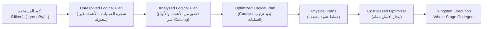

# 📘 DataFrames & Datasets: المحرك الذكي وسر أداء Spark الخارق

> [!IMPORTANT]
> **هدف هذا الدليل:**
> بنهاية هذا الملف، ستفهم لماذا DataFrame API أسرع من RDD رغم أنها تبدو أبسط — كيف يعمل مُحسّن Catalyst كـ "مترجم ذكي"، وكيف تخزن Tungsten البيانات في الذاكرة بطريقة تتفوق على Java الافتراضية بعشرات المرات.

---

## 1. 🎯 لماذا نحتاج DataFrames إذا كان RDD موجوداً؟

لنقارن نفس المهمة بالطريقتين:

```python
# ❌ طريقة RDD — المطور يتحكم بكل شيء بنفسه
result = sc.textFile("s3://sales/") \
           .map(lambda line: line.split(",")) \
           .filter(lambda cols: float(cols[2]) > 1000) \
           .map(lambda cols: (cols[1], float(cols[2]))) \
           .groupByKey() \
           .mapValues(lambda vals: sum(vals)) \
           .collect()
# المشكلة:
# 1. Spark لا يعرف شيئاً عن هيكل البيانات (الأعمدة والأنواع)
# 2. لا يستطيع تحسين ترتيب العمليات
# 3. يجب تحويل البيانات لكائنات Python (بطيء)
```

```python
# ✅ طريقة DataFrame — Spark يُحسّن تلقائياً
df = spark.read.parquet("s3://sales/")
result = df.filter(df.amount > 1000) \
           .groupBy("store_id") \
           .sum("amount") \
           .collect()
# الميزات:
# 1. Catalyst يعرف الأنواع والأعمدة → يُحسّن الخطة تلقائياً
# 2. Tungsten يخزن البيانات بصيغة ثنائية مُضغوطة → أسرع وأقل ذاكرة
# 3. Whole-Stage Codegen يجمع العمليات في loop Java واحد
```

**النتيجة العملية:** نفس المهمة، لكن DataFrame API أسرع بـ 5-20x على نفس البيانات!

---

## 2. 🏗️ المعمارية الداخلية: Catalyst + Tungsten

كل استعلام DataFrame يمر عبر خطوتين رئيسيتين:

### 2.1 — Catalyst Optimizer: المحرك الذكي للتخطيط



**ماذا يفعل Catalyst تحديداً؟**

| التحسين | ما يفعله | مثال |
| :--- | :--- | :--- |
| **Predicate Pushdown** | يُنزل الفلاتر لأقرب مصدر بيانات | يُرسل `WHERE amount > 1000` لقارئ Parquet فيقرأ فقط الصفوف المطلوبة |
| **Column Pruning** | يقرأ فقط الأعمدة المستخدمة | إذا select عمودان فقط، لا يُحمّل 98 عمود آخر |
| **Constant Folding** | يحسب الثوابت مسبقاً | `WHERE 2 + 2 > 3` يتحول لـ `WHERE 4 > 3` = true دائماً |
| **Join Reordering** | يُعيد ترتيب الـ Joins | يبدأ بالجدول الأصغر لتقليل البيانات المنقولة |

> [!TIP]
> **Pro Tip:** يمكنك رؤية تحسينات Catalyst بعرض الخطة:
>
> ```python
> df.filter("amount > 1000").select("store_id", "amount").explain(extended=True)
> # extended=True يُظهر الخطة المنطقية قبل وبعد التحسين
> ```
>
> ابحث عن `PushedFilters` في Scan node — هذا يعني أن الفلتر وصل للقارئ!

### 2.2 — Project Tungsten: تخزين البيانات بصيغة ثنائية

Tungsten هو "ثورة في إدارة الذاكرة". بدلاً من تخزين البيانات ككائنات Java (سبب في 50-70% مساحة زائدة ومشاكل GC)، يخزنها كـ Row ثنائية مضغوطة:

```
مثال: صف بيانات = {store_id: 5, amount: 1234.56, city: "Cairo"}

طريقة Java الافتراضية (Object):
┌──────────────────────────────────────────────────────┐
│ Object Header (16 bytes) │ store_id int (4+padding)  │
│ amount double (8 bytes)  │ city String object (ref)  │
│ String Header (16 bytes) │ "Cairo" chars (10 bytes)  │
│         = ~54+ bytes per row + GC overhead            │
└──────────────────────────────────────────────────────┘

طريقة Tungsten UnsafeRow (Binary):
┌────────────────────────────────────────────────────┐
│ Null Bitmap │ store_id  │ amount    │ city offset  │ "Cairo"  │
│  (8 bytes)  │ (8 bytes) │ (8 bytes) │ (8 bytes)    │(5 bytes) │
│                    = ~37 bytes per row, NO GC!                │
└────────────────────────────────────────────────────┘
```

**الفوائد العملية:**
- **أقل ذاكرة:** 30-50% تخفيض في استهلاك الذاكرة
- **لا GC:** البيانات خارج الـ JVM Heap (Off-heap) = لا توقفات GC
- **CPU Cache Friendly:** بيانات متجاورة في الذاكرة = أسرع في القراءة

---

## 3. ⚡ Whole-Stage Codegen: دمج العمليات في Loop واحد

هذه أقوى ميزة في Spark 2+. بدلاً من تنفيذ كل عملية منفصلة:

```
Row 1 → [Filter Operator] → [Project Operator] → [Aggregate Operator]
Row 2 → [Filter Operator] → [Project Operator] → [Aggregate Operator]
...مليون مرة...
(استدعاء virtual function لكل عملية × مليون صف = مليارات الاستدعاءات!)
```

Codegen يُترجمها لـ Java Class واحدة مُجمّعة:

```java
// الكود الذي يُولده Spark تلقائياً من استعلامك
final class GeneratedIterator extends BufferedRowIterator {
    protected void processNext() {
        while (input.hasNext()) {
            // كل الـ Operators في Loop واحد!
            InternalRow row = input.next();
            double amount = row.getDouble(2);
            
            if (amount > 1000.0) {              // Filter
                int store_id = row.getInt(1);   // Project
                hashMap.merge(store_id, amount, Double::sum); // Aggregate
            }
        }
    }
}
```

**النتيجة:** البيانات تبقى في CPU registers طوال الـ Loop = أسرع بـ 5-10x من الطريقة التقليدية.

> [!TIP]
> **كيف تتأكد أن Codegen مُفعّل؟**
> ```python
> df.explain(mode="codegen")
> # ابحث عن * أمام اسم الـ Operator
> # *HashAggregate, *Filter, *Scan parquet ← * = Codegen مُفعّل
> # SortMergeJoin (بدون *) ← Codegen مُعطّل لهذه العملية
> ```

---

## 4. 📊 Dataset[T] مقابل DataFrame: متى تستخدم كل منهما؟

```
DataFrame = Dataset[Row]   ← غير محددة النوع (Untyped)
Dataset[T] = كائنات مكتوبة ← محددة النوع (Strongly-typed)

مثال:
val df: DataFrame = spark.read.parquet("...")         // Row: لا يعرف الأعمدة وقت الترجمة
val ds: Dataset[SaleRecord] = df.as[SaleRecord]       // SaleRecord: أنواع محددة وقت الترجمة
```

| المعيار | DataFrame (Dataset[Row]) | Dataset[T] | PySpark |
| :--- | :--- | :--- | :--- |
| **السرعة** | ⚡ الأسرع | 🐢 أبطأ (Serialization JVM) | 🐢🐢 الأبطأ (Python overhead) |
| **أمان الأنواع** | ❌ (يكتشف وقت التشغيل) | ✅ (يكتشف وقت الترجمة) | ❌ |
| **الـ Tungsten** | ✅ مباشر | ⚠️ تحويل مستمر | ✅ (عبر JVM) |
| **متى تستخدم** | ETL, Analytics, SQL | Type-safe pipelines في Scala | Python developers |

> [!WARNING]
> **Common Mistake:** استخدام `Dataset[T]` ظناً أنه أسرع لأنه "Strongly typed".
>
> **الحقيقة:** عند استخدام `ds.map(record => ...)`:
> 1. Spark يُحوّل من Tungsten Binary لـ Scala Object (Deserialize)
> 2. ينفذ دالتك على الـ Object
> 3. يُعيد التحويل لـ Tungsten Binary (Serialize)
>
> هذا يحدث لكل صف! DataFrame تتجنب هذه الدورة تماماً لأنها تعمل مباشرة على Binary.

---

## 5. 🔍 تحليل خطط التنفيذ (Execution Plans)

هذه مهارة أساسية لكل مهندس بيانات متقدم:

```python
# استعلام للتحليل
df = spark.read.parquet("s3://sales/")
result = df.filter("amount > 1000") \
           .join(df.select("store_id", "region"), "store_id") \
           .groupBy("region") \
           .agg({"amount": "sum"})

# 1. الخطة المنطقية المُحسَّنة
result.explain(mode="formatted")
```

**كيف تقرأ الخطة:**

```
== Physical Plan ==
*(3) HashAggregate(keys=[region], functions=[sum(amount)])  ← المرحلة 3
+- Exchange hashpartitioning(region, 200)                   ← Shuffle هنا!
   +- *(2) HashAggregate(keys=[region], functions=[partial_sum(amount)])  ← المرحلة 2
      +- *(2) Project [region, amount]
         +- *(2) BroadcastHashJoin [store_id]              ← Broadcast Join! (لا Shuffle)
            :- *(2) Filter (amount > 1000)
            :  +- *(2) ColumnarToRow
            :     +- Scan parquet s3://sales/
            :        PushedFilters: [IsNotNull(amount), GreaterThan(amount,1000.0)]
            +- BroadcastExchange HashedRelationBroadcastMode
               +- *(1) Scan parquet s3://sales/
```

**شرح ما يحدث:**
1. **PushedFilters** → Predicate Pushdown يعمل! الفلتر يصل للـ Parquet Reader
2. **BroadcastHashJoin** → Catalyst قرر Broadcast أحد الجدولين (لأنه صغير) بدلاً من Shuffle
3. **`*` أمام الـ Operators** → Whole-Stage Codegen مُفعّل

---

## 6. 🚨 أخطاء شائعة في الأداء

### الخطأ 1: تعطيل Predicate Pushdown بغير قصد

```python
# ❌ يُعطّل Predicate Pushdown!
from pyspark.sql.functions import udf

# UDF مخصصة تحوّل الـ Pipeline لكائنات Python → لا يستطيع Catalyst تحسينها
my_udf = udf(lambda x: x > 1000)
df.filter(my_udf("amount")).explain()
# ← لن ترى PushedFilters في خطة Parquet Scan

# ✅ استخدم SQL expressions الأصلية
df.filter("amount > 1000").explain()
# ← ترى PushedFilters: [GreaterThan(amount, 1000)]
```

### الخطأ 2: `select("*")` قبل عمليات مُكلفة

```python
# ❌ يُعطّل Column Pruning
df.select("*").groupBy("store_id").count()
# Spark يُحمّل جميع الأعمدة (قد تكون 100+ عمود)!

# ✅ حدد الأعمدة المطلوبة مسبقاً
df.select("store_id").groupBy("store_id").count()
# Parquet يقرأ عمود واحد فقط
```

### الخطأ 3: تجاهل Adaptive Query Execution (AQE)

```python
# AQE (Spark 3+) يُعيد تحسين الخطة أثناء التنفيذ بناءً على إحصائيات فعلية
# تأكد من تفعيله:
spark.conf.set("spark.sql.adaptive.enabled", "true")
spark.conf.set("spark.sql.adaptive.coalescePartitions.enabled", "true")
# AQE سيُقلل عدد الـ Partitions تلقائياً بعد الـ Shuffle إذا كانت صغيرة
# وسيتعامل مع Data Skew تلقائياً
```

---

## 7. 🧪 التمارين العملية

### التمرين 1: مشاهدة Predicate Pushdown

```python
from pyspark.sql import SparkSession

spark = SparkSession.builder.master("local[2]").appName("CatalystLab").getOrCreate()

# إنشاء بيانات اختبار وحفظها كـ Parquet
spark.range(1, 100000) \
     .selectExpr("id", "id * 2.5 as amount", "id % 10 as store_id") \
     .write.mode("overwrite") \
     .parquet("/tmp/sales_test")

# قراءة وتطبيق فلتر
df = spark.read.parquet("/tmp/sales_test")

print("=== مع Predicate Pushdown ===")
df.filter("amount > 50000").explain(mode="formatted")
# ← ابحث عن PushedFilters في الـ Scan

print("\n=== بدون Predicate Pushdown (UDF يُعطّله) ===")
from pyspark.sql.functions import udf
from pyspark.sql.types import BooleanType
my_filter = udf(lambda x: x > 50000, BooleanType())
df.filter(my_filter("amount")).explain(mode="formatted")
# ← لن ترى PushedFilters
```

### التمرين 2: مقارنة أداء DataFrame مقابل RDD

```python
import time

# بيانات كبيرة
large_df = spark.range(10_000_000).selectExpr("id", "id * 1.5 as value")

# اختبار 1: DataFrame API
start = time.time()
df_result = large_df.filter("value > 5000000").count()
df_time = time.time() - start
print(f"DataFrame: {df_time:.3f}s → count={df_result}")

# اختبار 2: RDD API (نفس العملية)
rdd = large_df.rdd  # تحويل للـ RDD
start = time.time()
rdd_result = rdd.filter(lambda row: row.value > 5000000).count()
rdd_time = time.time() - start
print(f"RDD: {rdd_time:.3f}s → count={rdd_result}")

print(f"\nDataFrame أسرع بـ: {rdd_time/df_time:.1f}x")
```

### التمرين 3: تحليل تأثير Codegen

```python
# مقارنة مع وبدون Codegen
df = spark.range(10_000_000).selectExpr("id", "id % 100 as group_id", "id * 2.0 as value")

# مع Codegen (الافتراضي)
spark.conf.set("spark.sql.codegen.wholeStage", "true")
start = time.time()
df.groupBy("group_id").sum("value").count()
print(f"مع Codegen: {time.time() - start:.3f}s")

# بدون Codegen
spark.conf.set("spark.sql.codegen.wholeStage", "false")
start = time.time()
df.groupBy("group_id").sum("value").count()
print(f"بدون Codegen: {time.time() - start:.3f}s")

# إعادة التفعيل
spark.conf.set("spark.sql.codegen.wholeStage", "true")
```

---

## 8. 🎓 أسئلة المقابلات التقنية

### سؤال 1: كيف يُحسّن Catalyst استعلام يحتوي على Filter ثم Join؟

**الإجابة النموذجية:**
يطبق Catalyst **Predicate Pushdown** — يُنزل الـ Filter ليُنفَّذ قبل الـ Join. هذا يُقلل حجم البيانات التي تدخل عملية الـ Join بشكل هائل. إذا كان الفلتر يُبقي 10% من البيانات، فإن الـ Join سيعالج 10% من حجمه الأصلي. إضافةً لذلك، إذا كان أحد الجداول صغيراً، يختار CBO **Broadcast Hash Join** بدلاً من Sort Merge Join لتجنب الـ Shuffle تماماً.

### سؤال 2: ما هو `UnsafeRow` ولماذا يُعدّ ثورياً؟

**الإجابة النموذجية:**
`UnsafeRow` هو تمثيل ثنائي مُضغوط لصف البيانات في مشروع Tungsten. بدلاً من تخزين البيانات ككائنات Java على الـ JVM Heap (مما يسبب مشاكل GC)، يُخزّنها Tungsten كـ byte array في ذاكرة Off-heap. هذا يُلغي عبء الـ GC تماماً، ويُحسّن CPU cache locality (البيانات متجاورة في الذاكرة)، ويُقلل استهلاك الذاكرة بـ 30-50%.

### سؤال 3 (متقدم): متى يُعطّل Spark الـ Whole-Stage Codegen تلقائياً؟

**الإجابة النموذجية:**
يُعطّل Spark الـ Codegen في حالات معينة:
1. عند وجود **Python UDFs** — لأنها تتطلب الخروج من الـ JVM لعالم Python
2. عند استخدام **بعض Joins المعقدة** مثل SortMergeJoin بشروط غير متساوية
3. عند تجاوز **حد الكود المُجمَّع** (`spark.sql.codegen.maxFields = 100`) — إذا كان الاستعلام يحتوي على أكثر من 100 عمود

---

## 9. 📋 ورقة الغش السريعة

### قراءة `explain()` بسرعة

```
*(N) [Operator]   ← * = Codegen مُفعّل
Exchange          ← Shuffle يحدث هنا
BroadcastExchange ← Broadcast (بدون Shuffle!)
PushedFilters     ← Predicate Pushdown يعمل ✅
PartitionFilters  ← تصفية على مستوى الـ Partition (في Parquet/Delta)
```

### إعدادات الأداء الجوهرية

```python
# تفعيل AQE (Spark 3+)
spark.conf.set("spark.sql.adaptive.enabled", "true")

# AQE يُعيد تجميع الـ Partitions الصغيرة بعد الـ Shuffle
spark.conf.set("spark.sql.adaptive.coalescePartitions.enabled", "true")

# حد Broadcast Join (الجداول أصغر من هذا الحجم تُبرودكاست تلقائياً)
spark.conf.set("spark.sql.autoBroadcastJoinThreshold", "10MB")

# عدد الـ Partitions بعد الـ Shuffle
spark.conf.set("spark.sql.shuffle.partitions", "200")
# في AQE: يمكن ضبطها لقيمة كبيرة وAQE سيُقلّصها تلقائياً
```

> [!TIP]
> **الخطوة القادمة:** انتقل للملف `07_execution_model_dag.md` لفهم كيف تُحوَّل خطط Catalyst لمراحل (Stages) وكيف تتوزع المهام على الـ Executors.

<!-- START_NAVIGATION_LINKS -->
---
### 🔗 روابط التنقل السريع

| السابق (Previous) | التالي (Next) |
| :--- | :--- |
| [◀️ 📘 الـ RDD: العمود الفقري لـ Spark — الخط الداخلي والتسامح مع الأعطال](05_resilient_distributed_datasets.md) | [▶️ 📘 نموذج التنفيذ والـ DAG: كيف تتحول الأكواد لمهام موزعة](07_execution_model_dag.md) |
<!-- END_NAVIGATION_LINKS -->
