# 📘 نموذج التنفيذ والـ DAG: كيف تتحول الأكواد لمهام موزعة

> [!IMPORTANT]
> **هدف هذا الدليل:**
> بنهاية هذا الملف، ستفهم الرحلة الكاملة من سطر كود Python حتى انتهاء التنفيذ على عشرات الخوادم — ما هو الـ DAG، لماذا يوجد حدود بين الـ Stages، وكيف تُشخّص مشاكل الأداء من الـ Spark UI.

---

## 1. 🎯 فهم النموذج: كل شيء هو رسم بياني

عندما تكتب:
```python
result = spark.read.parquet("...") \
           .filter("amount > 500") \
           .groupBy("city") \
           .agg({"sales": "sum"}) \
           .orderBy("city")
```

لا ينفذ Spark هذه العمليات سطراً بسطر. بدلاً من ذلك، **يبنيها كرسم بياني من العمليات (DAG)**، ثم يُحوّل هذا الرسم لمراحل (Stages) وأخيراً لمهام (Tasks) تُرسل للـ Executors.

**السؤال الجوهري:** لماذا؟ لأن الرسم البياني يسمح لـ Catalyst بـ:
1. رؤية الصورة الكاملة قبل التنفيذ
2. إعادة ترتيب العمليات (مثل تنزيل الفلاتر)
3. دمج العمليات المتتالية في Task واحد (Pipelining)
4. تحديد أماكن الـ Shuffle الضرورية فقط

---

## 2. 🏗️ من الكود للـ DAG: رحلة خطوة بخطوة

### المرحلة 1 — الكود لا يُنفّذ فوراً (Lazy Evaluation)

```python
spark = SparkSession.builder.master("local[4]").appName("DAGLab").getOrCreate()

# كل هذه الأسطر لا تُنفّذ أي شيء!
df = spark.read.parquet("s3://data/orders")  # ← فقط يبني خطة القراءة
filtered = df.filter("amount > 500")          # ← يُضيف Filter للخطة
grouped = filtered.groupBy("city")            # ← يُضيف GroupBy للخطة
result = grouped.agg({"sales": "sum"})        # ← يُضيف Aggregation للخطة

print("حتى الآن: لم يُقرأ ولم يُعالج أي بيانات!")

# هذا السطر يُطلق التنفيذ الكامل:
final_df = result.orderBy("city").collect()  # ← ACTION: الآن Spark يعمل!
```

> [!TIP]
> **Pro Tip — متى يبدأ التنفيذ؟**
>
> فقط عند استدعاء **Action**:
> - `collect()`, `take(n)`, `count()`, `show()` → يُعيد بيانات للـ Driver
> - `write.parquet(...)`, `write.csv(...)` → يكتب للتخزين
> - `foreach()`, `foreachPartition()` → يُنفّذ دالة لكل صف/Partition

### المرحلة 2 — بناء الـ DAG وتقسيمه لـ Stages

الـ DAGScheduler يُحوّل الخطة المنطقية لمراحل حسب قاعدة واحدة:
> **كل Wide Dependency (Shuffle) = حد Stage جديد**

```
مثال على استعلامنا:
Scan Parquet → Filter → Shuffle Write      Stage 0
                              ↓
                        Shuffle Exchange
                              ↓
Shuffle Read → HashAggregate → Shuffle Write  Stage 1
                              ↓
                        Shuffle Exchange
                              ↓
Shuffle Read → Sort → Output                Stage 2
```



```mermaid
graph LR
    subgraph S0 ["Stage 0 (Narrow Operations)"]
        Scan[Scan Parquet] --> Filter[Filter amount > 500]
        Filter --> PartialAgg[Partial HashAggregate]
        PartialAgg --> SW[Shuffle Write]
    end
    
    subgraph Shuffle1 ["Shuffle Exchange 1"]
        SW -->|بيانات الـ Shuffle عبر الشبكة| SR[Shuffle Read]
    end
    
    subgraph S1 ["Stage 1"]
        SR --> FinalAgg[Final HashAggregate]
        FinalAgg --> SW2[Shuffle Write]
    end
    
    subgraph Shuffle2 ["Shuffle Exchange 2"]
        SW2 -->|بيانات الـ Shuffle| SR2[Shuffle Read]
    end
    
    subgraph S2 ["Stage 2"]
        SR2 --> Sort[Sort by city]
        Sort --> Output[Output/collect]
    end
```

### المرحلة 3 — من الـ Stages للـ Tasks

كل Stage تنقسم لـ Tasks بعدد يساوي عدد الـ Partitions:

```
Stage 0 + 6 Partitions → 6 Tasks (Task 0, Task 1, ..., Task 5)
كل Task تُعالج Partition واحدة
```

---

## 3. 🔬 Shuffle: أثقل عملية في Spark

الـ Shuffle هو "العدو الأول للأداء". إليك ما يحدث فيزيائياً:

### جانب الكتابة (Shuffle Write — Map Side)

```
Task 0 (على Executor 1) تُعالج Partition 0:
  └─ السجل (city="Cairo", sales=500)   → يكتب في ملف partition_for_reducer_0.data
  └─ السجل (city="Alex", sales=200)    → يكتب في ملف partition_for_reducer_1.data
  └─ السجل (city="Cairo", sales=800)   → يكتب في ملف partition_for_reducer_0.data

النتيجة: N ملف على القرص المحلي للـ Executor (بعدد الـ Partitions في المرحلة التالية)
```

### جانب القراءة (Shuffle Read — Reduce Side)

```
Task 0 في Stage 1 تُريد city="Cairo" فقط:
  1. تسأل الـ Driver: "أين partition_for_reducer_0 من Stage 0؟"
  2. الـ Driver يُعيد: "في Executor 1 وExecutor 3 وExecutor 5"
  3. Task 0 تسحب Shuffle blocks من الـ Executors عبر Netty-based BlockTransferService
  4. تدمج البيانات وتُجري الـ Aggregation
```

> [!WARNING]
> **Common Mistake — تجاهل حجم الـ Shuffle في الـ Spark UI**
>
> افتح Spark UI → Stages Tab → انظر "Shuffle Write" و"Shuffle Read":
> - إذا كان Shuffle Write ≈ حجم البيانات الأصلية → الفلاتر تأتي **بعد** الـ Shuffle! 
> - الحل: ضع الفلاتر قبل أي `groupBy` أو `join`

---

## 4. ⚡ Adaptive Query Execution (AQE): الـ Spark الذكي

في Spark 3+، أصبح Spark قادراً على **تعديل الخطة أثناء التنفيذ** بناءً على إحصائيات حقيقية:

```python
# تفعيل AQE
spark.conf.set("spark.sql.adaptive.enabled", "true")
```

### ما يفعله AQE تلقائياً:

**1. تقليص الـ Partitions الصغيرة (Coalesce Post-Shuffle Partitions)**
```
قبل AQE: 200 Partition بعد الـ Shuffle، كل منها 1 KB فقط
         = 200 Task صغيرة، عبء الجدولة أكبر من العمل الفعلي!

مع AQE: يُلاحظ أن الـ Partitions صغيرة، يدمجها لـ 20 Partition
         = 20 Task كبيرة أكثر كفاءة
```

**2. تحويل Sort-Merge Join لـ Broadcast Join (Dynamically)**
```
قبل AQE: Catalyst افترض أن الجدول B كبير → اختار Sort-Merge Join (مع Shuffle)

أثناء التنفيذ: AQE اكتشف أن الجدول B بعد الفلتر = 5 MB فقط
               → حوّله لـ Broadcast Join (بدون Shuffle!)
```

**3. معالجة Data Skew تلقائياً**
```
بدون AQE: Task لـ city="Cairo" تعالج 80% من البيانات (بطيئة جداً)
          بينما Task لـ city="Luxor" تعالج 0.1% (تنتهي فوراً)

مع AQE: يُقسم Partition الـ "Cairo" الكبير لعدة Partitions أصغر
         → لا straggler tasks بعد الآن
```

---

## 5. 📊 قراءة الـ Spark UI مثل الخبراء

### Stage Details Page

```
Stage ID: 2          Status: SUCCEEDED       Duration: 3.2 min
Tasks: 200           Succeeded: 198          Failed: 2 (retried)

Aggregated Metrics:
  Input Size:        45.3 GB   ← حجم البيانات المقروءة
  Output Size:       1.2 GB    ← حجم المخرجات
  Shuffle Write:     8.7 GB    ← حجم ملفات الـ Shuffle (كبير!)
  GC Time:           45 sec    ← ⚠️ يجب مراقبته (> 10% من الـ Task Duration)
  
Task Duration Distribution:
  Median: 1.8 sec
  75th:   2.1 sec
  Max:    3.1 min   ← ⚠️ Straggler! (Task واحدة تأخذ 100x أطول من المتوسط)
```

**كيف تُشخّص الـ Straggler:**

```python
# إذا رأيت Straggler، أولاً تحقق من Data Skew:
df.groupBy("city").count().orderBy("count", ascending=False).show(10)
# إذا كان city="Cairo" = 80 مليون سجل والبقية < 1 مليون
# → عندك Data Skew!
```

**الحل:**
```python
from pyspark.sql.functions import concat_ws, lit, rand, floor

# إضافة "ملح عشوائي" لتوزيع البيانات
df_salted = df.withColumn("city_salted", 
    concat_ws("_", df.city, floor(rand() * 10).cast("string")))
# "Cairo_0", "Cairo_1", ..., "Cairo_9" → 10 مجموعات بدلاً من واحدة
```

---

## 6. 🚨 سيناريوهات الفشل وكيفية التشخيص

### حادثة: Stage 1 يُعاد تشغيله 3 مرات

**الأعراض في Spark UI:**
```
Stage 1: FAILED (attempt 0)
Stage 1: FAILED (attempt 1)  
Stage 1: FAILED (attempt 2)
Job: FAILED
```

**الأسباب الشائعة:**

| السبب | التشخيص | الحل |
| :--- | :--- | :--- |
| **FetchFailedException** | ملفات الـ Shuffle تالفة أو مفقودة | الـ Executor مات أثناء الـ Shuffle Write؛ Spark يُعيد Stage 0 |
| **OutOfMemoryError** | Task تحاول تحميل Partition أكبر من الذاكرة | زيادة `spark.sql.shuffle.partitions` |
| **Task timeout** | Task لا ترسل تقدم/heartbeat أو تتعطل | مشكلة شبكة، GC طويل، OOM قريب، أو Data Skew |

---

## 7. 🧪 التمارين العملية

### التمرين 1: مشاهدة تقسيم الـ Stages في الـ UI

```python
from pyspark.sql import SparkSession
from pyspark.sql.functions import sum as _sum, col

spark = SparkSession.builder \
    .master("local[4]") \
    .appName("DAG_Visualization") \
    .config("spark.ui.port", "4040") \
    .getOrCreate()

# إنشاء بيانات تختبر عدة Stages
orders = spark.range(1, 1000000) \
    .selectExpr(
        "id as order_id",
        "cast(id % 50 as string) as city",   # 50 مدينة
        "cast(id % 100 * 10.0 as double) as amount"
    )

# هذا الاستعلام سيُنشئ 3 Stages:
# Stage 0: Scan + Filter + Partial Agg + Shuffle Write
# Stage 1: Shuffle Read + Final Agg + Shuffle Write
# Stage 2: Shuffle Read + Sort + Collect
result = orders \
    .filter("amount > 500") \
    .groupBy("city") \
    .agg(_sum("amount").alias("total_sales")) \
    .orderBy("total_sales", ascending=False)

print("افتح http://localhost:4040 الآن ثم اضغط Enter")
input()

result.show(10)
print("\nافتح Spark UI وتصفح الـ Jobs وStages وSQL tabs")
```

### التمرين 2: مشاهدة تأثير AQE

```python
import time

# بيانات غير متوازنة (Data Skew)
skewed_data = spark.createDataFrame(
    [(i % 3, float(i)) for i in range(500000)],
    ["key", "value"]
)
# هذا المثال لا يصنع Skew حقيقياً؛ المفاتيح الثلاثة شبه متوازنة.
# لصناعة Skew، اجعل معظم الصفوف على مفتاح واحد.

# بدون AQE
spark.conf.set("spark.sql.adaptive.enabled", "false")
spark.conf.set("spark.sql.shuffle.partitions", "200")

start = time.time()
skewed_data.groupBy("key").sum("value").count()
time_no_aqe = time.time() - start
print(f"بدون AQE: {time_no_aqe:.2f}s")

# مع AQE
spark.conf.set("spark.sql.adaptive.enabled", "true")
spark.conf.set("spark.sql.adaptive.coalescePartitions.enabled", "true")

start = time.time()
skewed_data.groupBy("key").sum("value").count()
time_aqe = time.time() - start
print(f"مع AQE: {time_aqe:.2f}s")
```

---

## 8. 🎓 أسئلة المقابلات التقنية

### سؤال 1: لماذا يُقسّم Spark الـ DAG لـ Stages؟

**الإجابة النموذجية:**
الـ DAG Scheduler يُقسّم الرسم البياني لـ Stages عند كل Wide Dependency (Shuffle). السبب أن الـ Shuffle يتطلب تبادل البيانات بين كل الـ Executors، وهذا لا يمكن تنفيذه في الذاكرة بدون تزامن. لذلك، يجب أن **تنتهي جميع Tasks في Stage N** قبل أن تبدأ أي Task في Stage N+1. هذا حاجز التزامن (Synchronization Barrier) الذي يُسبب تأخيراً ملحوظاً.

### سؤال 2: ما هو الـ Straggler وكيف تتعامل معه؟

**الإجابة النموذجية:**
الـ Straggler هو Task تستغرق وقتاً أطول بكثير من المتوسط، مما يُؤخّر اكتمال الـ Stage بأكملها. الأسباب الشائعة:
1. **Data Skew:** Partition يحتوي على بيانات أكبر بكثير من غيره
2. **مشكلة في الخادم:** قرص بطيء، مشكلة شبكة

الحلول:
- **AQE Skew Handling:** تلقائي في Spark 3+
- **Salting:** إضافة قيم عشوائية للمفتاح لتوزيع البيانات
- **Speculative Execution:** `spark.speculation=true` → Spark يُشغّل نسخة ثانية من الـ Straggler Task ويأخذ أول من ينتهي

### سؤال 3 (متقدم): ما الفرق بين `repartition(N)` و `coalesce(N)`؟

**الإجابة النموذجية:**

| المعيار | `repartition(N)` | `coalesce(N)` |
| :--- | :--- | :--- |
| نوع التبعية | Wide (يُنشئ Stage جديد) | Narrow (في نفس Stage) |
| الـ Shuffle | نعم (Hash Shuffle كامل) | لا (دمج Partitions محلي) |
| متى تستخدم | زيادة عدد الـ Partitions أو إعادة توزيع متوازن | تقليص عدد الـ Partitions فقط |
| تحذير | مُكلف لكنه يُعطي توزيعاً مثالياً | لا يضمن التوازن عند الزيادة |

---

## 9. 📋 ورقة الغش السريعة

### حساب عدد الـ Partitions المثالي

```python
# للـ Shuffle Partitions بعد groupBy/join:
total_cores = num_executors * cores_per_executor
recommended_partitions = total_cores * 3  # قاعدة عامة

# مثال: 10 Executors × 4 Cores = 40 Cores
# → spark.sql.shuffle.partitions = 120

spark.conf.set("spark.sql.shuffle.partitions", "120")

# مع AQE: ضع قيمة كبيرة واتركه يُقلّصها:
spark.conf.set("spark.sql.shuffle.partitions", "1000")
spark.conf.set("spark.sql.adaptive.enabled", "true")
# AQE سيُقلّص الـ 1000 partition لما هو مناسب فعلياً
```

### رموز الـ Spark UI التي يجب معرفتها

| الرمز / الكلمة | المعنى |
| :--- | :--- |
| `Exchange` في الخطة | Shuffle يحدث هنا |
| `*` أمام الـ Operator | Whole-Stage Codegen مُفعّل |
| `BroadcastExchange` | Broadcast Join (لا Shuffle) |
| `PushedFilters` | Predicate Pushdown يعمل |
| Shuffle Write >> Input | الفلاتر تأتي بعد الـ Shuffle! أصلح الترتيب |

> [!TIP]
> **الخطوة القادمة:** انتقل للملف `08_narrow_vs_wide_dependencies.md` للغوص أعمق في كيفية تأثير أنواع التبعيات على الأداء وكيف تتعامل مع حالات الـ Data Skew.

<!-- START_NAVIGATION_LINKS -->
---
### 🔗 روابط التنقل السريع

| السابق (Previous) | التالي (Next) |
| :--- | :--- |
| [◀️ 📘 DataFrames & Datasets: المحرك الذكي وسر أداء Spark الخارق](06_dataframes_and_datasets.md) | [▶️ 📘 التبعيات الضيقة والواسعة: مفتاح تصميم Pipelines عالية الأداء](08_narrow_vs_wide_dependencies.md) |
<!-- END_NAVIGATION_LINKS -->
