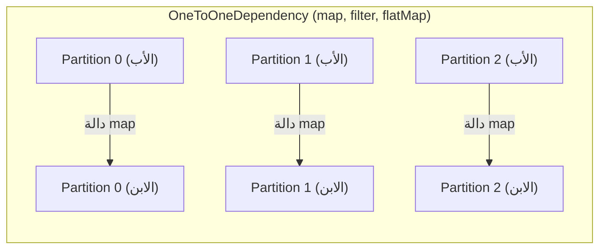
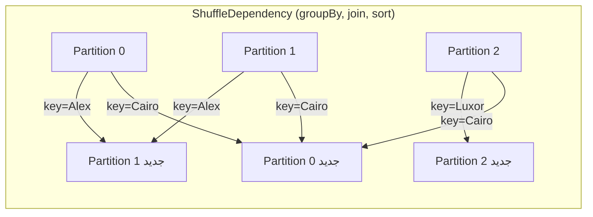

# 📘 التبعيات الضيقة والواسعة: مفتاح تصميم Pipelines عالية الأداء

> [!IMPORTANT]
> **هدف هذا الدليل:**
> بنهاية هذا الملف، ستكون قادراً على النظر لأي Pipeline وتحديد أماكن الـ Shuffle، وتقليل عددها للحد الأدنى، ومعالجة Data Skew — المهارات التي تُميّز مهندس البيانات المتقدم.

---

## 1. 🎯 السؤال الجوهري: هل يحتاج هذا لنقل بيانات عبر الشبكة؟

هذا هو **السؤال الأهم** الذي يجب أن تسأله عن كل عملية تكتبها في Spark.

**التبعية الضيقة (Narrow Dependency):** كل Partition في الـ RDD الابن يعتمد على Partition واحد فقط من الأب.
→ **لا شبكة، لا قرص، لا تأخير.**

**التبعية الواسعة (Wide Dependency):** كل Partition في الابن يحتاج بيانات من عدة Partitions في الأب.
→ **Shuffle حتمي: كتابة على قرص + نقل عبر شبكة + قراءة من قرص.**

```
مقارنة تكلفة العمليات:
  عملية في الذاكرة (Narrow):  ~1 ns   ←── السرعة القصوى
  عملية على القرص (SSD):      ~100 μs ←── 100,000× أبطأ
  عملية على الشبكة (1Gbps):   ~500 μs ←── 500,000× أبطأ
  
  الـ Shuffle = قرص + شبكة = أبطأ بمئات الآلاف من مرات!
```

---

## 2. 🏗️ التشريح الكامل لكل نوع تبعية

### 2.1 — التبعيات الضيقة (Narrow Dependencies)



**أمثلة Narrow:**

| العملية | ما تفعله | لماذا Narrow؟ |
| :--- | :--- | :--- |
| `map()` | تُحوّل كل سجل | سجل يُعطي سجلاً واحداً بنفس الـ Partition |
| `filter()` | تحذف سجلات | سجل إما يبقى أو يُحذف، لا انتقال |
| `flatMap()` | تُولّد عدة سجلات من واحد | كل السجلات تبقى في نفس الـ Partition |
| `union()` | تدمج RDDs | كل Partition يُضاف للمجموعة مباشرة |
| `coalesce()` | تُقلّص عدد الـ Partitions | تدمج Partitions متجاورة محلياً |

### 2.2 — التبعيات الواسعة (Wide Dependencies — Shuffle!)



**فيزياء الـ Shuffle في التفاصيل:**

```
الخطوة 1 — Shuffle Write (Map Side):
  كل Task تُنتج N ملف (N = عدد Partitions في المرحلة التالية)
  مثال: 6 Tasks × 10 Partitions = 60 ملف Shuffle على الأقراص!

الخطوة 2 — Shuffle Exchange:
  Driver يُسجّل مواقع الملفات في MapOutputTracker
  
الخطوة 3 — Shuffle Read (Reduce Side):
  كل Task تسأل Driver: "أين الملف الخاص بـ Partition 3؟"
  Driver يُجيب بعناوين الـ Executors
  Task تسحب الملفات عبر HTTP
```

---

## 3. ⚡ تأثير الأداء: الأرقام الحقيقية

```
سيناريو: معالجة 100 GB من بيانات المبيعات

بدون Shuffle (Narrow فقط):
  وقت المعالجة: ~3 دقائق
  استهلاك الشبكة: ~0 GB
  استهلاك القرص: ~0 GB (إضافي)

مع Shuffle واحد (Wide dependency):
  وقت المعالجة: ~12 دقيقة
  استهلاك الشبكة: ~80-120 GB
  استهلاك القرص: ~80-120 GB (ملفات Shuffle مؤقتة)
  
مع 3 Shuffles:
  وقت المعالجة: ~35+ دقيقة
  استهلاك الشبكة: ~300+ GB!
```

> [!TIP]
> **Pro Tip — قاعدة الذهب:** قبل كتابة أي `groupBy`, `join`, `orderBy`، اسأل نفسك: "هل أستطيع تقليل البيانات أولاً بـ `filter` أو `select`؟"

---

## 4. 🔍 مشكلة Data Skew: الـ Straggler القاتل

Data Skew تحدث عندما لا تكون البيانات موزعة بالتساوي على المفاتيح:

```
مثال واقعي — بيانات طلبات من مصر:
  city="Cairo"  → 15 مليون طلب  (70% من البيانات!)
  city="Alex"   → 3 مليون طلب
  city="Giza"   → 2 مليون طلب
  city="Luxor"  → 200K طلب
  ...بقية المدن → < 100K طلب
```

**ما يحدث في الـ Stage:**
```
Task 0 (Cairo):  تعالج 15M سجل → تأخذ 45 دقيقة  ← Straggler!
Task 1 (Alex):   تعالج 3M  سجل → تأخذ 9 دقائق
Task 2 (Giza):   تعالج 2M  سجل → تأخذ 6 دقائق
Task 3 (Luxor):  تعالج 200K سجل → تأخذ 35 ثانية

Stage لن تنتهي حتى Task 0 تنتهي → 45 دقيقة انتظار!
```

### حلول Data Skew

**الحل 1 — AQE تلقائياً (Spark 3+):**
```python
spark.conf.set("spark.sql.adaptive.enabled", "true")
spark.conf.set("spark.sql.adaptive.skewJoin.enabled", "true")
# AQE يكتشف الـ Skew تلقائياً ويُقسّم Cairo لعدة Sub-Partitions
```

**الحل 2 — Salting (يدوي لـ Spark 2):**
```python
from pyspark.sql.functions import concat_ws, floor, rand, lit, col

# إضافة ملح عشوائي لتوزيع البيانات
SALT_FACTOR = 10  # تقسيم كل مفتاح لـ 10 أجزاء

# جانب الـ Sales (الجانب الكبير)
df_salted = df_sales.withColumn(
    "city_salted",
    concat_ws("_", col("city"), (floor(rand() * SALT_FACTOR)).cast("string"))
)
# "Cairo" → "Cairo_0", "Cairo_1", ..., "Cairo_9"

# الآن التجميع موزع بشكل أفضل
result = df_salted \
    .groupBy("city_salted") \
    .agg({"amount": "sum"}) \
    .withColumn("city", split(col("city_salted"), "_")[0]) \
    .groupBy("city") \
    .agg({"sum(amount)": "sum"})  # تجميع ثانٍ لدمج النتائج
```

**الحل 3 — Broadcast Join لتجنب الـ Shuffle تماماً:**
```python
from pyspark.sql.functions import broadcast

# إذا كان أحد الجداول صغيراً (< 10 MB)
result = large_df.join(
    broadcast(small_lookup_df),  # يُرسل كامل الجدول الصغير لكل Executor
    on="city_id"
)
# لا Shuffle على الإطلاق!
```

---

## 5. 🚨 أخطاء شائعة مع الـ Dependencies

### الخطأ 1: `groupByKey` بدلاً من `reduceByKey`

```python
# ❌ groupByKey — كارثة أداء!
# يجمع كل القيم في الذاكرة ثم يُطبق الدالة
rdd.groupByKey().mapValues(sum)
# المشكلة: إذا مفتاح "Cairo" له 15 مليون قيمة
# → مليون قيمة في ذاكرة Task واحدة → OOM!

# ✅ reduceByKey — يُقلص البيانات قبل الـ Shuffle
rdd.reduceByKey(lambda a, b: a + b)
# يُجمع مسبقاً على كل Executor قبل الشبكة
# → حجم الـ Shuffle أصغر بكثير
```

### الخطأ 2: `repartition` بعد الـ Join بدلاً من قبله

```python
# ❌ تُجري Join على بيانات غير موزعة ثم تُعيد التوزيع
result = large_df.join(medium_df, "key").repartition(200)
# Shuffle مرتين!

# ✅ إذا كنت تحتاج توزيعاً معيناً، وزّع قبل الـ Join
large_repartitioned = large_df.repartition(200, "key")
medium_repartitioned = medium_df.repartition(200, "key")
# الآن الـ Join سيكون Narrow لأن نفس المفاتيح في نفس الـ Partitions!
result = large_repartitioned.join(medium_repartitioned, "key")
```

### الخطأ 3: `orderBy` داخل Pipeline

```python
# ❌ orderBy في منتصف Pipeline
df.groupBy("city") \
  .sum("amount") \
  .orderBy("city") \   # ← Shuffle عالمي (Global Sort) هنا!
  .filter("sum(amount) > 1000")  # ← الفلتر يأتي بعد Shuffle!

# ✅ الفلتر أولاً ثم الترتيب
df.groupBy("city") \
  .sum("amount") \
  .filter("sum(amount) > 1000") \  # قلل البيانات أولاً
  .orderBy("city")                 # ثم رتب ما تبقى
```

---

## 6. 🧪 التمارين العملية

### التمرين 1: تتبع الـ Dependencies برمجياً

```python
from pyspark.sql import SparkSession

spark = SparkSession.builder.master("local[4]").appName("DepsLab").getOrCreate()
sc = spark.sparkContext

base = sc.parallelize(range(1, 1000), 4)

# Narrow chain
step_narrow = base.map(lambda x: x * 2).filter(lambda x: x > 100)
print("=== Narrow Chain ===")
print(step_narrow.toDebugString().decode("utf-8"))

# Wide dependency (Shuffle)
pairs = base.map(lambda x: (x % 10, x))
step_wide = pairs.groupByKey()
print("\n=== Wide Dependency (ShuffleDependency) ===")
print(step_wide.toDebugString().decode("utf-8"))
# ستجد "ShuffledRDD" في المخرجات
```

### التمرين 2: قياس تكلفة الـ Shuffle

```python
import time

data = sc.parallelize(
    [(i % 1000, float(i)) for i in range(5_000_000)], 
    numSlices=20
)

# اختبار Narrow (لا Shuffle)
start = time.time()
narrow_result = data.map(lambda x: (x[0], x[1] * 2)).count()
narrow_time = time.time() - start

# اختبار Wide (مع Shuffle)
start = time.time()
wide_result = data.reduceByKey(lambda a, b: a + b).count()
wide_time = time.time() - start

print(f"Narrow (بدون Shuffle): {narrow_time:.2f}s")
print(f"Wide (مع Shuffle):     {wide_time:.2f}s")
print(f"تكلفة الـ Shuffle: {wide_time/narrow_time:.1f}x أبطأ")
```

### التمرين 3: اختبار Broadcast Join

```python
from pyspark.sql.functions import broadcast
import time

spark_sql = spark.builder.master("local[4]").appName("BroadcastTest").getOrCreate()

# بيانات كبيرة
large = spark_sql.range(1, 5_000_000) \
    .selectExpr("id", "cast(id % 100 as int) as city_id")

# جدول مراجع صغير
small = spark_sql.createDataFrame(
    [(i, f"City_{i}") for i in range(100)],
    ["city_id", "city_name"]
)

# Join عادي (Shuffle)
start = time.time()
large.join(small, "city_id").count()
regular_time = time.time() - start

# Broadcast Join (لا Shuffle)
start = time.time()
large.join(broadcast(small), "city_id").count()
broadcast_time = time.time() - start

print(f"Regular Join:   {regular_time:.2f}s")
print(f"Broadcast Join: {broadcast_time:.2f}s")
print(f"تحسين: {regular_time/broadcast_time:.1f}x أسرع")
```

---

## 7. 🎓 أسئلة المقابلات التقنية

### سؤال 1: ما الفرق الفيزيائي بين Narrow وWide Dependencies؟

**الإجابة النموذجية:**
- **Narrow:** كل Partition في الـ RDD الابن يعتمد على Partition واحد فقط من الأب. تُنفَّذ في نفس الـ Task على الـ Executor دون أي نقل للشبكة. عند فشل Partition، يُعاد حسابه محلياً فقط.
- **Wide:** كل Partition في الابن يحتاج بيانات من عدة Partitions أباء (قد تكون على Executors مختلفة). يتطلب Shuffle: كتابة على القرص المحلي، نقل عبر الشبكة، قراءة من القرص. عند فشل Partition، يجب إعادة حساب Stage بأكملها.

### سؤال 2: لماذا `reduceByKey` أفضل من `groupByKey`؟

**الإجابة النموذجية:**
كلاهما Wide Dependency ويتطلب Shuffle. الفرق هو **حجم ما يُنقل عبر الشبكة:**
- `groupByKey`: يجمع كل القيم لكل مفتاح أولاً ثم ينقلها كاملة → حجم كبير
- `reduceByKey`: يُطبّق دالة الدمج **محلياً** على كل Executor أولاً (Combine/Pre-aggregate) ثم ينقل فقط النتيجة المُقلّصة → حجم أصغر بكثير

### سؤال 3 (متقدم): كيف تكتشف Data Skew وكيف تعالجها؟

**الإجابة النموذجية:**
**الاكتشاف:** افتح Spark UI → Stage → Tasks. إذا كانت مدة الـ Max Task أكبر بـ 5x+ من الـ Median، هناك Skew. تأكد بـ:
```python
df.groupBy("key_column").count().orderBy("count", ascending=False).show(10)
```

**العلاج:**
1. **AQE (Spark 3+):** `spark.sql.adaptive.skewJoin.enabled=true`
2. **Salting:** إضافة suffix عشوائي للمفتاح الكبير لتوزيعه
3. **Broadcast Join:** إذا كان أحد الجداول صغيراً جداً

---

## 8. 📋 ورقة الغش السريعة

### قاموس العمليات: Narrow vs Wide

```python
# ── NARROW (لا Shuffle) ──────────────────────────────────────────
map()          # تحويل كل سجل
flatMap()      # توليد عدة سجلات من واحد  
filter()       # تصفية السجلات
mapPartitions() # تحويل Partition كامل
union()         # دمج RDDs (لا توازن Partitions)
coalesce(n)     # تقليص Partitions (بدون Shuffle)

# ── WIDE (مع Shuffle) ────────────────────────────────────────────
groupByKey()    # ❌ تجنب! استخدم reduceByKey
reduceByKey()   # ✅ أفضل من groupByKey
groupBy()       # DataFrame equivalent لـ groupByKey
join()          # ربط جدولين (إلا Broadcast Join)
repartition(n)  # إعادة توزيع مع Shuffle
sortBy()        # ترتيب عالمي
distinct()      # إزالة المكررات (تتطلب Shuffle)
```

### قرارات تصميم الـ Pipeline

| السيناريو | الحل المثالي |
| :--- | :--- |
| Join جدول صغير (< 10MB) | `broadcast(small_df)` → لا Shuffle! |
| تقليل عدد الـ Partitions | `coalesce(n)` → Narrow Dependency |
| إعادة توزيع متوازن | `repartition(n)` → Wide لكن ضروري |
| تجميع مع Data Skew | AQE أو Salting |
| تجميع بسيط | `reduceByKey` لا `groupByKey` |

> [!TIP]
> **الخطوة القادمة:** انتقل للملف `09_lazy_evaluation_caching.md` لتتعلم متى وكيف تستخدم الـ Cache لتجنب إعادة الحساب في Pipelines المتكررة.

<!-- START_NAVIGATION_LINKS -->
---
### 🔗 روابط التنقل السريع

| السابق (Previous) | التالي (Next) |
| :--- | :--- |
| [◀️ 📘 نموذج التنفيذ والـ DAG: كيف تتحول الأكواد لمهام موزعة](07_execution_model_dag.md) | [▶️ 📘 Lazy Evaluation والـ Caching: فن التحكم في متى وكيف يعمل Spark](09_lazy_evaluation_caching.md) |
<!-- END_NAVIGATION_LINKS -->
