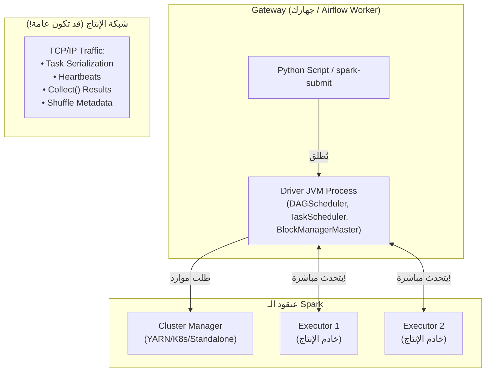
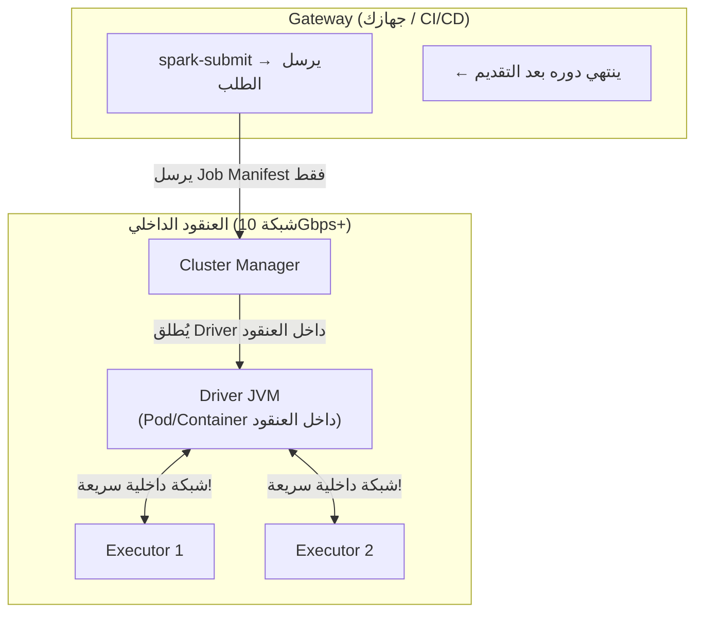

# 📘 أوضاع النشر (Deploy Modes): Client Mode vs Cluster Mode — الشبكة والإنتاج

> [!IMPORTANT]
> **هدف هذا الدليل:**
> بنهاية هذا الملف، ستفهم لماذا يُسبب Client Mode كوارث في الإنتاج، كيف تُكوّن الـ Ports لتجاوز الـ Firewalls، ومتى تختار كل وضع بناءً على معمارية نظامك.

---

## 1. 🎯 السؤال الجوهري: أين يعمل الـ Driver؟

هذا هو الفرق الوحيد (والمحوري) بين الوضعين:

```
Client Mode:
  [جهازك/Airflow Worker] ← Driver JVM يعمل هنا!
        ↕ شبكة بيئة الإنتاج (قد تكون بطيئة أو غير مستقرة)
  [العنقود: Executor 1, 2, 3, ...]

Cluster Mode:
  [جهازك/CI/CD] → يرسل الطلب فقط ثم ينتهي دوره
  [العنقود: Driver Pod + Executor 1, 2, 3, ...] ← Driver JVM يعمل هنا!
```

**لماذا هذا مهم؟**
- الـ Driver يتواصل مع كل الـ Executors باستمرار (Heartbeats + Task Scheduling)
- إذا كان الـ Driver بعيداً (Client Mode)، كل هذا الاتصال يمر عبر الشبكة الخارجية
- إذا كان الـ Driver داخل العنقود (Cluster Mode)، الاتصال يكون على شبكة داخلية سريعة (10Gbps+)

---

## 2. 🏗️ الطوبولوجيا الكاملة لكل وضع

### 2.1 — Client Mode: الدرايفر على جهازك



**المشاكل الحتمية في Client Mode مع بيئة الإنتاج:**

| المشكلة | السبب | التأثير |
| :--- | :--- | :--- |
| **اختناق الشبكة** | `collect()` يُرسل كل البيانات لجهازك | يُشبع شبكة Airflow Worker |
| **انقطاع الـ Job** | جهازك يُغلق أو تنقطع الشبكة | Job يفشل بالكامل |
| **مشكلة الـ Firewall** | الـ Executors تحاول الاتصال بجهازك | Connection Timeout، الـ Job لا يبدأ |
| **استنزاف الـ Airflow** | 20 Job × Driver JVM = 20 GB RAM على Airflow | Airflow Worker ينهار |

> [!WARNING]
> **Common Mistake:** تشغيل أكثر من Job واحد بـ Client Mode من نفس الخادم (مثل Airflow Worker).
>
> كل Driver JVM يأخذ `spark.driver.memory` (افتراضياً 1 GB). إذا كان لديك 20 Job متوازٍ:
> 20 × 1 GB = 20 GB RAM على Airflow! + استهلاك الشبكة الكامل لكل Job.

---

### 2.2 — Cluster Mode: الدرايفر داخل العنقود



**مزايا Cluster Mode:**

| الميزة | التفاصيل |
| :--- | :--- |
| **لا انقطاع** | حتى لو أُغلق جهازك، الـ Job يستمر |
| **شبكة سريعة** | Driver-Executor على 10Gbps بدلاً من 1Gbps |
| **لا تعارض موارد** | Airflow Worker لا يحمل أي Driver JVM |
| **إعادة تشغيل تلقائية** | Cluster Manager يُعيد Driver عند انهياره |

---

## 3. 🌐 مشكلة الـ Firewall في Client Mode

هذه من أكثر المشاكل شيوعاً عند البدء بـ Client Mode:

**ما الذي يحدث:**
```
1. أنت تُشغّل spark-submit من جهازك (IP: 192.168.1.100)
2. الـ Driver ينطلق على جهازك
3. الـ Executors داخل العنقود تحاول الاتصال بجهازك على:
   - spark.driver.port (افتراضي: عشوائي!)
   - spark.blockManager.port (افتراضي: عشوائي!)
4. الـ Firewall على جهازك يحظر الاتصالات الواردة!
5. الـ Executors تنتهي مهلتها (Connection Timeout)
6. الـ Job يفشل بـ: "Executor timeout"
```

**رسالة الخطأ الكلاسيكية:**
```
WARN CoarseGrainedSchedulerBackend: Requesting executors is not supported...
ERROR TransportClientFactory: Failed to create new connection
  java.io.IOException: Connection refused: 192.168.1.100/38291
```

**الحل — تثبيت المنافذ وفتح الـ Firewall:**

```bash
spark-submit \
  --master yarn \
  --deploy-mode client \
  --conf spark.driver.host=192.168.1.100 \      # عنوان IP جهازك الصريح
  --conf spark.driver.port=40000 \              # منفذ ثابت (لا عشوائي)
  --conf spark.blockManager.port=40001 \        # منفذ ثابت
  --conf spark.driver.bindAddress=0.0.0.0 \     # استمع على كل الـ Interfaces
  my_app.py
```

```bash
# فتح الـ Firewall (على Ubuntu/Debian)
sudo ufw allow from [subnet_العنقود] to any port 40000
sudo ufw allow from [subnet_العنقود] to any port 40001
```

---

## 4. ⚡ متى تختار أي وضع؟

### جدول القرار

| السيناريو | الوضع المناسب | السبب |
| :--- | :--- | :--- |
| **تطوير محلي وتجارب** | Client Mode | تريد رؤية الـ Logs مباشرة في Terminal |
| **Jupyter Notebook تفاعلي** | Client Mode | الـ Driver يجب أن يكون على نفس العملية |
| **Production ETL Jobs** | Cluster Mode | استقرار، لا اعتماد على جهاز الإرسال |
| **Airflow DAGs** | Cluster Mode | Airflow Workers لا تتحمل Driver JVMs |
| **CI/CD Pipeline** | Cluster Mode | الـ Pipeline تنتهي بعد الإرسال |
| **PySpark Shell (pyspark)** | Client Mode فقط | الـ Shell التفاعلي يتطلب Driver محلي |

> [!TIP]
> **Pro Tip — Apache Livy:** إذا أردت Jupyter Notebook يُرسل لـ Cluster Mode، استخدم **Apache Livy**. هو خدمة REST تستضيف الـ Spark Sessions داخل العنقود وتُعرّض واجهة HTTP. يتصل Jupyter بـ Livy بدلاً من بدء Driver محلي.

---

## 5. 📊 مقارنة أداء الشبكة: أرقام حقيقية

**سيناريو:** معالجة 50 GB من البيانات مع `collect()` في النهاية

```
Client Mode (Driver على Gateway بـ 1Gbps):
  وقت الـ Shuffle (داخلي):     ~8 دقائق (شبكة العنقود 10Gbps)
  وقت الـ Collect (خارجي):    ~7 دقائق (50 GB على شبكة 1Gbps)
  إجمالي:                      ~15 دقيقة

Cluster Mode (Driver داخل العنقود):
  وقت الـ Shuffle (داخلي):     ~8 دقائق (شبكة العنقود 10Gbps)
  وقت الـ Collect (داخلي):     ~1 دقيقة (50 GB على 10Gbps)
  إجمالي:                      ~9 دقيقة (أسرع بـ 40%!)

الفرق الحقيقي: لا تُعيد البيانات للـ Driver! اكتب مباشرة للـ Storage:
df.write.parquet("s3://output/")   ← هذا هو الصحيح دائماً
```

---

## 6. 🚨 سيناريوهات الفشل وكيفية التشخيص

### حادثة 1: Job يتوقف بعد 2 دقيقة (Heartbeat Timeout)

**الأعراض:**
```
INFO SparkContext: Starting job: collect at myapp.py:45
INFO DAGScheduler: Got job 0 (collect at myapp.py:45)
...
WARN HeartbeatReceiver: Removing executor 1 with no recent heartbeats: 120009 ms exceeds timeout 120000 ms
ERROR TaskSchedulerImpl: Lost executor 1 on 172.16.0.5: Executor heartbeat timed out after 120009 ms
```

**التشخيص والحل:**
```
السبب: الـ Executor لم يُرسل Heartbeat لـ 120 ثانية
الأسباب الشائعة:
  1. GC Pause طويل جداً (Stop-the-World)
  2. Executor يعالج بيانات ضخمة في Task واحدة (OOM قريب)
  3. مشكلة شبكة بين Executor والـ Driver (في Client Mode)

الحلول:
```

```python
# زيادة مهلة الـ Heartbeat
spark.conf.set("spark.network.timeout", "600s")
spark.conf.set("spark.executor.heartbeatInterval", "60s")

# تقليل الـ Task Size (زيادة عدد الـ Partitions)
spark.conf.set("spark.sql.shuffle.partitions", "500")

# أو تقليل عدد الـ Cores لتقليل GC Pressure
spark.conf.set("spark.executor.cores", "2")  # بدلاً من 4
```

### حادثة 2: Client Mode - Executors لا تتصل بالـ Driver

```bash
# التشخيص
spark-submit --conf spark.driver.host=auto ... my_app.py
# راقب السجلات للرسالة:
# INFO SparkContext: Registering BlockManager BlockManagerId(driver, 192.168.1.100, 40001, None)
# هذا يُظهر عنوان Driver المُعلن للـ Executors

# إذا كان العنوان خاطئاً (مثلاً 127.0.0.1 بدلاً من 192.168.1.100):
spark-submit --conf spark.driver.host=192.168.1.100 ...
```

---

## 7. 🧪 التمارين العملية

### التمرين 1: مقارنة الوضعين محلياً

```python
# hostname_check.py
import socket
from pyspark.sql import SparkSession

spark = SparkSession.builder.getOrCreate()

print(f"Driver عنوان IP: {socket.gethostbyname(socket.gethostname())}")
print(f"Driver اسم الخادم: {socket.gethostname()}")
print(f"Spark App ID: {spark.sparkContext.applicationId}")
print(f"Master: {spark.sparkContext.master}")

spark.stop()
```

```bash
# Client Mode: Driver يعمل على جهازك
spark-submit \
  --master spark://spark-master:7077 \
  --deploy-mode client \
  hostname_check.py
# ← يُطبع اسم جهازك

# Cluster Mode: Driver داخل العنقود
spark-submit \
  --master spark://spark-master:7077 \
  --deploy-mode cluster \
  hostname_check.py
# ← يُطبع اسم خادم داخل العنقود
```

### التمرين 2: محاكاة Gateway Disconnection

```python
# long_running_job.py
import time
from pyspark.sql import SparkSession

spark = SparkSession.builder.appName("DisconnectionTest").getOrCreate()

print("بدأ الـ Job. اقطع الشبكة عن جهازك الآن في 10 ثوانٍ!")
time.sleep(10)

# عملية طويلة نسبياً
result = spark.range(1, 100_000_000) \
    .filter("id % 3 == 0") \
    .groupBy("id % 10") \
    .count() \
    .collect()

print(f"انتهى الـ Job بـ {len(result)} نتيجة")
spark.stop()
```

```bash
# Client Mode: إذا قطعت الشبكة، الـ Job يفشل
spark-submit --deploy-mode client long_running_job.py

# Cluster Mode: الـ Job يستمر حتى بعد قطع الشبكة!
spark-submit --deploy-mode cluster long_running_job.py
```

### التمرين 3: تكوين منافذ ثابتة لـ Client Mode

```bash
spark-submit \
  --master spark://spark-master:7077 \
  --deploy-mode client \
  --conf spark.driver.host=$(hostname -I | awk '{print $1}') \
  --conf spark.driver.port=45000 \
  --conf spark.driver.blockManager.port=45001 \
  --conf spark.ui.port=4040 \
  hostname_check.py

# تحقق من المنافذ المستخدمة
netstat -tlnp | grep 4[50]0[0-9][0-9]
```

---

## 8. 🎓 أسئلة المقابلات التقنية

### سؤال 1: لماذا يُفضَّل Cluster Mode للإنتاج؟

**الإجابة النموذجية:**
ثلاثة أسباب رئيسية:
1. **الاستقرار:** الـ Job لا يعتمد على اتصال جهاز خارجي. قطع الشبكة أو إغلاق الجهاز لا يُوقف الـ Job.
2. **الأداء:** الـ Driver-Executor communication يتم على شبكة العنقود الداخلية (10Gbps+) بدلاً من الشبكة الخارجية (قد تكون 1Gbps).
3. **عدم استنزاف الموارد:** الـ Driver JVM لا يعمل على خادم الإرسال (مثل Airflow Worker)، مما يُبقي تلك الخوادم خفيفة.

### سؤال 2: لماذا `pyspark` Shell و Jupyter Notebooks تعمل فقط بـ Client Mode؟

**الإجابة النموذجية:**
الـ Shell التفاعلي و Jupyter Notebooks يتطلبان **حلقة stdin/stdout مباشرة مع الـ Driver** — تكتب كوداً وتحصل على نتيجة فورية. في Cluster Mode، الـ Driver يعمل داخل Container على خادم بعيد ولا يوجد اتصال مباشر بـ stdin/stdout. لهذا، تطبيقات الـ PySpark التفاعلية تعمل دائماً بـ Client Mode حيث الـ Driver هو العملية الحالية.

### سؤال 3 (متقدم): ما هي الـ Ports التي يجب فتحها للـ Firewall في Client Mode؟

**الإجابة النموذجية:**
يجب فتح المنافذ التالية **من العنقود إلى جهاز الـ Driver**:
1. `spark.driver.port` (افتراضي: عشوائي، يُفضَّل تثبيته مثل 40000): للاتصال الرئيسي بين الـ Executors والـ Driver.
2. `spark.driver.blockManager.port` (افتراضي: عشوائي، يُفضَّل 40001): لتبادل الـ Block Metadata والـ Cached Partitions.
3. `spark.ui.port` (افتراضي: 4040): لواجهة الـ Spark UI (اختياري).

الإعداد:
```bash
spark-submit \
  --conf spark.driver.port=40000 \
  --conf spark.blockManager.port=40001 \
  --conf spark.port.maxRetries=5 \
  ...
```

---

## 9. 📋 ورقة الغش السريعة

### معاملات `spark-submit` المهمة

```bash
spark-submit \
  # وضع النشر
  --master yarn|k8s://...|spark://...:7077 \
  --deploy-mode client|cluster \             # ← القرار الحاسم
  
  # موارد الـ Driver (مهم في Client Mode)
  --driver-memory 4g \
  --driver-cores 2 \
  
  # موارد الـ Executors
  --executor-memory 8g \
  --executor-cores 4 \
  --num-executors 10 \
  
  # منافذ ثابتة (لـ Client Mode خلف Firewall)
  --conf spark.driver.host=192.168.1.100 \
  --conf spark.driver.port=40000 \
  --conf spark.blockManager.port=40001 \
  
  my_app.py
```

### قرار سريع

```
هل تحتاج تفاعلاً مباشراً (Shell/Notebook)?
  ← نعم → Client Mode (لا خيار آخر)

هل هو Job إنتاجي مجدول (Airflow/CI)?
  ← نعم → Cluster Mode (دائماً)

هل الـ Job يستخدم collect() على بيانات كبيرة؟
  ← نعم (وهذا خطأ في الإنتاج!) → استبدل بـ write.parquet()
```

| الوضع | Client Mode | Cluster Mode |
| :--- | :--- | :--- |
| **Driver Location** | جهاز الإرسال | داخل العنقود |
| **Interactive Shells** | ✅ مدعوم | ❌ غير مدعوم |
| **Production Jobs** | ⚠️ خطر | ✅ مثالي |
| **Airflow** | ❌ يستنزف الـ Worker | ✅ مثالي |
| **Firewall Required** | ✅ يجب فتح Ports | ❌ لا حاجة |

> [!TIP]
> **تهانينا!** أكملت الوحدة الأولى كاملة — Core Architecture. الآن أنت تمتلك فهماً عميقاً لكيفية عمل Spark من الداخل، من DAG Scheduler حتى Shuffle وكيف تختار وضع النشر المناسب.
>
> **الخطوة القادمة:** انتقل لوحدة `02_data_transformations` لتتعلم كيف تكتب تحويلات بيانات فعّالة باستخدام DataFrames API.

<!-- START_NAVIGATION_LINKS -->
---
### 🔗 روابط التنقل السريع

| السابق (Previous) | التالي (Next) |
| :--- | :--- |
| [◀️ 📘 Lazy Evaluation والـ Caching: فن التحكم في متى وكيف يعمل Spark](09_lazy_evaluation_caching.md) | [▶️ 📘 قراءة وكتابة الملفات: Schema Inference، الـ Manual Schemas، وتقسيم الملفات (Partitioning)](../02_data_transformation/11_reading_writing_files.md) |
<!-- END_NAVIGATION_LINKS -->
