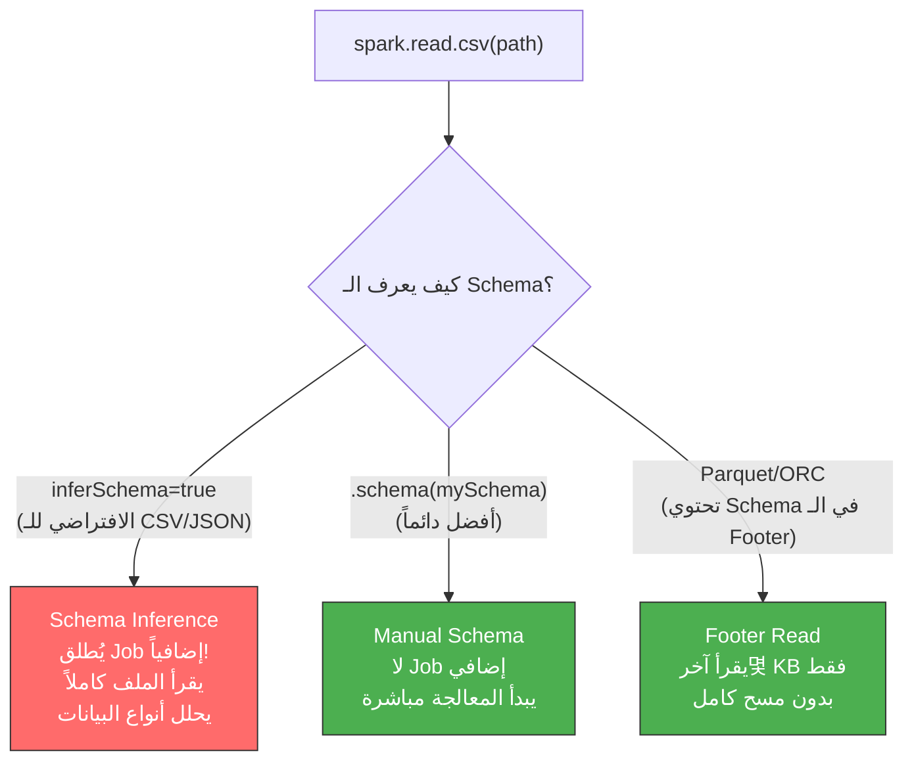

# 📘 قراءة وكتابة الملفات: Schema Inference، الـ Manual Schemas، وتقسيم الملفات (Partitioning)

> [!IMPORTANT]
> **هدف هذا الدليل:**
> بنهاية هذا الملف، ستفهم الفرق الجوهري في الأداء بين Schema Inference والـ Manual Schema، ولماذا الـ Partitioning الخاطئ يُحوّل عنقودك لكارثة، وكيف تكتب بيانات بأمان على S3 دون تلف.

---

## 1. 🎯 لماذا قراءة/كتابة الملفات ليست مجرد `read()` و`write()`؟

معظم المطورين يكتبون:
```python
df = spark.read.csv("s3://data/users.csv")
df.write.parquet("s3://output/users/")
```

ويظنون أن المهمة انتهت. لكن خلف الكواليس:
- **القراءة:** هل يقرأ الـ Schema من الملف؟ هل يُطلق Job إضافياً؟ هل يقرأ كل الأعمدة أم فقط المطلوبة؟
- **الكتابة:** هل تُنشئ مليون ملف صغير؟ هل تتلف البيانات إذا انهار Executor في المنتصف؟

هذا الدليل يُجيب على كل هذه الأسئلة.

---

## 2. 🏗️ آلية القراءة الداخلية: كيف يقرأ Spark الملفات؟

### المرحلة 1: تحديد الـ Schema

عندما تستدعي `spark.read`، أول شيء يفعله Spark هو تحديد شكل البيانات (Schema). وله طريقتان:



### ماذا يحدث أثناء Schema Inference؟

```
الخطوة 1: Driver يُعدّد كل الملفات في المسار
الخطوة 2: Driver يُطلق Job(0) — مهمة واحدة تقرأ عينة (أو كل الملفات!)
الخطوة 3: Executors يُحللون كل سطر ليتعرفوا على الأنواع
الخطوة 4: Driver يجمع النتائج ويُقرر أنواع البيانات
الخطوة 5: الآن فقط تبدأ المعالجة الفعلية
```

**مشكلة Schema Inference مع JSON:**
```
ملف JSON:
  سجل 1: {"user_id": 123, "score": 9.5}
  سجل 2: {"user_id": 456, "score": "N/A", "bonus_field": true}
  
Spark يجب أن يقرأ كل الملف لاكتشاف:
  - score: قد يكون Double أو String
  - bonus_field: موجود في بعض السجلات فقط
```

---

## 3. ⚡ Schema Inference vs Manual Schema: الأرقام الحقيقية

```python
# المقارنة العملية
import time
from pyspark.sql.types import StructType, StructField, StringType, DoubleType, IntegerType

# --- الطريقة البطيئة (Schema Inference) ---
start = time.time()
df_infer = spark.read \
    .option("header", "true") \
    .option("inferSchema", "true") \  # ← يُطلق Job إضافياً!
    .csv("s3://data/100GB_users.csv")
df_infer.count()  # الآن يبدأ التنفيذ الفعلي
infer_time = time.time() - start
print(f"مع Inference: {infer_time:.1f}s")

# --- الطريقة السريعة (Manual Schema) ---
schema = StructType([
    StructField("user_id",   IntegerType(), nullable=True),
    StructField("name",      StringType(),  nullable=True),
    StructField("email",     StringType(),  nullable=True),
    StructField("score",     DoubleType(),  nullable=True),
    StructField("join_date", StringType(),  nullable=True),
])

start = time.time()
df_manual = spark.read \
    .schema(schema) \          # ← لا Job إضافي!
    .option("header", "true") \
    .csv("s3://data/100GB_users.csv")
df_manual.count()
manual_time = time.time() - start
print(f"مع Manual Schema: {manual_time:.1f}s")
```

| الصيغة | وقت التهيئة | Jobs إضافية | استهلاك الـ Driver Memory |
| :--- | :--- | :--- | :--- |
| **CSV + inferSchema** | 85+ ثانية | 1 Job | متوسط-عالٍ |
| **JSON + inferSchema** | 210+ ثانية | 1 Job | عالٍ (JSON أثقل تحليلاً) |
| **CSV + Manual Schema** | < 0.1 ثانية | 0 Jobs | ضئيل |
| **Parquet** | < 0.5 ثانية | 0 Jobs | ضئيل (Footer فقط) |

> [!TIP]
> **Pro Tip:** في الإنتاج، **لا تستخدم inferSchema أبداً** مع ملفات كبيرة. عرّف الـ Schema يدوياً وخزّنه في ملف منفصل (Python dataclass أو JSON schema file). هذا أيضاً يُوثّق عقد البيانات (Data Contract) بين الفرق.

---

## 4. 📁 الـ Partitioning: تنظيم الملفات للسرعة

### ما هو الـ Partitioning؟

```python
# كتابة بيانات مُقسَّمة
df.write \
  .partitionBy("year", "month") \
  .parquet("s3://datalake/sales/")
```

**يُنشئ هذا الهيكل على التخزين:**
```
s3://datalake/sales/
├── year=2024/
│   ├── month=01/
│   │   ├── part-00000-xxxx.parquet  (50 MB)
│   │   └── part-00001-xxxx.parquet  (48 MB)
│   └── month=02/
│       └── part-00000-xxxx.parquet  (55 MB)
└── year=2025/
    └── month=01/
        └── part-00000-xxxx.parquet  (60 MB)
```

**لماذا هذا مفيد؟**
```python
# هذا الاستعلام يقرأ فقط مجلد year=2025/month=01/ !
df = spark.read.parquet("s3://datalake/sales/") \
         .filter("year = 2025 AND month = 1")

# افتح Spark UI وشاهد:
# Number of files read: 1  (لا يقرأ ملفات 2024!)
# هذا يُسمى Partition Pruning
```

### 🔴 الخطأ القاتل: التقسيم على أعمدة عالية الكثافة (High-Cardinality)

> [!CAUTION]
> **Common Mistake الأكثر تدميراً في Data Lakes:**
>
> ```python
> # ❌ تقسيم على User ID (ملايين المستخدمين!)
> df.write.partitionBy("user_id").parquet("s3://data/events/")
>
> # النتيجة:
> # عدد المستخدمين = 10 مليون
> # عدد الـ Executors = 200
> # عدد الملفات = 10M × 200 = 2,000,000,000 ملف!!! (ملياران من الملفات)
>
> # عواقب:
> # - Driver يحاول قائمة مليارات الملفات → OOM
> # - S3 API throttling
> # - كل ملف حجمه بضع KB فقط (Small File Problem)
> # - قراءة هذه البيانات لاحقاً: يستغرق ساعات فقط لـ listing!
> ```

**القاعدة الذهبية للـ Partitioning:**
```
الكثافة المثالية للـ Partition Column:
  ≤ 1,000 قيمة مختلفة: ✅ مناسب (year, month, region, status)
  1,000 - 10,000: ⚠️ تحقق من حجم كل partition (يجب > 100 MB)
  > 100,000: ❌ خطير جداً، ستنهار!
```

---

## 5. 🪣 Bucketing: البديل للـ Partitioning عند الكثافة العالية

```python
# بدلاً من partitionBy("user_id") الخطير:
df.write \
  .bucketBy(1000, "user_id") \  # 1000 bucket فقط، مهما كان عدد المستخدمين
  .sortBy("user_id") \
  .saveAsTable("events_bucketed")
```

**الفرق:**
- `partitionBy`: يُنشئ مجلداً لكل قيمة مختلفة
- `bucketBy`: يُوزّع القيم على عدد ثابت من الـ Buckets باستخدام Hash

**ميزة Bucketing في الـ Joins:**
```python
# إذا كان الجدولان مُقسّمان بنفس الـ Bucket key وعددهما متساوٍ:
users_bucketed = spark.table("users_bucketed")   # bucketBy(1000, "user_id")
events_bucketed = spark.table("events_bucketed") # bucketBy(1000, "user_id")

# هذا الـ Join لا يحتاج Shuffle!
result = users_bucketed.join(events_bucketed, "user_id")
# ← Shuffle Eliminated! الـ Buckets المتماثلة تُقابَل مباشرة
```

---

## 6. 🔒 File Committer Protocol: كيف تكتب Spark آمناً؟

### المشكلة: ماذا لو انهار Executor في المنتصف؟

بدون آلية حماية، ستجد ملفات نصف مكتوبة في مسار الإخراج. Spark يحل هذا بـ **Two-Phase Commit**:

```
المرحلة 1 — Task Commit:
  1. كل Task تكتب في مجلد مؤقت مخفي:
     .spark-staging-[job_id]/task_[task_id]/part-00000.parquet
  2. إذا نجحت: تُبلغ الـ Driver
  3. إذا فشلت: الملف المؤقت يُحذف، لا تأثير على المسار النهائي

المرحلة 2 — Job Commit (يُنفّذه الـ Driver فقط):
  1. Driver يتأكد أن كل Tasks نجحت
  2. ينقل (Rename) الملفات المؤقتة للمسار النهائي
  3. عملية ذرية: إما كل شيء أو لا شيء
```

### مشكلة S3: الـ Rename ليس ذرياً!

> [!WARNING]
> **Common Mistake على S3:**
>
> في الأنظمة المحلية (HDFS)، الـ Rename عملية ذرية سريعة (تغيير pointer فقط).
> في S3، الـ Rename = COPY + DELETE — يستغرق وقتاً طويلاً وليس ذرياً!
>
> لجداول كبيرة: قد يستغرق الـ Commit ساعات وقد يفشل بـ Timeout!

**الحل — S3A Committer:**
```properties
# في spark-defaults.conf أو spark-submit
spark.hadoop.fs.s3a.committer.name=directory
spark.hadoop.fs.s3a.committer.staging.conflict-mode=replace
spark.sql.sources.commitProtocolClass=org.apache.spark.internal.io.cloud.PathOutputCommitProtocol
spark.sql.parquet.output.committer.class=org.apache.spark.internal.io.cloud.BindingParquetOutputCommitter
```

---

## 7. 📊 أهم الـ Read Options حسب الصيغة

### CSV Options

```python
df = spark.read \
    .option("header", "true") \        # أول سطر = أسماء الأعمدة
    .option("sep", "\t") \             # فاصل الأعمدة (افتراضي: ,)
    .option("nullValue", "N/A") \      # معالجة القيم الفارغة
    .option("dateFormat", "dd/MM/yyyy") \ # صيغة التاريخ
    .option("encoding", "UTF-8") \     # ترميز النص
    .option("mode", "PERMISSIVE") \    # كيف يتعامل مع الأخطاء
    # PERMISSIVE: يضع الصف الخاطئ في عمود _corrupt_record
    # DROPMALFORMED: يتجاهل الصفوف الخاطئة
    # FAILFAST: يُوقف عند أول خطأ
    .schema(mySchema) \
    .csv("s3://data/")
```

### Parquet Options

```python
df = spark.read \
    .option("mergeSchema", "true") \   # دمج Schemas مختلفة في ملفات متعددة
    .parquet("s3://data/partitioned/")

# عند الكتابة
df.write \
    .option("compression", "snappy") \ # ضغط (snappy, gzip, zstd, none)
    .option("maxRecordsPerFile", 1000000) \ # تحديد حجم الملف
    .parquet("s3://output/")
```

---

## 8. 🚨 سيناريوهات الفشل والتشخيص

### حادثة 1: Driver OOM أثناء قراءة JSON

```text
ERROR MemoryManager: Not enough memory for JSON schema inference
java.lang.OutOfMemoryError: Java heap space
  at com.fasterxml.jackson.core.json.UTF8DataInputJsonParser...
```

**التشخيص:**
- افتح Spark UI → Jobs Tab
- إذا رأيت "Job 0" يبدأ فوراً قبل أي كود معالجة → هذا هو جمع الـ Schema
- المشكلة: ملف JSON ضخم + `inferSchema=true`

**الحل:**
```python
# ❌ كود خطير
df = spark.read.json("s3://logs/100GB_events.json")

# ✅ الحل: عرّف الـ Schema أولاً
from pyspark.sql.types import *
schema = StructType([
    StructField("event_id",   StringType(),  False),
    StructField("user_id",    LongType(),    False),
    StructField("timestamp",  TimestampType(), False),
    StructField("event_type", StringType(),  True),
    StructField("payload",    StringType(),  True),  # JSON كـ String
])
df = spark.read.schema(schema).json("s3://logs/100GB_events.json")
```

### حادثة 2: Commit Timeout على S3

```text
ERROR FileFormatWriter: Job failed during commit phase
java.net.SocketTimeoutException: Read timed out during S3 COPY operation
```

**السبب:** تقسيم على عمود عالي الكثافة = ملايين الملفات = Commit يستغرق ساعات.

**الحل السريع:**
```python
# قبل الكتابة: قلل عدد الملفات
df.repartition(100, "year", "month") \  # توجيه الـ Partitions
  .write \
  .partitionBy("year", "month") \        # فقط أعمدة منخفضة الكثافة
  .parquet("s3://output/")
```

---

## 9. 🧪 التمارين العملية

### التمرين 1: مقارنة Schema Inference مقابل Manual Schema

```python
from pyspark.sql import SparkSession
from pyspark.sql.types import *
import time, os

spark = SparkSession.builder.master("local[4]").appName("ReadWriteLab").getOrCreate()

# إنشاء ملف CSV اختباري
os.makedirs("/tmp/lab_data", exist_ok=True)
with open("/tmp/lab_data/users.csv", "w") as f:
    f.write("user_id,name,score,join_date\n")
    for i in range(100000):
        f.write(f"{i},User_{i},{i * 0.5:.2f},2024-01-{(i%28)+1:02d}\n")

# الاختبار 1: Schema Inference
start = time.time()
df1 = spark.read.option("header", "true").option("inferSchema", "true").csv("/tmp/lab_data/users.csv")
count1 = df1.count()
time1 = time.time() - start
print(f"Schema Inference: {time1:.3f}s | Schema: {df1.dtypes}")

# الاختبار 2: Manual Schema
schema = StructType([
    StructField("user_id",   IntegerType(), True),
    StructField("name",      StringType(),  True),
    StructField("score",     DoubleType(),  True),
    StructField("join_date", StringType(),  True),
])
start = time.time()
df2 = spark.read.schema(schema).option("header", "true").csv("/tmp/lab_data/users.csv")
count2 = df2.count()
time2 = time.time() - start
print(f"Manual Schema:    {time2:.3f}s | Schema: {df2.dtypes}")
print(f"\nالتسريع: {time1/time2:.1f}x أسرع مع Manual Schema")
```

### التمرين 2: مشاهدة Partition Pruning

```python
import os

# كتابة بيانات مُقسّمة
sales_data = [(2024, 1, "Cairo", 1000.0),
              (2024, 2, "Alex", 2000.0),
              (2025, 1, "Cairo", 3000.0),
              (2025, 3, "Giza", 1500.0)]

df = spark.createDataFrame(sales_data, ["year", "month", "city", "amount"])
df.write.mode("overwrite").partitionBy("year", "month").parquet("/tmp/sales_partitioned")

# مشاهدة الهيكل
print("=== الهيكل الفيزيائي ===")
for root, dirs, files in os.walk("/tmp/sales_partitioned"):
    level = root.replace("/tmp/sales_partitioned", "").count(os.sep)
    indent = "  " * level
    print(f"{indent}{os.path.basename(root)}/")
    for f in files:
        print(f"{indent}  {f}")

# قراءة مع Partition Pruning
df_filtered = spark.read.parquet("/tmp/sales_partitioned") \
                   .filter("year = 2025")

print("\n=== الخطة مع Partition Pruning ===")
df_filtered.explain(mode="formatted")
# ابحث عن: PartitionFilters: [isnotnull(year#0), (year#0 = 2025)]
```

### التمرين 3: الـ Small File Problem وكيفية الإصلاح

```python
# مشكلة: كتابة بدون التحكم في عدد الملفات
spark.range(1, 10000) \
     .selectExpr("id", "cast(id % 100 as string) as category") \
     .write.mode("overwrite") \
     .partitionBy("category") \
     .parquet("/tmp/small_files_problem")

# عدّ الملفات المُنتجة
import subprocess
result = subprocess.run(["find", "/tmp/small_files_problem", "-name", "*.parquet"], 
                        capture_output=True, text=True)
file_count = len(result.stdout.strip().split('\n'))
print(f"عدد الملفات المُنتجة: {file_count}")  # قد تكون مئات!

# الإصلاح: repartition قبل الكتابة
spark.range(1, 10000) \
     .selectExpr("id", "cast(id % 100 as string) as category") \
     .repartition(10, "category") \   # 10 ملف فقط لكل category
     .write.mode("overwrite") \
     .partitionBy("category") \
     .parquet("/tmp/small_files_fixed")

result2 = subprocess.run(["find", "/tmp/small_files_fixed", "-name", "*.parquet"], 
                         capture_output=True, text=True)
file_count2 = len(result2.stdout.strip().split('\n'))
print(f"عدد الملفات بعد الإصلاح: {file_count2}")
```

---

## 10. 🎓 أسئلة المقابلات التقنية

### سؤال 1: لماذا inferSchema أبطأ على JSON من Parquet؟

**الإجابة النموذجية:**
JSON هو صيغة نصية بدون Schema مُضمّنة. لتحديد الأنواع، يجب على Spark قراءة كل سجل في الملف وتحليله لاكتشاف كل المفاتيح وأنواعها (بما فيها المفاتيح الموجودة في بعض السجلات فقط). أما Parquet، فهو صيغة عمودية تخزن الـ Schema كاملاً في الـ Footer (آخر بضع KB من الملف). Spark يقرأ الـ Footer فقط دون أي مسح للبيانات.

### سؤال 2: ما الفرق بين `partitionBy` و `bucketBy` ومتى تستخدم كلاً منهما؟

**الإجابة النموذجية:**
- **`partitionBy`:** يُنشئ مجلداً لكل قيمة مختلفة في العمود. مناسب للأعمدة منخفضة الكثافة (< 1000 قيمة) مثل year, month, region. يُتيح Partition Pruning — قراءة مجلدات محددة فقط.
- **`bucketBy`:** يُوزّع البيانات على عدد ثابت من الـ Buckets بغض النظر عن عدد القيم. مناسب للأعمدة عالية الكثافة (مثل user_id). ميزته الكبرى: Join بين جدولين مُقسّمين بنفس Key وعدد Buckets يلغي الـ Shuffle تماماً.

### سؤال 3 (متقدم): ما هو Two-Phase Commit ولماذا هو ضروري في Spark؟

**الإجابة النموذجية:**
Two-Phase Commit يضمن أن ملفات المخرجات تظهر بشكل ذري (كاملة) حتى عند فشل بعض المهام:
1. **Task Phase:** كل Task تكتب في مجلد staging مؤقت. الفشل = حذف الملف المؤقت فقط.
2. **Job Phase:** بعد نجاح كل المهام، الـ Driver ينقل الملفات للمسار النهائي دفعة واحدة.

على S3، هذا البروتوكول يُسبب مشكلة: الـ Rename = Copy + Delete وليس ذرياً. الحل هو استخدام S3A Committer الذي يكتب مباشرة في المسار النهائي.

---

## 11. 📋 ورقة الغش السريعة

### أوامر القراءة والكتابة الأساسية

```python
# ── قراءة ───────────────────────────────────────────────────────────
# CSV (دائماً مع Schema)
df = spark.read.schema(schema).option("header", "true").csv("path/")

# JSON
df = spark.read.schema(schema).json("path/")

# Parquet (الأسرع والأفضل)
df = spark.read.parquet("path/")

# Delta Lake (الأحدث والأقوى)
df = spark.read.format("delta").load("path/")

# ── كتابة ────────────────────────────────────────────────────────────
# Parquet مُقسَّم
df.write.mode("overwrite").partitionBy("year", "month").parquet("path/")

# مع التحكم في حجم الملفات
df.repartition(50).write.mode("overwrite").parquet("path/")

# مع maxRecordsPerFile
df.write.option("maxRecordsPerFile", 1_000_000).parquet("path/")
```

### جدول اختيار الصيغة

| الصيغة | الأفضل لـ | الأداء | الـ Schema |
| :--- | :--- | :--- | :--- |
| **Parquet** | أي شيء، الاختيار الأول | ⚡⚡⚡ | في الـ Footer |
| **Delta Lake** | ACID, Updates, Time Travel | ⚡⚡⚡ | في الـ Footer |
| **ORC** | بيئات Hive القديمة | ⚡⚡ | في الـ Footer |
| **CSV** | تبادل البيانات مع أنظمة خارجية | ⚡ | يجب تعريفه |
| **JSON** | APIs والـ Semi-structured data | ⚡ | يجب تعريفه |

> [!TIP]
> **الخطوة القادمة:** انتقل للملف `12_storage_layouts_parquet_avro.md` لتفهم البنية الداخلية لـ Parquet وكيف تُحسّن ضغط واختيار الأعمدة لتوفير 70%+ من التكلفة.

<!-- START_NAVIGATION_LINKS -->
---
### 🔗 روابط التنقل السريع

| السابق (Previous) | التالي (Next) |
| :--- | :--- |
| [◀️ 📘 أوضاع النشر (Deploy Modes): Client Mode vs Cluster Mode — الشبكة والإنتاج](../01_core_architecture/10_deploy_modes_networking.md) | [▶️ 📘 صيغ التخزين: Parquet vs Avro — الهيكل الداخلي والاختيار الأمثل](12_storage_layouts_parquet_avro.md) |
<!-- END_NAVIGATION_LINKS -->
