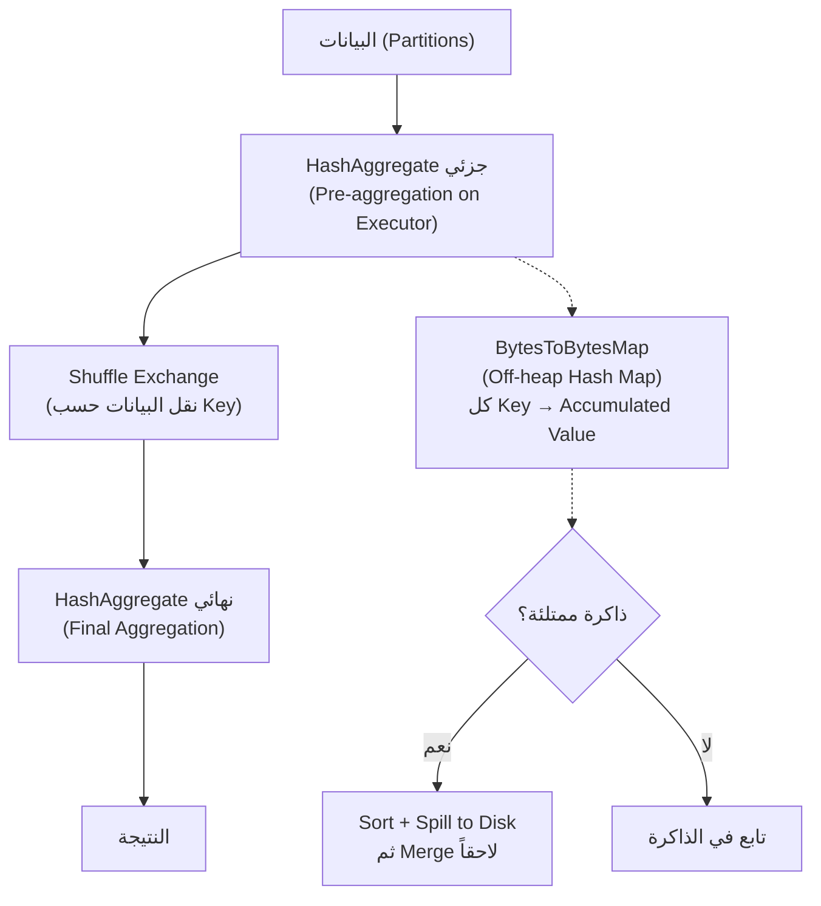

# 📘 التجميعات المتقدمة: GroupBy، Rollup، Cube، وسر HashAggregate

> [!IMPORTANT]
> **هدف هذا الدليل:**
> بنهاية هذا الملف، ستفهم كيف يُنفّذ Spark الـ GroupBy داخلياً باستخدام HashMap في الذاكرة، متى يلجأ للـ SortAggregate، ولماذا Rollup/Cube أسرع بكثير من تشغيل عدة Queries منفصلة.

---

## 1. 🎯 ما وراء groupBy().count(): عالم التجميعات المعقدة

```python
# تجميع بسيط — يعرفه الجميع
df.groupBy("region").sum("amount")

# لكن في الإنتاج، تحتاج:
# 1. تقارير متعددة الأبعاد (Multi-dimensional)
# 2. مجاميع فرعية وكلية في نفس الاستعلام
# 3. تجميعات متعددة في خطوة واحدة (بدون Shuffle متعدد)
```

**مثال واقعي:** تقرير مبيعات لسلسلة متاجر:
```
المطلوب في تقرير واحد:
  مبيعات كل (دولة + مدينة + متجر)  ← تفصيلي
  مبيعات كل (دولة + مدينة)          ← ملخص
  مبيعات كل (دولة)                   ← إجمالي الدولة
  مبيعات الإجمالي الكلي              ← Grand Total

قبل Rollup: 4 Queries منفصلة + Union = 4 Shuffles!
مع Rollup: Shuffle واحد فقط!
```

---

## 2. 🏗️ الآلية الداخلية: كيف يُجمّع Spark؟

### HashAggregate: المسار الأسرع



**ما هو BytesToBytesMap؟**

```
بدلاً من HashMap Java الاعتيادي (مع GC overhead):
  Spark ينشئ Hash Map مباشرة في الذاكرة Off-heap:
  
  Key bytes: [r,e,g,i,o,n,=,C,a,i,r,o]  → Hash → Slot 42
  Value bytes: [sum=0x00001F40]           ← يُحدَّث في مكانه (In-place update)
  
  لكل صف جديد:
    1. Hash الـ Key → Slot رقم X
    2. ابحث عن الـ Slot في الـ Map
    3. حدّث الـ Value مباشرة (لا إنشاء Object جديد!)
```

**لماذا هذا أسرع من Java HashMap؟**
- لا JVM Object creation لكل Entry
- لا Garbage Collection
- البيانات متجاورة في الذاكرة (Cache-friendly)

### متى يستخدم Spark SortAggregate بدلاً من HashAggregate؟

```
يلجأ Spark لـ SortAggregate في حالات نادرة:
  1. أنواع البيانات لا تدعم الـ Hashing (كائنات مخصصة معقدة)
  2. الـ Keys كبيرة جداً ولا تناسب الـ Off-heap Map
  3. بعض UDFs تُجبر Spark على الـ SortAggregate
  
SortAggregate أبطأ لأنه:
  - يُرتّب البيانات أولاً (Shuffle + Sort)
  - يمر على الصفوف المرتبة واحداً واحداً
  - يُحدّث قيمة التجميع عند تغيير الـ Key
```

> [!TIP]
> **Pro Tip:** افتح Spark UI → SQL Tab → ابحث في الخطة عن الـ Aggregate:
> - ترى `HashAggregate` ← ✅ المسار الأسرع
> - ترى `SortAggregate` ← ⚠️ مُكلف، راجع أنواع البيانات و UDFs

---

## 3. ⚡ الـ Two-Phase Aggregation: سر تقليل الـ Shuffle

قبل إرسال البيانات عبر الشبكة، Spark يُجمّع مسبقاً على كل Executor:

```python
df.groupBy("region").sum("amount")
```

```
مثال مبسط: 6 Tasks على 3 Executors

Task 1 (Partition 0): [("Cairo", 500), ("Alex", 200), ("Cairo", 800)]
  → Pre-aggregation: [("Cairo", 1300), ("Alex", 200)]  ← تقليل!

Task 2 (Partition 1): [("Cairo", 400), ("Giza", 600)]
  → Pre-aggregation: [("Cairo", 400), ("Giza", 600)]

بعد الـ Shuffle (Cairo يجتمع كله):
  ("Cairo", 1300) + ("Cairo", 400) = ("Cairo", 1700)  ✅

بدون Pre-aggregation:
  3 سجلات "Cairo" تنتقل عبر الشبكة
  مع Pre-aggregation:
  2 سجل فقط (تقليل 33%)
```

في البيانات الواقعية الكبيرة (ملايين السجلات)، الـ Pre-aggregation يُقلل الـ Shuffle بـ 90%+!

---

## 4. 📊 Grouping Sets، Rollup، Cube: التقارير متعددة الأبعاد

### المشكلة: تقارير متعددة الأبعاد بدون هذه الأوامر

```python
# ❌ قبل Rollup/Cube: تشغيل استعلامات منفصلة
detail = df.groupBy("country", "city").sum("sales")
by_country = df.groupBy("country").sum("sales").withColumn("city", lit(None))
grand_total = df.agg(sum("sales")).withColumn("country", lit(None)).withColumn("city", lit(None))

result = detail.union(by_country).union(grand_total)
# → 3 Shuffles! قراءة البيانات 3 مرات!
```

### الـ Rollup: تسلسل هرمي

```python
from pyspark.sql.functions import sum, grouping_id

# ✅ Rollup — تجميع هرمي من الأعلى للأسفل
df.rollup("country", "city", "store") \
  .agg(sum("sales").alias("total_sales")) \
  .orderBy("country", "city", "store") \
  .show()
```

**المخرجات:**
```
+----------+------+--------+------------+
| country  | city |  store | total_sales|
+----------+------+--------+------------+
|    null  | null |   null |    100,000 |  ← Grand Total
|   Egypt  | null |   null |     60,000 |  ← Egypt Total
|   Egypt  |Cairo |   null |     40,000 |  ← Cairo Total
|   Egypt  |Cairo | Store1 |     25,000 |  ← Store Detail
|   Egypt  |Cairo | Store2 |     15,000 |
|   Egypt  | Alex |   null |     20,000 |
...
```

**للـ N أعمدة، Rollup يُنتج N+1 مستوى تجميع (أبعد بعد)**

### الـ Cube: كل الاحتمالات

```python
# Cube — كل تركيبات المفاتيح الممكنة
df.cube("country", "city").agg(sum("sales")).show()
```

**المخرجات تشمل:**
```
(null, null)      ← Grand Total
(Egypt, null)     ← Egypt Total
(null, Cairo)     ← Cairo Total (عبر كل الدول!)
(Egypt, Cairo)    ← Egypt + Cairo
```

> [!WARNING]
> **Common Mistake:** استخدام Cube على أعمدة كثيرة.
>
> عدد مستويات الـ Cube = 2^N:
> - 2 أعمدة → 4 مستويات ✅
> - 3 أعمدة → 8 مستويات ✅
> - 4 أعمدة → 16 مستويات ⚠️
> - 6 أعمدة → 64 مستويات ❌ انفجار في الصفوف!
>
> **الحل:** استخدم Grouping Sets لتحديد التركيبات المطلوبة فقط.

### Grouping Sets: دقة كاملة في اختيار الأبعاد

```python
df.createOrReplaceTempView("sales")

spark.sql("""
    SELECT country, city, SUM(sales) as total,
           GROUPING_ID(country, city) as grp_id
    FROM sales
    GROUP BY GROUPING SETS (
        (country, city),   -- المستوى التفصيلي
        (country),         -- مستوى الدولة فقط
        ()                 -- Grand Total
    )
    ORDER BY grp_id, country, city
""").show()
```

### كيف يُنفّذ Catalyst Rollup/Cube داخلياً؟

```
المدخلات: صف واحد = ("Egypt", "Cairo", 1000)

الـ Expand Operator يُضاعفها:
  [("Egypt", "Cairo", 1000, grouping_id=0)]  ← detail
  [("Egypt",  null,   1000, grouping_id=1)]  ← country level
  [(null,     null,   1000, grouping_id=3)]  ← grand total

ثم HashAggregate يُجمّع كل هذه السجلات معاً في مرور واحد!
→ Shuffle واحد فقط!
```

---

## 5. 📈 دوال التجميع المتقدمة (Advanced Aggregate Functions)

```python
from pyspark.sql.functions import (
    sum, count, avg, min, max,
    collect_list, collect_set,
    count_distinct, approx_count_distinct,
    percentile_approx, stddev, variance,
    first, last
)

result = df.groupBy("region").agg(
    sum("amount").alias("total_amount"),
    count("*").alias("order_count"),
    avg("amount").alias("avg_amount"),
    min("amount").alias("min_order"),
    max("amount").alias("max_order"),
    
    # الأخطر! collect_list يجمع كل القيم في ذاكرة Task واحدة
    collect_list("product_id").alias("product_ids"),  # ⚠️ خطر OOM
    collect_set("category").alias("unique_categories"),  # ⚠️ خطر OOM
    
    # بديل آمن لـ COUNT DISTINCT (تقريبي لكن سريع وآمن على الذاكرة)
    approx_count_distinct("user_id", rsd=0.01).alias("approx_users"),
    
    # النسب المئوية
    percentile_approx("amount", [0.25, 0.5, 0.75]).alias("quartiles"),
    
    stddev("amount").alias("std_dev")
)
```

> [!WARNING]
> **Common Mistake — `collect_list` على مجموعات ضخمة:**
>
> ```python
> # ❌ إذا كان region="Cairo" يحتوي على مليون سجل:
> df.groupBy("region").agg(collect_list("product_id"))
> # collect_list يجمع مليون قيمة في List داخل ذاكرة Task واحدة!
> # → OOM حتمي!
>
> # ✅ البديل: استخدم approx_count_distinct أو حفظ في DataFrame منفصل
> df.groupBy("region", "product_id").count()  # بدون collect
> ```

---

## 6. 🚨 سيناريوهات الفشل وكيفية التشخيص

### حادثة: OOM في HashAggregate (BytesToBytesMap)

```text
java.lang.OutOfMemoryError: Unable to acquire 262144 bytes of memory in BytesToBytesMap
  at org.apache.spark.memory.TaskMemoryManager.allocatePage(TaskMemoryManager.java:234)
```

**التشخيص:**
- افتح Spark UI → Stages → ابحث عن "Spill (Memory)" و "Spill (Disk)"
- إذا كانت القيم كبيرة → HashAggregate يتدفق للقرص بكثرة

**الحل:**
```python
# زيادة عدد الـ Partitions لتوزيع المفاتيح
spark.conf.set("spark.sql.shuffle.partitions", "1000")

# أو تفعيل AQE ليختار تلقائياً
spark.conf.set("spark.sql.adaptive.enabled", "true")
```

### حادثة: انفجار صفوف Cube على أعمدة كثيرة

```text
WARN Spark: Stage 5 is very slow because of row explosion in Expand operator.
Output rows: 50,000,000 (Input: 1,000,000) - 50x expansion!
```

**الحل:**
```python
# استبدل Cube بـ Grouping Sets المُقيّد
# بدلاً من: df.cube("a", "b", "c", "d", "e").agg(...)  ← 2^5 = 32 مستوى
# استخدم: فقط المستويات التي تحتاجها
spark.sql("""
    SELECT a, b, c, d, e, SUM(val)
    FROM tbl
    GROUP BY GROUPING SETS ((a, b, c), (a, b), (a))
""")  # 3 مستويات فقط بدلاً من 32!
```

---

## 7. 🧪 التمارين العملية

### التمرين 1: GroupBy مقابل Rollup — مشاهدة الفرق

```python
from pyspark.sql import SparkSession
from pyspark.sql.functions import sum as _sum, count

spark = SparkSession.builder.master("local[4]").appName("AggLab").getOrCreate()

sales_data = [
    ("Egypt", "Cairo",  "Electronics", 5000),
    ("Egypt", "Cairo",  "Clothing",    2000),
    ("Egypt", "Alex",   "Electronics", 3000),
    ("Egypt", "Alex",   "Food",        1000),
    ("Saudi", "Riyadh", "Electronics", 8000),
    ("Saudi", "Jeddah", "Clothing",    4000),
]
df = spark.createDataFrame(sales_data, ["country", "city", "category", "sales"])

# GroupBy العادي
print("=== GroupBy العادي (لا مجاميع فرعية) ===")
df.groupBy("country", "city").agg(_sum("sales").alias("total")).orderBy("country", "city").show()

# Rollup (يُضيف مجاميع فرعية)
print("=== Rollup (مجاميع هرمية) ===")
df.rollup("country", "city").agg(_sum("sales").alias("total")).orderBy("country", "city").show()

# Cube (كل التركيبات)
print("=== Cube (كل التركيبات الممكنة) ===")
df.cube("country", "city").agg(_sum("sales").alias("total")).orderBy("country", "city").show()
```

### التمرين 2: مشاهدة الـ Expand Operator في الخطة

```python
cube_df = df.cube("country", "city").agg(_sum("sales"))

print("=== Physical Plan للـ Cube ===")
cube_df.explain(mode="formatted")
# ابحث عن "Expand" في الخطة
# شاهد كيف يُضاعف الـ Expand الصفوف

# عدّ الصفوف للمقارنة
print(f"صفوف المدخل:  {df.count()}")
print(f"صفوف الـ Cube: {cube_df.count()}")
# النسبة ≈ 2^N حيث N = عدد الأعمدة
```

### التمرين 3: Grouping Sets بدلاً من عدة Queries

```python
import time

df.createOrReplaceTempView("sales_view")

# ❌ طريقة بطيئة: 3 Queries منفصلة
start = time.time()
r1 = df.groupBy("country", "city").agg(_sum("sales").alias("total"))
r2 = df.groupBy("country").agg(_sum("sales").alias("total"))
r3 = df.agg(_sum("sales").alias("total"))
from pyspark.sql.functions import lit
combined = r1.withColumn("city", r1.city) \
    .union(r2.withColumn("city", lit(None))) \
    .union(r3.withColumn("country", lit(None)).withColumn("city", lit(None)))
combined.count()
multi_query_time = time.time() - start
print(f"طريقة 3 Queries: {multi_query_time:.3f}s")

# ✅ طريقة سريعة: Grouping Sets
start = time.time()
single = spark.sql("""
    SELECT country, city, SUM(sales) as total
    FROM sales_view
    GROUP BY GROUPING SETS ((country, city), (country), ())
""")
single.count()
grouping_sets_time = time.time() - start
print(f"طريقة Grouping Sets: {grouping_sets_time:.3f}s")
print(f"تسريع: {multi_query_time/grouping_sets_time:.1f}x")
```

---

## 8. 🎓 أسئلة المقابلات التقنية

### سؤال 1: ما الفرق بين HashAggregate وSortAggregate؟

**الإجابة النموذجية:**
- **HashAggregate:** يستخدم `BytesToBytesMap` في الذاكرة Off-heap. لكل صف، يُحسب Hash للـ Key ويُحدّث القيمة المجمّعة في مكانها. سريع جداً لأنه لا يحتاج ترتيباً. هو الـ Default.
- **SortAggregate:** يُرتّب البيانات أولاً حسب الـ Key، ثم يمر على الصفوف المرتبة لتحديث قيمة التجميع عند تغيير الـ Key. أبطأ بكثير. يُستخدم عندما أنواع البيانات لا تدعم الـ Hashing أو عند UDFs معقدة.

### سؤال 2: ما الفرق بين Rollup وCube ومتى تستخدم كلاً منهما؟

**الإجابة النموذجية:**
- **Rollup:** يُنتج مجاميع هرمية من اليسار لليمين. مع (A, B, C): يُنتج (A,B,C), (A,B), (A), (). مناسب للهياكل الهرمية مثل (Country → City → Store).
- **Cube:** يُنتج **كل** التركيبات الممكنة. مع (A, B, C): يُنتج 2^3 = 8 تركيبات. مناسب للتقارير متعددة الأبعاد الكاملة. **تحذير:** لا تستخدمه مع أكثر من 4 أعمدة (انفجار أسي في الصفوف).

### سؤال 3 (متقدم): لماذا `approx_count_distinct` أفضل من `count(distinct col)` في بعض الحالات؟

**الإجابة النموذجية:**
`COUNT(DISTINCT col)` يتطلب تجميع كل القيم المميزة في الذاكرة ومقارنتها — لمليار قيمة فريدة، يحتاج مليار مدخل في الـ HashSet. `approx_count_distinct` يستخدم خوارزمية **HyperLogLog** التي تُقدّر العدد باستخدام ذاكرة ثابتة (بضع KB فقط!) بغض النظر عن حجم البيانات، مع دقة قابلة للضبط (افتراضي 2-5% خطأ). للتقارير التي لا تحتاج عدداً دقيقاً، `approx_count_distinct` أسرع بـ 10-100x وأكثر أماناً على الذاكرة.

---

## 9. 📋 ورقة الغش السريعة

```python
# ── تجميعات أساسية ───────────────────────────────────────────────
df.groupBy("col1", "col2").agg(
    _sum("amount").alias("total"),
    count("*").alias("cnt"),
    avg("score").alias("avg_score"),
    approx_count_distinct("user_id").alias("unique_users")
)

# ── تجميعات هرمية ────────────────────────────────────────────────
df.rollup("country", "city").agg(_sum("sales"))    # هرمي (N+1 مستوى)
df.cube("country", "city").agg(_sum("sales"))      # كل التركيبات (2^N)
spark.sql("GROUP BY GROUPING SETS ((a,b), (a), ())")  # اختيار يدوي

# ── مؤشر مستوى التجميع ──────────────────────────────────────────
from pyspark.sql.functions import grouping_id
df.rollup("a", "b").agg(_sum("val"), grouping_id().alias("level"))
# level=0: (a,b), level=1: (a), level=3: Grand Total
```

| الأمر | المستويات مع 3 أعمدة | الأفضل لـ |
| :--- | :--- | :--- |
| `groupBy(a, b, c)` | 1 مستوى | تقارير مسطحة |
| `rollup(a, b, c)` | 4 مستويات (N+1) | هياكل هرمية |
| `cube(a, b, c)` | 8 مستويات (2^N) | BI متعدد الأبعاد |
| `GROUPING SETS(...)` | تحددها أنت | دقة كاملة |

> [!TIP]
> **الخطوة القادمة:** انتقل للملف `15_relational_joins.md` لتتعلم أنواع الـ Joins وكيف يختار Catalyst بين Sort-Merge Join وBroadcast Hash Join وكيف تُزيل الـ Shuffle.

<!-- START_NAVIGATION_LINKS -->
---
### 🔗 روابط التنقل السريع

| السابق (Previous) | التالي (Next) |
| :--- | :--- |
| [◀️ 📘 تنظيف وتحضير البيانات (Data Wrangling): Select، Filter، Cast، وأخطاء الـ Null الخفية](13_basic_data_wrangling.md) | [▶️ 📘 الـ Joins: خوارزميات الربط، Broadcast، ومعالجة Data Skew](15_relational_joins.md) |
<!-- END_NAVIGATION_LINKS -->
