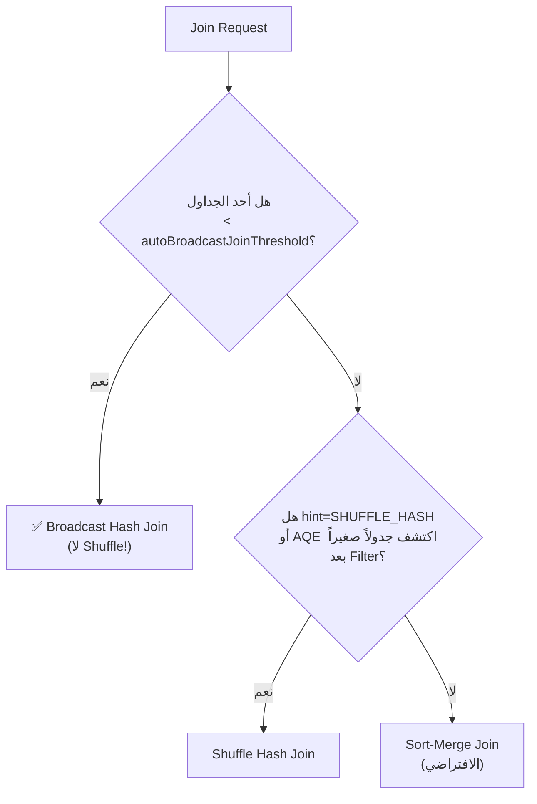

# 📘 الـ Joins: خوارزميات الربط، Broadcast، ومعالجة Data Skew

> [!IMPORTANT]
> **هدف هذا الدليل:**
> بنهاية هذا الملف، ستفهم لماذا Join على جدولين كبيرين يُسبب Shuffle عملاق، متى يُحوّل Catalyst الـ Join لـ Broadcast تلقائياً، وكيف تُصلح الـ Joins البطيئة بسبب Data Skew.

---

## 1. 🎯 لماذا الـ Join هو أكثر العمليات تكلفة؟

```python
# هذا السطر الواحد قد يُنشئ Shuffle بحجم مئات الـ GB:
result = orders_df.join(users_df, "user_id")
```

**لماذا؟** لأن Spark يجب أن يضمن أن:
- كل صفوف الـ Orders بنفس `user_id` تكون في نفس الـ Executor
- كل صفوف الـ Users بنفس `user_id` تكون في نفس الـ Executor

هذا يعني نقل ملايين الصفوف عبر الشبكة!

---

## 2. 🏗️ خوارزميات الـ Join الثلاث في Spark

### الخوارزمية 1: Broadcast Hash Join (الأسرع — لا Shuffle!)

**متى يُستخدم:** أحد الجداول صغير (< `autoBroadcastJoinThreshold`، افتراضي 10 MB)

```
الطريقة:
  1. Driver يقرأ الجدول الصغير كاملاً للذاكرة
  2. يُرسله (Broadcast) لكل Executor كنسخة كاملة
  3. كل Executor يُجري الـ Join محلياً — لا شبكة!

مثال:
  orders (5 GB) ← كبير، لا يُرسَل
  countries (50 KB) ← صغير، يُرسَل لكل Executor
  
  كل Executor: يربط orders الخاصة به مع نسخة countries المحلية!
```

```python
from pyspark.sql.functions import broadcast

# ✅ Broadcast يدوي (أضمن)
result = orders_df.join(
    broadcast(countries_df),  # ← يُجبر Spark على الـ Broadcast
    "country_id"
)

# ✅ Broadcast تلقائي (Catalyst يقرر)
spark.conf.set("spark.sql.autoBroadcastJoinThreshold", "50MB")
# كل جدول < 50 MB سيُبرودكاست تلقائياً
```

### الخوارزمية 2: Sort-Merge Join (الافتراضي للجداول الكبيرة)

**متى يُستخدم:** كلا الجدولين كبيران، لا يُمكن Broadcast

```
الطريقة:
  مرحلة 1 — Shuffle:
    كل Executor يُرسل صفوفه لـ Executor المسؤول عن هذا الـ Key
    (تحديد المسؤولية: Hash(key) % عدد_Executors)
  
  مرحلة 2 — Sort:
    كل Executor يُرتّب الصفوف حسب الـ Key
  
  مرحلة 3 — Merge:
    يمشي على الجدولين المرتبين معاً لإيجاد التطابقات
    (مثل merge في Merge Sort)
```

```
الخطة المادية:
*(5) SortMergeJoin [user_id], [user_id]
:- *(2) Sort [user_id ASC]
:  +- Exchange hashpartitioning(user_id, 200)  ← Shuffle!
:     +- *(1) Scan parquet orders
+- *(4) Sort [user_id ASC]
   +- Exchange hashpartitioning(user_id, 200)  ← Shuffle!
      +- *(3) Scan parquet users
```

### الخوارزمية 3: Shuffle Hash Join

**متى يُستخدم:** حالة وسطى — Shuffle بدون Sort. سريع جداً عند توزيع متوازن.

```
مثل Sort-Merge لكن بدون Sort:
  يبني Hash Map من الجدول الأصغر على الـ Executor
  يمر على الجدول الأكبر لإيجاد التطابقات
  
Spark لا يستخدمه كثيراً لأنه قد يسبب OOM مع البيانات غير المتوازنة
```

### مقارنة سريعة

| الخوارزمية | Shuffle؟ | Sort؟ | مناسب لـ |
| :--- | :--- | :--- | :--- |
| **Broadcast Hash Join** | ❌ لا | ❌ لا | جدول صغير < threshold |
| **Sort-Merge Join** | ✅ نعم | ✅ نعم | كلا الجدولين كبيران |
| **Shuffle Hash Join** | ✅ نعم | ❌ لا | توزيع متوازن، أحد الجدولين أصغر |

---

## 3. ⚡ كيف يختار Catalyst خوارزمية الـ Join؟



### قوة AQE: تحويل Join أثناء التنفيذ!

```python
# بدون AQE:
# Catalyst يرى: orders (5 GB) + users (2 GB) → يختار Sort-Merge Join

# الواقع بعد Filter:
# orders بعد .filter("year = 2025") = 200 MB فقط!
# لكن Catalyst لا يعرف هذا قبل التنفيذ...

# مع AQE:
spark.conf.set("spark.sql.adaptive.enabled", "true")
# AQE يرى الحجم الحقيقي بعد الـ Filter = 200 MB
# يُحوّل Sort-Merge Join → Broadcast Hash Join تلقائياً في منتصف التنفيذ!
```

---

## 4. 🔴 أنواع الـ Joins وكيفية اختيار الصحيح

```python
from pyspark.sql.functions import broadcast

# ── INNER JOIN: فقط التطابقات ──────────────────────────────────
orders.join(users, "user_id")              # أو
orders.join(users, "user_id", "inner")

# ── LEFT OUTER JOIN: كل اليسار + التطابقات ──────────────────────
orders.join(users, "user_id", "left")
# orders التي لا يوجد لها user → user columns = NULL

# ── RIGHT OUTER JOIN: كل اليمين + التطابقات ─────────────────────
orders.join(users, "user_id", "right")

# ── FULL OUTER JOIN: كل الصفوف من الجدولين ──────────────────────
orders.join(users, "user_id", "full")

# ── LEFT ANTI JOIN: صفوف اليسار التي لا تتطابق ──────────────────
orders.join(users, "user_id", "left_anti")
# مفيد لـ: "إيجاد الطلبات التي ليس لها مستخدم مسجل"

# ── LEFT SEMI JOIN: صفوف اليسار التي لها تطابق (بدون أعمدة اليمين) ─
orders.join(users, "user_id", "left_semi")
# مفيد لـ: الفلترة بناءً على وجود تطابق

# ── CROSS JOIN (الخطير!) ────────────────────────────────────────
df1.crossJoin(df2)
# كل صف × كل صف = N × M صف!
# مع 1000 صف × 1000 صف = 1,000,000 صف!
```

> [!CAUTION]
> **تحذير — CROSS JOIN:**
> يتطلب Spark تفعيلاً صريحاً للـ Cross Join عشان تعرف ما تفعله:
> ```python
> spark.conf.set("spark.sql.crossJoin.enabled", "true")
> ```
> تأكد من وجود WHERE clause بعده وإلا ستنفجر البيانات!

---

## 5. 🕳️ Data Skew في الـ Joins: كيفية التشخيص والعلاج

### تشخيص الـ Skew

```python
# Step 1: اكتشف توزيع المفاتيح
orders.groupBy("user_id").count() \
      .orderBy("count", ascending=False) \
      .show(10)

# إذا كانت النتائج مثل:
# user_id=NULL → 5,000,000 سجل (50% من البيانات!)
# user_id=1    → 100 سجل
# ← عندك Skew شديد على NULL!
```

### الحل 1: AQE Skew Join Handling

```python
spark.conf.set("spark.sql.adaptive.enabled", "true")
spark.conf.set("spark.sql.adaptive.skewJoin.enabled", "true")
spark.conf.set("spark.sql.adaptive.skewJoin.skewedPartitionFactor", "5")
spark.conf.set("spark.sql.adaptive.skewJoin.skewedPartitionThresholdInBytes", "256MB")
# AQE يكتشف الـ Partition الضخمة ويُقسّمها تلقائياً
```

### الحل 2: Salting يدوي (للـ Spark 2 أو حالات AQE لا يكفي فيها)

```python
from pyspark.sql.functions import concat, col, lit, floor, rand, coalesce

SALT_FACTOR = 10

# الجانب الكبير (orders): أضف ملح عشوائي
orders_salted = orders.withColumn(
    "user_id_salted",
    concat(col("user_id").cast("string"), lit("_"), 
           (floor(rand() * SALT_FACTOR)).cast("string"))
)

# الجانب الصغير (users): انشر كل مفتاح N مرة
from pyspark.sql.functions import explode, array
users_exploded = users.withColumn(
    "salt", explode(array([lit(i) for i in range(SALT_FACTOR)]))
).withColumn(
    "user_id_salted",
    concat(col("user_id").cast("string"), lit("_"), col("salt").cast("string"))
).drop("salt")

# الـ Join الآن موزع بالتساوي!
result = orders_salted.join(users_exploded, "user_id_salted") \
                      .drop("user_id_salted")
```

### الحل 3: Bucket Joins لإلغاء الـ Shuffle كلياً

```python
# كتابة الجدولين بنفس الـ Bucketing
orders.write.bucketBy(200, "user_id").saveAsTable("orders_bucketed")
users.write.bucketBy(200, "user_id").saveAsTable("users_bucketed")

# الـ Join الآن بدون Shuffle!
result = spark.table("orders_bucketed") \
              .join(spark.table("users_bucketed"), "user_id")
# ← Shuffle Eliminated! كل Bucket يُجري Join محلياً
```

---

## 6. 🚨 سيناريوهات الفشل وكيفية التشخيص

### حادثة 1: OOM في Broadcast Join

```text
ERROR Executor: Exception in task
java.lang.OutOfMemoryError: GC overhead limit exceeded
  at org.apache.spark.sql.execution.joins.BroadcastHashJoinExec...
```

**السبب:** جدول يبدو صغيراً من الإحصاءات لكن حجمه الفعلي بعد القراءة كبير (مثلاً بسبب توسيع JSON columns).

**التشخيص:**
```python
# تحقق من الحجم الفعلي قبل الـ Join
small_df.cache()
small_df.count()
# افتح Spark UI → Storage → شاهد الحجم الفعلي في الذاكرة
```

**الحل:**
```python
# إذا كان الجدول أكبر من المتوقع، أطفئ الـ Auto Broadcast
spark.conf.set("spark.sql.autoBroadcastJoinThreshold", "-1")  # تعطيل
# أو زيادة ذاكرة الـ Driver
--driver-memory 8g
```

### حادثة 2: Straggler Task بسبب NULL Skew

```
Stage 3 — Task Duration:
  Task 0: 2 min (user_id=1)
  Task 1: 2 min (user_id=2)
  Task 199: 45 min! (user_id=NULL — 80% من البيانات!)
```

**الحل:**
```python
# تقسيم الـ NULL إلى معالجة منفصلة
df_with_user = orders.filter(col("user_id").isNotNull()) \
                     .join(users, "user_id")

df_without_user = orders.filter(col("user_id").isNull())
# معالجة الحالتين منفصلتين ثم union

result = df_with_user.union(df_without_user)
```

---

## 7. 🧪 التمارين العملية

### التمرين 1: مقارنة Sort-Merge مقابل Broadcast

```python
from pyspark.sql import SparkSession
from pyspark.sql.functions import broadcast
import time

spark = SparkSession.builder.master("local[4]").appName("JoinLab").getOrCreate()

# جدول كبير: مليون طلب
orders = spark.range(1, 1_000_001) \
    .selectExpr("id as order_id", "cast(id % 1000 as long) as user_id", "rand() * 1000 as amount")

# جدول صغير: 1000 مستخدم
users = spark.range(1, 1001) \
    .selectExpr("id as user_id", "concat('User_', cast(id as string)) as name")

# Broadcast معطّل — Sort-Merge Join
spark.conf.set("spark.sql.autoBroadcastJoinThreshold", "-1")
start = time.time()
orders.join(users, "user_id").count()
smj_time = time.time() - start
print(f"Sort-Merge Join:    {smj_time:.2f}s")

# Broadcast مُفعّل
spark.conf.set("spark.sql.autoBroadcastJoinThreshold", "10MB")
start = time.time()
orders.join(broadcast(users), "user_id").count()
bhj_time = time.time() - start
print(f"Broadcast Hash Join:{bhj_time:.2f}s")
print(f"تسريع: {smj_time/bhj_time:.1f}x")

# تحقق من الخطة
print("\n=== خطة Sort-Merge ===")
spark.conf.set("spark.sql.autoBroadcastJoinThreshold", "-1")
orders.join(users, "user_id").explain(mode="formatted")
```

### التمرين 2: مشاهدة Left Anti Join

```python
# إيجاد الطلبات بدون مستخدمين مسجلين
orders_with_missing = spark.createDataFrame([
    (1, 100), (2, 200), (3, 999),  # user_id=999 غير موجود!
    (4, 100), (5, 888)  # user_id=888 غير موجود!
], ["order_id", "user_id"])

registered_users = spark.createDataFrame(
    [(100, "Ali"), (200, "Sara")],
    ["user_id", "name"]
)

# إيجاد الطلبات اليتيمة (بدون مستخدم)
orphan_orders = orders_with_missing.join(registered_users, "user_id", "left_anti")
print("=== طلبات بدون مستخدم مسجل ===")
orphan_orders.show()
```

### التمرين 3: تشخيص Data Skew

```python
from pyspark.sql.functions import count, col

# بيانات ذات توزيع غير متوازن
skewed_orders = spark.createDataFrame(
    [(i, 1 if i < 9000 else i) for i in range(10000)],  # 90% لـ user_id=1!
    ["order_id", "user_id"]
)

# اكتشاف الـ Skew
print("=== توزيع الـ Keys ===")
skewed_orders.groupBy("user_id").count() \
             .orderBy("count", ascending=False) \
             .show(5)

# شاهد الـ Straggler في الـ UI
skewed_orders.join(
    spark.range(1, 10001).selectExpr("id as user_id"),
    "user_id"
).count()
# افتح http://localhost:4040 وشاهد الـ Task Duration Distribution
```

---

## 8. 🎓 أسئلة المقابلات التقنية

### سؤال 1: متى يختار Catalyst Broadcast Hash Join تلقائياً؟

**الإجابة النموذجية:**
عندما يُقدّر Catalyst حجم أحد الجدولين أقل من `spark.sql.autoBroadcastJoinThreshold` (افتراضي 10 MB). يعتمد على إحصاءات الملفات المتاحة (Parquet statistics) أو الإحصاءات المحسوبة بـ `ANALYZE TABLE`. مع AQE، يمكن التحويل حتى **بعد** تشغيل الـ Job إذا اتضح أن الجدول أصغر مما كان مُقدَّراً.

### سؤال 2: ما الفرق بين LEFT SEMI JOIN وINNER JOIN؟

**الإجابة النموذجية:**
كلاهما يُعيد فقط الصفوف الموجودة في كلا الجدولين. الفرق:
- **INNER JOIN**: يُعيد **أعمدة كلا الجدولين**. إذا كان لصف واحد من اليسار عدة تطابقات في اليمين، يُعيد عدة صفوف.
- **LEFT SEMI JOIN**: يُعيد **فقط أعمدة الجدول الأيسر**. حتى لو كان هناك عدة تطابقات في اليمين، يُعيد صفاً واحداً فقط.

`LEFT SEMI JOIN` أكثر كفاءة كـ "فلتر بالوجود" لأن Spark يتوقف عند أول تطابق.

### سؤال 3 (متقدم): ما الفرق بين Partition Pruning وBucket Pruning؟

**الإجابة النموذجية:**
- **Partition Pruning:** يتجاهل الـ Directories الفيزيائية على التخزين (مثل `year=2024/`). يعمل مع أي نوع Shuffle أو Join عادي.
- **Bucket Pruning (Bucket Join):** عندما يكون كلا الجدولين مُقسَّمان بنفس المفتاح وعدد الـ Buckets، يُزيل الـ Shuffle تماماً. كل Bucket من الجدول الأول يُطابَق مع نفس الـ Bucket من الجدول الثاني محلياً. أقوى بكثير من Partition Pruning.

---

## 9. 📋 ورقة الغش السريعة

### أولوية اختيار الـ Join

```
1. هل أحد الجداول صغير (< 100 MB)؟
   ← broadcast(small_df) → Broadcast Hash Join (الأسرع)

2. هل كلا الجدولين مُقسَّمان بنفس الـ Key وعدد Buckets؟
   ← Bucket Join → Sort-Merge بدون Shuffle!

3. هل AQE مُفعَّل؟
   ← spark.sql.adaptive.enabled=true → Catalyst يُحوّل تلقائياً

4. الحالة العامة:
   ← Sort-Merge Join (مع Shuffle)
```

### Hints لإجبار نوع الـ Join

```python
# Broadcast
df.join(broadcast(other), "key")

# Sort-Merge (لمنع Broadcast على جداول كبيرة بدت صغيرة)
from pyspark.sql.functions import hint
orders.hint("MERGE").join(users.hint("MERGE"), "user_id")

# Shuffle Hash
orders.hint("SHUFFLE_HASH").join(users, "user_id")
```

### قرارات Skew

```python
# الأسرع: AQE
spark.conf.set("spark.sql.adaptive.skewJoin.enabled", "true")

# للتحكم الكامل: Salting يدوي
# للأداء الأقصى (مع قيود): Bucket Join
```

> [!TIP]
> **الخطوة القادمة:** انتقل للملف `16_handling_missing_data.md` لتتعلم استراتيجيات التعامل مع البيانات الناقصة وكيف تضمن سلامة البيانات في الـ Pipeline.

<!-- START_NAVIGATION_LINKS -->
---
### 🔗 روابط التنقل السريع

| السابق (Previous) | التالي (Next) |
| :--- | :--- |
| [◀️ 📘 التجميعات المتقدمة: GroupBy، Rollup، Cube، وسر HashAggregate](14_advanced_aggregations.md) | [▶️ 📘 معالجة البيانات الناقصة (Missing Data): استراتيجيات الـ NULL في الإنتاج](16_handling_missing_data.md) |
<!-- END_NAVIGATION_LINKS -->
