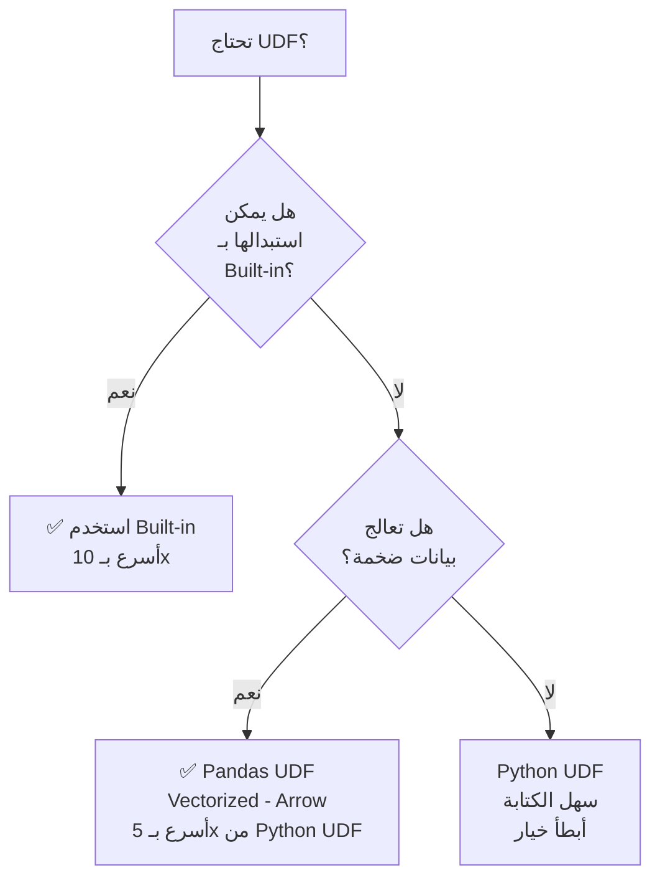

# 📘 الـ UDFs الاحترافية: Python UDFs، Pandas UDFs، وكيفية كتابة دوال آمنة وسريعة

> [!IMPORTANT]
> **هدف هذا الدليل:**
> بنهاية هذا الملف، ستعرف متى تكتب UDF ومتى تتجنبها، وكيف تكتب UDF آمنة لا تُسبب انهيار الـ Pipeline، والفرق العملي بين Python UDF وPandas UDF في الأداء.

---

## 1. 🎯 متى تكتب UDF أصلاً؟

```
قاعدة الذهب: لا تكتب UDF إذا استطعت تجنبها!

✅ ابحث أولاً في:
  1. pyspark.sql.functions (200+ دالة مُدمجة)
  2. spark.sql("...") مع SQL expressions
  3. selectExpr() مع SQL string expressions

❌ اكتب UDF فقط عندما:
  1. تحتاج مكتبة Python لا تُوفّرها Spark (spacy, transformers, scikit-learn)
  2. منطق تجاري معقد جداً لا يمكن تعبيره بـ SQL
  3. التفاعل مع APIs خارجية (مع مراعاة الأداء!)
```

---

## 2. 🏗️ أنواع UDFs في PySpark



| النوع | السرعة | الاستخدام | الكتابة |
| :--- | :--- | :--- | :--- |
| **Built-in Functions** | ⚡⚡⚡ (Tungsten) | أي عملية مُدمجة | دوال جاهزة |
| **Pandas UDF** | ⚡⚡ (Arrow) | بيانات ضخمة، NumPy/Pandas | `@pandas_udf` |
| **Python UDF** | ⚡ (Py4J) | منطق بسيط، مجموعات صغيرة | `@udf` |

---

## 3. ⚙️ Python UDF: الأساسيات الصحيحة

```python
from pyspark.sql.functions import udf, col
from pyspark.sql.types import StringType, IntegerType, DoubleType, BooleanType

# ── الطريقة 1: Decorator ──────────────────────────────────────────
@udf(returnType=StringType())
def classify_score(score):
    """تصنيف الدرجة — دائماً حدّد returnType!"""
    if score is None:
        return "UNKNOWN"  # معالجة NULL أساسية
    if score >= 90:
        return "EXCELLENT"
    elif score >= 70:
        return "GOOD"
    elif score >= 50:
        return "AVERAGE"
    else:
        return "POOR"

# الاستخدام
df.withColumn("grade", classify_score(col("score")))

# ── الطريقة 2: udf() function ────────────────────────────────────
def parse_phone(phone_str):
    """تحليل رقم الهاتف"""
    if phone_str is None:
        return None
    import re
    digits = re.sub(r"[^0-9]", "", phone_str)
    return digits if len(digits) >= 10 else None

parse_phone_udf = udf(parse_phone, StringType())
df.withColumn("phone_clean", parse_phone_udf(col("phone")))
```

### القواعد الإلزامية لكتابة Python UDF آمنة

```python
# ✅ القاعدة 1: دائماً عالج NULL في أول سطر
@udf(StringType())
def safe_udf(value):
    if value is None:          # ← أول شيء دائماً!
        return None
    # ... باقي المنطق

# ✅ القاعدة 2: استخدم Try/Except لتجنب انهيار الـ Pipeline
@udf(StringType())
def robust_udf(value):
    if value is None:
        return None
    try:
        # منطق قد يُخطئ
        return some_processing(value)
    except Exception:
        return None  # إعادة NULL بدلاً من انهيار الـ Task

# ✅ القاعدة 3: تجنب استيراد المكتبات خارج الدالة
# ❌ خطر: إذا لم يكن scikit-learn مثبتاً على كل Executor
import sklearn  # خارج الدالة — سيفشل عند import الملف!

# ✅ صحيح: الاستيراد داخل الدالة
@udf(StringType())
def ml_udf(value):
    import sklearn  # ← يُستورد على كل Executor عند الاستدعاء
    return sklearn.process(value)

# ✅ القاعدة 4: دائماً حدّد returnType صراحة
# ❌ خطر: Spark يُخمّن النوع (قد يُخطئ)
@udf
def bad_udf(x):
    return x * 2

# ✅ صحيح
@udf(DoubleType())
def good_udf(x: float) -> float:
    return x * 2
```

---

## 4. ⚡ Pandas UDF: الخيار المُفضَّل للبيانات الكبيرة

```python
import pandas as pd
from pyspark.sql.functions import pandas_udf
from pyspark.sql.types import StringType, DoubleType

# ── النوع 1: Scalar UDF (عمود → عمود) ───────────────────────────
@pandas_udf(StringType())
def classify_vectorized(scores: pd.Series) -> pd.Series:
    """
    يعمل على pd.Series كاملة في كل استدعاء
    أسرع بكثير لأنه يُرسل Batch بدلاً من صف صف
    """
    conditions = [
        scores >= 90,
        scores >= 70,
        scores >= 50,
    ]
    choices = ["EXCELLENT", "GOOD", "AVERAGE"]
    return pd.Series(
        pd.np.select(conditions, choices, default="POOR"),
        dtype="str"
    ).where(scores.notna(), other=None)

# الاستخدام مثل أي دالة Spark
df.withColumn("grade", classify_vectorized(col("score")))

# ── النوع 2: Iterator of Series ──────────────────────────────────
from typing import Iterator
from pyspark.sql.functions import pandas_udf

@pandas_udf(StringType())
def batch_udf(iterator: Iterator[pd.Series]) -> Iterator[pd.Series]:
    """
    مفيد لتحميل Model مرة واحدة للـ Partition كاملة
    (بدلاً من تحميله لكل صف!)
    """
    # تحميل الـ Model مرة واحدة للـ Partition
    model = load_ml_model("/path/to/model")
    
    for series in iterator:
        # تطبيق الـ Model على الـ Batch كاملاً
        yield pd.Series(model.predict(series.fillna("").tolist()))
```

### مقارنة أداء حقيقية

```python
import time

df_large = spark.range(1, 1_000_001).selectExpr(
    "cast(rand() * 100 as double) as score"
)

# Python UDF
@udf(StringType())
def classify_py(score):
    if score is None: return None
    if score >= 90: return "EXCELLENT"
    if score >= 70: return "GOOD"
    if score >= 50: return "AVERAGE"
    return "POOR"

start = time.time()
df_large.withColumn("grade", classify_py(col("score"))).count()
py_time = time.time() - start

# Pandas UDF
@pandas_udf(StringType())
def classify_pd(scores: pd.Series) -> pd.Series:
    return pd.cut(scores,
                  bins=[-float("inf"), 50, 70, 90, float("inf")],
                  labels=["POOR", "AVERAGE", "GOOD", "EXCELLENT"]).astype(str)

start = time.time()
df_large.withColumn("grade", classify_pd(col("score"))).count()
pd_time = time.time() - start

print(f"Python UDF:  {py_time:.2f}s")
print(f"Pandas UDF:  {pd_time:.2f}s")
print(f"تسريع:       {py_time/pd_time:.1f}x")
```

---

## 5. 🤖 استخدام ML Models مع Pandas UDFs

```python
# Pattern احترافي: تحميل Model مرة واحدة لكل Executor (ليس لكل صف!)

from pyspark.sql.functions import pandas_udf, col
from pyspark.sql.types import DoubleType
import pandas as pd
from typing import Iterator

# المسار للـ Model المحفوظ (يجب أن يكون متاحاً على كل Executor)
MODEL_PATH = "/shared/models/fraud_detector.pkl"

@pandas_udf(DoubleType())
def predict_fraud_score(iterator: Iterator[pd.DataFrame]) -> Iterator[pd.Series]:
    """
    Iterator Pandas UDF:
    - يُحمَّل الـ Model مرة واحدة لكل Partition
    - يُطبَّق على كل Batch من البيانات
    """
    import pickle
    
    # تحميل الـ Model مرة واحدة لكل Partition (وليس لكل صف!)
    with open(MODEL_PATH, "rb") as f:
        model = pickle.load(f)
    
    for batch in iterator:
        # تطبيق الـ Model على Batch كامل
        features = batch[["amount", "merchant_id", "hour"]].fillna(0)
        predictions = model.predict_proba(features)[:, 1]  # احتمال الاحتيال
        yield pd.Series(predictions)

# تطبيق على الـ DataFrame
result = transactions.withColumn(
    "fraud_score",
    predict_fraud_score(struct(col("amount"), col("merchant_id"), col("hour")))
)
```

---

## 6. 🔗 UDFs مع أنواع بيانات معقدة

```python
from pyspark.sql.types import ArrayType, MapType, StructType, StructField, StringType, IntegerType

# ── UDF تُعيد Array ───────────────────────────────────────────────
@udf(ArrayType(StringType()))
def extract_keywords(text):
    """استخراج كلمات مفتاحية من نص"""
    if text is None:
        return []
    stopwords = {"the", "a", "is", "in", "of", "and"}
    words = [w.lower() for w in text.split() if len(w) > 3]
    return [w for w in words if w not in stopwords]

df.withColumn("keywords", extract_keywords(col("description")))

# ── UDF تُعيد Map (Dictionary) ───────────────────────────────────
@udf(MapType(StringType(), IntegerType()))
def word_count(text):
    """عدّ تكرار كل كلمة"""
    if text is None:
        return {}
    from collections import Counter
    words = text.lower().split()
    return dict(Counter(words))

df.withColumn("word_freq", word_count(col("text")))

# ── UDF تأخذ Array كمدخل ─────────────────────────────────────────
@udf(DoubleType())
def calc_diversity_score(tags: list) -> float:
    """حساب تنوع العلامات"""
    if not tags:
        return 0.0
    unique_tags = len(set(tags))
    total_tags = len(tags)
    return unique_tags / total_tags

df.withColumn("diversity", calc_diversity_score(col("tags_array")))
```

---

## 7. 🚨 سيناريوهات الفشل والتشخيص

### حادثة 1: UDF تُسبب انهيار الـ Pipeline بصمت

```text
WARN TaskSetManager: Lost task 3.0 in stage 2.0
org.apache.spark.SparkException: Task failed while writing rows.
Caused by: org.apache.spark.api.python.PythonException: 
  ValueError: could not convert string to float: 'N/A'
```

**الحل:**
```python
# ❌ UDF لا تعالج الأخطاء
@udf(DoubleType())
def parse_amount(s):
    return float(s)  # ستنهار على "N/A"!

# ✅ UDF آمنة
@udf(DoubleType())
def safe_parse_amount(s):
    if s is None:
        return None
    try:
        return float(s)
    except (ValueError, TypeError):
        return None  # NULL بدلاً من انهيار!
```

### حادثة 2: UDF بطيئة بشكل غير متوقع

```text
Stage 5 Duration: 45 minutes (expected: 5 minutes)
Task Deserialization Time: 85% of task time!
```

**التشخيص:**
- افتح Spark UI → Stages → انقر على Stage البطيء
- إذا كان "Task Deserialization Time" مرتفعاً → UDF تُرسل بيانات ضخمة بين JVM وPython

**الحل:**
```python
# ❌ UDF تستورد بيانات ضخمة في الـ Closure
large_lookup_dict = load_large_dict()  # قاموس بـ 10 GB!

@udf(StringType())
def lookup(key):
    return large_lookup_dict.get(key)  # يُرسَل لكل Executor مع كل Task!

# ✅ استخدم Broadcast Variable
lookup_bc = spark.sparkContext.broadcast(large_lookup_dict)

@udf(StringType())
def lookup_broadcast(key):
    return lookup_bc.value.get(key)  # يُرسَل مرة واحدة فقط!
```

### حادثة 3: UDF تُعيد نتائج مختلفة في الإنتاج

```python
# ❌ UDF تعتمد على حالة خارجية (Global State)
counter = 0

@udf(IntegerType())
def stateful_udf(x):
    global counter
    counter += 1
    return counter  # الـ counter مختلف على كل Executor!

# UDFs يجب أن تكون Pure Functions (نفس المدخل → نفس المخرج دائماً)
```

---

## 8. 🧪 التمارين العملية

### التمرين 1: بناء UDF آمنة مع Type Checking

```python
from pyspark.sql import SparkSession
from pyspark.sql.functions import udf, col
from pyspark.sql.types import StructType, StructField, StringType, DoubleType, BooleanType

spark = SparkSession.builder.master("local[4]").appName("UDFLab").getOrCreate()

# بيانات اختبار
data = [
    (1, "Alice",   "85.5",  "+20-10-1234-5678"),
    (2, "Bob",     "N/A",   "invalid_phone"),
    (3, "Charlie", "92.0",  "+1-555-123-4567"),
    (4, None,      "45.0",  None),
    (5, "Diana",   "110.0", "+44-20-7946-0958"),  # score > 100 = خطأ
]
df = spark.createDataFrame(data, ["id", "name", "score_str", "phone_str"])

# UDF 1: تحويل درجة آمن مع فحص النطاق
@udf(DoubleType())
def parse_score(score_str):
    if score_str is None:
        return None
    try:
        score = float(score_str)
        if not (0 <= score <= 100):  # فحص النطاق
            return None
        return score
    except (ValueError, TypeError):
        return None

# UDF 2: تحليل الهاتف
@udf(StringType())
def parse_phone_udf(phone):
    if phone is None:
        return None
    try:
        import re
        digits = re.sub(r"[^0-9]", "", phone)
        return digits if 10 <= len(digits) <= 15 else None
    except Exception:
        return None

# UDF 3: تصنيف مُركَّب
@udf(StringType())
def classify_user(name, score):
    if name is None or score is None:
        return "INCOMPLETE"
    if score >= 90:
        return f"PREMIUM:{name.upper()}"
    elif score >= 70:
        return f"STANDARD:{name.upper()}"
    else:
        return f"BASIC:{name.upper()}"

# تطبيق كل الـ UDFs
df_result = df \
    .withColumn("score",      parse_score(col("score_str"))) \
    .withColumn("phone",      parse_phone_udf(col("phone_str"))) \
    .withColumn("user_tier",  classify_user(col("name"), col("score")))

df_result.show(truncate=False)
```

### التمرين 2: Pandas UDF مقارنة بـ Python UDF

```python
import pandas as pd
import time
from pyspark.sql.functions import pandas_udf
from pyspark.sql.types import StringType

df_test = spark.range(1, 500_001).selectExpr(
    "cast(rand() * 100 as double) as score",
    "cast(id as string) as user_id"
)

# Python UDF
@udf(StringType())
def grade_py(score):
    if score is None: return None
    if score >= 90: return "A"
    if score >= 80: return "B"
    if score >= 70: return "C"
    if score >= 60: return "D"
    return "F"

# Pandas UDF
@pandas_udf(StringType())
def grade_pd(scores: pd.Series) -> pd.Series:
    return pd.cut(
        scores,
        bins=[-float("inf"), 60, 70, 80, 90, float("inf")],
        labels=["F", "D", "C", "B", "A"]
    ).astype(str)

# المقارنة
start = time.time()
df_test.withColumn("grade", grade_py(col("score"))).count()
t1 = time.time() - start

start = time.time()
df_test.withColumn("grade", grade_pd(col("score"))).count()
t2 = time.time() - start

print(f"Python UDF:  {t1:.2f}s")
print(f"Pandas UDF:  {t2:.2f}s")
print(f"تسريع Pandas: {t1/t2:.1f}x")
```

---

## 9. 🎓 أسئلة المقابلات التقنية

### سؤال 1: لماذا يجب أن تكون UDFs Pure Functions؟

**الإجابة النموذجية:**
Spark قد يُعيد تنفيذ Task نفسها عدة مرات (بسبب الفشل، Speculative Execution، أو إعادة الحساب من الـ Lineage). إذا اعتمدت الـ UDF على حالة خارجية مثل counter أو random state، ستُعطي نتائج مختلفة في كل تنفيذ — وهذا يُكسر قاعدة المعالجة الموزعة Idempotency. **Pure Function:** نفس المدخل دائماً يُعطي نفس المخرج، بغض النظر عن الوقت أو الخادم.

### سؤال 2: ما هو Broadcast Variable ومتى تستخدمه مع UDFs؟

**الإجابة النموذجية:**
Broadcast Variable هو آلية لإرسال بيانات كبيرة لكل Executor مرة واحدة فقط (بدلاً من إرسالها مع كل Task). عند استخدام قاموس أو Model كبير داخل UDF، إذا وضعته كـ closure variable، يُرسَل مع كل Task (قد يكون الآلاف). باستخدام `spark.sparkContext.broadcast(data)`:
```python
large_dict = {"key": "value", ...}  # 500 MB
bc = spark.sparkContext.broadcast(large_dict)

@udf(StringType())
def lookup(key):
    return bc.value.get(key)  # يُستخدم النسخة المحلية للـ Executor
```
يُرسَل الـ 500 MB مرة واحدة لكل Executor (وليس لكل Task).

### سؤال 3 (متقدم): ما هو Iterator Pandas UDF ومتى يكون أفضل من Scalar Pandas UDF؟

**الإجابة النموذجية:**
**Scalar Pandas UDF:** يستدعي الدالة لكل Batch من البيانات، ويُعيد Pandas Series. الـ Model يُحمَّل في كل استدعاء.

**Iterator Pandas UDF:** يستدعي الدالة مرة واحدة لكل Partition، ويُمرّر Iterator من Batches. يُتيح تحميل الـ Model مرة واحدة ثم تطبيقه على كل Batches الـ Partition:

```python
@pandas_udf(DoubleType())
def predict(iterator):
    model = load_heavy_model()  # تحميل مرة واحدة فقط للـ Partition!
    for batch in iterator:
        yield pd.Series(model.predict(batch))
```

مثالي للـ ML Inference حيث تحميل الـ Model ثقيل (قد يستغرق عدة ثوانٍ).

---

## 10. 📋 ورقة الغش السريعة

### هيكل UDF الآمنة

```python
# Python UDF
@udf(ReturnType())
def my_udf(param1, param2):
    # 1. معالجة NULL أولاً
    if param1 is None or param2 is None:
        return None
    # 2. Try/Except للأمان
    try:
        return process(param1, param2)
    except Exception:
        return None  # ولا crash!

# Pandas UDF
@pandas_udf(ReturnType())
def my_pandas_udf(series: pd.Series) -> pd.Series:
    # يعمل على Series كاملة — أسرع بكثير
    return series.map(lambda x: None if x is None else process(x))
```

### قرارات اختيار النوع

```
هل المنطق موجود في Built-in Functions؟
  ← نعم → استخدمها (أسرع)

هل تحتاج مكتبة Python؟
  ← نعم → Pandas UDF (إذا كانت البيانات كبيرة)
  ← نعم → Python UDF (إذا كانت البيانات صغيرة أو المنطق بسيط)

هل تُحمّل Model ثقيل؟
  ← نعم → Iterator Pandas UDF

هل لديك قاموس/بيانات كبيرة في الـ UDF؟
  ← نعم → استخدم Broadcast Variable
```

> [!TIP]
> **الخطوة القادمة:** انتقل للملف `20_vectorized_pandas_udfs.md` لتتعلم Pandas UDFs المتقدمة مع GroupedData وWindow Functions لعمليات ML الاحترافية.

<!-- START_NAVIGATION_LINKS -->
---
### 🔗 روابط التنقل السريع

| السابق (Previous) | التالي (Next) |
| :--- | :--- |
| [◀️ 📘 معالجة النصوص المتقدمة: Regex، String Functions، وتحليل البيانات النصية](18_advanced_string_manipulation.md) | [▶️ 📘 Pandas UDFs المتجهة (Vectorized): ML Inference، GroupedData، وWindow Functions](20_vectorized_pandas_udfs.md) |
<!-- END_NAVIGATION_LINKS -->
