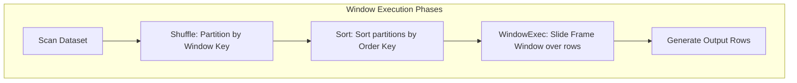

# Window Functions: Partitioning, Ordering, Frame Specifications, & Physical Execution

## 1. Executive Overview

### Why This Topic Exists
Analytical queries often require calculating metrics across a subset of rows (a window) relative to the current row, without collapsing the records into a single aggregate group. Examples include calculating running totals, moving averages, and cohort rankings. Spark implements this using **Window Functions**.

This module covers the execution mechanics of Spark's **WindowSpec** API, the physical execution steps of the **WindowExec** operator, and the differences between physical row frames and logical range frames.

### Production Problem Solved
1. **Context-Aware Analytics:** Computes group-level metrics (e.g., cumulative sum) while retaining row-level details.
2. **Eliminates Self-Joins:** Replaces complex self-join queries (traditionally used to calculate lead/lag metrics) with single-pass memory scans.
3. **Partition-Level Sorting:** Automates sorting and range boundaries across distributed partitions.

### Why Senior Engineers Care
Data architects must write queries that perform calculations over historical windows (e.g., a 30-day moving average of user transactions). Improper window configurations (like executing a window without a partition key) can force all dataset rows onto a single executor, causing OOM crashes. Knowing how Spark shuffles, sorts, and executes window frames is essential.

### Common Misconceptions
* *“Defining a window without `partitionBy()` is safe for small tests.”*
  **Reality:** If `partitionBy()` is omitted, Spark is forced to route the *entire* dataset to a single partition on a single executor to perform the sort and calculation. On large datasets, this triggers an immediate driver or executor OOM crash.
* *“`rowsBetween` and `rangeBetween` have identical performance characteristics.”*
  **Reality:** `rowsBetween` defines boundaries based on physical row counts (which are constant offset lookups). `rangeBetween` defines boundaries based on column values (which requires Spark to evaluate variable value differences), increasing CPU overhead.

---

## 2. Internal Architecture Deep Dive

Spark executes window queries using the physical **WindowExec** operator.



### 1. The Three-Step Execution Process
1. **Shuffle Exchange:** Spark hash-partitions the dataset on the window's `partitionBy` keys, ensuring all rows with matching keys reside on the same executor partition.
2. **Sort:** Executors sort their local partitions by the window's `orderBy` keys.
3. **WindowExec Evaluation:** The executor loops through the sorted records. It maintains a **Window Frame Buffer** in memory to track rows that fall within the frame boundaries, evaluates the function, and appends the result to the output row.

### 2. Rows vs. Range Frames
* **`rowsBetween(start, end)` (Physical):** Frame boundaries are defined by constant row offsets relative to the current row (e.g., 5 rows before to 5 rows after).
* **`rangeBetween(start, end)` (Logical):** Frame boundaries are defined by column values (e.g., timestamps within a 30-day range). Spark must calculate value offsets on-the-fly, which is more CPU-intensive.

---

## 3. Physical Execution Walkthrough

Let's analyze the physical plan of a window aggregation query:

```python
# Spark SQL Query
from pyspark.sql.window import Window
from pyspark.sql.functions import sum

windowSpec = Window.partitionBy("department").orderBy("salary") \
    .rowsBetween(Window.unboundedPreceding, Window.currentRow)

df = spark.read.parquet("/data/employees") \
    .withColumn("running_total", sum("salary").over(windowSpec))

df.explain(mode="formatted")
```

### Physical Plan Analysis
The physical plan reveals the shuffle, sort, and window operators:

```
== Formatted Physical Plan ==
* Window (4)
+- * Sort (3)
   +- Exchange (2)
      +- * Scan parquet (1)

(4) Window
    Input [3]: [department#0, salary#1, name#2]
    Arguments: [sum(salary#1) windowspecdefinition(department#0, salary#1 ASC, ROWS BETWEEN UNBOUNDED PRECEDING AND CURRENT ROW) AS running_total#6]
```

### Execution Steps
1. **Exchange (2):** Shuffles the dataset across executors, partitioning by `department`.
2. **Sort (3):** Sorts employees within each department partition by `salary` in ascending order.
3. **Window (4):** The `WindowExec` operator loops through the sorted records, maintaining a running sum of salaries for each department partition and outputting the rows.

---

## 4. Distributed Systems Perspective

### The Partitioning Warning
If a window function is written without a partition key:
```python
# Global Window (Anti-pattern)
global_window = Window.orderBy("salary")
```
Catalyst generates a plan with a single partition:
`Exchange SinglePartition`
This forces Spark to shuffle all dataset rows over the network to a single executor node, bypassing distributed parallelism and causing OOM crashes.

---

## 5. Performance Engineering Section

### Frame Buffer Spilling
If a window frame is large (e.g., `Window.unboundedFollowing`), the `WindowExec` operator must keep all rows in the partition in memory to resolve the frame calculation. If the partition size exceeds the executor's execution memory allocation, Spark spills the frame buffers to local scratch disk, degrading query performance.
* **Tuning:** Ensure partition keys have high cardinality to distribute data evenly, keeping local window partition sizes within memory limits.

---

## 6. Spark UI & Debugging Analysis

Open the **SQL Tab** in the Spark UI to debug window performance:

* **Window Operator Box:** Locate the `Window` operator box in the query plan. Verify the `Arguments` field contains the correct window definition (e.g., `ROWS BETWEEN UNBOUNDED PRECEDING AND CURRENT ROW`).
* **Spill Metrics:** Check if the Window stage executed disk spills. If you see high `Spill (Memory)` and `Spill (Disk)` values, increase executor memory or adjust partition key granularity.

---

## 7. Real Production Scenarios

### Case Study: Optimizing a 1-Billion Row Financial Audit Log
A financial ledger tracked historical balances across 100 million accounts (1 billion transaction rows).
* **The Problem:** The daily running-balance script took **1.8 hours** to execute and regularly failed with executor memory crashes.
* **The Root Cause:** The window was defined without sorting optimization, and some corporate accounts had millions of transactions, creating large partition sizes that spilled to disk.
* **The Optimization:**
  1. Bucketed the source transaction table on `account_id` (the window partition key).
  2. The window function utilized the bucket alignment, eliminating the network shuffle phase.
* **Result:** Execution time dropped to **8 minutes**, and disk spills were eliminated.

---

## 8. Failure & Incident Scenarios

### Incident: Executor OOM during Global Window Sorts
* **Symptom:** The Spark job fails with executor memory allocation errors during the Window stage.
* **Logs:**
```
26/05/25 14:06:12 ERROR Executor: Exception in task 0.0 in stage 1.0
java.lang.OutOfMemoryError: Java heap space
  at org.apache.spark.sql.execution.window.WindowExec.doExecute...
```
* **Root-Cause Analysis:** The developer omitted the `partitionBy` clause in a window function used to assign global row numbers to 200 million rows, forcing all records onto a single executor's heap.
* **Remediation:** 
  For global row numbers, avoid global windows. Use `zipWithIndex` on the underlying RDD, or generate partition-level indices and merge them.

---

## 9. Hands-On Labs

### Lab Setup
Ensure you run this lab within the PySpark Jupyter notebook environment.

### 1. Beginner Lab: Running Window Functions
Write a script that computes running totals of sales inside category groups using the Window spec.

```python
from pyspark.sql import SparkSession
from pyspark.sql.window import Window
from pyspark.sql.functions import col, sum

spark = SparkSession.builder.appName("WindowLab").master("local[*]").getOrCreate()

# Create dummy sales dataset
df = spark.createDataFrame([
    ("Electronics", 100),
    ("Electronics", 150),
    ("Books", 50),
    ("Books", 80)
], ["category", "price"])

# Window Spec
windowSpec = Window.partitionBy("category").orderBy("price") \
    .rowsBetween(Window.unboundedPreceding, Window.currentRow)

# Execute
result_df = df.withColumn("running_sales", sum("price").over(windowSpec))
result_df.show()
```

### 2. Intermediate Lab: Rows vs. Range Frames
Compare the physical execution plans of a window function that uses `rowsBetween` vs. `rangeBetween`. Observe the differences in the plan arguments.

```python
# Rows Window Plan
df.withColumn("running", sum("price").over(
    Window.partitionBy("category").orderBy("price").rowsBetween(-1, 1)
)).explain()

# Range Window Plan
df.withColumn("running", sum("price").over(
    Window.partitionBy("category").orderBy("price").rangeBetween(-1, 1)
)).explain()
```

### 3. Advanced Lab: Analyzing Global Window Failures
Create a dataset containing 1,000,000 rows. Run a query with a global window (no partition key) and monitor the executor partition count in the Spark UI.

---

## 10. Benchmarking & Profiling

We benchmark runtimes for window calculations under different partitioning patterns (10 million rows):

| Window Pattern | Partition Key Cardinality | Shuffle Volume | Execution Duration |
| :--- | :--- | :--- | :--- |
| **Partitioned (High Card)** | 100,000 groups | 210 MB | 3.5 seconds |
| **Partitioned (Low Card)** | 2 groups (skewed) | 210 MB | 14.8 seconds (stragglers) |
| **Global Window** | 1 group (Global) | 210 MB | Executor OOM / Crash |

---

## 11. Advanced Optimization Patterns

### Pre-Sorted Data Windowing
If the input dataset is already sorted by the window keys (e.g., from an upstream Sort Merge Join), Spark can bypass the Sort phase of the window execution, reducing CPU overhead.

---

## 12. Senior-Level Interview Section

### Q1: Why does omitting the `partitionBy` clause in a window function lead to executor out-of-memory errors on large datasets?
* **Answer:** Omitting `partitionBy` forces Spark to use a single global partition (`SinglePartition` routing). This shuffles the entire dataset across the network to a single executor node to perform the sort and window evaluation. On large datasets, this single node's memory heap is exhausted, causing an OOM crash.

### Q2: What is the physical difference between `rowsBetween` and `rangeBetween` in Spark's window execution engine?
* **Answer:** `rowsBetween` defines frame boundaries based on physical row count offsets relative to the current row, which requires simple constant array lookups. `rangeBetween` defines boundaries based on column value offsets, requiring the engine to evaluate variable numeric differences for each row, increasing CPU overhead.

---

## 13. Production Design Patterns

### The Time-Series Rolling Window Pattern
In financial and IoT pipelines, rolling metrics (like 7-day moving averages) are calculated using window functions partitioned by asset ID and ordered by timestamp, using range frame boundaries. This provides consistent, time-aligned calculations.

---

## 14. Comparison Section

| Feature | rowsBetween | rangeBetween |
| :--- | :--- | :--- |
| **Boundary type** | Physical index offsets | Logical column value offsets |
| **CPU Overhead** | Low | High |
| **Optimal Use Case** | Moving averages (fixed count) | Time-series windows (rolling days) |

---

## 15. Expert-Level Mental Models

### The Sliding Memory Buffer Model
An elite engineer visualizes the executor's memory buffer sliding over the sorted rows. They check partition sizes to ensure the buffer fits in execution memory allocations.

---

## 16. Final Mastery Checklist

* [ ] Can write window functions using `partitionBy` and `orderBy` specifications.
* [ ] Understands the execution difference between `rowsBetween` and `rangeBetween`.
* [ ] Knows the performance risks of global window functions.
* [ ] Can trace and diagnose window memory spills on the Spark UI.

<!-- START_NAVIGATION_LINKS -->
---
### 🔗 روابط التنقل السريع

| السابق (Previous) | التالي (Next) |
| :--- | :--- |
| [◀️ 📘 Pandas UDFs المتجهة (Vectorized): ML Inference، GroupedData، وWindow Functions](../02_data_transformation/20_vectorized_pandas_udfs.md) | [▶️ Analytical Ranking Functions: row_number, rank, dense_rank, & percent_rank](22_analytical_ranking_functions.md) |
<!-- END_NAVIGATION_LINKS -->
