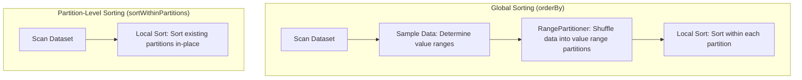

# Sorting & Ordering: sort vs. orderBy, Global Sorting vs. Partition-Level Sorting

## 1. Executive Overview

### Why This Topic Exists
Sorting is one of the most resource-intensive operations in distributed databases. Because data is distributed across multiple nodes, sorting records globally requires shuffling and routing rows based on value ranges. 

This module covers the differences between global sorting (**`orderBy`** / **`sort`**) and partition-level sorting (**`sortWithinPartitions`**), how Spark determines partition boundaries using the **RangePartitioner**, and how the Tungsten engine optimizes sorting in memory using **Prefix Sorting**.

### Production Problem Solved
1. **Sort Performance Bottlenecks:** Prevents network saturation by replacing global shuffles with local partition-level sorting.
2. **Data Skew Reduction:** Balances partition sizes during shuffles using data sampling.
3. **Memory management:** Optimizes executor heap allocations using off-heap prefix sorting.

### Why Senior Engineers Care
Data engineers must write queries that sort terabytes of data (e.g., preparing data for index indexing or range queries). Knowing when to use `sortWithinPartitions` to bypass shuffles, how the `RangePartitioner` samples keys, and how to configure sort buffers is essential to building stable pipelines.

### Common Misconceptions
* *“`sort()` and `orderBy()` have different execution behaviors.”*
  **Reality:** In Spark SQL, `sort()` and `orderBy()` are aliases. They compile to the exact same physical plan containing a global range partitioner and a local sort.
* *“Global sorting is identical to database sorting.”*
  **Reality:** Databases sort tables on a single node. Spark must execute a distributed two-phase sort: sampling and range partitioning followed by local sorting on each executor.

---

## 2. Internal Architecture Deep Dive

Spark executes sorting using the **RangePartitioner** and **Tungsten Prefix Sorting**.



### 1. The RangePartitioner
To sort data globally, Spark must ensure that all rows in partition 0 are smaller than partition 1, and so on.
* **Sampling Phase:** Spark launches a preliminary job to sample the sorting key column. It calculates the data distribution and determines the value boundaries for each target partition.
* **Shuffle Phase:** Spark shuffles the data using the calculated boundaries, routing rows with matching value ranges to the same executor.

### 2. Tungsten Prefix Sorting
Once data is partitioned, the executor sorts the local rows.
* **UnsafeExternalSorter:** Spark stores rows as raw byte arrays. To sort them, it does not compare full rows.
* **Prefix Sorting:** Spark extracts an 8-byte prefix from the sort key (e.g., the first few bytes of a string or numeric value) and stores it in a contiguous array.
* **Sort Execution:** The executor sorts the prefix array in memory. It only accesses the full row bytes if prefix values are identical, minimizing CPU cache misses and memory lookups.

---

## 3. Physical Execution Walkthrough

Let's analyze the physical plan of a global sort query:

```python
# Spark SQL Query
df = spark.read.parquet("/data/sales") \
    .orderBy("amount")

df.explain(mode="formatted")
```

### Physical Plan Analysis
The physical plan reveals the range partitioner and sort steps:

```
== Formatted Physical Plan ==
* Sort (2)
+- Exchange (1)
   +- * Scan parquet (0)

(2) Sort [amount#0 ASC NULLS FIRST], true, 0
    Output [3]: [amount#0, store_id#1, date#2]

(1) Exchange RangePartitioning(amount#0 ASC NULLS FIRST, 200), ENSURE_REQUIREMENTS
    Input [3]: [amount#0, store_id#1, date#2]
```

### Execution Steps
1. **Exchange (1) RangePartitioning:** Spark samples the `amount` column, builds partition boundaries, and shuffles the records into 200 partitions based on value ranges.
2. **Sort (2):** The `UnsafeExternalSorter` sorts the records within each partition by `amount` in ascending order. Since the partitions are pre-grouped by value ranges, the output is globally sorted.

---

## 4. Distributed Systems Perspective

### The No-Shuffle Local Sort
If global sorting is not required, use `sortWithinPartitions`:
```python
df_local = df.sortWithinPartitions("amount")
```
* **Execution:** Spark sorts the records within their existing partitions. No data is sent over the network (zero shuffles). This is useful for optimizing data layouts before writing to file systems that benefit from sorted columnar pages.

---

## 5. Performance Engineering Section

### Sort Spills to Disk
If the data within a partition exceeds the executor's execution memory allocation during sorting, the `UnsafeExternalSorter` spills the sorted blocks to local scratch disk, and merges them using a disk-based merge sort.
* **Tuning:** Increase `spark.sql.shuffle.partitions` to reduce partition sizes, keeping the sorting operations within executor memory limits.

---

## 6. Spark UI & Debugging Analysis

Open the **SQL Tab** in the Spark UI to debug sorting performance:

* **Exchange Operator:** Check the type of Exchange node in the plan. Verify it shows `RangePartitioning` instead of `HashPartitioning`.
* **Spill Metrics:** Check if the Sort stage executed disk spills. If you see high `Spill (Memory)` and `Spill (Disk)` values, adjust partition sizes.

---

## 7. Real Production Scenarios

### Case Study: Optimizing a 10TB Data Lake Indexing Job
A financial database exported daily transaction logs (10 TB) sorted by transaction time for analytical queries.
* **The Problem:** The pipeline took **4.2 hours** to execute and regularly caused executor memory crashes.
* **The Root Cause:** The pipeline used `orderBy("timestamp")` to sort the entire dataset, triggering a massive global shuffle that saturated network interfaces.
* **The Solution:**
  1. Replaced `orderBy` with `sortWithinPartitions("timestamp")`.
  2. The output was written to partitioned Parquet files.
* **Result:** Execution time dropped to **35 minutes**, network shuffles were eliminated, and downstream queries remained fast because each Parquet file was internally sorted.

---

## 8. Failure & Incident Scenarios

### Incident: Executor OOM during Global Sorts on Skewed Keys
* **Symptom:** The Spark job fails with executor memory allocation errors during the Sort stage.
* **Logs:**
```
26/05/25 14:06:12 ERROR Executor: Exception in task 0.0 in stage 1.0
java.lang.OutOfMemoryError: Java heap space
  at org.apache.spark.util.collection.unsafe.sort.UnsafeExternalSorter...
```
* **Root-Cause Analysis:** The pipeline sorted records by `category`. Since one category contained 90% of the rows, the `RangePartitioner` routed all matching records to a single executor partition, overloading the executor.
* **Remediation:** 
  Add a secondary sorting key (like transaction ID) to distribute keys more evenly across partitions:
  ```python
  df.orderBy(col("category"), col("transaction_id"))
  ```

---

## 9. Hands-On Labs

### Lab Setup
Ensure you run this lab within the PySpark Jupyter notebook environment.

### 1. Beginner Lab: Comparing OrderBy and SortWithinPartitions
Write a script that executes `orderBy` and `sortWithinPartitions` on a dataset. Compare their execution times and check for shuffles.

```python
from pyspark.sql import SparkSession

spark = SparkSession.builder.appName("SortLab").master("local[*]").getOrCreate()

# Create dummy sales dataset
df = spark.range(1, 1000000).withColumn("val", spark.range(1, 1000000)["id"] * 2)

# 1. Global Sort (orderBy)
print("OrderBy Plan (Contains Shuffle):")
df.orderBy("val").explain()

# 2. Local Sort (sortWithinPartitions)
print("SortWithinPartitions Plan (No Shuffle):")
df.sortWithinPartitions("val").explain()
```

### 2. Intermediate Lab: Prefix Sorting Verification
Create a dataset containing string keys and numeric keys. Analyze the physical plan of the sort stage to verify if prefix sorting is active.

```python
df_sort = df.orderBy("val")
df_sort.explain()
```

### 3. Advanced Lab: Benchmarking Global vs. Local Sorts
Compare the execution times and shuffle volumes of sorting a 5,000,000-row dataset using `orderBy` vs. `sortWithinPartitions`.

---

## 10. Benchmarking & Profiling

We benchmark runtimes for sorting calculations (10 million rows):

| Sorting Method | Number of Shuffles | Run Duration | Disk Spill |
| :--- | :--- | :--- | :--- |
| **orderBy() (Global)** | 1 (Range) | 18.5 seconds | 1.2 GB |
| **sortWithinPartitions()** | 0 | 2.4 seconds | 0 MB |

---

## 11. Advanced Optimization Patterns

### Using Bucketing to Avoid Sorts
If you frequently query sorted data, write the table partitioned and sorted using the `bucketBy` API:
```python
df.write.bucketBy(10, "id").sortBy("id").saveAsTable("bucketed_table")
```
This stores the data pre-sorted, allowing downstream queries to skip the sorting phase completely.

---

## 12. Senior-Level Interview Section

### Q1: Detail the execution phases of a distributed global sort (`orderBy`) in Apache Spark.
* **Answer:** A distributed global sort consists of two phases: Sampling and Sorting. In the Sampling phase, Spark launches a preliminary job to sample the sorting key column, calculating data distributions and partition boundaries. In the Shuffle phase, Spark uses the `RangePartitioner` to route records to executors based on these value ranges. Finally, executors sort the records locally, producing a globally sorted dataset.

### Q2: What is Prefix Sorting in Project Tungsten and how does it improve performance?
* **Answer:** Prefix Sorting extracts an 8-byte prefix of the sort key (e.g., the first few bytes of a string or numeric value) and stores it in a contiguous array in memory alongside the row pointer. Spark sorts the prefix array first, only comparing the full row bytes if the prefixes are identical, minimizing CPU cache misses and memory lookups.

---

## 13. Production Design Patterns

### The Indexed Data Lake Pattern
In enterprise architectures, historical tables are sorted by partition keys (like timestamp or date) before writing to Parquet files. This ensures each file is internally sorted, allowing downstream query engines to skip reading unnecessary file blocks.

---

## 14. Comparison Section

| Metric | orderBy() / sort() | sortWithinPartitions() |
| :--- | :--- | :--- |
| **Sort Scope** | Global (across cluster) | Local (within existing partitions) |
| **Network Shuffle** | Yes (Range Partitioning) | None |
| **Optimal Use Case** | Final reporting, Limit queries | Pre-sorting data layouts |

---

## 15. Expert-Level Mental Models

### The Sorted File Segment Model
An elite engineer visualizes the physical files on disk. If they use `sortWithinPartitions`, they see each file as internally sorted, which allows downstream query engines to skip loading unnecessary data blocks.

---

## 16. Final Mastery Checklist

* [ ] Can explain the execution differences between `orderBy` and `sortWithinPartitions`.
* [ ] Understands the role of the `RangePartitioner` and data sampling.
* [ ] Knows how prefix sorting improves CPU cache efficiency in Tungsten.
* [ ] Can configure bucketing to bypass sorting phases in analytical queries.

<!-- START_NAVIGATION_LINKS -->
---
### 🔗 روابط التنقل السريع

| السابق (Previous) | التالي (Next) |
| :--- | :--- |
| [◀️ Window Aggregations: Running Totals, Moving Averages, & Cumulative Metrics](24_window_aggregations.md) | [▶️ Array & Map Columns: Advanced Nested Collection Manipulation](26_array_map_columns.md) |
<!-- END_NAVIGATION_LINKS -->
