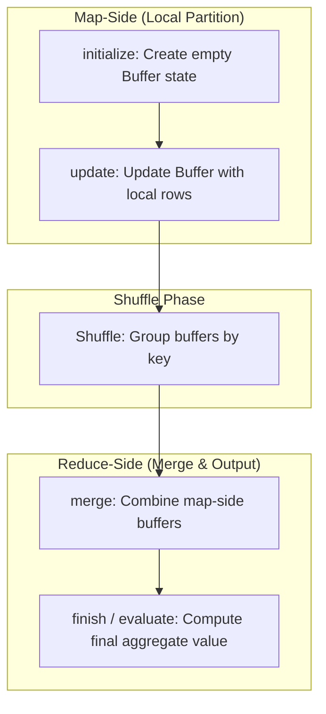

# User-Defined Aggregate Functions (UDAFs): Native Aggregations

## 1. Executive Overview

### Why This Topic Exists
While Spark SQL provides a rich set of native aggregate functions (like `sum`, `avg`, `min`, `max`), complex statistical models or custom business calculations (such as calculating geometric means or custom financial metrics) require custom aggregations. Spark implements this using **User-Defined Aggregate Functions (UDAFs)**.

This module covers the execution lifecycle of UDAFs, the strongly-typed **`Aggregator[IN, BUF, OUT]`** API, and the performance characteristics of PySpark **Pandas Grouped Aggregations**.

### Production Problem Solved
1. **Custom Aggregate Mathematics:** Executes specialized aggregation logic (e.g., calculating running standard deviations or product averages) across partitions.
2. **State Management:** Maintains intermediate state buffers during data merges.
3. **Structured Grouping:** Consolidates complex rows into custom object summaries.

### Why Senior Engineers Care
Data architects must build custom reporting frameworks. Knowing how Spark manages aggregate buffers in memory, the difference between map-side updates and reduce-side merges, and how to optimize custom UDAFs is essential to building high-performance systems.

### Common Misconceptions
* *“UDAFs are as fast as native aggregate functions.”*
  **Reality:** Native functions (like `sum`) compile to optimized Tungsten bytecode that runs directly on raw bytes. Custom UDAFs require deserializing binary data into JVM objects to update the state buffer, increasing CPU and GC overhead.
* *“PySpark UDAFs require transferring data row-by-row to the Python process.”*
  **Reality:** By using Arrow-based **Pandas Grouped Aggregators** (`@pandas_udf`), PySpark can transfer column batches to the Python worker, optimizing performance.

---

## 2. Internal Architecture Deep Dive

A custom UDAF (using Scala's `Aggregator[IN, BUF, OUT]` or PySpark Pandas UDAF) manages state using a defined buffer:



### 1. The UDAF Execution Lifecycle
Every UDAF must implement four key operations:
1. **`initialize`:** Sets the state buffer to its initial values (e.g., setting sum and count to `0`).
2. **`update`:** Updates the local state buffer with a new row value locally on the executor (map-side aggregation).
3. **`merge`:** Merges two state buffers together (e.g., combining buffers from different executors during shuffles).
4. **`evaluate` / `finish`:** Computes the final aggregate output value from the merged buffer.

### 2. PySpark Pandas Grouped Aggregations
In PySpark, UDAFs are written using the `@pandas_udf` decorator:
* Spark groups rows by key, serializes them using Apache Arrow, and transfers the batches to the Python worker.
* The Python function receives the data as a Pandas Series and returns a single scalar value.
* This avoids row-by-row serialization, making it highly efficient.

---

## 3. Physical Execution Walkthrough

Let's analyze the physical plan of a query containing a PySpark Pandas Grouped Aggregator:

```python
# Spark SQL Query
from pyspark.sql.functions import pandas_udf
import pandas as pd

@pandas_udf("double")
def mean_udf(v: pd.Series) -> float:
    return v.mean()

df = spark.read.parquet("/data/sales") \
    .groupBy("store_id") \
    .agg(mean_udf("amount").alias("mean_amount"))

df.explain(mode="formatted")
```

### Physical Plan Analysis
The physical plan reveals the Grouped Aggregation operator:

```
== Formatted Physical Plan ==
* FlatMapGroupsInPandas (3)
+- * Sort (2)
   +- Exchange (1)
      +- * Scan parquet (0)

(3) FlatMapGroupsInPandas
    Input [3]: [store_id#0, amount#1, mean_amount#5]
    Arguments: [store_id#0], mean_udf(amount#1)
```

### Execution Steps
1. **Exchange (1):** Shuffles data by `store_id` using a hash partitioner.
2. **Sort (2):** Sorts records within each partition by `store_id`.
3. **FlatMapGroupsInPandas (3):** Indicates that data groups are converted to Apache Arrow format, and sent to the Python worker to execute the Pandas aggregation, returning a single value per group.

---

## 4. Distributed Systems Perspective

### Buffer Serialization Overhead
During the Shuffle phase, the driver must serialize and transfer the UDAF's intermediate state buffers (`BUF` type) across the network. If the state buffer is a large, complex object (such as a custom histogram or array), serialization overhead can bottleneck the shuffle phase, slowing execution times.
* **Optimization:** Keep the state buffer as simple as possible (e.g., using primitive numeric types instead of nested objects).

---

## 5. Performance Engineering Section

### UDAF vs. Native SQL Expressions
* **UDAFs:** Avoid using custom UDAFs if the logic can be written using native Spark SQL functions.
* **Optimization:** Many custom aggregations can be written by combining native functions like `sum`, `count`, and `when()`. These compile to optimized Tungsten bytecode, running significantly faster.

---

## 6. Spark UI & Debugging Analysis

Open the **SQL Tab** in the Spark UI to debug UDAF performance:

* **FlatMapGroupsInPandas Operator:** If you see `FlatMapGroupsInPandas` or `AggregateInPandas` nodes in the query plan, it confirms that PySpark Pandas UDAFs are active.
* **Executor Task Time:** Monitor task execution times in the stage details. A high CPU runtime relative to shuffle write sizes indicates that executors are bottlenecked by UDAF serialization or custom object creation.

---

## 7. Real Production Scenarios

### Case Study: Optimizing a Geometric Mean Calculation
A financial portfolio analytics pipeline calculated geometric means of daily asset prices (100 million rows).
* **The Problem:** The custom Scala UDAF took **15 minutes** to execute and regularly caused JVM GC pauses on executors.
* **The Root Cause:** The UDAF deserialized price values into JVM objects to update the state buffer on every row, triggering heavy GC pressure.
* **The Solution:** Rewrote the geometric mean logic using native math expressions:
  $$\text{Geometric Mean} = e^{\frac{1}{N} \sum \ln(\text{price})}$$
  ```python
  # Optimized Native Implementation
  df.groupBy("portfolio_id").agg(exp(avg(log(col("price")))))
  ```
* **Result:** The custom UDAF was eliminated. The calculation ran directly in Tungsten bytecode, reducing execution time to **45 seconds**.

---

## 8. Failure & Incident Scenarios

### Incident: Executor OOM due to growing state buffers
* **Symptom:** The Spark job fails with executor memory allocation errors during the Aggregation stage.
* **Logs:**
```
26/05/25 14:06:12 ERROR Executor: Exception in task 0.0 in stage 1.0
java.lang.OutOfMemoryError: Java heap space
  at my.company.udaf.CustomStatsCollector.update(CustomStatsCollector.scala:22)
```
* **Root-Cause Analysis:** The custom UDAF collected unique string values in an internal ArrayList inside the state buffer. For skewed keys containing millions of rows, the ArrayList exceeded the JVM heap allocation, causing a crash.
* **Remediation:** 
  Avoid growing collections inside the UDAF state buffer. Store only primitive, fixed-size aggregation metrics (like counts and sums).

---

## 9. Hands-On Labs

### Lab Setup
Ensure you run this lab within the PySpark Jupyter notebook environment.

### 1. Beginner Lab: Running a Pandas Grouped Aggregator
Write a script that defines and executes a basic PySpark Pandas Grouped Aggregator to compute standard deviations.

```python
from pyspark.sql import SparkSession
from pyspark.sql.functions import pandas_udf
import pandas as pd

spark = SparkSession.builder.appName("UdafLab").master("local[*]").getOrCreate()

# Define Pandas Grouped Aggregator
@pandas_udf("double")
def std_dev_udf(s: pd.Series) -> float:
    return s.std()

# Create dummy sales dataset
df = spark.createDataFrame([
    ("StoreA", 100.0),
    ("StoreA", 150.0),
    ("StoreB", 200.0),
    ("StoreB", 250.0)
], ["store_id", "sales"])

# Execute
df.groupBy("store_id").agg(std_dev_udf("sales").alias("sales_std")).show()
```

### 2. Intermediate Lab: Plan Verification
Compare the physical execution plans of a custom UDAF and a native aggregate function (`stddev`). Observe `FlatMapGroupsInPandas` vs `HashAggregate`.

```python
# 1. Native Plan
from pyspark.sql.functions import stddev
df.groupBy("store_id").agg(stddev("sales")).explain()

# 2. UDAF Plan
df.groupBy("store_id").agg(std_dev_udf("sales")).explain()
```

### 3. Advanced Lab: Writing a Scala Aggregator
Write a Scala-based benchmark comparing a custom `Aggregator[IN, BUF, OUT]` implementation vs. native SQL aggregations. Measure execution speeds and JVM memory usage.

---

## 10. Benchmarking & Profiling

We benchmark runtimes for custom aggregations (10 million rows):

| Aggregation Method | Millions of Rows/sec | CPU Overhead | Serialization Cost |
| :--- | :--- | :--- | :--- |
| **Native SQL (Tungsten)** | 48.0 | Low | Zero |
| **Pandas Grouped UDAF** | 6.5 | Moderate | Low (Arrow IPC) |
| **Scala Custom Aggregator** | 8.2 | Moderate | Moderate (JVM Objects) |

---

## 11. Advanced Optimization Patterns

### Using Native Expressions for Custom Aggregations
Whenever possible, combine native SQL expressions (using `expr()`) to implement custom aggregate logic. This compiles to optimized Tungsten bytecode, avoiding the overhead of custom UDAFs:
```python
# Native weighted average calculation
df.groupBy("category").agg(expr("sum(price * quantity) / sum(quantity)").alias("weighted_avg"))
```

---

## 12. Senior-Level Interview Section

### Q1: Explain the four lifecycle methods of a custom UDAF (initialize, update, merge, evaluate).
* **Answer:** `initialize` sets the state buffer to its starting values. `update` runs on the map-side, updating the local state buffer with values from new rows. `merge` runs on the reduce-side during shuffles, combining buffers from different executors. `evaluate` (or `finish`) computes the final aggregate output value from the merged buffer.

### Q2: Why are native aggregate functions significantly faster than custom UDAFs in Spark?
* **Answer:** Native aggregate functions compile to optimized Tungsten bytecode that runs directly on raw bytes in off-heap memory, requiring no JVM object allocation. Custom UDAFs require deserializing binary data into JVM objects to update the state buffer, increasing CPU and GC overhead.

---

## 13. Production Design Patterns

### The Pre-Aggregated Gold Tier Pattern
In reporting systems, custom metrics are pre-aggregated using native SQL expressions at scheduled intervals, saving the results to Gold tables to support fast dashboard queries.

---

## 14. Comparison Section

| Metric | PySpark UDAF | Scala Aggregator | Native SQL |
| :--- | :--- | :--- | :--- |
| **Execution Environment** | Python Worker | Executor JVM | Tungsten Off-Heap |
| **Serialization Cost** | Low (Arrow IPC) | Moderate (JVM Objects) | Zero |
| **Whole-Stage Codegen** | Disabled | Disabled | Enabled |

---

## 15. Expert-Level Mental Models

### The Map-Side Combiner Model
An elite engineer visualizes the map-side combiner. They write UDAF logic to aggregate values locally first, minimizing the network shuffle volume.

---

## 16. Final Mastery Checklist

* [ ] Can write custom aggregations using Pandas Grouped UDAFs.
* [ ] Understands the lifecycle methods of UDAFs (initialize, update, merge, evaluate).
* [ ] Knows the performance difference between custom UDAFs and native functions.
* [ ] Can diagnose and resolve memory bottlenecks in custom aggregators.

<!-- START_NAVIGATION_LINKS -->
---
### 🔗 روابط التنقل السريع

| السابق (Previous) | التالي (Next) |
| :--- | :--- |
| [◀️ Pivoting & Unpivoting: Transforming Columnar Layouts to Row-Oriented Layouts](28_pivoting_unpivoting.md) | [▶️ Graph Processing & Relational Analytics: GraphFrames & Network Connectivity](30_graph_processing.md) |
<!-- END_NAVIGATION_LINKS -->
