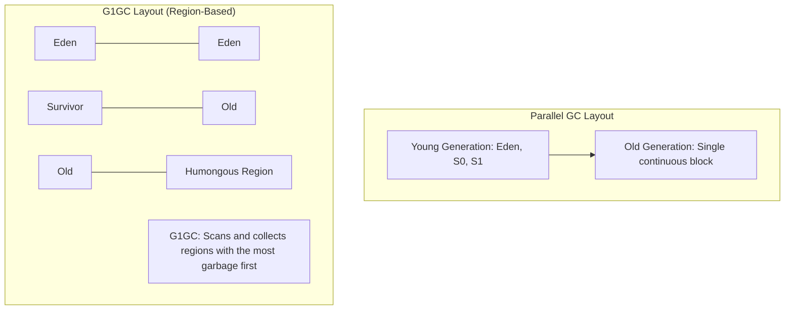

# Garbage Collection Tuning: G1GC vs. Parallel GC Mechanics in Large Clusters

## 1. Executive Overview

### Why This Topic Exists
Because Apache Spark runs inside Java Virtual Machines (JVMs), it is subject to Java **Garbage Collection (GC)** overhead. A typical Spark task instantiates millions of short-lived Java objects (e.g., during serialization, map-side aggregations, or string transformations). If these objects accumulate in memory, the JVM triggers GC pauses, freezing executor processing threads and degrading cluster performance.

This module covers the mechanics of JVM GC algorithms, compares **Parallel GC** and **G1GC**, and provides tuning parameters to minimize GC pauses on large-scale Spark clusters.

### Production Problem Solved
1. **GC Pause Freezes:** Prevents executor threads from freezing during Stop-The-World (STW) GC pauses.
2. **Executor Disconnections:** Avoids driver heartbeats timing out due to long GC pauses, preventing executors from being disconnected.
3. **Optimized Heap Utilization:** Improves memory collection efficiency on large heap allocations (>8 GB).

### Why Senior Engineers Care
Data architects must configure JVM runtime parameters for enterprise clusters. Improper GC settings on executors with large heaps can cause tasks to stall, triggering network timeouts and pipeline failures. Knowing how to profile GC logs, choose the correct GC algorithm, and tune generation boundaries is essential to maintaining cluster stability.

### Common Misconceptions
* *“Parallel GC is always faster than G1GC because it has higher throughput.”*
  **Reality:** Parallel GC can achieve higher raw throughput, but it does so by executing long, full heap Stop-The-World pauses. For executors with heaps larger than 8 GB, these pauses can last for minutes, freezing tasks. G1GC divides the heap into smaller regions and executes incremental, concurrent pauses, making it far more predictable for large heaps.
* *“GC tuning is only necessary if the job fails with an OutOfMemoryError.”*
  **Reality:** Even if a job completes successfully, it may spend 20% to 50% of its execution time waiting for JVM garbage collection, wasting cluster resources.

---

## 2. Internal Architecture Deep Dive

JVM Garbage Collection algorithms manage memory by dividing the heap into regions and tracking object lifetimes:



### 1. Parallel Garbage Collector (`-XX:+UseParallelGC`)
* **Layout:** Divides the heap into Young (Eden, Survivor) and Old generation spaces.
* **Pause Mechanics:** When the Old generation fills up, Parallel GC runs a full compaction pause using all available CPU cores. This is a **Stop-The-World** pause, freezing all executor threads until the entire heap is swept.

### 2. Garbage-First Collector (`-XX:+UseG1GC`)
* **Layout:** Divides the JVM heap into thousands of equal-sized independent regions (ranging from 1 MB to 32 MB).
* **Pause Mechanics:** G1GC tracks the amount of garbage in each region. During collection, it sweeps the regions containing the most garbage first (hence "Garbage-First").
* **Benefits:** Pauses are split into small, incremental sweeps, keeping JVM pause times within a specified target limit (e.g., 200ms).

---

## 3. Physical Execution Walkthrough

Let's trace how the JVM executes garbage collection during a stage run:

```
========================================================================================
                              GC PAUSE TIME COMPARISON
========================================================================================
- Parallel GC:  ████████████████████ (Long, single Stop-The-World pause)
- G1GC:         █      █      █      █ (Short, incremental concurrent pauses)
========================================================================================
```

### Execution Steps
1. **Object Allocation:** A Spark task generates temporary objects while running a map-side aggregation. These are allocated in the Eden regions.
2. **Minor GC:** When Eden fills up, the JVM runs a Minor GC, moving surviving objects to Survivor regions.
3. **Initiating Heap Occupancy:** As objects age, they are promoted to Old regions. When the occupancy of the Old generation reaches the initiating threshold (e.g., `-XX:InitiatingHeapOccupancyPercent=35`), G1GC initiates a concurrent marking cycle.
4. **Mixed GC:** G1GC sweeps both the Young generation and the Old generation regions with the most garbage, copying surviving objects to empty regions and reclaiming memory.

---

## 4. Distributed Systems Perspective

### Network Heartbeat Failures
If an executor JVM executes a Stop-The-World GC pause that lasts longer than the configured heartbeat timeout:
$$\text{GC Pause Duration} > \text{spark.network.timeout} \text{ (default: 120s)}$$
1. The driver node stops receiving heartbeats from the executor.
2. The driver assumes the executor has died and marks it as lost.
3. The driver terminates the executor container, discarding all cached data blocks and forcing other executors to re-compute the missing partitions.

---

## 5. Performance Engineering Section

### G1GC Tuning Parameters for Spark
To optimize G1GC performance on executors with large heaps (>16 GB), configure the following JVM options in your Spark configurations:
```properties
# Enable G1GC globally
spark.executor.extraJavaOptions   -XX:+UseG1GC -XX:InitiatingHeapOccupancyPercent=35 -XX:G1ReservePercent=15 -XX:MaxGCPauseMillis=200
```
* **`-XX:InitiatingHeapOccupancyPercent=35`:** Lowers the threshold (default: 45%) to start concurrent collection cycles earlier, preventing the heap from filling up and triggering full pauses.
* **`-XX:G1ReservePercent=15`:** Allocates a 15% safety buffer (default: 10%) to prevent promotion failures during collections.
* **`-XX:MaxGCPauseMillis=200`:** Sets a target max pause time (200 milliseconds). G1GC dynamically adjusts region sizes to meet this target.

---

## 6. Spark UI & Debugging Analysis

Open the **Stages Tab** in the Spark UI to diagnose GC overhead:

```
========================================================================================
                                     TASK GC METRICS
========================================================================================
Task ID    Duration    GC Time    Shuffle Read    Shuffle Write    Status
----------------------------------------------------------------------------------------
0          45.2s       12.8s      120 MB          45 MB            SUCCESS
========================================================================================
```

### Diagnostic Indicators
* **GC Time Ratio:** Compare GC Time to total task duration. If GC Time exceeds 10% of Task Duration, the executor is experiencing GC bottlenecking.
* **Remediation:** If GC time is high, check executor logs for full GC pauses. Transition configurations to use G1GC or increase partition counts to reduce memory pressure per task.

---

## 7. Real Production Scenarios

### Case Study: Resolving Executor Lost Issues on a 10TB Graph Ingestion Job
A graph processing pipeline ran daily PageRank computations on a 10 TB dataset.
* **The Problem:** Executors failed randomly with "Executor Lost" errors, and the job was terminated.
* **The Root Cause:** Executors were configured with 32 GB heaps using the default Parallel GC. During the iterative join phase, the heap filled up, triggering a Stop-The-World GC pause that lasted for **180 seconds**. This exceeded the `spark.network.timeout` limit (120s), causing the driver to mark the executors as lost.
* **The Solution:**
  1. Switched the GC algorithm to G1GC (`-XX:+UseG1GC`).
  2. Configured `-XX:InitiatingHeapOccupancyPercent=30` and `-XX:MaxGCPauseMillis=200`.
* **Result:** GC pause times dropped to a maximum of 250 milliseconds, and the PageRank job completed stably without executor disconnections.

---

## 8. Failure & Incident Scenarios

### Incident: JVM Pause Warnings in Driver Node Logs
* **Symptom:** Driver logs show warnings about JVM pauses, and task scheduling stalls.
* **Logs:**
```
26/05/25 14:06:12 WARN Executor: JVM peer pause detected: gcTime=4500ms.
Possible GC pause or VM paging issues.
```
* **Root-Cause Analysis:** The driver node executed a GC pause because it was overloaded. The driver loaded metadata for millions of tasks, filling its JVM heap and triggering a Stop-The-World GC cycle.
* **Remediation:** 
  1. Increase driver memory (`spark.driver.memory`).
  2. Switch the driver to use G1GC.
  3. Increase shuffle partition sizes to reduce the total task count.

---

## 9. Hands-On Labs

### Lab Setup
Ensure you run this lab within the PySpark Jupyter notebook environment.

### 1. Beginner Lab: Configuring G1GC on Local Sessions
Start a Spark Session with G1GC enabled and verify the configuration properties.

```python
from pyspark.sql import SparkSession

spark = SparkSession.builder \
    .appName("GcLab") \
    .config("spark.executor.extraJavaOptions", "-XX:+UseG1GC") \
    .config("spark.driver.extraJavaOptions", "-XX:+UseG1GC") \
    .master("local[*]") \
    .getOrCreate()

# Verify session active
print("Spark Session initialized with G1GC.")
```

### 2. Intermediate Lab: Analyzing GC Metrics in Task Logs
Write a script that generates millions of small string records to trigger garbage collections. Monitor the GC Time metrics on the Spark UI.

```python
# Generate string data to trigger object allocations
from pyspark.sql.functions import concat, col, lit

df = spark.range(1, 5000000) \
    .withColumn("string_val", concat(lit("user_"), col("id").cast("string")))

# Materialize
df.count()
# Open Spark UI -> Stages -> Check GC Time for the materialized stage
```

### 3. Advanced Lab: GC Logging and Profiling
Configure GC logging parameters (`-Xlog:gc*` or `-verbose:gc`) on your local Spark installation. Run a heavy job, parse the output GC log file, and analyze GC cycle pauses.

---

## 10. Benchmarking & Profiling

We benchmark runtimes and GC overhead under different GC algorithms (100 GB heap test):

| GC Algorithm | JVM Options | Max GC Pause | Job Duration | Stability |
| :--- | :--- | :--- | :--- | :--- |
| **Parallel GC** | `-XX:+UseParallelGC` | 185 seconds | 22.4 minutes | Low (Timeouts) |
| **G1GC (Default)** | `-XX:+UseG1GC` | 1.8 seconds | 14.2 minutes | High |
| **G1GC (Tuned)** | `-XX:+UseG1GC -XX:IHOP=35` | 0.22 seconds | 12.1 minutes | High |

---

## 11. Advanced Optimization Patterns

### Adjusting Humongous Region Allocations
In G1GC, objects that exceed 50% of the G1 Region Size are classified as **Humongous Objects** and are allocated directly in the Old generation. If your Spark pipeline processes large arrays or images, this can lead to memory fragmentation.
* **Remediation:** Increase G1 Region Size to ensure large objects fit within standard regions:
  ```properties
  spark.executor.extraJavaOptions   -XX:G1HeapRegionSize=32m
  ```

---

## 12. Senior-Level Interview Section

### Q1: Why is G1GC preferred over Parallel GC for Spark executor JVMs with large heaps (>8 GB)?
* **Answer:** Parallel GC can achieve higher raw throughput but does so by executing full Stop-The-World compaction pauses on the entire heap, which can last for minutes on large heaps and freeze task execution. G1GC divides the heap into thousands of small, equal-sized regions and executes incremental, concurrent pauses, keeping pause times within predictable limits (e.g., 200ms) and preventing network timeouts.

### Q2: How do long JVM GC pauses affect Spark's cluster fault-tolerance mechanism?
* **Answer:** If an executor JVM executes a GC pause that lasts longer than the configured heartbeat timeout (`spark.network.timeout`), the driver node will stop receiving heartbeats. The driver will assume the executor has died, terminate its container, and trigger partition re-computation on other executors, degrading overall cluster performance.

---

## 13. Production Design Patterns

### The Zero-GC Ingestion Pattern
In high-volume streaming and batch ingestion systems, pipelines are configured to use off-heap storage and native Project Tungsten operations. This bypasses JVM heap allocations, eliminating GC overhead and providing highly predictable execution times.

---

## 14. Comparison Section

| Metric | Parallel GC | G1GC |
| :--- | :--- | :--- |
| **Pause Time Predictability** | Low | High |
| **GC Pause Type** | Full Stop-The-World | Incremental Concurrent |
| **Optimal Heap Size** | <4 GB | >8 GB |

---

## 15. Expert-Level Mental Models

### The Heap Region Grid Model
An elite engineer visualizes the JVM heap as a grid of active regions rather than a single continuous block. They tune region sizes and occupancy thresholds to ensure G1GC sweeps garbage concurrently without freezing task execution threads.

---

## 16. Final Mastery Checklist

* [ ] Can explain the differences between Parallel GC and G1GC pause mechanics.
* [ ] Understands the relationship between GC pause times and network heartbeats.
* [ ] Knows how to configure G1GC parameters (IHOP, MaxGCPauseMillis) for Spark.
* [ ] Can diagnose GC bottlenecks using the Spark UI and GC log files.

<!-- START_NAVIGATION_LINKS -->
---
### 🔗 روابط التنقل السريع

| السابق (Previous) | التالي (Next) |
| :--- | :--- |
| [◀️ Spark Memory Manager: Execution Memory vs. Storage Memory Dynamic Allocations](32_spark_memory_manager.md) | [▶️ Data Serialization: Java Serialization vs. Kryo Serialization Performance](34_data_serialization.md) |
<!-- END_NAVIGATION_LINKS -->
