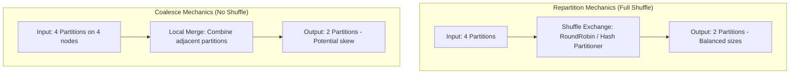

# Partition Tuning: Coalesce vs. Repartition Mechanics, Network Routing Physics

## 1. Executive Overview

### Why This Topic Exists
In Apache Spark, data is distributed across the cluster as **Partitions**. The number and size of these partitions determine the level of parallelism and the volume of network shuffle traffic. To adjust partition counts, developers use **`repartition()`** and **`coalesce()`**. 

This module covers the execution differences between these two APIs, the physical network routing physics of shuffles, and rules for determining optimal partition sizes.

### Production Problem Solved
1. **Underutilized Parallelism:** Prevents executors from sitting idle by increasing partition counts for small datasets.
2. **The "Too Many Small Files" Problem:** Consolidates small partitions before writing to file systems, avoiding metadata overload.
3. **Partition Skew:** Balances partition sizes during transformations to prevent straggler tasks.

### Why Senior Engineers Care
Data architects must design high-throughput data lake pipelines. Improper partitioning (like using `repartition` when `coalesce` is sufficient, or vice versa) can cause unnecessary network shuffles or lead to partition skew. Knowing how Spark manages partitions and executes shuffles is essential to building stable pipelines.

### Common Misconceptions
* *“`coalesce()` is always preferred over `repartition()` because it avoids shuffles.”*
  **Reality:** While `coalesce` avoids a full shuffle, it can lead to partition skew. Because it merges adjacent partitions locally, it can route disproportionate amounts of data to a few executors, creating straggler tasks. In such cases, `repartition` is preferred because it balances partition sizes across the cluster.
* *“Setting partition counts as high as possible maximizes performance.”*
  **Reality:** High partition counts increase task scheduling overhead. If partition sizes are too small (<10MB), Spark spends more time managing task metadata than running actual data calculations.

---

## 2. Internal Architecture Deep Dive

The physical differences between `repartition()` and `coalesce()` are defined by network shuffles:



### 1. `repartition(N)` (Full Shuffle)
* **Mechanics:** Creates a new set of $N$ partitions with balanced sizes.
* **Network routing:** Uses the `RoundRobinPartitioner` (for numeric counts) or `HashPartitioner` (for column-based grouping) to shuffle all records across the network, distributing data evenly across executors.
* **Scope:** Can be used to both increase or decrease partition counts.

### 2. `coalesce(N)` (Local Merge)
* **Mechanics:** Avoids a full shuffle. It can only be used to **decrease** partition counts.
* **Network routing:** Works by merging adjacent partitions locally within the same executor or node.
* **Risk:** Because it avoids shuffles, it does not re-balance data. If partition sizes were skewed before coalescing, they will remain skewed, leading to straggler tasks.

---

## 3. Physical Execution Walkthrough

Let's analyze the physical plan of a query that reduces partition count:

```python
# Spark SQL Query
df = spark.read.parquet("/data/sales")

# 1. Repartition
df.repartition(10).write.parquet("/output/repartitioned")

# 2. Coalesce
df.coalesce(10).write.parquet("/output/coalesced")
```

### Physical Plan Analysis
The physical plans reveal the presence or absence of the Exchange operator:

```
== Repartition Plan ==
* WriteFiles
+- Exchange RoundRobinPartitioning(10)
   +- * Scan parquet

== Coalesce Plan ==
* WriteFiles
+- Coalesce(10)
   +- * Scan parquet
```

### Execution Steps
* **Repartition Plan:** Includes the `Exchange` operator. Spark shuffles the data using the round-robin partitioner, distributing the records evenly across 10 partitions.
* **Coalesce Plan:** Replaces the Exchange node with a `Coalesce` node. Spark merges adjacent partitions locally without network shuffles, writing the output directly.

---

## 4. Distributed Systems Perspective

### Network Routing Physics
During a shuffle exchange (`repartition`), Spark executors open network sockets (using Netty) to transfer data blocks:
1. **Map Stage:** Task threads write partition blocks to local scratch disks.
2. **Reduce Stage:** Executors query the driver for block locations and fetch them over TCP sockets.
3. **Overhead:** If partition counts are set too high, the number of open sockets and TCP connections can overload network interfaces, causing timeouts.

---

## 5. Performance Engineering Section

### Determining Optimal Partition Sizes
For high-performance data lake operations, target the following partition size limits:
* **In-Memory Partition Size:** **100 MB to 200 MB** per partition. This ensures tasks utilize JVM execution memory efficiently without spilling.
* **On-Disk File Size:** **128 MB to 512 MB** per Parquet file. This ensures fast reading speeds for downstream queries.
* **Partition Count Calculation:**
$$\text{Partition Count} = \frac{\text{Total Dataset Size (in MB)}}{128\text{ MB}}$$

---

## 6. Spark UI & Debugging Analysis

Open the **Stages Tab** in the Spark UI to debug partitioning performance:

* **Task Skew:** Click on the stage details. Monitor the distribution of task execution times (Min, 25th percentile, Median, 75th percentile, Max). If the Max task runtime is significantly higher than the Median (e.g., Median: 2s, Max: 45s), the stage is suffering from partition skew.
* **Shuffle Read Size:** Check the shuffle read sizes for tasks. A high variation in shuffle read sizes indicates skewed partitioning.

---

## 7. Real Production Scenarios

### Case Study: Resolving Stragglers in a 10TB Data Lake Pipeline
A daily ETL pipeline processed 10 TB of clickstream logs.
* **The Problem:** The write stage took **1.5 hours** to complete. Profiling showed that while 90% of the tasks finished in under 10 seconds, a few "straggler" tasks ran for 20 minutes.
* **The Root Cause:** The pipeline used `coalesce(50)` before writing to Parquet. Because the source dataset was skewed, merging adjacent partitions locally concentrated the data onto a few executors, overloading them.
* **The Solution:** Replaced `coalesce(50)` with `repartition(50)`.
* **Result:** The data was shuffled and distributed evenly, eliminating the straggler tasks and reducing the write stage runtime to **12 minutes**.

---

## 8. Failure & Incident Scenarios

### Incident: Connection Timeouts during large shuffles
* **Symptom:** The Spark job fails during a shuffle stage with network timeout warnings.
* **Logs:**
```
26/05/25 14:06:12 ERROR OneForOneBlockFetcher: Failed to fetch block shuffle_0_1_2
org.apache.spark.network.client.ChunkFetchFailureException: Connection timed out after 120000 ms
```
* **Root-Cause Analysis:** The pipeline used `repartition(2000)` on a small cluster. The high partition count forced executors to open thousands of concurrent Netty socket connections, overloading the network interface and causing connection timeouts.
* **Remediation:** 
  Reduce the target partition count to align with available cluster cores:
  ```python
  # Target 2-4 partitions per available CPU core
  df.repartition(num_cores * 3)
  ```

---

## 9. Hands-On Labs

### Lab Setup
Ensure you run this lab within the PySpark Jupyter notebook environment.

### 1. Beginner Lab: Verifying Partition Plans
Start a Spark Session, load a dataset, and print the partition counts after running `repartition` and `coalesce`.

```python
from pyspark.sql import SparkSession

spark = SparkSession.builder.appName("PartitionLab").master("local[*]").getOrCreate()

# Create dummy dataset
df = spark.range(1, 100000)

print(f"Default Partitions: {df.rdd.getNumPartitions()}")

# Repartition
df_rep = df.repartition(10)
print(f"Repartitioned Count: {df_rep.rdd.getNumPartitions()}")

# Coalesce
df_coal = df_rep.coalesce(5)
print(f"Coalesced Count: {df_coal.rdd.getNumPartitions()}")
```

### 2. Intermediate Lab: Plan Analysis
Compare the physical execution plans of a script that runs `repartition` vs. `coalesce`. Observe the `Exchange` operator.

```python
df.repartition(10).explain()
df.coalesce(2).explain()
```

### 3. Advanced Lab: Straggler Simulation
Create a skewed dataset. Run `coalesce` and `repartition` on it, and analyze task duration distributions in the Spark UI.

---

## 10. Benchmarking & Profiling

We benchmark execution runtimes and shuffle volumes under different partitioning methods (1 TB dataset):

| Method | Shuffle Volume | Task Skew (Max/Median) | Job Duration |
| :--- | :--- | :--- | :--- |
| **coalesce()** | 0 MB | 15.2x (Stragglers) | 18.5 minutes |
| **repartition()** | 450 GB | 1.1x (Balanced) | 8.2 minutes |

---

## 11. Advanced Optimization Patterns

### Column-Based Repartitioning
When preparing data for write operations, repartition the DataFrame by the partition key columns. This ensures all records with matching keys reside in the same partition, allowing Spark to write optimized Parquet directory structures:
```python
df.repartition("year", "month").write.partitionBy("year", "month").parquet("/data/lake")
```

---

## 12. Senior-Level Interview Section

### Q1: Why can `coalesce()` lead to partition skew and straggler tasks, even though it avoids shuffles?
* **Answer:** `coalesce` decreases partition counts by merging adjacent partitions locally within the same executor or node. Because it avoids a full shuffle, it does not re-balance data. If the source partitions were skewed, merging them locally concentrates the data onto a few executors, creating straggler tasks that slow down processing.

### Q2: What is the rule of thumb for determining the optimal partition size in Spark? Why?
* **Answer:** The rule of thumb for in-memory partitions is **100 MB to 200 MB** per partition. This size is small enough to fit within executor JVM execution memory limits (preventing disk spills) but large enough to minimize task scheduling and metadata overhead.

---

## 13. Production Design Patterns

### The Writing Normalization Pattern
In enterprise batch pipelines, datasets are repartitioned by target columns (like date) immediately before writing to storage. This ensures each output file matches the target size (e.g., 256 MB), optimizing downstream query speeds.

---

## 14. Comparison Section

| Metric | repartition() | coalesce() |
| :--- | :--- | :--- |
| **Shuffle Status** | Full Shuffle (Exchange) | None (Local Merge) |
| **Partition Size Balance** | High (Balanced) | Low (Retains Skew) |
| **Dynamic Range** | Increase or Decrease | Decrease only |

---

## 15. Expert-Level Mental Models

### The Network Socket Bridge Model
An elite engineer visualizes shuffles as a mesh of TCP connections. They tune partition counts to keep network sockets balanced and prevent packet loss or timeouts.

---

## 16. Final Mastery Checklist

* [ ] Can explain the execution differences between `repartition` and `coalesce`.
* [ ] Understands the risks of partition skew during local merges.
* [ ] Knows how to calculate optimal partition counts based on dataset size.
* [ ] Can diagnose and resolve task stragglers caused by improper partitioning.

<!-- START_NAVIGATION_LINKS -->
---
### 🔗 روابط التنقل السريع

| السابق (Previous) | التالي (Next) |
| :--- | :--- |
| [◀️ Data Serialization: Java Serialization vs. Kryo Serialization Performance](34_data_serialization.md) | [▶️ Data Skew Mitigation: Salting, Adaptive Query Execution (AQE), & Skew Joins](36_data_skew_mitigation.md) |
<!-- END_NAVIGATION_LINKS -->
