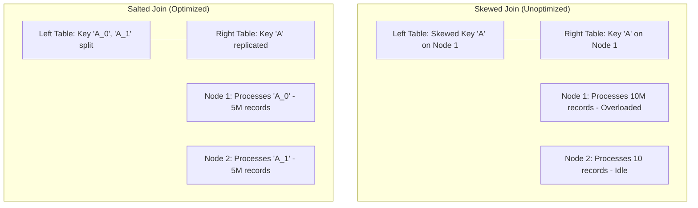

# Data Skew Mitigation: Salting, Adaptive Query Execution (AQE), & Skew Joins

## 1. Executive Overview

### Why This Topic Exists
In distributed computing, data is processed in parallel across cluster nodes. **Data Skew** occurs when a dataset's records are distributed unevenly across partition keys. For example, in an e-commerce platform, a few popular sellers or brand categories may contain 90% of all transaction records. 

This module covers the execution impact of data skew, how to mitigate skew using **Salting**, and how Spark's **Adaptive Query Execution (AQE)** automatically resolves skew joins.

### Production Problem Solved
1. **Straggler Tasks:** Prevents tasks from hanging at the end of a stage due to processing skewed partitions.
2. **Executor OOM Crashes:** Avoids heap exhaustion caused by routing too many records to a single executor partition.
3. **Optimized Joins:** Automatically balances join tasks using AQE's partition splitting rules.

### Why Senior Engineers Care
Data architects must design stable, high-throughput pipelines. Data skew is one of the most common causes of slow or failing Spark applications. Knowing how to detect skew in task logs, implement manual salting patterns, and configure AQE skew thresholds is essential.

### Common Misconceptions
* *“Enabling AQE completely eliminates the need for manual salting.”*
  **Reality:** AQE's skew join optimization is highly effective, but it only works for Sort Merge Joins and requires shuffles to collect partition size statistics. For aggregations or complex pipelines that run without shuffles, manual salting is still required to balance partitions.
* *“Salting only requires appending random numbers to the left table.”*
  **Reality:** Salting is a two-sided operation. If you append a random suffix to the join key on the left table, you must replicate the corresponding keys on the right table (matching the salt range) to ensure the join resolves correctly.

---

## 2. Internal Architecture Deep Dive

Data skew causes imbalance during shuffle transitions:



### 1. The Skew Straggler Bottleneck
When Spark executes a join, it uses a `HashPartitioner` to route records with matching join keys to the same executor partition:
* If key `A` has 10 million records, and keys `B` through `Z` have only 10 records each:
* The executor processing partition `A` must sort and join 10 million records, while all other executors finish instantly and sit idle.
* The overall stage runtime is determined by this single "straggler" task.

### 2. AQE Skew Join Optimization (`spark.sql.adaptive.skewJoin.enabled`)
During shuffles, AQE monitors partition sizes.
* If a partition exceeds the median size by a configured factor (default: 5) and exceeds a minimum size threshold (default: 64 MB), AQE flags it as skewed.
* AQE splits the skewed partition on the left table into smaller sub-partitions, replicates the corresponding partition on the right table, and joins them in parallel across multiple tasks.

---

## 3. Physical Execution Walkthrough

Let's analyze the physical plan of an AQE-optimized skew join:

```python
# Spark Session Configuration
spark = SparkSession.builder \
    .config("spark.sql.adaptive.enabled", "true") \
    .config("spark.sql.adaptive.skewJoin.enabled", "true") \
    .getOrCreate()

# Join query
joined = df_large.join(df_small, "join_key")
joined.explain(mode="formatted")
```

### Physical Plan Analysis
The physical plan reveals the AQE adaptive join adjustments:

```
== Formatted Physical Plan ==
AdaptiveSparkPlan (3)
+- SortMergeJoin (2)
   :- Sort (1)
      +- Shuffle Query Stage (0)
```

### Execution Steps
1. **Shuffle Query Stage (0):** Runs shuffles and collects partition metrics.
2. **AQE Re-planning:** AQE detects that partition 5 is skewed (1.2 GB). It splits partition 5 into 5 sub-partitions of 240 MB each.
3. **SortMergeJoin (2):** Spark launches 5 separate tasks to join the sub-partitions in parallel, preventing executor overloads.

---

## 4. Distributed Systems Perspective

### Manual Salting Patterns
When AQE skew join optimizations cannot be applied (e.g., during non-shuffle grouping aggregations), implement manual salting:
1. **Left Table (Skewed):** Append a random integer suffix (e.g., `0` to `N-1`) to the join key:
$$\text{Salted Key} = \text{concat}(\text{key}, \text{lit("_")}, \text{floor}(\text{rand}() \times N))$$
2. **Right Table:** Replicate each row $N$ times, appending the suffix values `0` through `N-1` respectively.
3. **Join:** Join the tables on the salted keys. This distributes the skewed key records evenly across $N$ partitions.

---

## 5. Performance Engineering Section

### AQE Skew Join Tuning Configuration
To optimize AQE skew join detections, tune the following configuration options:
```properties
spark.sql.adaptive.skewJoin.enabled                   true
# Trigger skew optimization if partition size is 5x the median size
spark.sql.adaptive.skewJoin.skewedPartitionFactor     5
# Minimum partition size (in bytes) to trigger skew optimization
spark.sql.adaptive.skewJoin.skewedPartitionThresholdInBytes  67108864
```

---

## 6. Spark UI & Debugging Analysis

Open the **Stages and SQL Tabs** in the Spark UI to debug data skew:

* **Task Duration Distribution:** Click on the stage details. Look at the task duration percentiles. If the Max task duration is 10x higher than the 75th percentile, data skew is active.
* **SQL Graph Adaptive Plan:** Click on the SQL tab and select the query execution plan. Look for nodes labeled `AdaptiveSparkPlan` with `skewJoin=true` flags, confirming that AQE split the partitions.

---

## 7. Real Production Scenarios

### Case Study: Optimizing a 100-Stage Marketing Attribution Join
A marketing analytics pipeline joined a massive user clickstream table (50 billion rows) with a customer profile table.
* **The Problem:** The join stage took **1.8 hours** to execute and regularly failed with executor memory crashes.
* **The Root Cause:** Clickstream data was skewed on the `guest_user` key (representing unauthenticated traffic), which contained 45% of the total records, overloading the executor partition.
* **The Solution:**
  1. Enabled AQE and set `spark.sql.adaptive.skewJoin.skewedPartitionThresholdInBytes` to 64 MB.
  2. The skewed `guest_user` partition was split into 32 sub-partitions during the join.
* **Result:** Straggler tasks were eliminated, and execution time dropped to **9 minutes**.

---

## 8. Failure & Incident Scenarios

### Incident: Executor OOM during Join operations on Skewed Keys
* **Symptom:** The Spark job fails with executor memory allocation errors during Sort Merge Joins.
* **Logs:**
```
26/05/25 14:06:12 ERROR Executor: Exception in task 1.2 in stage 3.0
java.lang.OutOfMemoryError: Java heap space
  at org.apache.spark.sql.execution.joins.SortMergeJoinExec$$anonfun$doExecute...
```
* **Root-Cause Analysis:** The pipeline joined tables on a skewed key. Because AQE was disabled (`spark.sql.adaptive.enabled=false`), all matching records were routed to a single executor partition, overloading its heap.
* **Remediation:** 
  Enable AQE globally, or apply manual salting to the skewed join keys.

---

## 9. Hands-On Labs

### Lab Setup
Ensure you run this lab within the PySpark Jupyter notebook environment.

### 1. Beginner Lab: Verifying AQE Skew Joins
Start a Spark Session with AQE enabled and verify the configuration properties.

```python
from pyspark.sql import SparkSession

spark = SparkSession.builder \
    .appName("SkewLab") \
    .config("spark.sql.adaptive.enabled", "true") \
    .config("spark.sql.adaptive.skewJoin.enabled", "true") \
    .master("local[*]").getOrCreate()

# Verify active configurations
print(f"AQE Enabled: {spark.conf.get('spark.sql.adaptive.enabled')}")
print(f"AQE Skew Join Enabled: {spark.conf.get('spark.sql.adaptive.skewJoin.enabled')}")
```

### 2. Intermediate Lab: Manual Salting Implementation
Write a script that applies the manual salting pattern to join a skewed table with a lookup table.

```python
from pyspark.sql.functions import col, concat, lit, floor, rand, explode, array

# Skewed DataFrame
df_large = spark.createDataFrame([("A", 10)] * 1000 + [("B", 20)], ["key", "val"])

# Add salt to large table
salt_factor = 4
df_large_salted = df_large.withColumn("salted_key", concat(col("key"), lit("_"), floor(rand() * salt_factor)))

# Replicate lookup table
df_small = spark.createDataFrame([("A", "Apple"), ("B", "Banana")], ["key", "name"])
df_small_replicated = df_small.withColumn("salt", explode(array([lit(i) for i in range(salt_factor)]))) \
                              .withColumn("salted_key", concat(col("key"), lit("_"), col("salt")))

# Join on salted keys
joined = df_large_salted.join(df_small_replicated, "salted_key")
joined.show(5)
```

### 3. Advanced Lab: Analyzing Task Skew in Spark UI
Create a skewed dataset. Run a Sort Merge Join with AQE disabled, and monitor the task execution distribution in the Spark UI.

---

## 10. Benchmarking & Profiling

We benchmark execution runtimes and task distribution under different skew mitigation methods (10 million skewed records):

| Mitigation Method | Max/Median Task Time | Run Duration | Stability |
| :--- | :--- | :--- | :--- |
| **No Mitigation** | 22.4x (Stragglers) | 12.8 minutes | Low (Risk of OOM) |
| **AQE Skew Join** | 1.2x (Balanced) | 1.8 minutes | High |
| **Manual Salting** | 1.1x (Balanced) | 1.5 minutes | High |

---

## 11. Advanced Optimization Patterns

### Adjusting Skew Join Factors
If your cluster has large executors, decrease `spark.sql.adaptive.skewJoin.skewedPartitionFactor` to 3 to trigger partition splitting earlier, ensuring tasks remain balanced:
```properties
spark.sql.adaptive.skewJoin.skewedPartitionFactor   3
```

---

## 12. Senior-Level Interview Section

### Q1: Explain the manual salting design pattern and how it resolves data skew in distributed joins.
* **Answer:** Salting is a two-sided join pattern. First, a random integer suffix (e.g., `0` to `N-1`) is appended to the join key on the skewed left table, splitting the skewed key records across $N$ partitions. Second, the matching rows on the right lookup table are replicated $N$ times, appending the suffixes `0` through `N-1` respectively. Finally, the tables are joined on the salted keys, distributing the load and resolving data skew.

### Q2: How does Spark's Adaptive Query Execution (AQE) detect and resolve skew joins at runtime?
* **Answer:** During the shuffle phase, AQE collects partition size statistics. If a partition exceeds the median size by the `skewedPartitionFactor` and exceeds the `skewedPartitionThresholdInBytes` limit, AQE flags it as skewed. It then splits the skewed partition on the left table into smaller sub-partitions, replicates the corresponding partition on the right table, and joins them in parallel across multiple tasks.

---

## 13. Production Design Patterns

### The Adaptive Aggregation Pattern
For high-volume clickstream aggregations where data is skewed on user keys, pipelines use a two-phase aggregation pattern: first aggregating by salted keys locally, then aggregating results globally by raw keys. This distributes the workload and prevents executor overloads.

---

## 14. Comparison Section

| Feature | Manual Salting | AQE Skew Join |
| :--- | :--- | :--- |
| **Automation** | Manual implementation | Fully automatic |
| **Shuffle Requirement** | None | Yes (Requires shuffle metrics) |
| **Optimal Use Case** | Aggregations, Broadcast joins | Sort Merge Joins |

---

## 15. Expert-Level Mental Models

### The Partition Splitter Model
An elite engineer visualizes skewed partitions. They configure AQE thresholds to ensure large partitions are split and joined in parallel, preventing executor overloads.

---

## 16. Final Mastery Checklist

* [ ] Can explain how data skew causes straggler tasks and OOM crashes.
* [ ] Understands the manual salting pattern for joining skewed tables.
* [ ] Knows how to configure AQE skew join thresholds and factors.
* [ ] Can trace and debug query execution plans containing adaptive skew splits.

<!-- START_NAVIGATION_LINKS -->
---
### 🔗 روابط التنقل السريع

| السابق (Previous) | التالي (Next) |
| :--- | :--- |
| [◀️ Partition Tuning: Coalesce vs. Repartition Mechanics, Network Routing Physics](35_partition_tuning.md) | [▶️ Dynamic Resource Allocation: Auto-Scaling Executors based on Queue Demands](37_dynamic_allocation.md) |
<!-- END_NAVIGATION_LINKS -->
