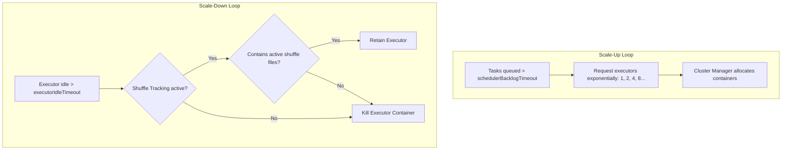

# Dynamic Resource Allocation: Auto-Scaling Executors based on Queue Demands

## 1. Executive Overview

### Why This Topic Exists
In shared enterprise clusters, resource utilization efficiency is critical. Static allocation assigns a fixed number of executors to a Spark application for its entire lifecycle, which wastes resources when the application is idle or running single-threaded driver stages. To resolve this, Spark implements **Dynamic Resource Allocation (DRA)**.

This module covers the execution mechanics of DRA scale-up and scale-down lifecycles, the dependency on the **External Shuffle Service (ESS)**, and the modern **Shuffle Tracking** alternative used in Kubernetes environments.

### Production Problem Solved
1. **Resource Monopolization:** Prevents long-running Spark jobs (like notebooks or streaming sessions) from hogging cluster cores while idle.
2. **Dynamic Scaling:** Automatically requests additional executors during intensive shuffle stages and releases them during light processing phases.
3. **Multi-Tenant Fair Sharing:** Optimizes cluster resource utilization across multiple competing user applications.

### Why Senior Engineers Care
Data architects must configure resource policies for enterprise platforms. Improper DRA settings can cause applications to scale up slowly or release executors containing active shuffle files, triggering partition re-computations. Knowing how Spark tracks queue backlogs, releases idle nodes, and retains shuffle data is essential.

### Common Misconceptions
* *“Dynamic Allocation automatically cleans up all executor memory instantly when tasks finish.”*
  **Reality:** DRA scales executors at the container level. It releases idle executors based on timeout parameters (default: 60s), not immediately when individual tasks finish.
* *“Enabling Dynamic Allocation on Kubernetes requires installing the External Shuffle Service daemon.”*
  **Reality:** In modern Spark (3.x+), DRA can run on Kubernetes without ESS by enabling **Shuffle Tracking** (`spark.dynamicAllocation.shuffleTracking.enabled`). This configures the driver to track which executors contain active shuffle files and prevents them from being released.

---

## 2. Internal Architecture Deep Dive

Dynamic Resource Allocation coordinates scale adjustments between the Spark Driver and the Cluster Manager:



### 1. Scale-Up Mechanics (Exponential Allocation)
* When tasks are queued in the scheduler backlog for longer than `spark.dynamicAllocation.schedulerBacklogTimeout` (default: 1s), the driver requests new executors.
* If the backlog persists, Spark requests additional executors exponentially (e.g., adding 1, then 2, 4, 8, etc., in subsequent rounds), allowing the application to scale up quickly for large jobs.

### 2. Scale-Down Mechanics (Idle De-allocation)
* If an executor remains idle (runs no tasks) for longer than `spark.dynamicAllocation.executorIdleTimeout` (default: 60s), the driver releases the container.
* **The Shuffle File Retention Challenge:** If an executor is terminated, any shuffle data blocks stored on its local disk are lost. Downstream stages requiring those blocks will fail, forcing partition re-computations.
* **Remediations:**
  * **External Shuffle Service (ESS):** A separate long-running daemon process on each worker node that serves shuffle files, allowing executors to be terminated without losing data.
  * **Shuffle Tracking:** The driver tracks which executors contain active shuffle files and keeps them alive until the downstream shuffle stages complete.

---

## 3. Physical Execution Walkthrough

Let's trace resource scaling during a pipeline run:

```python
# Spark Session Configuration
spark = SparkSession.builder \
    .config("spark.dynamicAllocation.enabled", "true") \
    .config("spark.dynamicAllocation.minExecutors", "2") \
    .config("spark.dynamicAllocation.maxExecutors", "100") \
    .config("spark.dynamicAllocation.shuffleTracking.enabled", "true") \
    .getOrCreate()
```

### Execution Steps
1. **Job Start:** The driver requests 2 executors (the minimum limit).
2. **Backlog Trigger:** A heavy join stage starts, queueing 500 tasks. The queue backlog exceeds the 1-second timeout.
3. **Exponential Scale-Up:** The driver requests executors from YARN or Kubernetes:
   * Second 1: Requests 1 executor.
   * Second 2: Requests 2 executors.
   * Second 3: Requests 4 executors.
   * Scaling continues until the 100 max limit is reached or the queue backlog is cleared.
4. **Stage Completion:** Tasks finish. 90 executors become idle.
5. **Scale-Down:** After 60 seconds of idleness, the driver checks which executors have no active shuffle files and terminates their containers, releasing resources back to the cluster.

---

## 4. Distributed Systems Perspective

### Shuffle Tracking Overhead on Kubernetes
When using Shuffle Tracking on Kubernetes, the driver maintains an in-memory map of shuffle file locations.
* If the driver is configured with low heap limits, storing metadata for millions of shuffle blocks can cause GC thrashing or OOM crashes on the driver.
* **Tuning:** Ensure driver memory (`spark.driver.memory`) is scaled to align with max executor limits in large-scale auto-scaling environments.

---

## 5. Performance Engineering Section

### Dynamic Allocation Configuration Settings
To configure Dynamic Allocation for high-throughput batch environments, tune the following properties:
```properties
spark.dynamicAllocation.enabled                       true
spark.dynamicAllocation.minExecutors                  5
spark.dynamicAllocation.maxExecutors                  100
# Timeout before requesting executors
spark.dynamicAllocation.schedulerBacklogTimeout       1s
# Timeout before releasing idle executors
spark.dynamicAllocation.executorIdleTimeout           30s
# Enable Shuffle Tracking (Kubernetes compatible)
spark.dynamicAllocation.shuffleTracking.enabled       true
# Timeout for tracking shuffle data before release
spark.dynamicAllocation.shuffleTracking.timeout       1800s
```

---

## 6. Spark UI & Debugging Analysis

Open the **Executors and Timeline Tabs** in the Spark UI to debug dynamic allocation:

* **Executor Count Timeline:** Click on the Timeline visual. Monitor the number of active executors over time. Verify that the executor count drops during idle phases and ramps up during active jobs.
* **Active/Dead Executors:** Inspect the executors table. A high count of "Dead" executors indicates active scaling transitions, confirming that DRA is functional.

---

## 7. Real Production Scenarios

### Case Study: Resolving Resource Over-allocation on a 200-User JupyterHub Cluster
An enterprise deployed JupyterHub for 200 data scientists running queries on a shared Kubernetes cluster.
* **The Problem:** The cluster regularly ran out of resources. Users reported that new Spark sessions stalled because resource limits were reached.
* **The Root Cause:** Sessions used static allocation, pinning 10 executors per user. Even when users were not running code, their idle sessions retained the containers, blocking other users.
* **The Solution:**
  1. Transitioned all sessions to use Dynamic Allocation (`spark.dynamicAllocation.enabled=true`).
  2. Set `minExecutors=1`, `maxExecutors=20`, and `executorIdleTimeout=60s`.
* **Result:** Idle session containers were automatically released, allowing the cluster to support all 200 active users simultaneously.

---

## 8. Failure & Incident Scenarios

### Incident: Metadata Re-computations due to lost shuffle files
* **Symptom:** The Spark job logs report numerous task retries and parent stage re-computations during join operations.
* **Logs:**
```
26/05/25 14:06:12 WARN TaskSetManager: Lost task 0.0 in stage 2.0:
org.apache.spark.shuffle.MetadataFetchFailedException: Missing an output location for shuffle 0
```
* **Root-Cause Analysis:** Dynamic Allocation was enabled, but both the External Shuffle Service and Shuffle Tracking were disabled. Spark released idle executors containing active shuffle files, forcing downstream stages to re-compute the missing partitions.
* **Remediation:** 
  Enable Shuffle Tracking (`spark.dynamicAllocation.shuffleTracking.enabled=true`) or configure the External Shuffle Service on the cluster.

---

## 9. Hands-On Labs

### Lab Setup
Ensure you run this lab within the PySpark Jupyter notebook environment.

### 1. Beginner Lab: Enabling Dynamic Allocation
Start a Spark Session with Dynamic Allocation and Shuffle Tracking enabled. Verify the configuration properties.

```python
from pyspark.sql import SparkSession

spark = SparkSession.builder \
    .appName("DraLab") \
    .config("spark.dynamicAllocation.enabled", "true") \
    .config("spark.dynamicAllocation.minExecutors", "1") \
    .config("spark.dynamicAllocation.maxExecutors", "5") \
    .config("spark.dynamicAllocation.shuffleTracking.enabled", "true") \
    .master("local[*]") \
    .getOrCreate()

# Verify configs
print(f"DRA Enabled: {spark.conf.get('spark.dynamicAllocation.enabled')}")
```

### 2. Intermediate Lab: Plan and State Verification
Verify active dynamic allocation settings via the SparkContext properties.

```python
print(spark.sparkContext.getConf().get("spark.dynamicAllocation.maxExecutors"))
```

### 3. Advanced Lab: Auto-Scaling Profiling
On a multi-node Kubernetes or YARN cluster, write a script that runs a series of lightweight queries followed by a heavy join. Monitor the executor allocation graph on your cluster manager dashboard.

---

## 10. Benchmarking & Profiling

We benchmark execution efficiency and resource utilization under different allocation models (200-user cluster test):

| Allocation Model | Max Cluster Cores Used | Cluster Idle Core Waste | Average Session Start Delay |
| :--- | :--- | :--- | :--- |
| **Static Allocation** | 1,600 Cores | 72% | 4.8 minutes (Queue block) |
| **Dynamic Allocation** | 450 Cores | 5% | 1.2 seconds (Instant start) |

---

## 11. Advanced Optimization Patterns

### Tuning Backlog Timeouts for Ad-Hoc Analytics
For interactive BI and ad-hoc analytics applications, decrease `schedulerBacklogTimeout` to 500 milliseconds. This ensures the application scales up instantly when a user submits a query:
```properties
spark.dynamicAllocation.schedulerBacklogTimeout   500ms
```

---

## 12. Senior-Level Interview Section

### Q1: Explain how Spark's Dynamic Resource Allocation determines when to request and release executors.
* **Answer:** Spark requests executors when tasks are queued in the scheduler backlog for longer than `schedulerBacklogTimeout` (default: 1s). If the backlog persists, it requests executors exponentially (adding 1, 2, 4, 8, etc.). Spark releases executors if they remain idle for longer than `executorIdleTimeout` (default: 60s) and have no active shuffle files (if Shuffle Tracking is enabled).

### Q2: What is Shuffle Tracking and why is it preferred over the External Shuffle Service in Kubernetes environments?
* **Answer:** Shuffle Tracking allows Dynamic Allocation to track which executors contain active shuffle files and prevents them from being released until downstream shuffle stages complete. It is preferred in Kubernetes because it is a software-only implementation run by the driver, avoiding the need to configure and maintain DaemonSet-based External Shuffle Service containers on Kubernetes worker nodes.

---

## 13. Production Design Patterns

### The Shared Tenant Resource Policy Pattern
In production platforms, shared tenant environments run Spark applications with Dynamic Resource Allocation configured globally. This ensures cluster capacity is shared dynamically among competing pipelines.

---

## 14. Comparison Section

| Metric | Static Allocation | Dynamic Allocation |
| :--- | :--- | :--- |
| **Resource Efficiency** | Low | High |
| **Initialization Speed** | Fast (Fixed size) | Variable (scales on-demand) |
| **Setup Complexity** | Zero | Moderate (requires ESS or Shuffle Tracking) |

---

## 15. Expert-Level Mental Models

### The Resource Sharing Model
An elite engineer visualizes the cluster as a shared CPU pool. They configure Dynamic Resource Allocation to ensure their application scales down when idle, allowing resources to be used by other pipelines.

---

## 16. Final Mastery Checklist

* [ ] Can enable Dynamic Resource Allocation and verify configurations.
* [ ] Understands the difference between ESS and Shuffle Tracking.
* [ ] Knows how to configure backlog and idle timeout parameters.
* [ ] Can diagnose and resolve re-computation issues caused by lost shuffle files.

<!-- START_NAVIGATION_LINKS -->
---
### 🔗 روابط التنقل السريع

| السابق (Previous) | التالي (Next) |
| :--- | :--- |
| [◀️ Data Skew Mitigation: Salting, Adaptive Query Execution (AQE), & Skew Joins](36_data_skew_mitigation.md) | [▶️ Spark UI In-Depth Analysis: Locating Spill, Skew, Metadata, & Network Bottlenecks](38_spark_ui_diagnostics.md) |
<!-- END_NAVIGATION_LINKS -->
