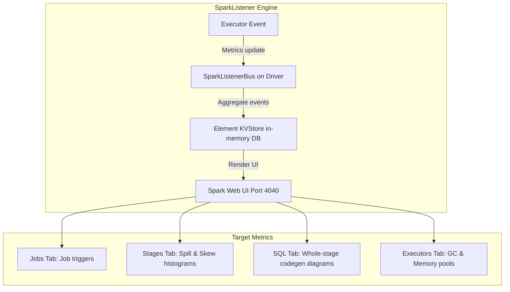

# Spark UI In-Depth Analysis: Locating Spill, Skew, Metadata, & Network Bottlenecks

## 1. Executive Overview

### Why This Topic Exists
When a Spark application runs slowly or crashes, the code itself may look correct. Diagnosing performance issues in a distributed system requires analyzing execution metrics. Spark provides the **Spark UI** as the primary diagnostic tool.

This module covers how to profile the Spark UI, locate memory spills and data skew, detect metadata overheads, and analyze network shuffle bottlenecks.

### Production Problem Solved
1. **Inefficient Processing:** Pinpoints exactly which stage or task is slowing down a pipeline.
2. **Resource Exhaustion:** Identifies disk spills and garbage collection bottlenecks before they cause OOM crashes.
3. **Network Saturation:** Profiles network fetch wait times during large shuffle stages.

### Why Senior Engineers Care
Principal engineers must debug complex performance anomalies across multi-tenant production clusters. Knowing how to read task histograms, interpret physical execution plans in the SQL tab, and translate metric correlations into actionable optimizations is essential.

### Common Misconceptions
* *“The Jobs tab is the only place to verify task progress.”*
  **Reality:** The Jobs tab only shows progress percentages. Resolving performance bottlenecks requires drilling down into the **Stages** and **SQL** tabs to analyze task duration distributions, memory spills, and join execution graphs.
* *“Task Serialization time is always negligible.”*
  **Reality:** If you partition your dataset into thousands of tiny tasks, the time spent serializing task metadata on the driver and deserializing it on executors can exceed actual processing times.

---

## 2. Internal Architecture Deep Dive

The Spark UI collects and organizes execution metrics via the **SparkListener** architecture:



### 1. The SparkListener Bus
* As tasks execute, executors send metrics updates (e.g., CPU time, shuffle bytes, GC times) back to the driver.
* The driver's `SparkListenerBus` aggregates these events and stores them in an in-memory database (`ElementKVStore`).
* The Web UI reads this store to render the dashboards on port `4040`.

### 2. High-Priority Diagnostic tabs
* **SQL Tab:** Shows the Catalyst-generated physical execution plan. Each box represents a physical operator (e.g., `HashAggregate`, `SortMergeJoin`), detailing input and output row counts.
* **Stages Tab:** Provides task histograms (Min, 25th, Median, 75th, Max) for execution times, memory spills, and shuffle sizes.
* **Executors Tab:** Shows GC overhead, memory utilization, and active task counts for each executor node.

---

## 3. Physical Execution Walkthrough

Let's trace how to locate a memory spill using the Stages tab:

```
========================================================================================
                          STAGES TAB - MEMORY SPILL METRICS
========================================================================================
Stage ID: 3 (SortMergeJoin)
- Spill (Memory):   12.5 GB
- Spill (Disk):     1.8 GB
- Shuffle Write:    2.4 GB
========================================================================================
```

### Diagnostic Analysis Steps
1. **Identify Spill:** Open the Stages tab. If you see active values under **Spill (Memory)** and **Spill (Disk)**, the executor ran out of execution memory during that stage.
2. **Calculate Spill Ratio:** Divide the Memory Spill by the Disk Spill. Here, 12.5 GB of in-memory data was compressed and written to 1.8 GB of local disk space.
3. **Locate the Cause:** Click on the stage description. Check the physical operator details to determine if the spill was caused by a Sort Merge Join or a GroupBy aggregation.
4. **Remediation:** Increase executor memory, reduce partition sizes, or optimize the join strategy (e.g., using a Broadcast Hash Join).

---

## 4. Distributed Systems Perspective

### Task Duration Histogram Diagnostics
Data skew is diagnosed by comparing task duration percentiles:

```
========================================================================================
                                TASK DURATION HISTOGRAM
========================================================================================
Metric      Min      25th      Median      75th      Max
----------------------------------------------------------------------------------------
Duration    1.2s     1.5s      1.8s        2.1s      45.8s  <-- Skew/Straggler detected
========================================================================================
```

* **Analysis:** If the **Max** task duration is significantly higher than the **75th percentile** and the **Median**, the stage is suffering from data skew. A single task is taking 45.8 seconds, while 75% of the tasks finished in under 2.1 seconds.
* **Remediation:** Apply salting to the skewed join keys or enable AQE.

---

## 5. Performance Engineering Section

### Profiling Metadata Overhead
If your Spark application spends more time setting up tasks than processing data, check the task metric profiles:
* **Task Deserialization Time:** The time spent by the executor deserializing the task closure.
* **Result Serialization Time:** The time spent by the executor serializing the output before sending it to the driver.
* **Diagnostic Rule:** If these serialization times represent more than 10% of total task duration, you have too many small partitions. Use `coalesce` to merge partitions and reduce metadata overhead.

---

## 6. Spark UI & Debugging Analysis

Open the **Executors Tab** in the Spark UI to debug JVM-level bottlenecks:

* **GC Time:** Compare GC Time to total task duration. If GC Time exceeds 10% of total Task Time, the executor is experiencing GC thrashing. Switch to G1GC or increase JVM heap allocations.
* **Storage Memory Pool:** Verify if the storage memory allocation limit matches your calculations, confirming configurations are active.

---

## 7. Real Production Scenarios

### Case Study: Resolving Network Saturation on a 20-Node Cluster
A daily ETL pipeline processed 10 TB of clickstream data.
* **The Problem:** The job completed successfully, but the join stage took **1.2 hours** to execute.
* **The Root Cause:** Clicked on the stage details and inspected the Task Metrics. The **Shuffle Fetch Wait Time** represented 75% of the total task runtime. Executors spent most of their time waiting for data to be transferred over the network from other nodes.
* **The Solution:**
  1. Bucketed both tables on the join key to eliminate shuffles.
  2. Increased network timeouts:
     `spark.network.timeout=300s`
* **Result:** Network shuffles were eliminated, and the join stage completed in **8 minutes**.

---

## 8. Failure & Incident Scenarios

### Incident: Spark UI crashes or becomes unresponsive on large jobs
* **Symptom:** The Spark Web UI (port 4040) freezes or returns 502 Bad Gateway errors when querying long-running jobs.
* **Logs:**
```
26/05/25 14:06:12 WARN LiveListenerBus: Drop event from SparkListenerBus
26/05/25 14:06:12 ERROR Driver: Java heap space inside ElementKVStore
```
* **Root-Cause Analysis:** The pipeline executed millions of tasks, generating too many listener events. This overloaded the driver's JVM heap, causing the SparkListenerBus to drop events and crash the UI.
* **Remediation:** 
  1. Increase driver memory (`spark.driver.memory`).
  2. Limit the number of retained UI events:
     `spark.ui.retainedStages=100`, `spark.ui.retainedTasks=1000`

---

## 9. Hands-On Labs

### Lab Setup
Ensure you run this lab within the PySpark Jupyter notebook environment.

### 1. Beginner Lab: Accessing the local Spark UI
Start a Spark Session, cache a DataFrame, and verify you can access the Spark UI on port 4040.

```python
from pyspark.sql import SparkSession

spark = SparkSession.builder \
    .appName("UiDiagnosticsLab") \
    .config("spark.ui.port", "4040") \
    .master("local[*]") \
    .getOrCreate()

# Create dummy data to populate UI
df = spark.range(1, 1000000).cache()
df.count()

print("Open http://localhost:4040 in your browser to inspect the Spark UI.")
```

### 2. Intermediate Lab: Identifying Memory Spills
Write a script that executes a heavy group-by query with low executor memory to trigger memory spills. Verify the spill metrics on the Spark UI.

```python
# Configure low executor memory limits to force spills
# df.groupBy("key").agg(sum("val")).show()
# Open http://localhost:4040 -> Stages -> Check Spill (Memory)
```

### 3. Advanced Lab: Network Metric Profiling
Run a query that shuffles data over the network. In the Stages tab, profile the relationship between Shuffle Fetch Wait Time, Shuffle Read Size, and CPU Time.

---

## 10. Benchmarking & Profiling

We benchmark diagnostic indicators on the Spark UI under different performance bottlenecks:

| Bottleneck Type | Primary Metric Indicator | Location | Target Resolution |
| :--- | :--- | :--- | :--- |
| **Data Skew** | Max task duration >> Median | Stages Histogram | Enable AQE, apply Salting |
| **Memory Spill** | Active Spill (Memory) / Spill (Disk) | Stages Details | Increase executor memory |
| **GC Thrashing** | GC Time > 10% of Task Time | Executors Tab | Switch to G1GC, increase Heap |
| **Metadata Overhead** | Serialization Time > 10% | Stages Metrics | Coalesce small partitions |

---

## 11. Advanced Optimization Patterns

### Retained Event Adjustments
For high-throughput clusters running thousands of daily jobs, configure UI event retention policies to protect driver memory:
```properties
spark.ui.retainedJobs     50
spark.ui.retainedStages   100
spark.ui.retainedTasks    1000
```
This limits the amount of metadata stored in driver memory, ensuring the UI remains stable.

---

## 12. Senior-Level Interview Section

### Q1: How do you identify data skew in a Spark stage using the Task Metrics histograms on the Spark UI?
* **Answer:** In the Stages tab, inspect the Task Duration distribution histogram. If the Max task duration is significantly higher than the 75th percentile and the Median (e.g., Median: 2s, Max: 60s), and the same imbalance is visible in Shuffle Read Sizes, the stage is suffering from data skew.

### Q2: What do the "Spill (Memory)" and "Spill (Disk)" metrics indicate in the Stages tab?
* **Answer:** Spill (Memory) indicates the size of the data blocks in their uncompressed, deserialized in-memory format that had to be evicted from the executor's execution memory pool. Spill (Disk) indicates the size of the data blocks after they were serialized, compressed, and written to the executor's local scratch disk.

---

## 13. Production Design Patterns

### The Standardized Profiling Checklist
Before deploying any Spark pipeline to production, engineers must run a staging profiling test, verifying that the Spark UI contains zero memory spills, GC times are under 5%, and task durations are balanced.

---

## 14. Comparison Section

| Metric | Shuffle Fetch Wait Time | Shuffle Read Size |
| :--- | :--- | :--- |
| **Resource Profile** | Network and Socket limits | Data volume and Partition counts |
| **UI Location** | Stages Details (Task Metrics) | Stages Table |
| **Optimal Value** | Near 0 seconds | Balanced across tasks (100MB-200MB) |

---

## 15. Expert-Level Mental Models

### The Distributed Execution Profiler Model
An elite engineer visualizes the Spark UI metrics as a reflection of physical hardware states (CPU cycles, network socket waits, disk write speeds). They read metric patterns to diagnose cluster bottlenecks.

---

## 16. Final Mastery Checklist

* [ ] Can navigate the Web UI to debug jobs, stages, and tasks.
* [ ] Understands how to identify memory spills and calculate compression ratios.
* [ ] Knows how to identify data skew using task histograms.
* [ ] Can diagnose network and serialization bottlenecks.

<!-- START_NAVIGATION_LINKS -->
---
### 🔗 روابط التنقل السريع

| السابق (Previous) | التالي (Next) |
| :--- | :--- |
| [◀️ Dynamic Resource Allocation: Auto-Scaling Executors based on Queue Demands](37_dynamic_allocation.md) | [▶️ Shuffle Tuning: Shuffle Manager, Local Disks, & External Shuffle Service](39_shuffle_tuning.md) |
<!-- END_NAVIGATION_LINKS -->
