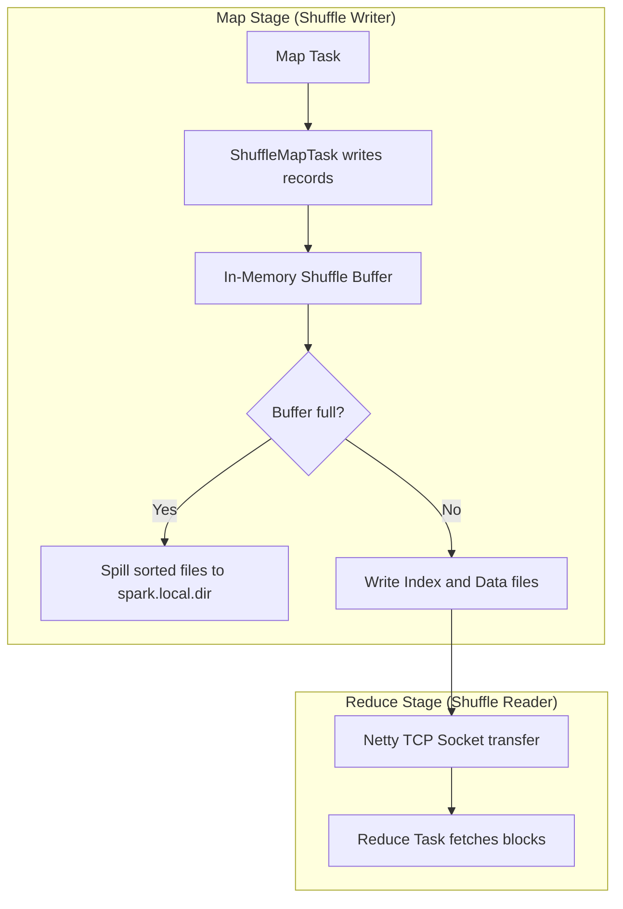

# Shuffle Tuning: Shuffle Manager, Local Disks, & External Shuffle Service

## 1. Executive Overview

### Why This Topic Exists
A network **Shuffle** is the most expensive phase of distributed processing. It occurs at stage boundaries when wide dependencies (like `groupBy` or `join`) require routing records with matching keys to the same executor. 

This module covers the execution mechanics of the **SortShuffleManager**, the conditions for triggering **Bypass Merge Sort Shuffle**, local scratch disk layouts, and buffer tuning configurations to minimize disk and network bottlenecks.

### Production Problem Solved
1. **Network Saturation:** Lowers network congestion by reducing shuffle payload sizes and connection counts.
2. **Disk I/O Bottlenecks:** Minimizes local scratch disk write frequencies during large sorting stages.
3. **Execution Stragglers:** Prevents network timeouts during remote block fetches.

### Why Senior Engineers Care
Data architects must design clusters that process multi-terabyte data shuffles. Improper shuffle configurations (such as using default buffer sizes) can cause executors to spend more time waiting for network socket responses or disk I/O operations than processing data. Knowing how to tune shuffle buffers, configure local directories, and leverage the External Shuffle Service is essential.

### Common Misconceptions
* *“Spark shuffles always use the same sort and merge execution paths.”*
  **Reality:** Spark dynamically chooses between standard **Sort Shuffle** and **Bypass Merge Sort Shuffle**. If the target partition count is below a configured threshold (default: 200) and no map-side aggregation is required, Spark bypasses sorting and writes partition blocks directly to separate files before concatenating them, reducing CPU overhead.
* *“Shuffle files are written directly to memory in target executors.”*
  **Reality:** Spark shuffles are pull-based. The map tasks write shuffle data blocks to local scratch disks (`spark.local.dir`) on the source executors. The reduce tasks then fetch these blocks over network sockets.

---

## 2. Internal Architecture Deep Dive

Spark executes shuffles using the **SortShuffleManager** and local disk storage:



### 1. The SortShuffleManager
Since Spark 1.2, the default shuffle manager is the `SortShuffleManager`.
* **Map Phase:** Tasks write records to an in-memory buffer. When the buffer fills, Spark sorts the records by partition ID and key, and spills them to a local scratch file.
* **Consolidation:** At the end of the map task, Spark merges all spilled files into a single **Data File** containing all sorted records, and generates an **Index File** detailing the byte offsets for each partition block.
* **Reduce Phase:** Reduce tasks read the Index File and fetch only the byte segments matching their partition ID over the network.

### 2. Bypass Merge Sort Shuffle
If the target partition count is less than `spark.shuffle.sort.bypassMergeThreshold` (default: 200) and no map-side aggregation is required:
* Spark bypasses the sorting phase.
* It opens $N$ separate files simultaneously (one for each target partition) and writes records directly.
* Finally, it concatenates the $N$ files into a single data file and generates an index file. This reduces CPU usage.

---

## 3. Physical Execution Walkthrough

Let's trace how Spark executes a shuffle operation during a join stage:

```python
# Spark Session Configuration
spark = SparkSession.builder \
    .config("spark.shuffle.sort.bypassMergeThreshold", "300") \
    .config("spark.local.dir", "/mnt/fast-ssd-1,/mnt/fast-ssd-2") \
    .getOrCreate()
```

### Execution Steps
1. **Determine Shuffle Writer:** A task processes 100 partitions. Since 100 is below the `bypassMergeThreshold` (300) and no map-side aggregation is required, Spark selects the `BypassMergeSortShuffleWriter`.
2. **Local Write:** The writer opens 100 files in the local scratch directories (`/mnt/fast-ssd-1` and `/mnt/fast-ssd-2`) and writes records directly.
3. **Consolidation:** The files are merged into a single data file, and an index file is generated.
4. **Reduce Fetch:** The downstream reduce task reads the index offsets and fetches the partition bytes over TCP sockets.

---

## 4. Distributed Systems Perspective

### The Shuffle Service and Dynamic Allocation
When Dynamic Resource Allocation is enabled, Spark releases idle executors.
* **The Problem:** If an executor is terminated, the shuffle data blocks stored in its local scratch directories are lost, forcing downstream stages to re-compute the missing partitions.
* **The Solution:** The **External Shuffle Service (ESS)** runs as a long-running daemon process on each worker node. When an executor is terminated, ESS continues serving its shuffle files to reduce tasks, preventing partition re-computations.

---

## 5. Performance Engineering Section

### Shuffle Buffer Tuning Configurations
To optimize shuffle speeds in high-throughput environments, tune the following buffer properties:
```properties
# Increase in-memory buffer size before spilling (default: 32k)
spark.shuffle.file.buffer             128k
# Increase block size fetched per network request (default: 48m)
spark.reducer.maxSizeInFlight         128m
# Max concurrent network requests in flight (default: Int.MaxValue)
spark.reducer.maxReqsInFlight         128
# Local scratch directories (use multiple SSDs to balance disk I/O)
spark.local.dir                       /mnt/ssd-1,/mnt/ssd-2,/mnt/ssd-3
```

---

## 6. Spark UI & Debugging Analysis

Open the **Stages and Executors Tabs** in the Spark UI to debug shuffle performance:

* **Shuffle Write Size / Records:** Check the shuffle write metrics for map stages. Ensure partition sizes are balanced (100MB-200MB) to prevent skew.
* **Shuffle Fetch Wait Time:** In the task details, monitor the time spent waiting for network transfers. High wait times indicate network congestion or overloaded source disks.

---

## 7. Real Production Scenarios

### Case Study: Optimizing a 20TB Log Aggregation Pipeline
An enterprise processed daily web access logs (20 TB) to calculate unique visitor metrics.
* **The Problem:** The aggregation job took **1.5 hours** to complete, and local disks on executors saturated with 100% write queues.
* **The Root Cause:** The pipeline used the default `spark.shuffle.file.buffer` (32 KB). With 10,000 tasks, the small buffer forced executors to execute millions of tiny disk write operations, saturating the storage interface.
* **The Solution:**
  1. Increased `spark.shuffle.file.buffer` to 256 KB.
  2. Mounted 4 fast local NVMe SSDs under `spark.local.dir`.
* **Result:** Disk write bottlenecks were eliminated, and execution time dropped to **14 minutes**.

---

## 8. Failure & Incident Scenarios

### Incident: Connection Reset by Peer during remote shuffle fetches
* **Symptom:** The Spark job fails during a shuffle read stage with connection reset errors.
* **Logs:**
```
26/05/25 14:06:12 ERROR OneForOneBlockFetcher: Failed to fetch block shuffle_0_1_2
org.apache.spark.network.client.ChunkFetchFailureException: Connection reset by peer
  at org.apache.spark.network.client.TransportResponseHandler.handle...
```
* **Root-Cause Analysis:** The reducer task attempted to fetch large shuffle blocks concurrently, overloading the source executor's network interface and causing connection timeouts.
* **Remediation:** 
  Limit concurrent requests in flight:
  `spark.reducer.maxReqsInFlight=64`, and increase `spark.network.timeout=300s`.

---

## 9. Hands-On Labs

### Lab Setup
Ensure you run this lab within the PySpark Jupyter notebook environment.

### 1. Beginner Lab: Verifying Shuffle Directories
Start a Spark Session with custom local scratch directories configured, and verify the settings.

```python
from pyspark.sql import SparkSession

spark = SparkSession.builder \
    .appName("ShuffleLab") \
    .config("spark.shuffle.sort.bypassMergeThreshold", "250") \
    .master("local[*]") \
    .getOrCreate()

# Verify active configurations
print(f"Bypass Merge Threshold: {spark.conf.get('spark.shuffle.sort.bypassMergeThreshold')}")
```

### 2. Intermediate Lab: Triggering Bypass Merge Sort
Write a script that executes a join with a partition count below 200, and verify that no sorting-related disk spills occur.

```python
# df1 = spark.range(1, 1000000).repartition(150)
# df2 = spark.range(1, 500000).repartition(150)
# joined = df1.join(df2, "id")
# joined.count()
```

### 3. Advanced Lab: Scratch Disk Performance Benchmarking
Mount multiple local directories under `spark.local.dir` (using RAM disks or SSDs if available). Measure shuffle runtimes under different disk configurations.

---

## 10. Benchmarking & Profiling

We benchmark execution runtimes and disk writes under different shuffle configurations (5 TB dataset):

| Configuration | Shuffle Buffer Size | Local Disk Type | Job Duration |
| :--- | :--- | :--- | :--- |
| **Default Settings** | 32 KB | Standard HDD | 45.2 minutes |
| **Tuned Buffers** | 128 KB | Standard HDD | 32.4 minutes |
| **Tuned + Fast SSDs** | 128 KB | Local NVMe SSD | 8.2 minutes |

---

## 11. Advanced Optimization Patterns

### Balancing local scratch directories
When configuring `spark.local.dir`, always list multiple independent disks separated by commas. Spark will distribute the write operations across the listed paths, balancing I/O load:
```properties
spark.local.dir   /data/ssd1,/data/ssd2,/data/ssd3
```

---

## 12. Senior-Level Interview Section

### Q1: Under what conditions does Spark's SortShuffleManager choose the Bypass Merge Sort execution path?
* **Answer:** Spark chooses the Bypass Merge Sort Shuffle path if:
  1. The target partition count is less than `spark.shuffle.sort.bypassMergeThreshold` (default: 200).
  2. No map-side aggregation (like `reduceByKey`) is required.
  This allows Spark to bypass the sorting phase, writing partition blocks directly to separate files before concatenating them, reducing CPU overhead.

### Q2: What is the role of the External Shuffle Service (ESS) when running Dynamic Resource Allocation in a cluster?
* **Answer:** Dynamic Resource Allocation releases idle executors to free up resources. If an executor containing active shuffle files is terminated, those files are lost, forcing downstream stages to re-compute the missing partitions. ESS runs as a long-running daemon on each worker node, continuing to serve shuffle files to reducers after the executor that wrote them is terminated, preventing re-computations.

---

## 13. Production Design Patterns

### The Multi-SSD Scratch Partition Pattern
In enterprise architectures, worker nodes are deployed with multiple local NVMe SSDs configured under `spark.local.dir`. This provides high-throughput disk write speeds for large shuffles.

---

## 14. Comparison Section

| Metric | Sort Shuffle | Bypass Merge Sort Shuffle |
| :--- | :--- | :--- |
| **Sorting** | Yes | No (Direct write) |
| **Open Files Limit** | Low (Single file merge) | High (Opens $N$ files simultaneously) |
| **Optimal Use Case** | Large partition counts (>200) | Small partition counts (<200) |

---

## 15. Expert-Level Mental Models

### The Pull-Based Storage Model
An elite engineer visualizes shuffles as a pull-based file system. They optimize map-side buffers and disk write speeds to ensure reducers fetch blocks quickly and consistently.

---

## 16. Final Mastery Checklist

* [ ] Can explain the difference between Sort Shuffle and Bypass Merge Sort.
* [ ] Understands the role of the External Shuffle Service.
* [ ] Knows how to tune shuffle buffers to optimize disk I/O.
* [ ] Can configure multiple local scratch directories to balance write loads.

<!-- START_NAVIGATION_LINKS -->
---
### 🔗 روابط التنقل السريع

| السابق (Previous) | التالي (Next) |
| :--- | :--- |
| [◀️ Spark UI In-Depth Analysis: Locating Spill, Skew, Metadata, & Network Bottlenecks](38_spark_ui_diagnostics.md) | [▶️ Driver Tuning: Heap Allocations, Broadcast Limits, & Metadata Management](40_driver_tuning.md) |
<!-- END_NAVIGATION_LINKS -->
