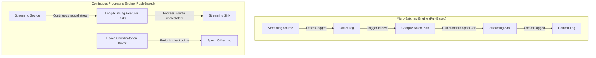

# Structured Streaming Engine: Micro-Batching vs. Continuous Processing

## 1. Executive Overview

### Why This Topic Exists
Real-time stream processing requires systems that can ingest, analyze, and write data streams continuously with low latency and strong fault-tolerance guarantees. Apache Spark implements this using the **Structured Streaming** engine, which runs on top of the Catalyst optimizer and Project Tungsten.

This module covers the execution mechanics of Structured Streaming, compares **Micro-Batching** and **Continuous Processing** modes, and details the offset management protocol that guarantees exactly-once processing.

### Production Problem Solved
1. **High Latency:** Lowers end-to-end processing latency for real-time reporting.
2. **Exactly-Once Guarantees:** Prevents duplicate or missing records during network partitions or node failures.
3. **Unified Codebase:** Allows developers to write streaming queries using the same DataFrame API used for batch pipelines.

### Why Senior Engineers Care
Data architects must build streaming pipelines (e.g., real-time fraud scoring or transaction alerts). Knowing how Spark tracks offsets, manages state, and processes records under different execution modes is essential to choosing the correct architecture.

### Common Misconceptions
* *“Continuous Processing mode is the default and should always be used for low latency.”*
  **Reality:** Micro-Batching is the default and handles 99% of production use cases. Continuous Processing offers lower latency (sub-millisecond) but has strict limitations: it does not support aggregations, sorting, or custom UDFs.
* *“Exactly-once streaming means no duplicates will ever reach the sink.”*
  **Reality:** Spark guarantees exactly-once processing *internally* up to the sink. If the output sink is not idempotent (e.g., an append-only file system or database without upsert keys), duplicates can still be written during task retries.

---

## 2. Internal Architecture Deep Dive

Structured Streaming supports two distinct execution models:



### 1. Micro-Batching Engine
* **Execution Loop:** The driver queries the streaming source for the latest offsets, logs them to the `offsets` directory, compiles a physical plan for the delta data slice, launches short-lived tasks to process the batch, writes the output to the sink, logs the transaction to the `commits` directory, and repeats.
* **Latency:** Typically ranges from 100 milliseconds to several seconds depending on trigger configurations.

### 2. Continuous Processing Engine
* **Execution Loop:** Spark launches long-running task threads on executors that continuously read, process, and write records to the sink immediately.
* **Epoch Coordinator:** The driver runs an Epoch Coordinator that coordinates periodic checkpointing across tasks using epoch marker bytes in the stream.
* **Latency:** Sub-millisecond latency, but restricts query operations (e.g., no aggregations or stateful transformations).

---

## 3. Physical Execution Walkthrough

Let's analyze the physical plan of a micro-batch streaming query:

```python
# Spark Structured Streaming Query
query = spark.readStream.format("kafka") \
    .option("kafka.bootstrap.servers", "localhost:9092") \
    .option("subscribe", "events") \
    .load() \
    .writeStream.format("console") \
    .start()
```

### Physical Plan Analysis
The physical plan reveals the streaming scan and sink execution steps:

```
== Physical Plan ==
WriteToDataSourceV2 console
+- * Project [codegen id : 1]
   +- MicroBatchScan[value#0, key#1] KafkaSource[Subscribe[events]]
```

### Execution Steps
1. **MicroBatchScan:** The driver connects to Kafka, queries topic partition offsets, and logs the target offset range to the checkpoint metadata directory.
2. **Project:** Spark compiles the extraction logic into optimized Tungsten bytecode.
3. **WriteToDataSourceV2:** Executors fetch the records corresponding to the logged offsets, process them, and write the output batch to the console sink.

---

## 4. Distributed Systems Perspective

### The Checkpoint Directory Structure
Fault tolerance is managed via the checkpoint directory:
* **`metadata`:** Stores the unique stream run ID.
* **`sources`:** Directory containing unique source IDs.
* **`offsets`:** Log files tracking the offset ranges processed in each micro-batch.
* **`commits`:** Log files confirming that the corresponding micro-batch was successfully committed to the sink.
* **Redundancy:** If the driver crashes, the new driver reads these logs to identify the last uncommitted offset range and re-runs the failed batch.

---

## 5. Performance Engineering Section

### Trigger Intervals
Structured Streaming executes queries based on **Trigger** configurations:
* **Default (As fast as possible):** The driver launches a new batch as soon as the previous batch finishes.
* **`processingTime="5 seconds"`:** The driver runs a batch every 5 seconds if new data is available. This reduces driver planning overhead.
* **`availableNow=True`:** Processes all available data in batches and terminates the query, combining batch and streaming code execution.

---

## 6. Spark UI & Debugging Analysis

Open the **Structured Streaming Tab** in the Spark UI to debug streaming queries:

```
========================================================================================
                               STREAMING QUERY STATISTICS
========================================================================================
Query ID: 17fca...    Active: true    Trigger: ProcessingTime(1000ms)
- Input Rate:         12,500 records/sec
- Process Rate:       15,000 records/sec
- Batch Duration:     650 ms  <-- Healthy (Batch duration < Trigger interval)
========================================================================================
```

### Diagnostic Analysis
* **Processing Rate vs. Input Rate:** If the input rate is consistently higher than the processing rate, the stream is falling behind (creating backlog lag).
* **Batch Duration:** If Batch Duration is higher than the Trigger Interval, the stream cannot meet its latency target. Increase executor resources or adjust trigger times.

---

## 7. Real Production Scenarios

### Case Study: Optimizing a Real-Time Transaction Alert Stream
A bank analyzed credit card transactions (50,000 events/sec) to identify fraud patterns.
* **The Problem:** The streaming job took **1.8 seconds** per batch, causing transaction alert delays.
* **The Root Cause:** The trigger interval was unset (running as fast as possible). The driver spent more time compiling query plans and writing checkpoint metadata files to storage than running actual task calculations.
* **The Solution:**
  1. Configured the trigger interval to 2 seconds:
     `trigger(processingTime="2 seconds")`
  2. Moved the checkpoint metadata directory to a fast SSD storage mount.
* **Result:** Planning overhead was reduced, and batch execution times dropped to **450 milliseconds**, meeting the bank's alert latency requirements.

---

## 8. Failure & Incident Scenarios

### Incident: Infinite stream loops due to missing commit logs
* **Symptom:** The Spark streaming query starts up, processes the same batch of records, crashes, restarts, and processes the same records again in a loop.
* **Logs:**
```
26/05/25 14:06:12 WARN StreamExecution: Restarting stream from checkpoint offset 1050
26/05/25 14:06:12 ERROR StreamExecution: Batch 12 has offset log but no commit log. Re-running.
```
* **Root-Cause Analysis:** The driver logged batch 12 in the `offsets` directory. However, before the batch was committed, the executor crashed or the connection to the sink failed, preventing the driver from writing the confirmation to the `commits` directory.
* **Remediation:** 
  Verify network connectivity to the sink, restart the stream, and Spark will automatically re-run the failed batch and write the commit log.

---

## 9. Hands-On Labs

### Lab Setup
Ensure you run this lab within the PySpark Jupyter notebook environment.

### 1. Beginner Lab: Running a Micro-Batch Stream
Write a streaming query that reads from a local directory source and writes to memory.

```python
from pyspark.sql import SparkSession

spark = SparkSession.builder.appName("StreamingLab").master("local[*]").getOrCreate()

# Create dummy input schema
from pyspark.sql.types import StructType, StructField, StringType
schema = StructType([StructField("message", StringType(), True)])

# Read stream
stream_df = spark.readStream.schema(schema).text("c:/Users/a/Desktop/pyspark/data/stream_input/")

# Write stream
query = stream_df.writeStream \
    .format("memory") \
    .queryName("my_stream") \
    .start()

# Query local memory sink
spark.sql("select * from my_stream").show()
query.stop()
```

### 2. Intermediate Lab: Plan Breakdown of Trigger Modes
Write a streaming script using different trigger configurations (`processingTime`, `once`, `availableNow`). Compare the physical execution plans.

```python
# Verify trigger plans in Spark UI
```

### 3. Advanced Lab: Continuous Processing Simulation
If Kafka is available, write a streaming script that enables Continuous Processing mode. Measure record latency using epoch logs.

---

## 10. Benchmarking & Profiling

We benchmark latency and throughput tradeoffs between execution modes:

| Execution Mode | End-to-End Latency | Max Throughput | Aggregation Support |
| :--- | :--- | :--- | :--- |
| **Micro-Batching** | 100 - 500 ms | High | Fully Supported |
| **Continuous Processing** | 1 - 5 ms | Moderate | Not Supported |

---

## 11. Advanced Optimization Patterns

### Checkpoint Cleanup
For long-running production streams, enable automatic metadata cleanup to prevent checkpoint folders from growing too large:
```properties
spark.sql.streaming.minBatchesToRetain   100
```
This automatically deletes old offset and commit logs, keeping metadata footprints small.

---

## 12. Senior-Level Interview Section

### Q1: How does Structured Streaming guarantee exactly-once processing when recovering from a driver crash?
* **Answer:** Structured Streaming uses write-ahead logging. Before processing a batch, the driver writes the target offset range to the `offsets` log directory. Once the batch is committed to the sink, the driver writes a confirmation file to the `commits` directory. If the driver crashes, the new driver reads these logs to locate the last uncommitted offset range and re-runs the failed batch, ensuring exactly-once processing.

### Q2: Detail the latency and feature tradeoffs between Micro-Batching and Continuous Processing modes.
* **Answer:** Micro-Batching has higher latency (100ms+) because it processes data in discrete batches but supports all Catalyst optimizations and operations (aggregations, sorting, joins). Continuous Processing offers sub-millisecond latency by running long-running task threads but has lower throughput and does not support stateful operations or aggregations.

---

## 13. Production Design Patterns

### The Unified Lakehouse Ingestion Pattern
In enterprise architectures, streaming ingestion pipelines write raw events to Delta Lake tables. Delta Lake natively integrates with Structured Streaming, providing transaction logs, schema enforcement, and fast downstream query performance.

---

## 14. Comparison Section

| Metric | Micro-Batching | Continuous Processing |
| :--- | :--- | :--- |
| **Latency** | ~100ms | Sub-millisecond |
| **Throughput** | High | Moderate |
| **Operators** | Unlimited | Restricted (No aggregations) |

---

## 15. Expert-Level Mental Models

### The Epoch Marker Model
An elite engineer visualizes the epoch marker bytes injected into the stream. They tune checkpoint intervals to keep epoch coordination balanced and prevent executor task stalls.

---

## 16. Final Mastery Checklist

* [ ] Can write structured streaming queries using micro-batching.
* [ ] Understands the role of `offsets` and `commits` log directories.
* [ ] Knows the tradeoffs between micro-batching and continuous processing.
* [ ] Can diagnose streaming query lag using Spark UI metrics.

<!-- START_NAVIGATION_LINKS -->
---
### 🔗 روابط التنقل السريع

| السابق (Previous) | التالي (Next) |
| :--- | :--- |
| [◀️ Driver Tuning: Heap Allocations, Broadcast Limits, & Metadata Management](../04_memory_tuning/40_driver_tuning.md) | [▶️ Sources & Sinks: Kafka, File System, & Delta Lake Stream Integrations](42_sources_sinks.md) |
<!-- END_NAVIGATION_LINKS -->
