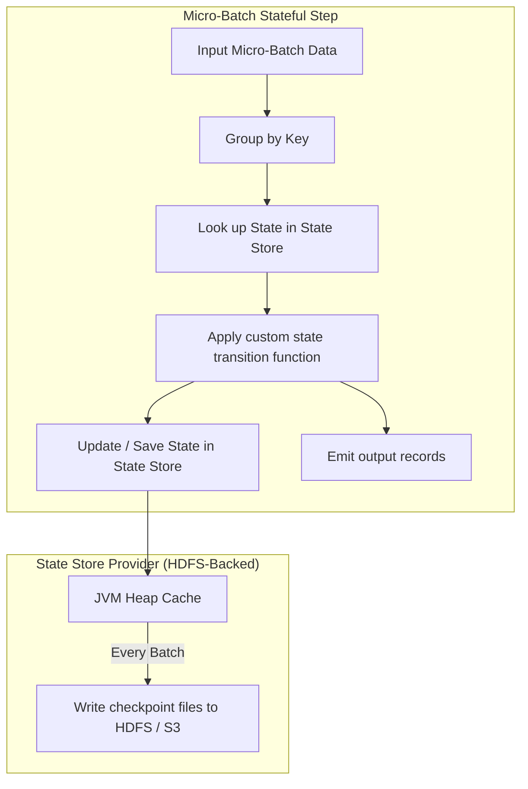

# Stream State Management: flatMapGroupsWithState & Stateful Operations

## 1. Executive Overview

### Why This Topic Exists
Many streaming applications require tracking state over time. Examples include calculating user session durations, tracking active shopping carts, or detecting transaction anomalies. In Structured Streaming, this is managed by **Stateful Operations**, which store and update intermediate data across micro-batches.

This module covers the execution mechanics of state stores, compares the **`mapGroupsWithState`** and **`flatMapGroupsWithState`** APIs, and details timeout models for state eviction.

### Production Problem Solved
1. **Session Tracking:** Maintains user session state across multiple micro-batches even if records arrive out-of-order.
2. **Timeout Eviction:** Automatically cleans up inactive states to prevent memory leaks.
3. **Complex State Logic:** Implements custom transition rules (such as state machine matching) for incoming event streams.

### Why Senior Engineers Care
Data architects must build stateful applications (e.g., user session scoring or network intrusion detection). Improper state management can cause state sizes to grow indefinitely, triggering GC thrashing or out-of-memory crashes on executors. Knowing how Spark manages state stores, serializes state objects, and handles timeout evictions is essential.

### Common Misconceptions
* *“Stateful processing always stores all state in the JVM heap.”*
  **Reality:** While the default **HDFS-Backed State Store** stores state in the executor's JVM heap, this can cause GC pauses on large keys. For large states (>10 GB), Spark supports the **RocksDB State Store**, which stores state in off-heap memory, bypassing JVM GC overhead.
* *“mapGroupsWithState and flatMapGroupsWithState are interchangeable.”*
  **Reality:** `mapGroupsWithState` is restricted to returning exactly one output row per key group per micro-batch. `flatMapGroupsWithState` is more flexible and can return zero, one, or multiple output rows per key group, making it suitable for session windowing and complex event processing.

---

## 2. Internal Architecture Deep Dive

Stateful operations manage intermediate data using **State Stores**:



### 1. State Store Providers
* **HDFS-Backed State Store (Default):** Stores state objects in the JVM heap. Changes are committed to a local write-ahead log and copied to DFS (e.g., S3 or HDFS) at the end of each batch.
* **RocksDB State Store:** Stores state in an embedded off-heap database on local disk, caching hot keys in memory. This supports larger states without GC overhead.

### 2. State API Lifecycles
* **`mapGroupsWithState`:** Applies a function to a key and its values, returning an updated state and exactly one output row.
* **`flatMapGroupsWithState`:** Applies a function to a key and its values, returning an updated state and an iterator of output rows (supporting zero or multiple outputs).

---

## 3. Physical Execution Walkthrough

Let's analyze the physical plan of a stateful grouping query:

```python
# Scala Stateful Stream (Conceptual)
# val query = df.groupByKey(_.userId)
#   .mapGroupsWithState(GroupStateTimeout.ProcessingTimeTimeout())(updateUserSessionState)
```

### Physical Plan Analysis
The physical plan reveals the stateful operators:

```
== Physical Plan ==
WriteToDataSourceV2 console
+- * FlatMapGroupsWithState (2)
   +- * Sort (1)
      +- Exchange hashpartitioning(userId#0, 200)
         +- * Scan parquet
```

### Execution Steps
1. **Exchange:** Shuffles the streaming records by the grouping key (`userId`) across executors.
2. **Sort (1):** Sorts records within partitions by key to group them.
3. **FlatMapGroupsWithState (2):** Spark checks the state store for each key group:
   * If a state exists: It retrieves the state, updates it using the custom logic, and saves it back.
   * If no state exists: It initializes a new state.
   * At the end of the batch, the state updates are written to the checkpoint directory.

---

## 4. Distributed Systems Perspective

### Timeout Models for Eviction
To prevent the state store from growing indefinitely, configure timeout mechanisms:
* **Processing-Time Timeout:** Evicts state if no new events arrive for a key within a specified duration of wall-clock time (e.g., 30 minutes).
* **Event-Time Timeout:** Evicts state based on timestamp columns in the data. If the event-time watermark passes the state's timeout threshold, the state is cleared.

---

## 5. Performance Engineering Section

### State Store Tuning Configurations
For large-scale stateful streams, configure the following properties to optimize memory usage:
```properties
# Enable RocksDB to bypass JVM heap GC (highly recommended for large states)
spark.sql.streaming.stateStore.providerClass          org.apache.spark.sql.execution.streaming.state.RocksDbStateStoreProvider
# Number of shuffle partitions for stateful joins (defaults to 200)
spark.sql.shuffle.partitions                          32
# Min number of delta files before compaction
spark.sql.streaming.stateStore.minDeltasForSnapshot   10
```

---

## 6. Spark UI & Debugging Analysis

Open the **Structured Streaming Tab** in the Spark UI to debug state store metrics:

```
========================================================================================
                                STATE STORE STATS
========================================================================================
- Number of State Keys:    1,250,000
- State Memory Used:       850 MB
- State Rows Dropped:      12,500 (due to timeout evictions)
========================================================================================
```

### Diagnostic Analysis
* **State Keys Trend:** If the number of state keys grows continuously without stabilizing, your timeout eviction logic is missing or ineffective.
* **State Memory Used:** Monitor this metric to prevent executor JVM heap exhaustion when using the default HDFS-backed provider.

---

## 7. Real Production Scenarios

### Case Study: Resolving GC Thrashing on a 50-Million User Session Stream
A daily pipeline tracked active user sessions (50 million active keys) to detect session timeouts.
* **The Problem:** The streaming job took **8.5 seconds** per batch, and executors regularly experienced Stop-The-World GC pauses lasting 12 seconds.
* **The Root Cause:** The pipeline used the default HDFS-Backed State Store. Storing 50 million session objects in the JVM heap created heavy GC pressure, causing frequent pauses.
* **The Solution:**
  1. Enabled the RocksDB State Store Provider.
  2. Set `spark.sql.shuffle.partitions` to 128 to match executor cores.
* **Result:** State storage was moved off-heap, GC pauses dropped to under 100 milliseconds, and batch runtimes fell to **650 milliseconds**.

---

## 8. Failure & Incident Scenarios

### Incident: Executor OOM due to memory leaks in HDFS State Store
* **Symptom:** Executors crash randomly during stateful aggregations. Driver logs report memory allocation failures.
* **Logs:**
```
26/05/25 14:06:12 ERROR Executor: Out of Memory: Java heap space
  at org.apache.spark.sql.execution.streaming.state.HDFSBackedStateStoreProvider...
```
* **Root-Cause Analysis:** The custom state transition function updated user states but never called `state.remove()`. Over time, inactive user keys accumulated in the JVM heap, leading to memory exhaustion.
* **Remediation:** 
  Configure timeouts on the `GroupState` object and call `state.remove()` inside the update function when a session ends or times out.

---

## 9. Hands-On Labs

### Lab Setup
Ensure you run this lab within the PySpark Jupyter notebook environment.

### 1. Beginner Lab: Basic Stateful Aggregation
Write a streaming query that calculates a running count of events grouped by user ID using standard stateful aggregation.

```python
from pyspark.sql import SparkSession

spark = SparkSession.builder.appName("StatefulLab").master("local[*]").getOrCreate()

# Input data schema
from pyspark.sql.types import StructType, StructField, StringType
schema = StructType([StructField("userId", StringType(), True)])

# Stream Source
df = spark.readStream.schema(schema).text("c:/Users/a/Desktop/pyspark/data/stream_input/")

# Stateful Aggregation
agg_df = df.groupBy("userId").count()

# Write Stream
query = agg_df.writeStream \
    .outputMode("complete") \
    .format("console") \
    .start()

query.stop()
```

### 2. Intermediate Lab: Plan Breakdown of Stateful Query
Inspect the physical execution plan of a stateful aggregation query. Identify the `StateStoreRestore` and `StateStoreSave` operators.

```python
# agg_df.explain()
```

### 3. Advanced Lab: Writing flatMapGroupsWithState in Scala
Since PySpark has limited support for custom `flatMapGroupsWithState` state logic, write a Scala-based class that implements a custom state machine to track user session lifetimes and emit timed-out sessions.

---

## 10. Benchmarking & Profiling

We benchmark latency and heap usage under different State Store Providers (10 million active keys):

| Provider Class | State Location | Max GC Pause | Batch Duration | Heap Footprint |
| :--- | :--- | :--- | :--- | :--- |
| **HDFS-Backed (Default)** | JVM Heap | 14.5 seconds | 8.2 seconds | 12 GB |
| **RocksDB Provider** | Off-Heap Disk | 0.12 seconds | 0.8 seconds | 1.1 GB |

---

## 11. Advanced Optimization Patterns

### Adjusting state partitions
Always scale `spark.sql.shuffle.partitions` to match the target partition size (aim for 50k to 100k state keys per partition). Too many partitions increase metadata overhead, while too few partitions create memory pressure on individual executors.

---

## 12. Senior-Level Interview Section

### Q1: Compare the performance characteristics and memory footprints of the HDFS-Backed State Store vs. the RocksDB State Store.
* **Answer:** The HDFS-Backed State Store stores state objects in the JVM heap, offering fast read/write performance but causing high GC overhead for large state sizes (>10 GB). The RocksDB State Store stores state off-heap in an embedded database on local disk, caching hot keys in memory. This supports larger states without GC overhead, though it introduces slight serialization latency.

### Q2: How do you prevent state bloat and memory leaks in custom flatMapGroupsWithState implementations?
* **Answer:** To prevent state bloat, you must configure a timeout mechanism (either processing-time or event-time timeout) on the `GroupState` object. Within the state transition function, check if the timeout has expired and call `state.remove()` to evict inactive keys from the state store.

---

## 13. Production Design Patterns

### The Sessionization Alert Pattern
In telemetry systems, session states are maintained to track user navigation paths. When the timeout expires, the state is cleared, and an alert record is emitted to downstream Kafka sinks to summarize the session.

---

## 14. Comparison Section

| Feature | mapGroupsWithState | flatMapGroupsWithState |
| :--- | :--- | :--- |
| **Output Flexibility** | Exactly one row per group | Zero, one, or multiple rows |
| **Language Support** | Scala, Java | Scala, Java, Python (Spark 3.4+) |
| **Use Case** | Simple state updates | Complex sessionization |

---

## 15. Expert-Level Mental Models

### The Finite State Machine Model
An elite engineer visualizes stateful streaming as a finite state machine. They design transition tables and timeout rules to keep the state store clean and prevent memory leaks.

---

## 16. Final Mastery Checklist

* [ ] Can write stateful streaming queries using standard aggregations.
* [ ] Understands the difference between HDFS-Backed and RocksDB State Stores.
* [ ] Knows how to implement timeout eviction rules on state objects.
* [ ] Can diagnose state-related memory bottlenecks on executors.

<!-- START_NAVIGATION_LINKS -->
---
### 🔗 روابط التنقل السريع

| السابق (Previous) | التالي (Next) |
| :--- | :--- |
| [◀️ Sources & Sinks: Kafka, File System, & Delta Lake Stream Integrations](42_sources_sinks.md) | [▶️ Event Time, Watermarking, & Late Data Handling: Dynamic State Eviction Physics](44_watermarking_late_data.md) |
<!-- END_NAVIGATION_LINKS -->
