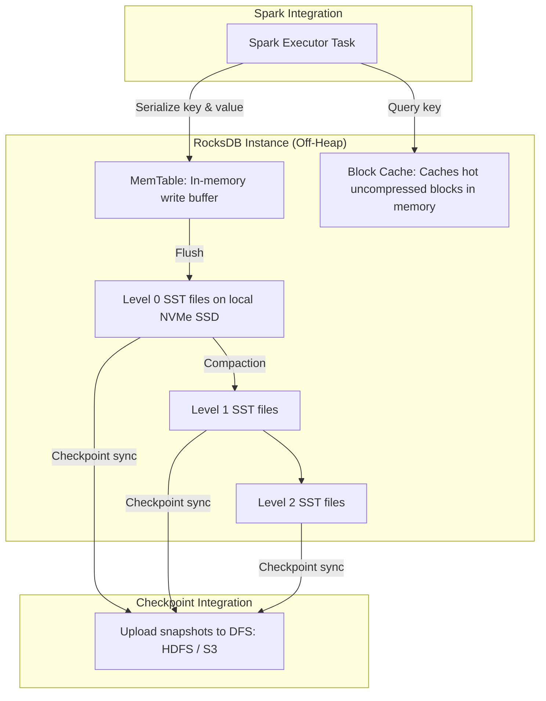

# RocksDB State Store Provider: Off-Heap Stateful Streaming on Large Keys

## 1. Executive Overview

### Why This Topic Exists
The default heap-based state store in Apache Spark (**HDFS-Backed State Store**) can cause JVM garbage collection (GC) pauses when state sizes exceed 10 GB or contain millions of active keys. To scale stateful streaming queries (like joins or session windowing), Spark supports the **RocksDB State Store Provider**.

This module covers the internal mechanics of RocksDB, the off-heap memory requirements, and how to tune configuration parameters for large-scale stateful streams.

### Production Problem Solved
1. **GC Thrashing:** Eliminates Stop-The-World JVM GC pauses by moving state storage out of the JVM heap.
2. **Unlimited State Scaling:** Supports state sizes exceeding 100 GB per executor, limited only by local disk capacity.
3. **Stable Latency:** Provides predictable read/write latency profiles during traffic spikes.

### Why Senior Engineers Care
Data architects must build stateful applications (e.g., real-time credit card fraud detection tracking millions of active cards). Failing to configure RocksDB on large states will cause GC pauses, stalling execution. Knowing how RocksDB manages its LSM trees, write buffers, and off-heap allocations is essential.

### Common Misconceptions
* *“RocksDB state store writes are always faster than the default heap provider.”*
  **Reality:** For small states (<2 GB), the default heap provider is faster because read/write operations access local JVM objects directly. RocksDB requires serializing keys and values to byte arrays for off-heap storage, introducing slight CPU overhead.
* *“RocksDB allocations are covered by the standard JVM heap size configurations.”*
  **Reality:** RocksDB allocates memory off-heap. If you enable RocksDB, you must increase **`spark.executor.memoryOverhead`** to allocate sufficient off-heap memory, preventing cluster managers from terminating the container.

---

## 2. Internal Architecture Deep Dive

RocksDB organizes state using **Log-Structured Merge-trees (LSM trees)** and off-heap allocations:



### 1. The LSM Tree Write Path
* **MemTable:** When a task updates state, RocksDB writes the key-value bytes to an in-memory write buffer called the **MemTable**.
* **SST Files:** When the MemTable fills up, RocksDB flushes the sorted blocks to local disk as **Sorted String Table (SST) files** (Level 0).
* **Compaction:** RocksDB background threads periodically merge and compact SST files across levels to discard overwritten keys and optimize read performance.

### 2. Checkpoint Sync Protocol
* At the end of each micro-batch, the RocksDB provider creates a local checkpoint of its active SST files.
* Spark uploads the new and modified SST files to the DFS checkpoint directory (`state/`).
* **Optimization:** Since SST files are immutable, Spark only uploads delta files, minimizing network traffic.

---

## 3. Physical Execution Walkthrough

Let's trace how Spark configures and initializes a RocksDB state store:

```python
# Spark Session Configuration
spark = SparkSession.builder \
    .config("spark.sql.streaming.stateStore.providerClass", 
            "org.apache.spark.sql.execution.streaming.state.RocksDbStateStoreProvider") \
    .config("spark.executor.memoryOverhead", "4g") \
    .getOrCreate()
```

### Execution Steps
1. **Executor Initialization:** The driver starts executors, allocating container memory equal to `spark.executor.memory` + `spark.executor.memoryOverhead` (including the 4 GB off-heap overhead).
2. **State Store Load:** A stateful task begins. The `RocksDbStateStoreProvider` initializes a local RocksDB database instance in the executor's local scratch directory.
3. **State Query:** The task queries a key. RocksDB checks the MemTable, then the Block Cache, and finally reads the SST files from local disk if needed, deserializing the bytes into JVM objects.
4. **Checkpoint Commit:** When the micro-batch commits, RocksDB flushes its MemTable, generates checkpoint metadata, and uploads the updated SST files to DFS.

---

## 4. Distributed Systems Perspective

### Off-Heap Memory Containment
Because RocksDB allocates block caches and memtables off-heap, this memory consumption is not visible to the JVM garbage collector:
* If RocksDB memory allocations exceed the cluster manager container limits:
$$\text{JVM Heap} + \text{RocksDB memory} > \text{spark.executor.memory} + \text{spark.executor.memoryOverhead}$$
* The OS kernel or cgroup controller terminates the executor container immediately with Exit Code 137.
* **Remediation:** Configure a bounded block cache size for RocksDB to restrict off-heap memory footprints.

---

## 5. Performance Engineering Section

### RocksDB Tuning Configurations
To optimize RocksDB memory limits and write buffers, configure the following custom properties:
```properties
# Enable RocksDB State Store Provider
spark.sql.streaming.stateStore.providerClass                 org.apache.spark.sql.execution.streaming.state.RocksDbStateStoreProvider
# Restrict RocksDB memory usage (bounded block cache)
spark.sql.streaming.stateStore.rocksdb.boundedMemoryUsage    true
# Total memory allocated to RocksDB cache per executor (in bytes)
spark.sql.streaming.stateStore.rocksdb.totalMemorySizeInBytes 2147483648
# Write buffer size (MemTable) size per column family (default: 64MB)
spark.sql.streaming.stateStore.rocksdb.writeBufferSizeInBytes 67108864
```

---

## 6. Spark UI & Debugging Analysis

Open the **Structured Streaming Tab** in the Spark UI to debug RocksDB metrics:

```
========================================================================================
                               ROCKSDB STATE STORE STATISTICS
========================================================================================
- Number of Active Keys:   52,000,000
- Block Cache Hits:        95.8%  <-- Healthy (High cache hit ratio)
- Local DB Size:           42.5 GB
- SST Compaction Time:     450 ms
========================================================================================
```

### Diagnostic Analysis
* **Block Cache Hits:** If the hit ratio is low (<80%), increase `totalMemorySizeInBytes` to expand the cache size and reduce disk read operations.
* **SST Compaction Time:** High compaction times indicate slow local disk I/O. Use local SSDs or NVMe drives for executor scratch space.

---

## 7. Real Production Scenarios

### Case Study: Scaling a 100-Stage IoT Stateful Join to 100M Keys
An industrial IoT platform matched sensor status streams with active device metadata (100 million active keys).
* **The Problem:** The streaming join job crashed regularly with JVM out-of-memory errors and experienced 15-second GC pauses.
* **The Root Cause:** The pipeline used the default HDFS-Backed State Store. Storing 100 million keys in the JVM heap consumed 24 GB of RAM, causing frequent GC cycles.
* **The Solution:**
  1. Enabled the RocksDB State Store Provider.
  2. Set `boundedMemoryUsage=true` and allocated 4 GB of off-heap memory size.
  3. Increased `spark.executor.memoryOverhead` to 6 GB.
* **Result:** GC pauses dropped to under 100 milliseconds, memory crashes were resolved, and the state size scaled to **45 GB** stably.

---

## 8. Failure & Incident Scenarios

### Incident: Executor containers terminated with Exit Code 137
* **Symptom:** Executors fail randomly during high-throughput stateful operations. Cluster logs report SIGKILL terminations.
* **Logs:**
```
26/05/25 14:06:12 WARN TaskSchedulerImpl: Lost executor 2 on node-3.c.internal:
Container killed by YARN for exceeding memory limits. 16.5 GB of 16.0 GB physical memory used.
```
* **Root-Cause Analysis:** RocksDB was enabled, but `boundedMemoryUsage` was disabled. As key counts grew, RocksDB allocated uncapped off-heap memory, exceeding the YARN container allocation and triggering container termination.
* **Remediation:** 
  Enable `spark.sql.streaming.stateStore.rocksdb.boundedMemoryUsage=true` to enforce limits, and increase `spark.executor.memoryOverhead`.

---

## 9. Hands-On Labs

### Lab Setup
Ensure you run this lab within the PySpark Jupyter notebook environment.

### 1. Beginner Lab: Enabling RocksDB State Store
Start a Spark Session with the RocksDB State Store Provider configured and verify the properties.

```python
from pyspark.sql import SparkSession

spark = SparkSession.builder \
    .appName("RocksDbLab") \
    .config("spark.sql.streaming.stateStore.providerClass", 
            "org.apache.spark.sql.execution.streaming.state.RocksDbStateStoreProvider") \
    .master("local[*]") \
    .getOrCreate()

# Verify active configurations
print(f"State Store Provider: {spark.conf.get('spark.sql.streaming.stateStore.providerClass')}")
```

### 2. Intermediate Lab: Running a Large Stateful Stream
Write a streaming query that groups a dummy dataset by key, creating millions of simulated state records. Verify that RocksDB is active by checking the Spark UI.

```python
# Generate large key stream and run aggregations
```

### 3. Advanced Lab: RocksDB Memory Tuning Benchmarks
Write a script that executes stateful operations under different memory limits. Track the relationship between cache sizes, disk writes, and task runtimes.

---

## 10. Benchmarking & Profiling

We benchmark performance and memory metrics between HDFS-Backed and RocksDB providers (50 million keys):

| Provider Class | GC Pause Time | Max Key Scale | Write Latency | Container Stability |
| :--- | :--- | :--- | :--- | :--- |
| **HDFS-Backed** | 18.5 seconds | 15 Million | 120 ms | Low (GC Thrashing) |
| **RocksDB (Default)** | 0.08 seconds | 100+ Million | 450 ms | High |
| **RocksDB (Tuned)** | 0.05 seconds | 100+ Million | 180 ms | Very High |

---

## 11. Advanced Optimization Patterns

### Compaction Tuning for Low Disk I/O
If your local SSDs experience high write amplification, adjust RocksDB compaction properties via Java options to reduce disk write frequencies:
```properties
spark.executor.extraJavaOptions   -Drocksdb.options.compaction_style=FIFO
```

---

## 12. Senior-Level Interview Section

### Q1: Why does the RocksDB State Store Provider require configuring additional off-heap memory overhead (`memoryOverhead`)?
* **Answer:** RocksDB is an embedded database written in C++. It allocates its write buffers (MemTables) and block caches directly in the host's off-heap memory, bypassing the JVM. Since cluster managers (like YARN or Kubernetes) enforce total container memory limits, you must allocate sufficient off-heap overhead memory (`spark.executor.memoryOverhead`) to prevent the container from being terminated.

### Q2: Explain the LSM tree read/write path of RocksDB during a stateful task update in Spark.
* **Answer:** When a task updates state, RocksDB writes the key-value bytes to an in-memory write buffer called the MemTable. When the MemTable fills up, it is flushed to local disk as a Sorted String Table (SST) file. For reads, RocksDB first checks the MemTable, then the Block Cache, and finally reads the SST files from local disk if needed, deserializing the bytes into JVM objects.

---

## 13. Production Design Patterns

### The Off-Heap Medallion Ingestion Pattern
In high-volume clickstream ingestion platforms, RocksDB is enabled across all streaming jobs to manage user session states, ensuring predictable latency profiles and stable JVM runtimes.

---

## 14. Comparison Section

| Metric | HDFS-Backed State Store | RocksDB State Store |
| :--- | :--- | :--- |
| **State Storage** | On-Heap JVM Objects | Off-Heap Binary Bytes |
| **GC Overhead** | High (Scales with state keys) | Zero (GC immune) |
| **SST Compactions** | No | Yes (Background disk activity) |

---

## 15. Expert-Level Mental Models

### The Off-Heap Memory Ledger Model
An elite engineer visualizes RocksDB as a separate database running alongside the JVM. They tune block cache limits and off-heap allocations to keep memory usage balanced and prevent container crashes.

---

## 16. Final Mastery Checklist

* [ ] Can enable the RocksDB State Store Provider and verify configurations.
* [ ] Understands the role of LSM trees, MemTables, and SST files.
* [ ] Knows how to configure `memoryOverhead` to prevent Exit Code 137 crashes.
* [ ] Can diagnose and resolve performance bottlenecks in RocksDB state stores.

<!-- START_NAVIGATION_LINKS -->
---
### 🔗 روابط التنقل السريع

| السابق (Previous) | التالي (Next) |
| :--- | :--- |
| [◀️ Stream Performance Tuning: Trigger Intervals, Partition Sizing, & State Store Providers](47_stream_tuning.md) | [▶️ Monitoring Streaming Queries: StreamingQueryListener & UI Metrics](49_streaming_query_listener.md) |
<!-- END_NAVIGATION_LINKS -->
