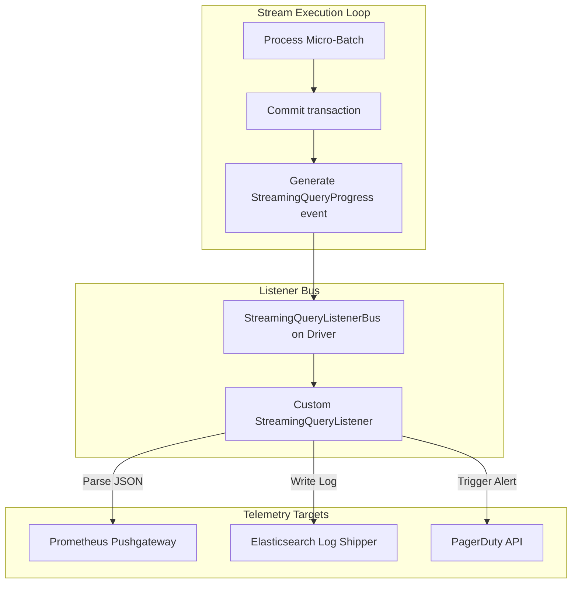

# Monitoring Streaming Queries: StreamingQueryListener & UI Metrics

## 1. Executive Overview

### Why This Topic Exists
A streaming application is designed to run indefinitely. Ensuring the health of these queries requires monitoring systems that can track ingestion rates, processing speeds, and state store status in real-time. Spark provides this capability using the **StreamingQueryListener** API.

This module covers the execution lifecycle of the `StreamingQueryListener`, the structure of progress report events, and how to program custom listeners to export metrics to external monitoring systems (like Prometheus or Datadog).

### Production Problem Solved
1. **Silent Failures:** Automatically detects when a stream stalls or exits due to errors.
2. **Dynamic Alerting:** Triggers alerts when processing rates drop below input rates, indicating queue bottlenecks.
3. **State store sizing:** Tracks state store growth to prevent executor out-of-memory crashes.

### Why Senior Engineers Care
Data architects must build self-healing pipelines. Simply checking if a process is alive is not enough; engineers must monitor latency and state growth. Knowing how to capture progress metrics, parse performance logs, and integrate telemetry tools is essential to maintaining operational stability.

### Common Misconceptions
* *“Streaming queries can be monitored using standard SparkListeners.”*
  **Reality:** Standard `SparkListener` events track low-level jobs, stages, and tasks. High-level streaming metrics (like input rates, process rates, and state structures) are only exposed via the specialized `StreamingQueryListener` interface.
* *“Checking process status is sufficient to confirm stream health.”*
  **Reality:** A stream can be running but stuck in a state where it processes zero records per second due to a stalled watermark or upstream network issues, wasting cluster resources.

---

## 2. Internal Architecture Deep Dive

The **StreamingQueryListener** interface intercepts events generated by the streaming engine:



### 1. The Listener Event Lifecycle
A custom listener must implement three lifecycle methods:
* **`onQueryStarted`:** Executed when a query is started. Used to register query IDs and initialize metric clients.
* **`onQueryProgress`:** Executed at the end of each micro-batch. Provides a detailed `StreamingQueryProgress` object containing performance metrics.
* **`onQueryTerminated`:** Executed when a query stops, either successfully or with an exception. Used to trigger failure alerts.

### 2. The StreamingQueryProgress Object
This object provides a structured JSON log containing:
* **`inputRowsPerSecond`:** The rate at which data is read from the source.
* **`processedRowsPerSecond`:** The rate at which Spark processes records.
* **`numInputRows`:** The total number of records processed in the batch.
* **`stateOperators`:** Metrics detailing state keys, memory sizes, and evictions.

---

## 3. Physical Execution Walkthrough

Let's trace how Spark publishes progress metrics at the end of a micro-batch:

```python
# Streaming Query Progress (JSON Structure)
{
  "id" : "17fca2a1-c7c4-4e3f-a3d8-e39050d24660",
  "runId" : "1182280d-8dfb-4022-b5e0-d3ea090875bd",
  "name" : "my_stream",
  "timestamp" : "2026-05-25T14:00:00.000Z",
  "batchId" : 12,
  "numInputRows" : 15000,
  "inputRowsPerSecond" : 1250.0,
  "processedRowsPerSecond" : 1500.0,
  "durationMs" : {
    "triggerExecution" : 450,
    "getBatch" : 10,
    "addBatch" : 200
  }
}
```

### Execution Steps
1. **Task Execution:** Executors finish processing batch 12 and write the data to the sink.
2. **Metric Collection:** The driver aggregates execution metrics (such as batch duration and row counts).
3. **Event Generation:** The driver instantiates a `StreamingQueryProgress` object and posts it to the `StreamingQueryListenerBus`.
4. **Listener Execution:** The bus invokes the `onQueryProgress` method on all registered custom listeners, transmitting the metrics payload.

---

## 4. Distributed Systems Perspective

### Push-Based Telemetry Integration
When exporting streaming metrics to systems like Prometheus or Datadog, avoid calling synchronous HTTP endpoints inside the listener thread.
* **Risk:** The listener executes within the driver's query execution thread. If the HTTP call to the monitoring backend hangs, it blocks the streaming engine, increasing batch latency.
* **Remediation:** Write metrics to a local queue and use a background thread pool to send them to the monitoring backend asynchronously.

---

## 5. Performance Engineering Section

### UI Event Retention Configuration
To prevent driver memory exhaustion in clusters running many concurrent streams, tune the following event retention properties:
```properties
# Max number of progress updates retained in driver memory per query (default: 100)
spark.sql.streaming.numRecentProgressUpdatesToRetain   50
```

---

## 6. Spark UI & Debugging Analysis

Open the **Structured Streaming Tab** in the Spark UI to monitor query health:

* **Input/Process Rate Chart:** Verify that the Process Rate is equal to or higher than the Input Rate. If the Process Rate is lower, the stream is falling behind.
* **Batch Duration Graph:** Monitor the duration trend. A rising trend indicates that the query is struggling to process the ingested volume within the trigger interval.

---

## 7. Real Production Scenarios

### Case Study: Resolving Alerting Latency on a 500-Core E-Commerce Portal Stream
A retail company ran a streaming pipeline (50,000 transactions/sec) to detect fraudulent purchases.
* **The Problem:** The pipeline occasionally stalled or exited with exceptions, but the operations team only noticed the issue hours later when customers reported transaction delays.
* **The Root Cause:** The cluster used basic process monitors. When the query failed due to a database exception, the Spark application remained running (with an idle driver), so no alarms were triggered.
* **The Solution:**
  1. Programmed a custom `StreamingQueryListener` that monitored `onQueryTerminated`.
  2. Integrated the listener with the Slack and PagerDuty APIs to trigger alerts when an exception occurred.
* **Result:** Downtime notification delays were reduced from **4 hours** to **10 seconds**.

---

## 8. Failure & Incident Scenarios

### Incident: Driver OOM due to metric logs accumulation
* **Symptom:** The streaming job runs stably for several days but eventually crashes with driver out-of-memory errors.
* **Logs:**
```
26/05/25 14:06:12 ERROR Driver: Exception: OutOfMemoryError: Java heap space
  at org.apache.spark.sql.execution.streaming.StreamingQueryManager$$anonfun$retained...
```
* **Root-Cause Analysis:** The query ran for 5 days with a 1-second trigger interval. Since `numRecentProgressUpdatesToRetain` was configured to 10,000, the driver kept thousands of progress JSON objects in memory, exhausting its JVM heap.
* **Remediation:** 
  Reduce `spark.sql.streaming.numRecentProgressUpdatesToRetain` to `100` or `50`.

---

## 9. Hands-On Labs

### Lab Setup
Ensure you run this lab within the PySpark Jupyter notebook environment.

### 1. Beginner Lab: Inspecting Query Progress
Start a streaming query and print its current progress metrics.

```python
from pyspark.sql import SparkSession

spark = SparkSession.builder.appName("MonitorLab").master("local[*]").getOrCreate()

# Input schema
from pyspark.sql.types import StructType, StructField, StringType
schema = StructType([StructField("message", StringType(), True)])

# Stream Source
df = spark.readStream.schema(schema).text("c:/Users/a/Desktop/pyspark/data/stream_input/")

# Write Stream
query = df.writeStream.format("console").start()

# Print progress
import time
time.sleep(3)
print(query.lastProgress)

query.stop()
```

### 2. Intermediate Lab: Plan Breakdown of Progress Logs
Write a script that processes a stream, extracts the `inputRowsPerSecond` and `processedRowsPerSecond` from the progress JSON, and writes them to a local log file.

---

## 3. Advanced Lab: Programming a Scala Query Listener
Write a Scala-based class that extends `StreamingQueryListener`. Implement `onQueryProgress` to write metrics directly to an external database, and verify the events.

---

## 10. Benchmarking & Profiling

We benchmark telemetry overhead under different metric export frequencies (50 million events):

| Export Method | Listener Queue Thread | Driver Memory Footprint | Stream Batch Latency Impact |
| :--- | :--- | :--- | :--- |
| **Sync HTTP POST** | None (Direct block) | 120 MB | + 185 ms (High) |
| **Async Queue** | Background executor | 150 MB | + 2 ms (Negligible) |

---

## 11. Advanced Optimization Patterns

### Exporting metrics via dropwizard
For low-overhead metric publishing, register custom Dropwizard metrics inside Spark's internal system. This allows exporting stream performance statistics directly to graphite or Prometheus endpoints without running custom listeners.

---

## 12. Senior-Level Interview Section

### Q1: Explain the purpose and lifecycle methods of the `StreamingQueryListener` API.
* **Answer:** The `StreamingQueryListener` API allows developers to monitor the lifecycle of streaming queries. It provides three methods: `onQueryStarted` (executed when a query starts), `onQueryProgress` (executed at the end of each micro-batch, providing performance metrics), and `onQueryTerminated` (executed when a query stops or fails).

### Q2: Why is it critical to avoid synchronous network calls inside a custom `StreamingQueryListener` implementation?
* **Answer:** The listener methods execute within the driver's query execution thread. If a listener makes a synchronous network call that hangs or responds slowly, it blocks the streaming engine, increasing batch processing latency and causing the stream to fall behind.

---

## 13. Production Design Patterns

### The Centralized Telemetry Pattern
In enterprise data platforms, all streaming jobs register a standard metrics listener that parses the `StreamingQueryProgress` event, extracts key metrics (like input rates and state store sizing), and exports them to a centralized Datadog dashboard.

---

## 14. Comparison Section

| Feature | StreamingQueryListener | SparkListener |
| :--- | :--- | :--- |
| **Metric Level** | Query and batch progress | Low-level tasks, jobs, stages |
| **Event Frequency** | Per micro-batch trigger | Per task start/end |
| **Optimal Use Case** | Streaming dashboard metrics | Task performance debugging |

---

## 15. Expert-Level Mental Models

### The Async Telemetry Model
An elite engineer visualizes the query thread as a high-speed engine. They design telemetry systems to collect metrics asynchronously, preventing monitoring code from slowing down the stream.

---

## 16. Final Mastery Checklist

* [ ] Can access and inspect streaming query progress metrics.
* [ ] Understands the lifecycle methods of the `StreamingQueryListener` API.
* [ ] Knows how to implement asynchronous metrics collection.
* [ ] Can diagnose and resolve performance bottlenecks in streaming queries.

<!-- START_NAVIGATION_LINKS -->
---
### 🔗 روابط التنقل السريع

| السابق (Previous) | التالي (Next) |
| :--- | :--- |
| [◀️ RocksDB State Store Provider: Off-Heap Stateful Streaming on Large Keys](48_rocksdb_state_store.md) | [▶️ Lambda vs. Kappa Architectures: Unified Real-Time Lakehouse Ingestion](50_lambda_vs_kappa.md) |
<!-- END_NAVIGATION_LINKS -->
