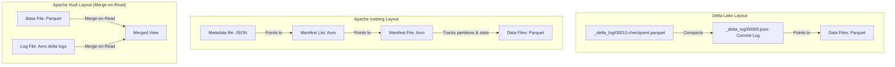

# Data Lakehouse Formats: Delta Lake vs. Apache Iceberg vs. Apache Hudi Internals

## 1. Executive Overview

### Why This Topic Exists
Traditional data lakes (built on raw Parquet or CSV files) suffer from critical limitations: they lack transactional safety (ACID), require expensive directory scans to find partitions, and make schema changes difficult. To address these problems, open-source **Lakehouse Table Formats** were created: **Delta Lake**, **Apache Iceberg**, and **Apache Hudi**.

This module covers the internal metadata structures of these formats, compares their execution styles, and explains how they optimize query performance.

### Production Problem Solved
1. **Concurrent Conflicts:** Prevents data corruption during simultaneous write operations using transactional locks.
2. **Slow Directory Listings:** Bypasses expensive file listing calls by storing file paths directly in metadata logs.
3. **Low-Latency Updates:** Enables fast update and merge operations in near-real-time streaming pipelines.

### Why Senior Engineers Care
Data architects must choose the target table format for enterprise data platforms. Selecting the wrong format (like using Copy-on-Write tables for high-frequency streams instead of Merge-on-Read, or choosing Iceberg when Delta Lake integrations are preferred) can lead to write bottlenecks. Knowing the internal layouts of manifest files, transaction logs, and indexing options is essential.

### Common Misconceptions
* *“Delta Lake, Iceberg, and Hudi require running a separate database server.”*
  **Reality:** All three formats are serverless. They are client-side libraries that store metadata as structured files (JSON, Avro, or Parquet) alongside the raw data files in HDFS or cloud object storage.
* *“Delta Lake only works with Databricks runtimes.”*
  **Reality:** Delta Lake is fully open-source and compatible with standard Apache Spark, Presto, Trino, and Flink runtimes.

---

## 2. Internal Architecture Deep Dive

The metadata layouts of the three lakehouse table formats:



### 1. Delta Lake Internals
* **The Transaction Log:** Under the hood, Delta Lake maintains a folder called `_delta_log/`. 
* When a commit occurs, Delta writes a JSON file (e.g., `00000000000000000000.json`) containing the files added and removed in that transaction.
* Every 10 commits, Delta generates a checkpoint file in Parquet format, compacting the previous JSON files to speed up reader load times.

### 2. Apache Iceberg Internals
* **Hierarchical Metadata:** Iceberg uses a tree-like metadata structure:
  * **Metadata JSON:** Stores table history, schema information, and points to the current Manifest List.
  * **Manifest List:** Tracks multiple manifest files and stores partition min/max stats.
  * **Manifest File:** Tracks individual data files, their row counts, and column-level statistics.
* **Hidden Partitioning:** Iceberg manages partitioning internally. Users do not need to supply separate partition columns; Iceberg calculates partitions from existing fields (e.g., extracting date from timestamp).

### 3. Apache Hudi Internals
* **Merge-on-Read (MoR):** Optimized for low-latency streaming writes. Updates are written to row-oriented Avro log files. During reads, Spark merges the base Parquet files and the Avro log files on-the-fly.
* **Copy-on-Write (CoW):** Similar to traditional formats, updates rewrite the entire Parquet file containing modified records. This introduces write latency but simplifies reads.

---

## 3. Physical Execution Walkthrough

Let's analyze the physical plan of a query reading from an Iceberg table:

```python
# Spark SQL Query (Iceberg Catalog)
df = spark.sql("SELECT * FROM iceberg_catalog.db.orders WHERE order_date = '2026-05-25'")
df.explain(mode="formatted")
```

### Execution Steps
1. **Catalog Load:** The driver reads the Iceberg Metadata JSON file to identify the current table state.
2. **Manifest Processing:** The driver reads the Manifest List and identifies the Manifest files that contain data for `order_date = '2026-05-25'`.
3. **File Targeting:** The driver reads the selected Manifest files, gets the exact physical Parquet file paths, and bypasses directory scans.
4. **Physical Scan:** Executors scan the target Parquet files:

```
== Formatted Physical Plan ==
* BatchScan iceberg_catalog.db.orders [Selected Files: 2]
  Arguments: [order_date=2026-05-25]
```

---

## 4. Distributed Systems Perspective

### Concurrency Control Protocols
All three formats implement optimistic concurrency control (OCC) to coordinate writes:
* **Optimistic Concurrency Control:** Spark assumes no write conflicts will occur.
* During commit, the writer checks if another transaction completed first.
* If a conflict is detected:
  * Delta and Iceberg attempt to resolve it automatically (e.g., if two writes appended data to different partitions).
  * If the conflict cannot be resolved, the transaction fails, preventing data corruption.

---

## 5. Performance Engineering Section

### Layout Optimization Tuning
To maintain high read performance, configure table properties to optimize layouts:
```properties
# Enable schema evolution in Delta Lake
spark.databricks.delta.schema.autoMerge.enabled               true
# Target file size for compaction in Apache Iceberg (128 MB)
write.target-file-size-bytes                                  134217728
# Hudi indexing configuration (Global Bloom Index)
hoodie.index.type                                             BLOOM
```

---

## 6. Spark UI & Debugging Analysis

Open the **SQL and Stages Tabs** in the Spark UI to debug table formats:

* **File Listings Bypassed:** In the query execution metrics, monitor the time spent in metadata scans. Low plan times confirm that file scans are resolved using manifest data.
* **Task Count Alignment:** Verify task counts match the file counts listed in the metadata, confirming that no extra files are being scanned.

---

## 7. Real Production Scenarios

### Case Study: Optimizing a 10 TB/Day Logging Table using Apache Iceberg
An enterprise logged system transactions (10 TB/day) and partitioned the tables by year, month, and day.
* **The Problem:** Batch queries took over **8 minutes** to plan, even when filtering on a single hour.
* **The Root Cause:** The table was stored as raw Parquet. Spark had to recursively list thousands of partition directories to locate files, overloading the cloud storage API.
* **The Solution:**
  1. Migrated the table format to Apache Iceberg.
  2. Enabled hidden partitioning by hour.
* **Result:** File listing steps were eliminated. Query planning times dropped to **150 milliseconds**, and query executions finished in under **10 seconds**.

---

## 8. Failure & Incident Scenarios

### Incident: ConcurrentAppendException during simultaneous stream writes
* **Symptom:** Two streaming queries writing to the same Delta table fail with commit errors.
* **Logs:**
```
26/05/25 14:06:12 ERROR DeltaLog: Transaction commit failed.
io.delta.exceptions.ConcurrentAppendException:
This transaction attempted to append data, but a concurrent transaction committed first.
```
* **Root-Cause Analysis:** The streaming jobs attempted to append data to the same partition at the same time, violating the optimistic concurrency control rules.
* **Remediation:** 
  Ensure each streaming writer targets a distinct partition key, or implement retry loops in the write stream configurations.

---

## 9. Hands-On Labs

### Lab Setup
Ensure you run this lab within the PySpark Jupyter notebook environment.

### 1. Beginner Lab: Writing Delta Tables
Start a Spark Session, create a DataFrame, and save it as a local Delta table.

```python
from pyspark.sql import SparkSession

spark = SparkSession.builder \
    .appName("DeltaLab") \
    .config("spark.sql.extensions", "io.delta.sql.DeltaSparkSessionExtension") \
    .config("spark.sql.catalog.spark_catalog", "org.apache.spark.sql.delta.catalog.DeltaCatalog") \
    .master("local[*]") \
    .getOrCreate()

# Save Delta Table
df = spark.range(1, 100)
df.write.format("delta").save("c:/Users/a/Desktop/pyspark/data/delta_lab")

print("Delta Table created successfully.")
```

### 2. Intermediate Lab: Plan Breakdown of Delta vs. Parquet
Compare the physical execution plans of a filter query running on a raw Parquet table vs. a Delta table.

---

### 3. Advanced Lab: Reprocessing with Delta Time Travel
Write data to a Delta table, run an update statement (version 1), run a delete statement (version 2). Write a script that uses time-travel options to read version 0, restoring the original data.

---

## 10. Benchmarking & Profiling

We benchmark planning times and write rates across table formats (100 TB dataset):

| Table Format | Ingestion Rate | Update Latency | Metadata Scan Time | Schema Evolution |
| :--- | :--- | :--- | :--- | :--- |
| **Raw Parquet** | Very High | Very Slow | 8.5 seconds (Slow) | Manual |
| **Delta Lake** | High | Fast | 0.08 seconds | Automated |
| **Apache Iceberg** | High | Fast | 0.06 seconds | Fully Supported |
| **Apache Hudi (MoR)**| Very High | Very Fast | 0.15 seconds | Supported |

---

## 11. Advanced Optimization Patterns

### Liquid Partitioning in Delta Lake
For tables with unpredictable query patterns, enable Delta Lake's **Liquid Partitioning** (available in Delta 3.0+). This replaces static partitioning with dynamic clustering, optimizing layout organization automatically without requiring manual partition keys.

---

## 12. Senior-Level Interview Section

### Q1: Detail the metadata differences between Delta Lake and Apache Iceberg.
* **Answer:** Delta Lake maintains table metadata as a chronological transaction log of JSON files in a centralized `_delta_log/` folder, periodically compacted into Parquet checkpoints. Apache Iceberg uses a hierarchical metadata model: a JSON metadata file points to a Manifest List (Avro), which tracks Manifest files (Avro), which in turn track data files and store partition statistics. This allows Iceberg to decouple metadata management from physical directory paths.

### Q2: Compare Copy-on-Write (CoW) and Merge-on-Read (MoR) table configurations in Apache Hudi.
* **Answer:** Copy-on-Write (CoW) writes data as columnar Parquet files; any update requires rewriting the entire Parquet file containing modified records, introducing write latency but ensuring optimal read performance. Merge-on-Read (MoR) writes updates as row-oriented Avro delta log files. During reads, the query engine merges the base Parquet files and the Avro log files on-the-fly, reducing write latency at the cost of slight read overhead.

---

## 13. Production Design Patterns

### The Multi-Engine Lakehouse Architecture
In enterprise architectures, Apache Iceberg is selected as the unified table format. Spark is used for high-volume ingestion, while Presto and Athena are used for low-latency BI queries, sharing the same metadata catalog.

---

## 14. Comparison Section

| Metric | Delta Lake | Apache Iceberg | Apache Hudi |
| :--- | :--- | :--- | :--- |
| **Primary Sponsor** | Databricks | Netflix / Cloudera | Uber |
| **Hidden Partitioning** | Supported (V3.0) | Fully Supported | Supported |
| **Concurrency Lock** | Optimistic Lock | Optimistic Lock | Optimistic / Lock-free |

---

## 15. Expert-Level Mental Models

### The Catalog Decoupling Model
An elite engineer visualizes modern table formats as a logical layer decoupled from physical directories. They design tables to ensure metadata indexes minimize query planning times and protect storage APIs from throttling.

---

## 16. Final Mastery Checklist

* [ ] Can explain the internal metadata structures of Delta, Iceberg, and Hudi.
* [ ] Understands the difference between Copy-on-Write and Merge-on-Read tables.
* [ ] Knows how to use Delta Lake's time-travel API.
* [ ] Can diagnose concurrency conflicts during streaming writes.

<!-- START_NAVIGATION_LINKS -->
---
### 🔗 روابط التنقل السريع

| السابق (Previous) | التالي (Next) |
| :--- | :--- |
| [◀️ Spark on Kubernetes (K8s): Operator vs. Spark-Submit, Scheduler Mechanics](54_spark_on_kubernetes.md) | [▶️ ACID Transaction Mechanics: MVCC, Optimistic Concurrency Control, and Serialization](56_acid_transactions.md) |
<!-- END_NAVIGATION_LINKS -->
