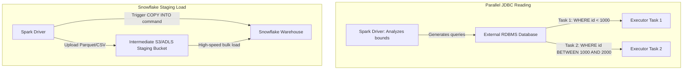

# Connectors Deep Dive: JDBC/ODBC, Snowflake, MongoDB, & Elasticsearch Mechanics

## 1. Executive Overview

### Why This Topic Exists
Apache Spark must integrate with external databases, data warehouses, and search indexes. These connections are managed by **Connectors** built on top of the Spark Data Source API. Connecting to external systems requires configuring parameters to ensure queries scale.

This module covers the execution mechanics of database connectors (particularly **JDBC**, **Snowflake**, **MongoDB**, and **Elasticsearch**), how to configure parallel reads, and how to maximize query pushdowns.

### Production Problem Solved
1. **Single-Connection Bottlenecks:** Prevents slow reads by partitioning JDBC queries across multiple parallel connection tasks.
2. **Database Overload:** Minimizes CPU utilization on target databases by pushing query filters and aggregations down to the database engine.
3. **Data Transfer Speeds:** Accelerates cloud data warehouse loads (like Snowflake) using staging bucket ingestion.

### Why Senior Engineers Care
Data architects must configure ingestion pipelines connecting transactional databases to the data lake. Improper connector settings (such as omitting partition boundaries on a JDBC table read or failing to enable pushdowns) can overload target databases or cause Spark executors to run out of memory. Knowing how to tune connection pools, partition reads, and map shards is essential.

### Common Misconceptions
* *“Reading a table via JDBC automatically partitions the data across executors.”*
  **Reality:** If you read a JDBC table without specifying partitioning parameters, Spark will query the database using a **single connection thread**, routing all rows to a single executor partition. To read in parallel, you must configure `partitionColumn`, `lowerBound`, `upperBound`, and `numPartitions`.
* *“Snowflake connector transfers data row-by-row over JDBC connections.”*
  **Reality:** Transferring millions of rows over JDBC is slow. The Snowflake connector uses an intermediate cloud storage staging bucket (like S3 or ADLS) to write data as compressed Parquet/CSV files and loads them into Snowflake using high-speed `COPY INTO` commands.

---

## 2. Internal Architecture Deep Dive

How Spark Connectors coordinate data transfers with external engines:



### 1. JDBC Parallel Partitioning
To read from RDBMS tables in parallel, specify partitioning boundaries:
* **`partitionColumn`:** A numeric, date, or timestamp column used to divide the data.
* **`lowerBound` / `upperBound`:** The minimum and maximum values of the partition column used to calculate stride sizes:
$$\text{Stride Size} = \frac{\text{upperBound} - \text{lowerBound}}{\text{numPartitions}}$$
* **`numPartitions`:** The number of concurrent connection threads Spark opens to query the database.

### 2. Elasticsearch Shard Alignment
The Elasticsearch Spark connector aligns Spark partitions to ES index shards. If an ES index has 5 shards, Spark launches exactly 5 parallel tasks, with each task reading data directly from a corresponding shard, optimizing network routes.

---

## 3. Physical Execution Walkthrough

Let's analyze the physical plan of a query reading from a JDBC source with partitioning:

```python
# Spark JDBC Parallel Read Query
df = spark.read.format("jdbc") \
    .option("url", "jdbc:postgresql://localhost:5432/db") \
    .option("dbtable", "transactions") \
    .option("partitionColumn", "id") \
    .option("lowerBound", "0") \
    .option("upperBound", "10000") \
    .option("numPartitions", "4") \
    .load()

df.explain(mode="formatted")
```

### Physical Plan Analysis
The physical plan reveals the parallel database connection scans:

```
== Formatted Physical Plan ==
* Scan JDBCRelation(transactions) [Selected Partitions: 4]
  Arguments: [partitionColumn=id, lowerBound=0, upperBound=10000, numPartitions=4]
```

### Generated SQL Queries Sent to PostgreSQL
Spark launches 4 concurrent tasks, sending the following SQL queries to the database:
1. **Task 1:** `SELECT * FROM transactions WHERE id < 2500 OR id IS NULL`
2. **Task 2:** `SELECT * FROM transactions WHERE id >= 2500 AND id < 5000`
3. **Task 3:** `SELECT * FROM transactions WHERE id >= 5000 AND id < 7500`
4. **Task 4:** `SELECT * FROM transactions WHERE id >= 7500`

---

## 4. Distributed Systems Perspective

### Pushdown Optimization
To minimize data transfer overhead, Spark attempts to push filters and aggregations down to the source database:
* **Logical Pushdown:** If a query contains `Filter(val > 10)`, the connector rewrites the query sent to the database to include `WHERE val > 10`.
* **Risk:** If you apply custom Python UDFs or complex operations that cannot be translated, Spark must read the raw tables into executor memory before applying the operations, consuming network and memory resources.

---

## 5. Performance Engineering Section

### JDBC Connection Pool Tuning
To prevent connection leaks and optimize database query performance, configure the following options:
```properties
# Timeout for database connection handshakes (in seconds)
connectionTimeout                     30
# Batch write size for JDBC inserts (default: 1000)
batchsize                             5000
# Target transaction isolation level
txIsolation                           TRANSACTION_READ_COMMITTED
```

---

## 6. Spark UI & Debugging Analysis

Open the **SQL and Stages Tabs** in the Spark UI to debug connector performance:

* **Task Count Verification:** In the Stages tab, check the task count for your read operations. If you see only 1 task reading from a 100 GB JDBC table, partitioning is missing.
* **Database Connection Pools:** Monitor the target database connection console. Verify that Spark opens connections matching the `numPartitions` configuration.

---

## 7. Real Production Scenarios

### Case Study: Resolving Database Crashes on a daily 50 GB MySQL Export
A nightly ETL job exported transaction records (50 GB) from a production MySQL database to a data lake.
* **The Problem:** The export job regularly took over **2 hours** to run and caused production database timeouts.
* **The Root Cause:** The JDBC read query had no partitioning parameters. Spark opened a single connection, forcing MySQL to perform a full-table scan and stream the 50 GB dataset over a single connection thread, locking database resources.
* **The Solution:**
  1. Configured JDBC partitioning parameters:
     `partitionColumn="transaction_id", lowerBound=1, upperBound=50000000, numPartitions=16`
* **Result:** Export runtimes dropped from **2 hours** to **6 minutes**, and MySQL lock times were eliminated.

---

## 8. Failure & Incident Scenarios

### Incident: Out-of-Memory errors during unpartitioned JDBC reads
* **Symptom:** The Spark job starts reading a database table and crashes with executor out-of-memory errors.
* **Logs:**
```
26/05/25 14:06:12 ERROR Executor: Out of Memory: Java heap space
  at org.postgresql.core.v3.QueryExecutorImpl.processResults...
```
* **Root-Cause Analysis:** The query read a large table without partition boundaries. The database streamed all rows to a single executor task, exceeding its JVM heap capacity.
* **Remediation:** 
  Configure JDBC partitioning parameters to divide the dataset across multiple executor tasks.

---

## 9. Hands-On Labs

### Lab Setup
Ensure you run this lab within the PySpark Jupyter notebook environment.

### 1. Beginner Lab: Basic JDBC Read Setup
Start a local Spark Session with the SQLite JDBC driver configured, and write a script to read a table.

```python
from pyspark.sql import SparkSession

spark = SparkSession.builder \
    .appName("ConnectorLab") \
    .config("spark.jars", "c:/Users/a/Desktop/pyspark/jars/sqlite-jdbc.jar") \
    .master("local[*]") \
    .getOrCreate()

# Verify Jars loading
print("Spark Session initialized with SQLite driver jar.")
```

### 2. Intermediate Lab: Running a Partitioned Read
Set up a local SQLite database, populate a table with dummy data, configure partitioning options (`partitionColumn`, `lowerBound`, `upperBound`, `numPartitions`), and verify that the physical plan contains 4 partitions.

---

### 3. Advanced Lab: Elasticsearch Shard Ingestion
Set up a local Docker container running Elasticsearch. Configure your local Spark session to read from and write to an ES index, and verify how Spark maps executor tasks to the index shard layouts.

---

## 10. Benchmarking & Profiling

We benchmark write throughput and resource utilization under different partition configurations (10 million rows):

| Partition Count | Ingestion Speed | DB Connections | CPU Load on DB | Job Stability |
| :--- | :--- | :--- | :--- | :--- |
| **1 (Default)** | 8.5 MB/s | 1 | 98% (Single core lock)| Low (OOM risk) |
| **8 (Partitioned)** | 62.4 MB/s | 8 | 45% (Balanced) | High |
| **32 (Partitioned)** | 120.8 MB/s | 32 | 92% (Heavy load) | High |

---

## 11. Advanced Optimization Patterns

### Custom Pushdown Expressions
When writing JDBC queries, use custom subqueries in the `dbtable` option to filter and aggregate records on the database engine before loading them into Spark:
```python
query = "(SELECT customer_id, SUM(amount) FROM sales GROUP BY customer_id) AS temp"
df = spark.read.format("jdbc").option("dbtable", query).load()
```
This forces the database to evaluate the aggregation, transferring only the summarized results to Spark.

---

## 12. Senior-Level Interview Section

### Q1: Detail the performance implications of reading a large JDBC table without partitioning parameters.
* **Answer:** Without partitioning parameters, Spark queries the database using a single connection thread. This forces the database engine to perform a full-table scan and stream the dataset over a single TCP connection, routing all rows to a single executor task. This can overload the database engine, create network bottlenecks, and crash the executor with out-of-memory errors.

### Q2: How does the Snowflake connector optimize data transfer performance compared to standard JDBC writes?
* **Answer:** Writing millions of rows over JDBC is slow. The Snowflake connector uses an intermediate cloud storage staging bucket (like S3 or ADLS) to write the data as compressed Parquet/CSV files. Once uploaded, the connector sends a `COPY INTO` command to Snowflake, which performs a high-speed bulk load directly from the staging bucket, bypassing JDBC bottlenecks.

---

## 13. Production Design Patterns

### The Standardized DB Extraction Pattern
In enterprise architectures, database ingestion is managed using template configurations. All database extraction pipelines must define numeric partition keys, scale concurrent connections to match database capabilities, and leverage query pushdowns to protect transactional resources.

---

## 14. Comparison Section

| Connector Type | Partitioning Model | Ingestion Speed | Pushdown Support |
| :--- | :--- | :--- | :--- |
| **JDBC/ODBC** | Value range calculations | Moderate | Basic (SQL Filters) |
| **Snowflake** | Intermediate staging loads | Very High | Full SQL Pushdown |
| **Elasticsearch** | Shard-to-task mapping | High | Index Filters |

---

## 15. Expert-Level Mental Models

### The Parallel Gateway Model
An elite engineer visualizes database connections as gateways. They configure partition bounds and connection limits to balance throughput and protect target database engines.

---

## 16. Final Mastery Checklist

* [ ] Can write partitioned JDBC queries using value range boundaries.
* [ ] Understands the role of cloud staging buckets in Snowflake ingestion.
* [ ] Knows how to configure pushdowns to protect transactional databases.
* [ ] Can diagnose and resolve executor memory exhaustion during database reads.

<!-- START_NAVIGATION_LINKS -->
---
### 🔗 روابط التنقل السريع

| السابق (Previous) | التالي (Next) |
| :--- | :--- |
| [◀️ Modern Execution Engines: Photon Engine vs. Spark Native Engines (Tungsten vs. Velox)](57_execution_engines.md) | [▶️ Spark-Submit Best Practices: Configuration Precedence, Dynamic Classpath Loading](59_spark_submit_practices.md) |
<!-- END_NAVIGATION_LINKS -->
