# CI/CD & Automated Testing for Spark Pipelines: Pytest-Spark, Mocking, & Airflow Orchestration

## 1. Executive Overview

### Why This Topic Exists
Deploying data pipelines to production without automated testing is a major risk. A single bug in transformation logic can corrupt downstream analytics tables or dashboards. However, testing Spark pipelines is challenging because Spark requires a JVM runtime, runs distributed tasks, and relies on external data catalogs and systems.

This module covers how to write unit tests for Spark transformations using **Pytest**, mock external systems, design CI/CD pipelines, and orchestrate Spark jobs in **Apache Airflow**.

### Production Problem Solved
1. **Logic Regression:** Detects bugs in transformations before changes are deployed to production.
2. **Slow Test Suites:** Avoids starting and stopping a new Spark session for every test by using shared fixtures.
3. **Environment Mismatches:** Ensures consistent dependency environments across local development, CI testing, and production runs.

### Why Senior Engineers Care
Data architects must build robust, automated data platforms. Writing tests that verify transformations, setting up CI/CD workflows, and designing orchestration DAGs are essential to maintaining operational reliability. Knowing how to structure code for testability, mock data inputs, and configure Airflow tasks is critical.

### Common Misconceptions
* *“Unit testing Spark transformations requires connecting to a live cluster.”*
  **Reality:** You do not need a live cluster to test Spark code. You can run unit tests locally using a local Spark session (`local[*]`) in your test fixtures, running tests entirely within the CI runner memory.
* *“We should test read and write operations inside our core transformation unit tests.”*
  **Reality:** Testing storage read/write calls makes unit tests slow and dependent on external network systems. The best practice is to isolate your core business logic into pure functions that accept and return DataFrames (`def transform(df: DataFrame) -> DataFrame`), decoupling them from input/output side effects.

---

## 2. Internal Architecture Deep Dive

The architecture of a testable Spark application, showing the separation of data access and transformation logic:

```mermaid
graph TD
    subgraph sg_1 ["Testable Code Architecture"]
        Source[1. Data Ingestion: Read from S3/Kafka] --> Transform[2. Core Transformation: Pure Functions]
        Transform --> Sink[3. Data Output: Write to Delta Table]
    end

    subgraph sg_2 ["Unit Testing Suite (Pytest)"]
        MockData[Mock Input DataFrame: created in-memory] --> TestFixture[Shared local SparkSession fixture]
        TestFixture --> TestCall[Invoke Transform function]
        TestCall --> Assert[Assert output DataFrame schema and values match expected results]
    end

    subgraph sg_3 ["CI/CD Pipeline"]
        CodePush[Git Push] --> Runner[CI Runner Container]
        Runner -->|Run Tests| PytestRun[pytest tests/]
        PytestRun -->|Success| Build[Build docker image & deploy]
    end
```



### 1. Designing for Testability
To test Spark code, separate data access and transformation logic:
* **The Ingestion Layer:** Reads data from external systems.
* **The Transformation Layer (Pure Functions):** Processes the data. These functions take DataFrames as arguments and return DataFrames, containing no file reads or writes.
* **The Output Layer:** Writes the resulting DataFrames to target storage.
* **Unit Testing:** Focuses on testing the transformation layer by passing mock, in-memory DataFrames and validating the outputs.

---

## 3. Physical Execution Walkthrough

Let's analyze a Pytest unit test for a Spark transformation:

```python
# app/transformations.py
from pyspark.sql import DataFrame
from pyspark.sql.functions import col

def calculate_doubled_amount(df: DataFrame) -> DataFrame:
    return df.withColumn("doubled_amount", col("amount") * 2)
```

```python
# tests/test_transformations.py
import pytest
from pyspark.sql import SparkSession
from app.transformations import calculate_doubled_amount

@pytest.fixture(scope="session")
def spark_session():
    # Share a single local Spark Session across all unit tests to save startup times
    spark = SparkSession.builder \
        .appName("UnitTestSession") \
        .master("local[*]") \
        .getOrCreate()
    yield spark
    spark.stop()

def test_calculate_doubled_amount(spark_session):
    # 1. Arrange: Create mock in-memory input data
    input_data = spark_session.createDataFrame([
        (1, 100.0), (2, 250.0)
    ], ["id", "amount"])
    
    # 2. Act: Run transformation function
    result_df = calculate_doubled_amount(input_data)
    
    # 3. Assert: Verify the output schema and values
    expected_data = [(1, 100.0, 200.0), (2, 250.0, 500.0)]
    assert result_df.collect() == expected_data
```

---

## 4. Distributed Systems Perspective

### Isolated Execution on Airflow Operators
When orchestrating Spark jobs in Apache Airflow, select the appropriate operator:
* **`SparkSubmitOperator`:** Submits jobs to an external Spark cluster using `spark-submit`. This requires configuring the Spark client libraries on the Airflow worker nodes.
* **`KubernetesPodOperator` (Preferred):** Launches a separate Kubernetes pod containing your code and dependencies. The pod runs `spark-submit` internally, keeping the Airflow nodes isolated from Spark dependencies.

---

## 5. Performance Engineering Section

### Shared Test Session Configuration
Starting a new local Spark session in every test function adds several seconds of startup overhead, slowing down the test suite.
* **Tuning:** Define your Spark session fixture with `scope="session"`. This ensures Pytest starts a single Spark session at the beginning of the test run and shares it across all tests, reducing runtimes by up to 90%.

---

## 6. Spark UI & Debugging Analysis

Open the **Local Driver Log Files** to debug unit test failures:

* **Schema Mismatch Warnings:** If assertions fail, print the schema trees:
  `result_df.printSchema()` and `expected_df.printSchema()`. Mismatched nullability parameters can cause test failures even if values match.
* **JVM Port Collisions:** If local tests fail to start, check the logs. Multiple concurrent test runs can cause Spark Web UI port collisions. Configure random Web UI ports:
  `spark.ui.port=0` (disables fixed port binding).

---

## 7. Real Production Scenarios

### Case Study: Optimizing Test Speeds on a 500-Transformation Data Platform
An enterprise analytics platform maintained a suite of 500 Spark transformation unit tests.
* **The Problem:** The local test suite took over **35 minutes** to run on CI servers, slowing down developer releases.
* **The Root Cause:** The test setup initialized a new Spark session for every test class, wasting time on JVM spin-ups.
* **The Solution:**
  1. Refactored the test fixtures to use a single, shared session-scoped Spark session.
  2. Set `spark.ui.enabled=false` and `spark.ui.port=0` to eliminate UI initialization overhead.
* **Result:** Test suite execution times dropped from **35 minutes** to **2 minutes**.

---

## 8. Failure & Incident Scenarios

### Incident: Nullability assertions fail despite matching values
* **Symptom:** Unit tests fail with schema mismatch exceptions, even though the row values are identical.
* **Logs:**
```
Failed: assert StructType(List(StructField(amount,DoubleType,true))) ==
               StructType(List(StructField(amount,DoubleType,false)))
```
* **Root-Cause Analysis:** The transformation schema output marked the column nullability as `true` (nullable), while the expected schema mock was defined as `false` (non-nullable).
* **Remediation:** 
  Define helper functions to compare DataFrame schemas while ignoring nullability and metadata attributes, or explicitly set nullability parameters when creating test DataFrames.

---

## 9. Hands-On Labs

### Lab Setup
Ensure you run this lab within the PySpark Jupyter notebook environment.

### 1. Beginner Lab: Writing a Basic Unit Test
Write a transformation function that filters out inactive users, and write a Pytest test case to verify the filter logic.

```python
# app/transformations.py
def filter_active_users(df):
    return df.filter("status = 'active'")
```

```python
# test_transformations.py
# Write test case verifying that active users are returned and inactive users are dropped.
```

### 2. Intermediate Lab: DataFrame Assertions
Implement a helper function `assert_df_equal` that compares the schemas and row values of two DataFrames, ignoring nullability and column ordering.

---

### 3. Advanced Lab: Airflow DAG Setup
Write a complete Apache Airflow DAG manifest that schedules a daily data pipeline. Use the `KubernetesPodOperator` to launch the job, configure volume mounts, and define task dependencies.

---

## 10. Benchmarking & Profiling

We benchmark test suite execution times under different Pytest configurations (500 unit tests):

| Fixture Scope | Web UI Status | Total Startup Time | Test Suite Duration | CI Cost |
| :--- | :--- | :--- | :--- | :--- |
| **Function Scope** | Active (Default) | 850 seconds | 35.8 minutes | High |
| **Session Scope** | Active | 2.5 seconds | 3.5 minutes | Low |
| **Session Scope** | Disabled (`ui.enabled=false`) | 1.1 seconds | 2.1 minutes | Very Low |

---

## 11. Advanced Optimization Patterns

### Test Parallelization with xdist
If you have a large test suite, run tests in parallel using the `pytest-xdist` plugin. Ensure your shared Spark session is configured with dynamic port allocations to prevent port collisions between worker threads.

---

## 12. Senior-Level Interview Section

### Q1: Why is it considered a best practice to design Spark transformations as pure functions for unit testing?
* **Answer:** Pure functions accept DataFrames as arguments and return DataFrames, containing no file reads or writes. This decouples the core business logic from input/output side effects, allowing developers to test the transformations locally using fast, in-memory mock data without needing database connections or network access.

### Q2: What is the benefit of using `KubernetesPodOperator` over `SparkSubmitOperator` in Apache Airflow workflows?
* **Answer:** The `KubernetesPodOperator` launches a separate, isolated container pod to run the job, keeping the Airflow worker nodes clean of Spark client libraries and dependencies. This isolates the runtime environment, simplifies dependency management, and provides better security.

---

## 13. Production Design Patterns

### The Automated Release Ingestion Pattern
In production architectures, code changes are pushed to git. A CI runner compiles the package, runs unit tests using a local Spark session, builds a Docker image, and updates the Airflow DAG to run the new image, ensuring only tested code reaches production.

---

## 14. Comparison Section

| Metric | SparkSubmitOperator | KubernetesPodOperator |
| :--- | :--- | :--- |
| **Client Isolation** | Low (Requires local libraries) | High (Isolated container) |
| **Dependency Management** | Global | Localized in Docker image |
| **Orchestration Control** | basic | Full (Limits, environment vars) |

---

## 15. Expert-Level Mental Models

### The Isolated Logic Model
An elite engineer visualizes the pipeline as isolated building blocks. They separate data extraction, transformation, and load operations to ensure code can be tested locally and deployed reliably.

---

## 16. Final Mastery Checklist

* [ ] Can write unit tests for Spark transformations using Pytest.
* [ ] Understands how to configure session-scoped Spark fixtures.
* [ ] Knows how to orchestrate Spark jobs in Apache Airflow using containerized operators.
* [ ] Can diagnose and resolve schema nullability conflicts in unit tests.

<!-- START_NAVIGATION_LINKS -->
---
### 🔗 روابط التنقل السريع

| السابق (Previous) | التالي (Next) |
| :--- | :--- |
| [◀️ Spark-Submit Best Practices: Configuration Precedence, Dynamic Classpath Loading](59_spark_submit_practices.md) | 🏁 نهاية المسار |
<!-- END_NAVIGATION_LINKS -->
